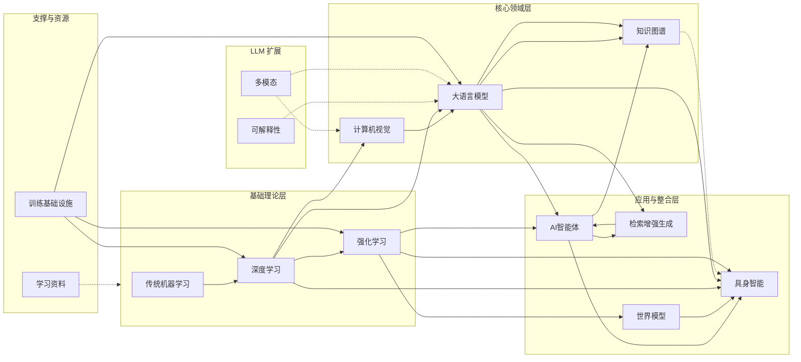

<div align="center">

  <h1>🧠 Machine Learning Study Notes</h1>
  <p>
    <strong>从经典算法到大语言模型：一场结构化的现代机器学习之旅</strong><br>
    <em>ML / DL / NLP / CV / LLM / RAG / KG</em>
  </p>

  <!-- 核心状态栏k -->
  <p>
    <!-- 动态获取最后提交时间 -->
    
    <!-- 静态徽章 -->
    
    
    
  </p>
</div>

---

## 层级关系

```
基础方法层：
├── traditional-ml/              # 传统机器学习
├── deep-learning/               # 深度学习基础
└── reinforce-learning/          # 强化学习

核心领域层：
├── llm/                         # 大语言模型
├── cv/                          # 计算机视觉
└── knowledge-graph/             # 知识图谱

应用与集成层：
├── rag/                         # 检索增强生成（LLM + 外部知识）
├── agentic/                     # AI智能体（LLM驱动的自主系统）
├── world-models/                # 世界模型（环境建模与预测）
└── embodied-intelligence/       # 具身智能（物理世界落地）

基础设施层：
└── training-infra/              # 训练基础设施

支撑资源：
├── learning-materials/          # 学习资料与书籍推荐
└── asserts/                     # 图片、脚本等资源文件
```

## 知识体系



## 目录结构

```
machine-learning/
│
├── traditional-ml/              # 传统机器学习
│   ├── 01-fundamentals/         # 数学基础
│   │   ├── linear-algebra/         # 线性代数
│   │   ├── probability-and-statistics/ # 概率论与统计
│   │   └── optimization/           # 优化理论
│   ├── 02-supervised-learning/  # 监督学习
│   │   ├── linear-models/          # 线性模型
│   │   ├── tree-based-models/      # 树模型
│   │   ├── svm/                    # 支持向量机
│   │   └── knn/                    # K近邻
│   ├── 03-unsupervised-learning/   # 无监督学习
│   │   ├── clustering/             # 聚类算法
│   │   └── dimensionality-reduction/ # 降维方法
│   ├── 04-practical-ml/            # 实践方法
│   │   ├── feature-engineering/    # 特征工程
│   │   ├── model-selection-and-tuning/ # 模型选择与调优
│   │   ├── ensemble-methods/       # 集成方法
│   │   ├── imbalanced-learning/    # 不平衡学习
│   │   └── interpretability/       # 可解释性
│   ├── 05-time-series/             # 时间序列
│   │   ├── classical-methods/      # 经典方法
│   │   ├── machine-learning-approaches/ # 机器学习方法
│   │   └── deep-learning-for-ts/   # 深度学习时序
│   └── 06-probabilistic-graphical-models/ # 概率图模型
│       ├── bayesian-networks/      # 贝叶斯网络
│       └── markov-random-fields/   # 马尔可夫随机场
│
├── deep-learning/               # 深度学习基础
│   ├── 01-neural-network-fundamentals/ # 神经网络基础
│   ├── 02-training-and-optimization/ # 训练与优化
│   ├── 03-architectures/           # 按领域划分的架构
│   │   ├── cnns/                   # 卷积神经网络
│   │   ├── rnns-and-sequence-models/ # 循环神经网络与序列模型
│   │   ├── transformers/           # Transformer
│   │   └── generative-models/      # 生成模型
│   ├── 04-advanced-topics/         # 进阶主题
│   └── 05-infra/                   # 深度学习基础设施
│
├── reinforce-learning/          # 强化学习
│   ├── 01-fundamentals/            # 基础概念
│   ├── 02-model-free-rl/           # 无模型强化学习
│   ├── 03-policy-methods/          # 基于策略与Actor-Critic
│   ├── 04-model-based-rl/          # 基于模型的强化学习
│   ├── 05-advanced-topics/         # 进阶与应用
│   └── 06-evaluation-and-tools/    # 评估与工具
│
├── cv/                          # 计算机视觉
│   ├── 01-image-fundamentals/      # 图像基础
│   ├── 02-image-classification/    # 图像分类
│   ├── 03-detection-and-segmentation/ # 目标检测与分割
│   ├── 04-video-and-3d-vision/     # 视频与3D视觉
│   ├── 05-generative-and-multimodal/ # 生成与多模态
│   ├── 06-foundation-models/       # 自监督与基础模型
│   └── 07-applications-and-tools/  # 应用与工具
│
├── llm/                         # 大语言模型
│   ├── 01-foundations/             # 基础
│   │   ├── transformer-architecture/ # Transformer架构
│   │   ├── tokenization/           # 分词
│   │   └── scaling-laws/           # 缩放定律
│   ├── 02-model-zoo/               # 模型全景
│   │   ├── open-source-models/     # 开源模型
│   │   ├── architectural-variants/ # 架构变体
│   │   └── emergent-abilities/     # 涌现能力
│   ├── 03-training/                # 训练
│   │   ├── pre-training/           # 预训练
│   │   ├── fine-tuning/            # 微调
│   │   └── alignment/              # 对齐
│   ├── 04-serving/                 # 推理与部署
│   │   ├── optimization-techniques/ # 优化技术
│   │   ├── serving-frameworks/     # Serving框架
│   │   └── prompt-engineering/     # 提示工程
│   ├── 05-evaluation/              # 评估
│   │   ├── benchmarks/             # 基准测试
│   │   ├── evaluation-methods/     # 评估方法
│   │   └── evaluation-frameworks/  # 评估框架
│   ├── 06-applications/            # 应用与伦理
│   │   ├── agents/                 # LLM 智能体应用
│   │   ├── llm-wiki/               # LLM 知识库/wiki
│   │   ├── rag/                    # RAG 应用
│   │   ├── safety-and-alignment/   # 安全与对齐
│   │   └── social-impact/          # 社会影响
│   ├── 07-explainability/          # 可解释性
│   │   ├── mechanistic/            # 机制可解释性
│   │   ├── attribution/            # 归因方法
│   │   ├── probing/                # 探测技术
│   │   └── counterfactual/         # 反事实解释
│   └── 08-multimodal/              # 多模态
│
├── rag/                         # 检索增强生成
│   ├── 01-fundamentals/            # 基础概念
│   ├── 02-retrieval/               # 索引与检索
│   ├── 03-generation/              # 生成与增强
│   ├── 04-advanced-rag-patterns/   # 高级RAG模式
│   ├── 05-evaluation/              # 评估与基准
│   └── 06-production/              # 生产与生态
│
├── agentic/                     # AI智能体
│   ├── 01-core-concepts/           # 核心概念
│   ├── 02-cognitive-capabilities/  # 认知能力
│   ├── 03-agent-architectures/     # 智能体架构
│   ├── 04-environments/            # 环境与仿真
│   ├── 05-frameworks-and-tools/    # 框架与工具
│   └── 06-evaluation/              # 评估与可靠性
│
├── knowledge-graph/             # 知识图谱
│   ├── 01-representation/          # 知识表示
│   ├── 02-construction/            # 知识构建
│   ├── 03-storage-and-query/       # 存储与查询
│   ├── 04-reasoning/               # 知识推理
│   ├── 05-applications/            # 应用
│   └── 06-quality/                 # 质量与演化
│
├── embodied-intelligence/       # 具身智能
│   ├── 01-foundations/             # 基础
│   ├── 02-perception/              # 感知闭环
│   ├── 03-motor-control-and-policies/ # 运动控制与策略
│   ├── 04-planning-and-navigation/ # 规划与导航
│   ├── 05-manipulation/            # 操作与交互
│   ├── 06-foundation-models/       # 大模型驱动具身
│   └── 07-evaluation-and-benchmarks/ # 评估与基准
│
├── world-models/                # 世界模型
│   ├── 01-foundations/             # 基础
│   ├── 02-methods-and-architectures/ # 方法与架构
│   ├── 03-reasoning-models/        # 推理用世界模型
│   ├── 04-large-scale-world-models/ # 大规模世界模型
│   ├── 05-evaluation/              # 评估
│   └── 06-applications/            # 应用
│
├── training-infra/              # 训练基础设施
│   ├── 01-hardware-and-networking/ # 硬件与网络
│   ├── 02-distributed-training/    # 分布式训练
│   ├── 03-frameworks-and-tools/    # 训练框架与工具
│   ├── 04-memory-and-storage/      # 内存与存储优化
│   ├── 05-compilation-and-kernels/ # 模型编译与内核
│   ├── 06-ml-operations/           # 实验追踪与运维
│   └── 07-observability-and-debugging/ # 可观测性与调试
│
├── learning-materials/          # 学习资料
│   ├── 01-books/                   # 书籍
│   ├── 02-courses-and-lectures/    # 课程与讲座
│   ├── 04-blogs-and-technical-guides/ # 博客与技术指南
│   ├── 05-tools-and-frameworks/    # 工具与框架快速入门
│   ├── 06-datasets/                # 数据集
│   └── 07-community-and-events/    # 社区与活动
│
└──  asserts/                     # 资源文件
```

## 声明

- 📢 如需转载，请注明出处

- 🏗️ 个人的学习仓库，目录建得很全，但是不确定什么时候填坑
