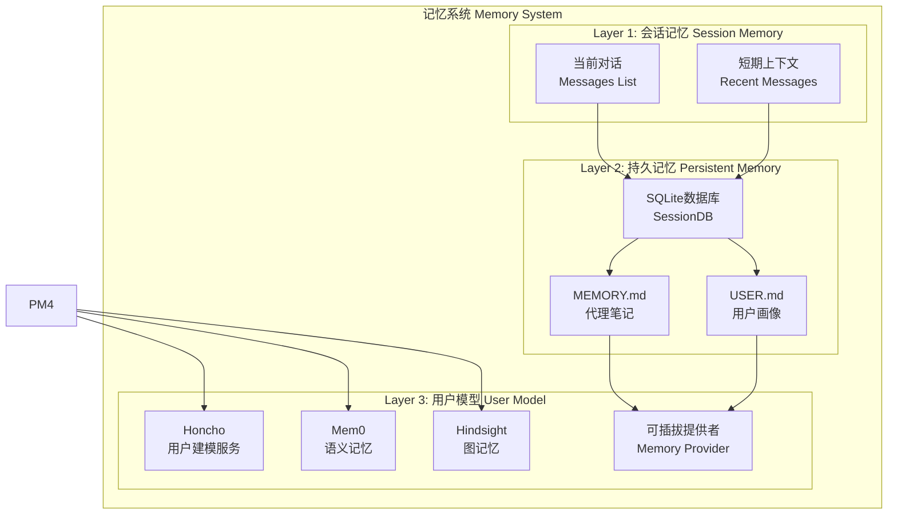
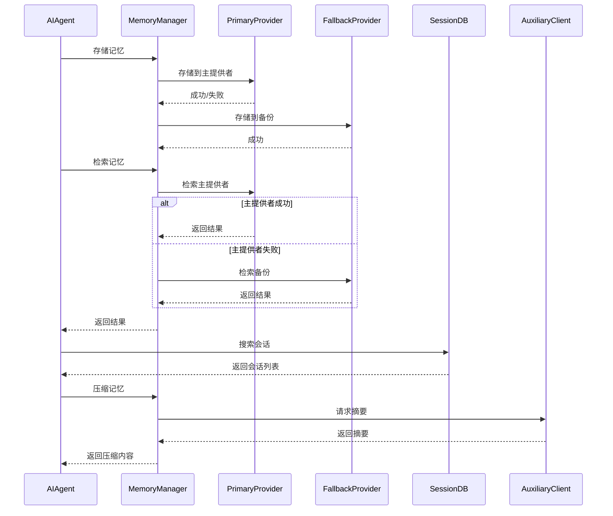
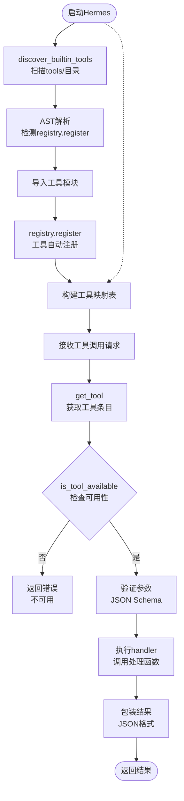
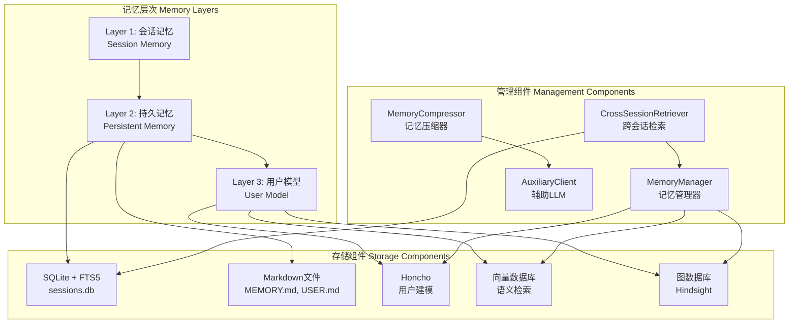

## 记忆系统概述
## 多层记忆系统

Hermes Agent采用三层记忆架构，提供从短期到长期的完整记忆能力。

### 记忆系统架构图



### Layer 1: 会话记忆（Session Memory）

会话记忆存储在内存中，包含：

1. **当前对话消息列表**：`messages`列表
2. **短期上下文**：最近N条消息
3. **工具调用历史**：`tool_calls`列表
4. **迭代状态**：`iteration_count`、`tokens_used`

**特点**：
- 快速访问（内存）
- 临时性（会话结束清除）
- 实时更新

### Layer 2: 持久记忆（Persistent Memory）

持久记忆存储在磁盘上，包含：

#### 1. MEMORY.md（代理笔记）

**位置**：`~/.hermes/memories/MEMORY.md`

```markdown
# Hermes Memory

## Project Information
- Project root: /home/user/projects/myapp
- Language: Python
- Framework: Flask

## Conventions
- Use snake_case for function names
- Write docstrings for all functions
- Use type hints

## Preferences
- User prefers concise explanations
- Show code examples first
- Use dark mode for code blocks

## Learned Patterns
- When debugging, start with logs
- For database queries, use SQLAlchemy
- API responses should include error handling
```

#### 2. USER.md（用户画像）

**位置**：`~/.hermes/memories/USER.md`

```markdown
# User Profile

## Identity
- Name: Developer
- Role: Full-stack developer
- Experience: 5+ years

## Preferences
- Languages: Python, JavaScript
- Tools: VS Code, Git, Docker
- Frameworks: React, Flask, FastAPI

## Communication Style
- Direct and concise
- Prefers code over explanations
- Likes examples and templates

## Context
- Works on web applications
- Interested in AI/ML
- Values clean code and documentation
```

#### 3. SQLite会话数据库

**文件位置**：`~/.hermes/sessions/sessions.db`

**表结构**：

```sql
-- 会话表
CREATE TABLE sessions (
    id TEXT PRIMARY KEY,
    platform TEXT NOT NULL,
    user_id TEXT,
    title TEXT,
    created_at TIMESTAMP DEFAULT CURRENT_TIMESTAMP,
    updated_at TIMESTAMP DEFAULT CURRENT_TIMESTAMP,
    metadata JSON
);

-- 消息表
CREATE TABLE messages (
    id INTEGER PRIMARY KEY AUTOINCREMENT,
    session_id TEXT NOT NULL,
    role TEXT NOT NULL,
    content TEXT,
    tool_calls JSON,
    created_at TIMESTAMP DEFAULT CURRENT_TIMESTAMP,
    FOREIGN KEY (session_id) REFERENCES sessions(id)
);

-- FTS5全文搜索索引
CREATE VIRTUAL TABLE messages_fts USING fts5(
    content,
    session_id,
    tokenize='porter unicode61'
);
```

**FTS5搜索**：

```python
class SessionDB:
    def __init__(self, db_path: str):
        self.db_path = db_path
        self.conn = sqlite3.connect(db_path)
        self._create_tables()

    def search_sessions(self, query: str, limit: int = 10) -> list:
        """使用FTS5搜索会话"""
        cursor = self.conn.execute("""
            SELECT DISTINCT s.id, s.title, s.platform, s.created_at
            FROM sessions s
            JOIN messages m ON s.id = m.session_id
            JOIN messages_fts fts ON m.rowid = fts.rowid
            WHERE messages_fts MATCH ?
            ORDER BY s.updated_at DESC
            LIMIT ?
        """, (query, limit))

        return cursor.fetchall()

    def get_session_messages(self, session_id: str) -> list:
        """获取会话的所有消息"""
        cursor = self.conn.execute("""
            SELECT role, content, tool_calls, created_at
            FROM messages
            WHERE session_id = ?
            ORDER BY created_at ASC
        """, (session_id,))

        return cursor.fetchall()
```

### Layer 3: 用户模型（User Model）

用户模型提供语义记忆和图记忆能力，支持高级检索。

#### 可插拔记忆提供者

**文件位置**：`agent/memory_provider.py`

```python
class MemoryProvider(ABC):
    """记忆提供者抽象基类"""

    @abstractmethod
    def store(self, key: str, value: dict, metadata: dict = None):
        """存储记忆"""
        pass

    @abstractmethod
    def retrieve(self, query: str, limit: int = 5) -> list:
        """检索记忆"""
        pass

    @abstractmethod
    def delete(self, key: str):
        """删除记忆"""
        pass


class HonchoMemoryProvider(MemoryProvider):
    """Honcho用户建模服务"""

    def __init__(self, api_key: str, profile_scope: bool = True):
        self.client = HonchoClient(api_key)
        self.profile_scope = profile_scope

    def store(self, key: str, value: dict, metadata: dict = None):
        """存储到Honcho"""
        self.client.store_memory(
            key=key,
            value=value,
            metadata=metadata,
            profile_id=self._get_profile_id() if self.profile_scope else None
        )

    def retrieve(self, query: str, limit: int = 5) -> list:
        """从Honcho检索"""
        return self.client.search_memories(
            query=query,
            limit=limit,
            profile_id=self._get_profile_id() if self.profile_scope else None
        )


class VectorMemoryProvider(MemoryProvider):
    """向量数据库记忆提供者"""

    def __init__(self, embedding_model: str = "text-embedding-3-small"):
        self.embedding_model = embedding_model
        self.collection = self._init_vector_db()

    def store(self, key: str, value: dict, metadata: dict = None):
        """存储到向量数据库"""
        embedding = self._embed(str(value))
        self.collection.add(
            documents=[str(value)],
            embeddings=[embedding],
            metadatas=[metadata or {}],
            ids=[key]
        )

    def retrieve(self, query: str, limit: int = 5) -> list:
        """从向量数据库检索"""
        query_embedding = self._embed(query)
        results = self.collection.query(
            query_embeddings=[query_embedding],
            n_results=limit
        )
        return results


class MemoryManager:
    """记忆管理器"""

    def __init__(self, provider: MemoryProvider = None):
        self.primary_provider = provider
        self.fallback_provider = VectorMemoryProvider()

    def store_memory(self, key: str, value: dict, metadata: dict = None):
        """存储记忆（主提供者 + 备份）"""
        if self.primary_provider:
            try:
                self.primary_provider.store(key, value, metadata)
            except Exception as e:
                logger.warning(f"Primary provider failed: {e}")

        # 总是备份到向量数据库
        self.fallback_provider.store(key, value, metadata)

    def retrieve_memory(self, query: str, limit: int = 5) -> list:
        """检索记忆（主提供者优先）"""
        if self.primary_provider:
            try:
                return self.primary_provider.retrieve(query, limit)
            except Exception as e:
                logger.warning(f"Primary provider failed: {e}")

        return self.fallback_provider.retrieve(query, limit)
```

### 8个外部记忆提供者

| 提供者 | 类型 | 用途 |
|-------|------|------|
| Honcho | 用户建模服务 | 用户画像、对话历史 |
| Mem0 | 语义记忆 | 长期语义存储 |
| Hindsight | 图记忆 | 关系图谱 |
| Supermemory | 向量搜索 | 快速语义检索 |
| RetainDB | 时间序列数据库 | 时间序列记忆 |
| ByteRover | 知识图谱 | 知识图谱存储 |
| OpenViking | 混合记忆 | 多模态记忆 |
| Holographic | 全息记忆 | 分布式记忆 |

### 记忆压缩与跨会话检索

#### 记忆压缩

**文件位置**：`agent/context_compressor.py`

```python
class MemoryCompressor:
    def __init__(self, max_tokens: int = 10000):
        self.max_tokens = max_tokens
        self.auxiliary_client = AuxiliaryClient()

    def compress_memory(self, memory_content: str) -> str:
        """压缩记忆内容"""
        if self._estimate_tokens(memory_content) <= self.max_tokens:
            return memory_content

        # 使用辅助LLM摘要
        summary = self.auxiliary_client.summarize_text(
            text=memory_content,
            max_length=self.max_tokens
        )

        return summary

    def _estimate_tokens(self, text: str) -> int:
        """估算token数量"""
        return len(text) // 4  # 经验规则：4字符≈1token
```

#### 跨会话检索

```python
class CrossSessionRetriever:
    def __init__(self, session_db: SessionDB, memory_manager: MemoryManager):
        self.session_db = session_db
        self.memory_manager = memory_manager

    def retrieve(self, query: str, limit: int = 5) -> list:
        """跨会话检索相关记忆"""
        results = []

        # 1. 从SESSION DB搜索
        session_results = self.session_db.search_sessions(query, limit)
        results.extend([
            {
                "source": "session",
                "session_id": row[0],
                "title": row[1],
                "platform": row[2],
                "created_at": row[3]
            }
            for row in session_results
        ])

        # 2. 从记忆管理器检索
        memory_results = self.memory_manager.retrieve_memory(query, limit)
        results.extend([
            {
                "source": "memory",
                "content": result["content"],
                "metadata": result.get("metadata", {})
            }
            for result in memory_results
        ])

        # 3. 按相关性排序
        results = self._rank_by_relevance(results, query)

        return results[:limit]

    def _rank_by_relevance(self, results: list, query: str) -> list:
        """按相关性排序"""
        # 简单实现：使用BM25
        # 实际可以使用更复杂的相似度算法
        return sorted(
            results,
            key=lambda r: self._calculate_relevance(r, query),
            reverse=True
        )

    def _calculate_relevance(self, result: dict, query: str) -> float:
        """计算相关性分数"""
        text = str(result.get("title", "") or result.get("content", ""))
        return len(set(query.lower().split()) & set(text.lower().split()))
```

### 记忆系统完整流程



## 工具注册与调用流程图



## 记忆系统架构图



## 参考资料

- [工具系统官方文档](https://hermes-agent.nousresearch.com/docs/user-guide/features/tools)
- [记忆系统官方文档](https://hermes-agent.nousresearch.com/docs/user-guide/features/memory)
- [ToolRegistry源码](tools/registry.py)
- [SessionDB源码](hermes_state.py)
- [MCP集成文档](https://hermes-agent.nousresearch.com/docs/user-guide/features/mcp)

## 官方文档参考

详细的记忆功能说明请参考：
- [Hermes Agent官方文档 - Memory Providers特性](https://hermes-agent.nousresearch.com/docs/user-guide/features/memory-providers)
- [记忆系统配置指南](https://hermes-agent.nousresearch.com/docs/user-guide/configuration#memory)
- [记忆类型说明](https://hermes-agent.nousresearch.com/docs/user-guide/configuration#memory-types)

### 记忆提供者（Memory Providers）配置

Hermes Agent支持多种外部记忆提供者，实现无缝的跨会话持久化：

```yaml
# config.yaml
memory:
  # 使用的记忆提供者
  provider: honcho  # 可选：honcho, mem0, vector, custom
  
  # 提供者特定配置
  honcho:
    api_key: ${HONCHO_API_KEY}
    profile_scope: true  # 是否使用profile隔离
  
  mem0:
    api_key: ${MEM0_API_KEY}
    host: https://api.mem0.ai
  
  vector:
    collection_name: "hermes_memories"
    embedding_model: "text-embedding-3-small"
```

### 支持的记忆提供者

| 提供者 | 类型 | 用途 | 配置要求 |
|-------|------|------|----------|
| **Honcho** | 用户建模服务 | `HONCHO_API_KEY`, profile ID |
| **Mem0** | 语义记忆 | `MEM0_API_KEY` |
| **Vector** | 向量数据库 | collection name, embedding model |
| **Supabase** | PostgreSQL + 向量 | `SUPABASE_URL`, `SUPABASE_KEY` |
| **Qdrant** | 向量数据库 | `QDRANT_HOST`, `QDRANT_API_KEY` |
| **Chroma** | 向量数据库 | `CHROMA_HOST`, `CHROMA_PORT` |
| **Holographic** | 全息记忆 | `HOLOGRAPHIC_API_KEY` |

### 记忆类型

Hermes Agent使用三种记忆类型，各有不同的存储和检索策略：

#### 1. 会话记忆（Session Memory）
- **存储**：SQLite数据库（`sessions.db`）
- **生命周期**：单次会话
- **用途**：短期上下文保持
- **检索**：按会话ID直接查询
- **特点**：FTS5全文搜索

#### 2. 持久记忆（Persistent Memory）
- **存储**：Markdown文件（`MEMORY.md`、`USER.md`）
- **生命周期**：长期持久化
- **用途**：项目特定知识和用户偏好
- **检索**：按需加载到提示词
- **特点**：人工可编辑，版本控制友好

#### 3. 用户模型（User Model）
- **存储**：外部记忆提供者（向量数据库）
- **生命周期**：跨所有会话和profiles
- **用途**：语义搜索和用户行为建模
- **检索**：相似度搜索、知识图谱查询
- **特点**：自动化记忆提取、智能关联

### 记忆配置示例

```yaml
# config.yaml - 完整记忆配置
memory:
  # 记忆提供者
  provider: honcho
  
  # 会话记忆配置
  sessions:
    max_messages: 200
    fts5_enabled: true
    compression_threshold: 50000  # tokens
  
  # 持久记忆配置
  persistent:
    auto_save: true
    auto_extract: true  # 自动从对话提取记忆
    user_file: USER.md
    project_file: MEMORY.md
  
  # 用户模型配置
  user_model:
    extraction_model: claude-haiku-4.1
    similarity_threshold: 0.75
    max_results: 5
  
  # 提供者配置
  honcho:
    api_key: ${HONCHO_API_KEY}
    profile_id: ${HONCHO_PROFILE_ID}
    auto_create_profile: true
```

### 记忆提取与存储

Hermes Agent自动从对话中提取有价值的信息并存储到记忆：

```python
# 记忆管理器的提取逻辑
def extract_and_store_memory(conversation: list, user_id: str):
    """
    从对话中提取记忆
    
    提取策略：
    1. 用户明确指示（"记住..."）
    2. 重复出现的模式
    3. 重要配置信息（API密钥、数据库连接）
    4. 用户偏好（编码风格、工具选择）
    """
    for message in conversation:
        if message["role"] == "user":
            content = message["content"]
            
            # 检测记忆触发
            if "记住" in content or "记住" in content:
                memory_content = extract_memory_after_keyword(content)
                if memory_content:
                    store_to_memory(user_id, memory_content)
            
            # 检测配置信息
            config_info = extract_config_info(content)
            if config_info:
                store_to_user_model(user_id, config_info)
```

### 记忆检索与使用

```python
# 记忆检索策略
def retrieve_relevant_memory(query: str, context: dict) -> list:
    """
    检索相关记忆
    
    检索策略：
    1. 关键词匹配（持久记忆）
    2. 语义搜索（用户模型）
    3. 最近使用（会话记忆）
    """
    memories = []
    
    # 1. 从持久记忆检索
    persistent_mem = search_keywords(query, "MEMORY.md", "USER.md")
    memories.extend(persistent_mem)
    
    # 2. 从用户模型检索
    semantic_mem = search_semantic(query, limit=3)
    memories.extend(semantic_mem)
    
    # 3. 从会话记忆检索
    session_mem = get_recent_messages(limit=5)
    memories.extend(session_mem)
    
    # 4. 排序和去重
    memories = rank_and_deduplicate(memories)
    
    return memories[:10]
```

### 记忆安全和隐私

```yaml
# config.yaml - 记忆安全配置
memory:
  # 敏感信息过滤
  filters:
    - pattern: "(password|token|secret|key)"
      action: "redact"  # 脱敏
    - pattern: "(credit_card|ssn|bank)"
      action: "skip"  # 跳过
  
  # 记忆加密（可选）
  encryption:
    enabled: false
    provider: "local"  # local, aws-kms
    key_id: ${MEMORY_ENCRYPTION_KEY}
  
  # 记忆保留策略
  retention:
    max_age_days: 365
    auto_cleanup: true
```
