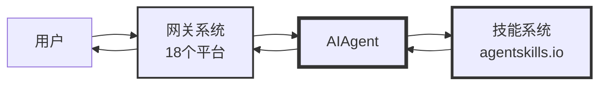
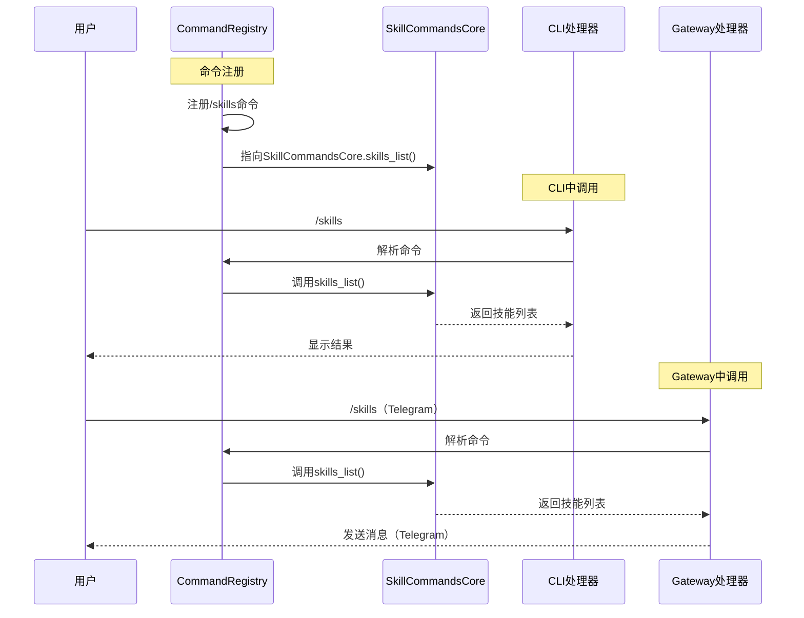
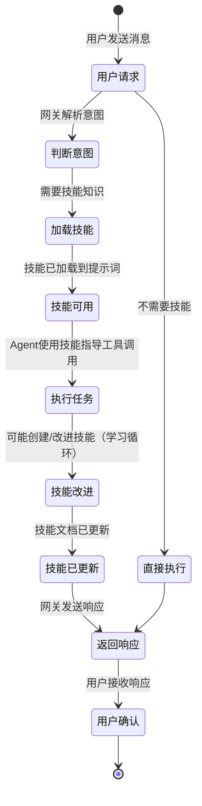
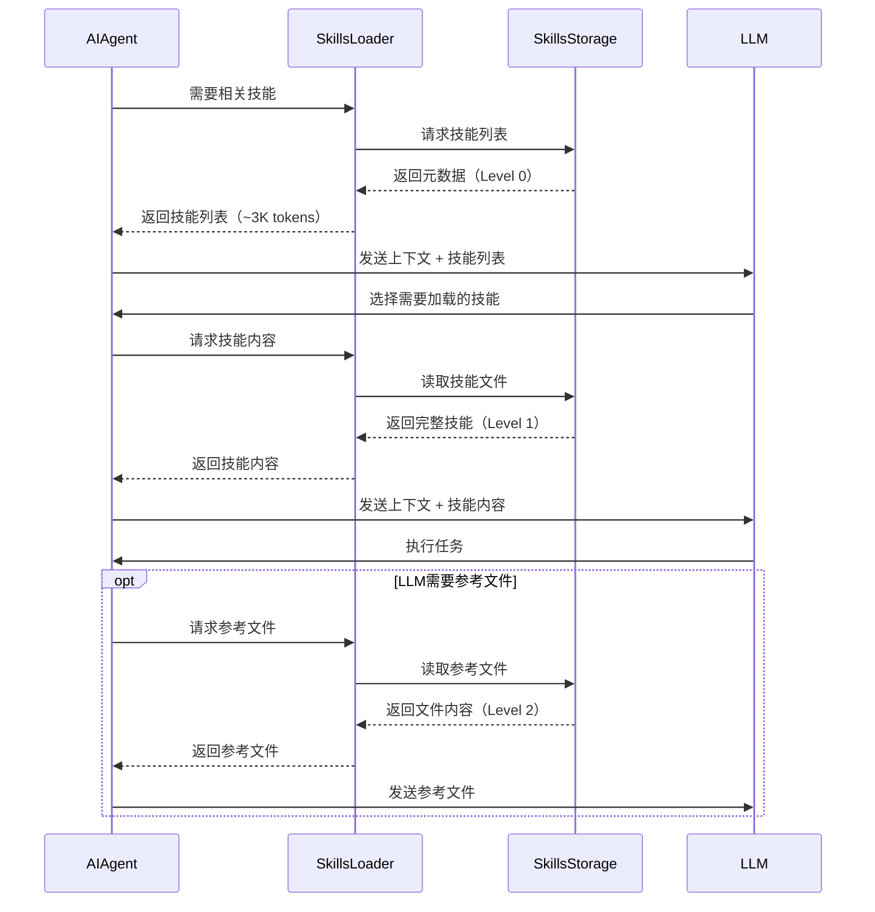
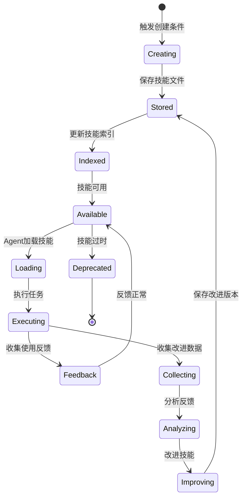
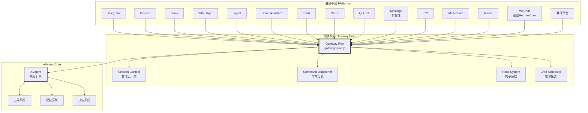

# Hermes Agent 技能系统与网关
## 技能系统与网关的关系

### 核心关系

技能系统和网关系统在Hermes Agent中承担不同的角色，但紧密协作：

- **技能系统**：提供可复用的领域知识（"大脑记忆"）
- **网关系统**：提供多平台的用户访问通道（"输入输出接口"）
- **协同作用**：网关将用户请求传递给Agent，Agent使用技能系统提供知识来响应用户

### 关系图



### 1. 网关作为技能的分发渠道

**为什么技能需要网关**：

1. **多平台访问**：用户可以在Telegram、Discord、Slack等18个平台上使用技能
2. **统一命令**：`/skills`、`/load`、`/install`命令在所有平台上一致可用
3. **技能Hub集成**：用户可以通过网关命令直接从Skills Hub浏览和安装技能

```mermaid
flowchart TB
    subgraph "网关支持的 Platforms"
        P1[Telegram]
        P2[Discord]
        P3[Slack]
        P4[WhatsApp]
        P5[Signal]
        P6[Home Assistant]
        P7[Email]
        P8[Matrix]
    end

    subgraph "统一的技能命令 Unified Commands"
        C1[/skills<br/>列表]
        C2[/load<br/>加载]
        C3[/install<br/>安装]
        C4[/search<br/>搜索]
    end

    User --> GW[网关]
    GW --> P1
    GW --> P2
    GW --> P3
    GW --> P4
    GW --> P5
    GW --> P6
    GW --> P7
    GW --> P8

    P1 --> C1
    P2 --> C2
    P3 --> C3
    P4 --> C4
    P4 --> C1
    P5 --> C2
    P6 --> C3
    P7 --> C4
    P8 --> C1

    style GW stroke:#333,stroke-width:3px
```

### 2. CLI/Gateway共享的技能命令

技能斜杠命令在CLI和Gateway中完全共享，确保一致的用户体验：

| 命令 | 功能 | CLI | Gateway |
|------|------|-----|----------|
| `/skills` | 列出可用技能 | ✅ | ✅ |
| `/load <skill>` | 加载特定技能 | ✅ | ✅ |
| `/search <query>` | 搜索技能 | ✅ | ✅ |
| `/install <skill>` | 安装技能 | ✅ | ✅ |
| `/create` | 创建新技能 | ✅ | ✅ |
| `/edit <skill>` | 编辑技能 | ✅ | ✅ |
| `/delete <skill>` | 删除技能 | ✅ | ✅ |

**实现方式**：

- **集中定义**：`agent/skill_commands.py`定义所有技能命令逻辑
- **共享注册**：`hermes_cli/commands.py`的`COMMAND_REGISTRY`包含命令元数据
- **平台适配**：CLI和Gateway各自的命令处理器调用相同的底层函数



### 3. 统一的技能管理体验

**为什么这样设计**：

1. **一致性**：用户在CLI学会的命令在所有平台都可用
2. **可移植性**：技能管理知识不绑定特定平台
3. **可扩展性**：新平台适配器自动获得所有技能命令
4. **维护性**：只需维护一套技能命令代码，覆盖所有平台

### 4. 技能通过网关的完整生命周期



### 为什么把技能和网关放在一起

1. **交付渠道关系**：
   - 技能是知识内容
   - 网关是这些内容的交付平台
   - 类似"内容 + 渠道"的架构模式

2. **CLI/Gateway共享架构**：
   - 技能命令在CLI和Gateway中共享
   - 统一的命令注册表和分发机制
   - 代码复用，降低维护成本

3. **用户体验优先**：
   - 用户不关心底层是CLI还是Gateway
   - 统一的命令和交互模式减少学习曲线
   - 技能在任何平台上无缝使用

4. **功能内聚性**：
   - 技能系统和网关都涉及"用户交互"层面
   - 都涉及命令分发和响应格式化
   - 共同的配置（`display`、`skills`相关）

### 总结

| 方面 | 技能系统 | 网关系统 |
|------|---------|----------|
| **核心职责** | 提供领域知识 | 提供多平台访问 |
| **存储位置** | `~/.hermes/skills/` | Gateway配置 |
| **主要组件** | SkillIndex、SkillsHub | GatewayRouter、平台适配器 |
| **用户可见性** | 通过`/skills`命令 | 通过所有消息平台 |
| **CLI支持** | 完全支持 | 不适用（CLI本身就是入口） |
| **平台支持** | 完全支持 | 18个平台 |
| **共享内容** | 斜杠命令逻辑 | 斜杠命令逻辑 |
| **协同方式** | Agent使用技能响应请求 | 网关传递请求给Agent |

## 技能系统概述

技能系统是Hermes Agent自进化能力的核心机制。技能是按需加载的知识文档，遵循agentskills.io开放标准，支持渐进式披露、自动创建和持续改进。

### 技能系统架构

```mermaid
flowchart TB
    subgraph "技能系统 Skills System"
        SI[技能索引<br/>Skills Index]
        SL[技能加载器<br/>Skills Loader]
        SM[技能管理器<br/>Skill Manager]
        SS[技能存储<br/>Skills Storage]
        SH[Skills Hub<br/>技能仓库]
    end

    subgraph "技能生命周期 Skill Lifecycle"
        CR[创建 Create]
        ST[存储 Store]
        IND[索引 Index]
        LOAD[加载 Load]
        EXEC[执行 Execute]
        REF[改进 Refine]
        DEL[删除 Delete]
    end

    subgraph "渐进式披露 Progressive Disclosure"
        L0[Level 0<br/>skills_list]
        L1[Level 1<br/>skill_view]
        L2[Level 2<br/>skill_view + path]
    end

    subgraph "agentskills.io标准"
        STD[标准格式]
        FRONT[YAML前置数据]
        BODY[Markdown正文]
        META[元数据]
    end

    SI --> SL
    SL --> SM
    SM --> SS
    SM --> SH

    CR --> ST
    ST --> IND
    IND --> LOAD
    LOAD --> EXEC
    EXEC --> REF
    REF --> IND

    L0 --> L1 --> L2

    STD --> FRONT
    STD --> BODY
    STD --> META

    style SI stroke:#333,stroke-width:4px
    style SM stroke:#333,stroke-width:2px
    style SS stroke:#333,stroke-width:2px
```



## agentskills.io开放标准

agentskills.io是AI代理技能的开放标准，确保技能在不同代理之间的可移植性和互操作性。

### 技能文件结构

```markdown
---
name: Debugging Flask Applications
description: Systematic approach to debugging Flask web applications
category: software-development
tags: [flask, debugging, web]
author: Hermes Agent
version: 1.0.0
---

# Debugging Flask Applications

This skill provides a systematic approach to debugging Flask web applications.

## Common Issues

### 1. 500 Internal Server Error

**Symptoms:**
- Server returns 500 status code
- No error message shown to user

**Diagnosis:**
1. Check Flask logs: `tail -f logs/flask.log`
2. Check browser console for client-side errors
3. Enable debug mode in development:
   ```python
   app.run(debug=True)
   ```

**Solution:**
- Review stack trace in logs
- Check for unhandled exceptions
- Verify database connections
- Test routes individually

### 2. Template Not Found

**Symptoms:**
- `TemplateNotFound` exception
- 404 errors on valid routes

**Diagnosis:**
```python
app.jinja_loader.searchpath
```

**Solution:**
- Verify template directory structure
- Check template names match filenames
- Ensure `app.template_folder` is set correctly

## Debugging Workflow

1. **Reproduce the issue**: Create minimal test case
2. **Isolate the problem**: Comment out code sections
3. **Check logs**: Application and server logs
4. **Use Flask debugger**:
   ```python
   from flask import Flask
   from werkzeug.debug import DebuggedApplication

   app = Flask(__name__)
   app = DebuggedApplication(app, evalex=True)
   ```

## Common Patterns

### Database Connection Issues

```python
# Check connection
@app.before_request
def check_db():
    try:
        db.session.execute(text('SELECT 1'))
    except:
        db.session.remove()
        db.create_all()
```

### Request Logging

```python
@app.before_request
def log_request():
    logger.info(f"{request.method} {request.path}")

@app.after_request
def log_response(response):
    logger.info(f"Response: {response.status_code}")
    return response
```

## Best Practices

- Always check logs first
- Use debug mode in development
- Test routes with `curl` or Postman
- Use Flask's built-in debugger
- Keep error handling consistent
- Log all database operations
```

### YAML前置数据（Frontmatter）

```yaml
---
name: 技能名称
description: 技能描述（一句话）
category: 分类（如：software-development）
tags: [标签1, 标签2, ...]
author: 作者
version: 版本号
platforms: [平台列表]  # 可选：cli, gateway, telegram等
conditions:  # 可选：触发条件
  - when: "用户提到'flask'"
    then: "加载此技能"
requires:  # 可选：依赖
  - tool: "terminal"
  - skill: "python-basics"
references:  # 可选：相关资源
  - title: Flask Documentation
    url: https://flask.palletsprojects.com/
---
```

### 技能元数据

| 字段 | 类型 | 必需 | 说明 |
|------|------|------|------|
| name | string | 是 | 技能名称 |
| description | string | 是 | 技能描述 |
| category | string | 是 | 技能分类 |
| tags | list | 否 | 技能标签 |
| author | string | 否 | 作者 |
| version | string | 否 | 版本号 |
| platforms | list | 否 | 支持的平台 |
| conditions | list | 否 | 触发条件 |
| requires | dict | 否 | 依赖 |
| references | list | 否 | 相关资源 |

## 渐进式披露模式（Progressive Disclosure）

Hermes Agent使用渐进式披露模式加载技能，最小化token使用：

### Level 0: skills_list()

返回技能列表（仅元数据），约3000 tokens：

```python
def skills_list() -> list:
    """
    返回技能列表（仅元数据）

    Returns:
        [
            {
                "name": "Debugging Flask Apps",
                "description": "Systematic debugging approach",
                "category": "software-development",
                "tags": ["flask", "debugging"]
            },
            ...
        ]
    """
    skills_dir = get_skills_dir()
    skills = []

    for skill_path in skills_dir.glob("**/*.md"):
        metadata = parse_frontmatter(skill_path)
        skills.append({
            "name": metadata.get("name", skill_path.stem),
            "description": metadata.get("description", ""),
            "category": metadata.get("category", "misc"),
            "tags": metadata.get("tags", [])
        })

    return skills
```

### Level 1: skill_view(name)

返回技能的完整内容和元数据：

```python
def skill_view(name: str) -> dict:
    """
    返回技能的完整内容和元数据

    Args:
        name: 技能名称

    Returns:
        {
            "name": "Debugging Flask Apps",
            "description": "...",
            "category": "software-development",
            "metadata": {...},
            "content": "# Debugging Flask Applications\n..."
        }
    """
    skills_dir = get_skills_dir()
    skill_path = skills_dir / f"{name}.md"

    if not skill_path.exists():
        raise SkillNotFoundError(name)

    content = skill_path.read_text(encoding="utf-8")
    metadata, body = parse_frontmatter(content)

    return {
        "name": name,
        "metadata": metadata,
        "content": body
    }
```

### Level 2: skill_view(name, path)

返回技能的特定参考文件：

```python
def skill_view(name: str, path: str) -> str:
    """
    返回技能的特定参考文件

    Args:
        name: 技能名称
        path: 技能内文件路径（如：examples/basic.py）

    Returns:
        文件内容字符串
    """
    skills_dir = get_skills_dir()
    skill_path = skills_dir / name
    reference_path = skill_path / path

    if not reference_path.exists():
        raise FileNotFoundError(f"Reference not found: {path}")

    return reference_path.read_text(encoding="utf-8")
```

### 渐进式披露流程



## 自动技能创建与自改进

### 技能创建触发条件

Hermes Agent在以下情况下自动创建技能：

1. **复杂任务完成**：多步骤任务成功完成
2. **用户认可**：用户表示"这很有用"或类似反馈
3. **模式识别**：识别到重复的成功模式
4. **明确请求**：用户明确要求"保存为技能"

### 技能创建流程

```python
class SkillCreator:
    def __init__(self, skills_dir: str, auxiliary_client: AuxiliaryClient):
        self.skills_dir = Path(skills_dir)
        self.auxiliary_client = auxiliary_client

    def should_create_skill(self, trajectory: dict, user_feedback: str) -> bool:
        """
        判断是否应该创建技能

        条件：
        1. 任务成功（无错误）
        2. 用户正面反馈
        3. 轨迹足够复杂（>= 5个工具调用）
        """
        if trajectory.get("error"):
            return False

        if not self._has_positive_feedback(user_feedback):
            return False

        if len(trajectory.get("tool_calls", [])) < 5:
            return False

        return True

    def create_skill(self, trajectory: dict, task_description: str) -> str:
        """
        从轨迹创建技能

        Args:
            trajectory: 完整任务轨迹
            task_description: 任务描述

        Returns:
            技能文件路径
        """
        # 1. 提取关键步骤
        key_steps = self._extract_key_steps(trajectory)

        # 2. 生成技能内容
        skill_content = self._generate_skill_content(
            task_description,
            key_steps
        )

        # 3. 生成元数据
        metadata = self._generate_metadata(
            task_description,
            trajectory
        )

        # 4. 保存技能文件
        skill_name = self._generate_skill_name(task_description)
        skill_path = self.skills_dir / f"{skill_name}.md"

        full_content = self._assemble_skill_file(
            metadata,
            skill_content
        )

        skill_path.write_text(full_content, encoding="utf-8")

        # 5. 更新索引
        self._update_skill_index(skill_path)

        return str(skill_path)

    def _extract_key_steps(self, trajectory: dict) -> list:
        """提取关键步骤"""
        tool_calls = trajectory.get("tool_calls", [])

        # 按工具类型分组
        steps = []
        current_step = None

        for call in tool_calls:
            if self._is_new_step(call, current_step):
                current_step = {
                    "tool": call["name"],
                    "args": call["args"],
                    "result": call.get("result", "")
                }
                steps.append(current_step)
            else:
                # 合并到当前步骤
                current_step["result"] += f"\n{call.get('result', '')}"

        return steps

    def _generate_skill_content(self, task: str, steps: list) -> str:
        """使用辅助LLM生成技能内容"""
        prompt = f"""
        Based on the following task and execution steps, create a skill document.

        Task: {task}

        Steps:
        {self._format_steps(steps)}

        Create a well-structured skill following the agentskills.io standard.
        Include:
        - Clear description
        - Step-by-step instructions
        - Common patterns
        - Best practices
        - Code examples where applicable
        """

        response = self.auxiliary_client.generate_text(prompt)

        return response

    def _generate_metadata(self, task: str, trajectory: dict) -> dict:
        """生成技能元数据"""
        return {
            "name": self._generate_skill_name(task),
            "description": f"Skill for: {task}",
            "category": self._infer_category(task),
            "tags": self._extract_tags(trajectory),
            "author": "Hermes Agent",
            "version": "1.0.0"
        }

    def _generate_skill_name(self, task: str) -> str:
        """生成技能名称"""
        # 使用首字母大写的驼峰命名
        words = task.lower().split()[:4]  # 最多4个词
        return "".join(word.capitalize() for word in words)

    def _infer_category(self, task: str) -> str:
        """推断技能分类"""
        task_lower = task.lower()

        category_keywords = {
            "software-development": ["code", "debug", "test", "deploy"],
            "research": ["search", "analyze", "investigate"],
            "productivity": ["organize", "schedule", "manage"],
            "creative": ["write", "design", "create"],
            "devops": ["build", "deploy", "monitor"]
        }

        for category, keywords in category_keywords.items():
            if any(kw in task_lower for kw in keywords):
                return category

        return "misc"
```

### 技能自改进机制

```python
class SkillImprover:
    def __init__(self, skills_dir: str, auxiliary_client: AuxiliaryClient):
        self.skills_dir = Path(skills_dir)
        self.auxiliary_client = auxiliary_client

    def improve_skill(self, skill_name: str, usage_feedback: list) -> bool:
        """
        基于使用反馈改进技能

        Args:
            skill_name: 技能名称
            usage_feedback: 使用反馈列表
                [
                    {
                        "success": True,
                        "user_rating": 5,
                        "issues": ["步骤2不够清晰"],
                        "suggestions": ["添加截图示例"]
                    },
                    ...
                ]

        Returns:
            是否成功改进
        """
        # 1. 加载当前技能
        skill_path = self.skills_dir / f"{skill_name}.md"
        if not skill_path.exists():
            return False

        current_content = skill_path.read_text(encoding="utf-8")
        metadata, body = parse_frontmatter(current_content)

        # 2. 分析反馈
        improvements = self._analyze_feedback(usage_feedback)

        if not improvements:
            return False  # 无需改进

        # 3. 生成改进建议
        improvement_suggestions = self._generate_improvements(
            body,
            improvements
        )

        # 4. 应用改进
        improved_body = self._apply_improvements(
            body,
            improvement_suggestions
        )

        # 5. 更新版本
        metadata["version"] = self._increment_version(metadata.get("version", "1.0.0"))

        # 6. 保存改进的技能
        improved_content = self._assemble_skill_file(
            metadata,
            improved_body
        )

        skill_path.write_text(improved_content, encoding="utf-8")

        return True

    def _analyze_feedback(self, feedback: list) -> list:
        """分析反馈提取改进点"""
        improvements = []

        # 统计成功率
        success_rate = sum(1 for f in feedback if f.get("success")) / len(feedback)
        if success_rate < 0.7:
            improvements.append({
                "type": "clarity",
                "severity": "high",
                "description": "低成功率，需要澄清步骤"
            })

        # 收集常见问题
        issue_counts = {}
        for f in feedback:
            for issue in f.get("issues", []):
                issue_counts[issue] = issue_counts.get(issue, 0) + 1

        # 排序问题
        common_issues = sorted(
            issue_counts.items(),
            key=lambda x: x[1],
            reverse=True
        )

        for issue, count in common_issues:
            if count >= 2:  # 至少2次提及
                improvements.append({
                    "type": "correction",
                    "severity": "medium",
                    "description": f"常见问题: {issue} (提及{count}次)"
                })

        # 收集建议
        suggestions = {}
        for f in feedback:
            for suggestion in f.get("suggestions", []):
                suggestions[suggestion] = suggestions.get(suggestion, 0) + 1

        # 排序建议
        common_suggestions = sorted(
            suggestions.items(),
            key=lambda x: x[1],
            reverse=True
        )

        for suggestion, count in common_suggestions:
            if count >= 2:
                improvements.append({
                    "type": "enhancement",
                    "severity": "low",
                    "description": f"用户建议: {suggestion} (提及{count}次)"
                })

        return improvements

    def _generate_improvements(self, body: str, improvements: list) -> dict:
        """生成具体改进建议"""
        prompt = f"""
        Analyze the following skill content and suggest improvements based on feedback.

        Skill Content:
        {body}

        Feedback:
        {self._format_improvements(improvements)}

        Provide specific, actionable improvements including:
        1. Which sections to modify
        2. What to change in each section
        3. Why the change is needed
        """

        response = self.auxiliary_client.generate_text(prompt)

        # 解析改进建议
        return self._parse_improvements(response)

    def _apply_improvements(self, body: str, improvements: dict) -> str:
        """应用改进到技能内容"""
        improved_body = body

        for section, changes in improvements.items():
            if section in body:
                # 替换部分内容
                old_content = self._extract_section(body, section)
                new_content = self._apply_changes(old_content, changes)
                improved_body = improved_body.replace(old_content, new_content)

        return improved_body

    def _increment_version(self, version: str) -> str:
        """增加版本号"""
        try:
            major, minor, patch = map(int, version.split("."))
            patch += 1
            return f"{major}.{minor}.{patch}"
        except:
            return "2.0.0"  # 重置到2.0.0
```

### 技能生命周期



## 技能存储与索引

### 技能目录结构

```
~/.hermes/skills/
├── index-cache/              # 技能索引缓存
│   ├── skills_index.json
│   ├── category_index.json
│   └── tag_index.json
├── software-development/    # 按分类组织
│   ├── debugging-flask-apps.md
│   ├── python-best-practices.md
│   └── testing-strategies.md
├── research/
│   ├── literature-search.md
│   └── data-analysis.md
├── creative/
│   ├── creative-writing.md
│   └── design-patterns.md
└── [其他分类目录]
```

### 技能索引

```python
class SkillIndex:
    def __init__(self, skills_dir: str):
        self.skills_dir = Path(skills_dir)
        self.index_file = self.skills_dir / "index-cache" / "skills_index.json"
        self.cache_dir = self.skills_dir / "index-cache"

    def build_index(self) -> dict:
        """构建技能索引"""
        skills = {}

        # 扫描所有技能文件
        for skill_path in self.skills_dir.rglob("*.md"):
            # 跳过索引缓存
            if "index-cache" in str(skill_path):
                continue

            try:
                # 解析前置数据和内容
                content = skill_path.read_text(encoding="utf-8")
                metadata, body = parse_frontmatter(content)

                # 提取技能信息
                skill_info = {
                    "name": metadata.get("name", skill_path.stem),
                    "path": str(skill_path.relative_to(self.skills_dir)),
                    "category": metadata.get("category", "misc"),
                    "tags": metadata.get("tags", []),
                    "description": metadata.get("description", ""),
                    "author": metadata.get("author", ""),
                    "version": metadata.get("version", "1.0.0"),
                    "platforms": metadata.get("platforms", []),
                    "requires": metadata.get("requires", {}),
                    "updated_at": datetime.fromtimestamp(
                        skill_path.stat().st_mtime
                    ).isoformat()
                }

                skills[skill_info["name"]] = skill_info

            except Exception as e:
                logger.warning(f"Failed to index {skill_path}: {e}")

        # 构建辅助索引
        self._build_category_index(skills)
        self._build_tag_index(skills)

        # 保存主索引
        self.cache_dir.mkdir(parents=True, exist_ok=True)
        self.index_file.write_text(
            json.dumps(skills, indent=2, ensure_ascii=False),
            encoding="utf-8"
        )

        return skills

    def _build_category_index(self, skills: dict):
        """构建分类索引"""
        category_index = {}

        for name, skill in skills.items():
            category = skill["category"]
            if category not in category_index:
                category_index[category] = []
            category_index[category].append(name)

        category_file = self.cache_dir / "category_index.json"
        category_file.write_text(
            json.dumps(category_index, indent=2, ensure_ascii=False),
            encoding="utf-8"
        )

    def _build_tag_index(self, skills: dict):
        """构建标签索引"""
        tag_index = {}

        for name, skill in skills.items():
            for tag in skill["tags"]:
                if tag not in tag_index:
                    tag_index[tag] = []
                tag_index[tag].append(name)

        tag_file = self.cache_dir / "tag_index.json"
        tag_file.write_text(
            json.dumps(tag_index, indent=2, ensure_ascii=False),
            encoding="utf-8"
        )

    def search(self, query: str, limit: int = 10) -> list:
        """搜索技能"""
        # 1. 尝试精确匹配
        exact_matches = self._exact_search(query)
        if exact_matches:
            return exact_matches[:limit]

        # 2. 尝试模糊匹配
        fuzzy_matches = self._fuzzy_search(query)
        if fuzzy_matches:
            return fuzzy_matches[:limit]

        # 3. 尝试语义搜索（如果有向量数据库）
        semantic_matches = self._semantic_search(query)
        if semantic_matches:
            return semantic_matches[:limit]

        return []

    def _exact_search(self, query: str) -> list:
        """精确搜索"""
        skills = self._load_index()
        matches = []

        for name, skill in skills.items():
            if (query.lower() in name.lower() or
                query.lower() in skill["description"].lower() or
                query.lower() in skill["category"].lower()):
                matches.append(skill)

        return matches

    def _fuzzy_search(self, query: str) -> list:
        """模糊搜索"""
        skills = self._load_index()
        matches = []

        query_words = set(query.lower().split())

        for name, skill in skills.items():
            text = f"{name} {skill['description']} {skill['category']}"
            text_words = set(text.lower().split())

            # 计算重叠度
            overlap = len(query_words & text_words)
            if overlap > 0:
                matches.append({
                    **skill,
                    "score": overlap
                })

        # 按分数排序
        matches.sort(key=lambda x: x["score"], reverse=True)

        return matches
```

## Skills Hub集成

**文件位置**：`hermes_cli/skills_hub.py`

Skills Hub是社区技能仓库，允许浏览、安装和分享技能。

### Skills Hub API

```python
class SkillsHubClient:
    def __init__(self, base_url: str = "https://api.agentskills.io"):
        self.base_url = base_url
        self.client = httpx.Client()

    def search_skills(self, query: str, category: str = None,
                     tags: list = None, limit: int = 20) -> list:
        """搜索技能"""
        params = {
            "query": query,
            "limit": limit
        }

        if category:
            params["category"] = category

        if tags:
            params["tags"] = ",".join(tags)

        response = self.client.get(f"{self.base_url}/skills", params=params)
        response.raise_for_status()

        return response.json()["skills"]

    def get_skill(self, skill_id: str) -> dict:
        """获取技能详情"""
        response = self.client.get(f"{self.base_url}/skills/{skill_id}")
        response.raise_for_status()

        return response.json()

    def download_skill(self, skill_id: str, dest_dir: str) -> str:
        """下载技能"""
        skill_info = self.get_skill(skill_id)
        download_url = skill_info["download_url"]

        response = self.client.get(download_url)
        response.raise_for_status()

        dest_path = Path(dest_dir) / f"{skill_info['name']}.md"
        dest_path.write_text(response.text, encoding="utf-8")

        return str(dest_path)

    def publish_skill(self, skill_path: str, api_key: str) -> dict:
        """发布技能"""
        skill_path = Path(skill_path)
        content = skill_path.read_text(encoding="utf-8")
        metadata, body = parse_frontmatter(content)

        payload = {
            "name": metadata.get("name"),
            "description": metadata.get("description"),
            "category": metadata.get("category"),
            "tags": metadata.get("tags", []),
            "content": body
        }

        response = self.client.post(
            f"{self.base_url}/skills",
            json=payload,
            headers={"Authorization": f"Bearer {api_key}"}
        )
        response.raise_for_status()

        return response.json()
```

### Skills Hub CLI命令

```python
def skills_browse(query: str = "", category: str = None):
    """浏览技能"""
    client = SkillsHubClient()
    skills = client.search_skills(query=query, category=category)

    print(f"找到 {len(skills)} 个技能:\n")

    for skill in skills:
        print(f"名称: {skill['name']}")
        print(f"描述: {skill['description']}")
        print(f"分类: {skill['category']}")
        print(f"标签: {', '.join(skill['tags'])}")
        print(f"作者: {skill['author']}")
        print(f"版本: {skill['version']}")
        print(f"下载: {skill['downloads']}")
        print("-" * 50)


def skills_install(skill_name_or_id: str, dest_dir: str = None):
    """安装技能"""
    if dest_dir is None:
        dest_dir = get_skills_dir()

    client = SkillsHubClient()

    # 1. 搜索技能
    skills = client.search_skills(skill_name_or_id)
    if not skills:
        print(f"未找到技能: {skill_name_or_id}")
        return

    skill = skills[0]

    # 2. 确认安装
    print(f"安装技能: {skill['name']}")
    print(f"描述: {skill['description']}")
    confirm = input("确认安装? (y/n): ")
    if confirm.lower() != 'y':
        return

    # 3. 下载技能
    dest_path = client.download_skill(skill["id"], dest_dir)
    print(f"技能已安装到: {dest_path}")

    # 4. 更新索引
    indexer = SkillIndex(dest_dir)
    indexer.build_index()
    print("技能索引已更新")


def skills_publish(skill_path: str, api_key: str):
    """发布技能"""
    client = SkillsHubClient()

    # 1. 验证技能
    if not Path(skill_path).exists():
        print(f"技能文件不存在: {skill_path}")
        return

    # 2. 发布技能
    print(f"发布技能: {skill_path}")
    result = client.publish_skill(skill_path, api_key)

    print(f"技能已发布!")
    print(f"ID: {result['id']}")
    print(f"URL: {result['url']}")
```

## 消息网关（Messaging Gateway）

消息网关是Hermes Agent与18个消息平台通信的桥梁，提供统一的会话路由、用户授权和斜杠命令系统。

### 网关架构



### Gateway主循环

**文件位置**：`gateway/run.py`

```python
class Gateway:
    def __init__(self, config: dict):
        self.config = config
        self.platforms = {}
        self.session_store = SessionStore()
        self.command_dispatcher = CommandDispatcher()
        self.hook_system = HookSystem()
        self.cron_scheduler = CronScheduler()

    async def start(self):
        """启动网关"""
        # 1. 初始化平台适配器
        for platform_name, platform_config in self.config.get("platforms", {}).items():
            if platform_config.get("enabled", False):
                platform = self._create_platform(platform_name, platform_config)
                self.platforms[platform_name] = platform

        # 2. 启动所有平台
        for platform in self.platforms.values():
            await platform.start()

        # 3. 启动Cron调度器
        await self.cron_scheduler.start()

        # 4. 触发启动钩子
        await self.hook_system.trigger_hooks("gateway_start")

        logger.info("Gateway started")

    async def handle_message(self, platform: str, user_id: str,
                          message: str, message_id: str = None):
        """
        处理消息

        Args:
            platform: 平台名称
            user_id: 用户ID
            message: 消息内容
            message_id: 消息ID（可选）
        """
        # 1. 检查用户授权
        if not await self._is_user_authorized(platform, user_id):
            await self._send_unauthorized_response(platform, user_id)
            return

        # 2. 获取或创建会话
        session = self.session_store.get_or_create(
            platform=platform,
            user_id=user_id
        )

        # 3. 检查斜杠命令
        if message.startswith("/"):
            await self._handle_slash_command(
                platform, user_id, session, message, message_id
            )
            return

        # 4. 触发消息前钩子
        await self.hook_system.trigger_hooks(
            "message_before",
            platform=platform,
            user_id=user_id,
            message=message,
            session=session
        )

        # 5. 创建AIAgent并运行
        ai_agent = AIAgent(
            model=session.get("model", self.config.get("model")),
            session_id=session["id"],
            platform=platform
        )

        response = ai_agent.run_conversation(
            user_message=message,
            conversation_history=session.get("messages", [])
        )

        # 6. 更新会话
        session["messages"] = response["messages"]
        session["updated_at"] = datetime.now().isoformat()
        self.session_store.update(session)

        # 7. 发送响应
        await self._send_response(platform, user_id, response["final_response"])

        # 8. 触发消息后钩子
        await self.hook_system.trigger_hooks(
            "message_after",
            platform=platform,
            user_id=user_id,
            message=message,
            response=response,
            session=session
        )

    async def _handle_slash_command(self, platform: str, user_id: str,
                                 session: dict, message: str,
                                 message_id: str = None):
        """处理斜杠命令"""
        # 解析命令
        command, *args = message[1:].split()
        command = command.lower()

        # 分发命令
        handler = self.command_dispatcher.get_handler(command)
        if handler:
            try:
                result = await handler(
                    platform=platform,
                    user_id=user_id,
                    session=session,
                    args=args,
                    message_id=message_id
                )
                await self._send_response(platform, user_id, result)
            except Exception as e:
                logger.error(f"Command {command} failed: {e}", exc_info=True)
                await self._send_response(
                    platform, user_id,
                    f"命令执行失败: {str(e)}"
                )
        else:
            await self._send_response(
                platform, user_id,
                f"未知命令: /{command}"
            )
```

### 会话持久化与会话隔离

```python
class SessionStore:
    def __init__(self, db_path: str):
        self.db_path = db_path
        self.conn = sqlite3.connect(db_path)
        self._create_tables()

    def _create_tables(self):
        """创建会话表"""
        self.conn.execute("""
            CREATE TABLE IF NOT EXISTS sessions (
                id TEXT PRIMARY KEY,
                platform TEXT NOT NULL,
                user_id TEXT NOT NULL,
                title TEXT,
                model TEXT,
                messages JSON,
                created_at TIMESTAMP DEFAULT CURRENT_TIMESTAMP,
                updated_at TIMESTAMP DEFAULT CURRENT_TIMESTAMP,
                metadata JSON,
                UNIQUE(platform, user_id)
            )
        """)

        self.conn.execute("""
            CREATE INDEX IF NOT EXISTS idx_platform_user
            ON sessions(platform, user_id)
        """)

    def get_or_create(self, platform: str, user_id: str) -> dict:
        """获取或创建会话"""
        session = self._get_session(platform, user_id)

        if not session:
            session_id = self._generate_session_id()
            session = {
                "id": session_id,
                "platform": platform,
                "user_id": user_id,
                "title": f"{platform} conversation",
                "model": None,
                "messages": [],
                "created_at": datetime.now().isoformat(),
                "updated_at": datetime.now().isoformat(),
                "metadata": {}
            }

            self._insert_session(session)
            logger.info(f"Created session {session_id} for {platform}:{user_id}")

        return session

    def _get_session(self, platform: str, user_id: str) -> Optional[dict]:
        """获取会话"""
        cursor = self.conn.execute("""
            SELECT id, platform, user_id, title, model,
                   messages, created_at, updated_at, metadata
            FROM sessions
            WHERE platform = ? AND user_id = ?
        """, (platform, user_id))

        row = cursor.fetchone()
        if row:
            return {
                "id": row[0],
                "platform": row[1],
                "user_id": row[2],
                "title": row[3],
                "model": row[4],
                "messages": json.loads(row[5]) if row[5] else [],
                "created_at": row[6],
                "updated_at": row[7],
                "metadata": json.loads(row[8]) if row[8] else {}
            }

        return None

    def update(self, session: dict):
        """更新会话"""
        self.conn.execute("""
            UPDATE sessions
            SET title = ?, model = ?, messages = ?,
                updated_at = ?, metadata = ?
            WHERE id = ?
        """, (
            session.get("title"),
            session.get("model"),
            json.dumps(session.get("messages", [])),
            datetime.now().isoformat(),
            json.dumps(session.get("metadata", {})),
            session["id"]
        ))
        self.conn.commit()
```

### 用户授权机制

```python
class Authorization:
    def __init__(self, config: dict):
        self.allowlist = config.get("allowlist", [])
        self.dm_pairing = config.get("dm_pairing", {})
        self.pairing_codes = {}

    async def is_user_authorized(self, platform: str, user_id: str) -> bool:
        """检查用户授权"""
        # 1. 检查白名单
        if self.allowlist:
            if user_id not in self.allowlist:
                logger.warning(f"User {user_id} not in allowlist")
                return False

        # 2. 检查DM配对
        if platform in self.dm_pairing:
            pairing_key = f"{platform}:{user_id}"
            if pairing_key not in self.dm_pairing[pairing_key]:
                return False

        return True

    async def request_pairing(self, platform: str, user_id: str,
                             pairing_code: str) -> bool:
        """请求配对"""
        expected_key = f"{platform}:{user_id}"

        # 检查配对码是否有效
        if expected_key not in self.pairing_codes:
            return False

        stored_code = self.pairing_codes[expected_key]
        if pairing_code != stored_code:
            return False

        # 添加到已配对列表
        if platform not in self.dm_pairing:
            self.dm_pairing[platform] = {}

        self.dm_pairing[platform][user_id] = True

        # 移除配对码
        del self.pairing_codes[expected_key]

        return True

    def generate_pairing_code(self, platform: str, user_id: str) -> str:
        """生成配对码"""
        pairing_key = f"{platform}:{user_id}"
        pairing_code = secrets.token_urlsafe(6)
        self.pairing_codes[pairing_key] = pairing_code
        return pairing_code
```

### 斜杠命令系统

```python
class CommandDispatcher:
    def __init__(self):
        self.handlers = {}

    def register_command(self, name: str, handler: Callable,
                        aliases: list = None, help_text: str = ""):
        """注册命令"""
        self.handlers[name] = {
            "handler": handler,
            "aliases": aliases or [],
            "help": help_text
        }

        # 注册别名
        for alias in aliases or []:
            self.handlers[alias] = {
                "handler": handler,
                "aliases": [],
                "help": help_text
            }

    def get_handler(self, name: str) -> Optional[Callable]:
        """获取命令处理器"""
        return self.handlers.get(name, {}).get("handler")

    def get_command_help(self, name: str) -> str:
        """获取命令帮助"""
        return self.handlers.get(name, {}).get("help", "No help available")

    def list_commands(self) -> list:
        """列出所有命令"""
        commands = []
        seen = set()

        for name, info in self.handlers.items():
            canonical_name = self._get_canonical_name(name)
            if canonical_name not in seen:
                seen.add(canonical_name)
                commands.append({
                    "name": canonical_name,
                    "aliases": info["aliases"],
                    "help": info["help"]
                })

        return commands

    def _get_canonical_name(self, name: str) -> str:
        """获取规范名称（非别名）"""
        # 简化：第一个注册的是规范名称
        for cmd_name, info in self.handlers.items():
            if name in info["aliases"] + [cmd_name]:
                return cmd_name
        return name


# 注册命令
dispatcher = CommandDispatcher()

@asyncio.coroutine
async def cmd_new(platform: str, user_id: str, session: dict,
                   args: list, message_id: str = None) -> str:
    """开始新会话"""
    # 重置会话
    session["messages"] = []
    session["title"] = f"New conversation"
    session_store.update(session)

    return "会话已重置"

@asyncio.coroutine
async def cmd_model(platform: str, user_id: str, session: dict,
                    args: list, message_id: str = None) -> str:
    """切换模型"""
    if not args:
        return f"当前模型: {session.get('model', '未设置')}"

    new_model = args[0]
    session["model"] = new_model
    session_store.update(session)

    return f"模型已切换到: {new_model}"

@asyncio.coroutine
async def cmd_skills(platform: str, user_id: str, session: dict,
                   args: list, message_id: str = None) -> str:
    """列出技能"""
    skills = skills_list()

    if not args:
        # 列出所有技能
        skill_list = "\n".join(
            f"- {skill['name']}: {skill['description']}"
            for skill in skills[:20]  # 限制显示数量
        )
        return f"可用技能:\n{skill_list}"

    # 加载特定技能
    skill_name = args[0]
    skill = skill_view(skill_name)

    return f"已加载技能: {skill_name}\n\n{skill['content'][:500]}..."

# 注册命令
dispatcher.register_command("new", cmd_new, aliases=["reset"], help_text="开始新会话")
dispatcher.register_command("model", cmd_model, help_text="切换模型")
dispatcher.register_command("skills", cmd_skills, help_text="管理技能")
```

### 钩子系统与Cron调度

```python
class HookSystem:
    def __init__(self):
        self.hooks = {
            "gateway_start": [],
            "gateway_stop": [],
            "message_before": [],
            "message_after": [],
            "command_before": [],
            "command_after": [],
            "tool_call": [],
            "skill_load": [],
        }

    def register_hook(self, event: str, handler: Callable):
        """注册钩子"""
        if event not in self.hooks:
            raise ValueError(f"Unknown event: {event}")

        self.hooks[event].append(handler)

    async def trigger_hooks(self, event: str, **kwargs):
        """触发钩子"""
        if event not in self.hooks:
            return

        for handler in self.hooks[event]:
            try:
                if asyncio.iscoroutinefunction(handler):
                    await handler(**kwargs)
                else:
                    handler(**kwargs)
            except Exception as e:
                logger.error(f"Hook {event} failed: {e}", exc_info=True)


class CronScheduler:
    def __init__(self, jobs_file: str):
        self.jobs_file = Path(jobs_file)
        self.jobs = self._load_jobs()
        self.running = False

    def _load_jobs(self) -> list:
        """加载定时任务"""
        if not self.jobs_file.exists():
            return []

        with open(self.jobs_file, 'r') as f:
            return json.load(f)

    def add_job(self, schedule: str, prompt: str,
                target_platform: str = None,
                target_user: str = None) -> str:
        """添加定时任务"""
        job_id = str(uuid.uuid4())

        job = {
            "id": job_id,
            "schedule": schedule,  # cron表达式
            "prompt": prompt,
            "target_platform": target_platform,
            "target_user": target_user,
            "next_run": self._calculate_next_run(schedule),
            "enabled": True
        }

        self.jobs.append(job)
        self._save_jobs()

        return job_id

    async def start(self):
        """启动调度器"""
        self.running = True

        while self.running:
            # 检查到期任务
            now = datetime.now()

            for job in self.jobs:
                if not job.get("enabled", False):
                    continue

                next_run = datetime.fromisoformat(job["next_run"])

                if now >= next_run:
                    # 执行任务
                    await self._execute_job(job)

                    # 计算下次运行时间
                    job["next_run"] = self._calculate_next_run(
                        job["schedule"]
                    )

            # 保存更新
            self._save_jobs()

            # 等待1分钟
            await asyncio.sleep(60)

    async def _execute_job(self, job: dict):
        """执行定时任务"""
        # 创建AIAgent
        ai_agent = AIAgent(
            model=self.config.get("model"),
            platform=job.get("target_platform", "cron")
        )

        # 执行任务
        response = ai_agent.run_conversation(
            user_message=job["prompt"]
        )

        # 发送响应
        if job.get("target_platform") and job.get("target_user"):
            await self._send_response(
                job["target_platform"],
                job["target_user"],
                response["final_response"]
            )

    def _calculate_next_run(self, cron_expr: str) -> str:
        """计算下次运行时间（cron表达式解析）"""
        # 简化实现：使用croniter库
        from croniter import croniter

        base = datetime.now()
        iter = croniter(cron_expr, base)
        next_time = iter.get_next(datetime)

        return next_time.isoformat()
```

## 参考资料

- [技能系统官方文档](https://hermes-agent.nousresearch.com/docs/user-guide/features/skills)
- [agentskills.io标准](https://agentskills.io)
- [Skills Hub](https://agentskills.io/hub)
- [网关架构文档](https://hermes-agent.nousresearch.com/docs/user-guide/messaging)
- [Gateway源码](gateway/run.py)
- [SkillCommands源码](agent/skill_commands.py)
