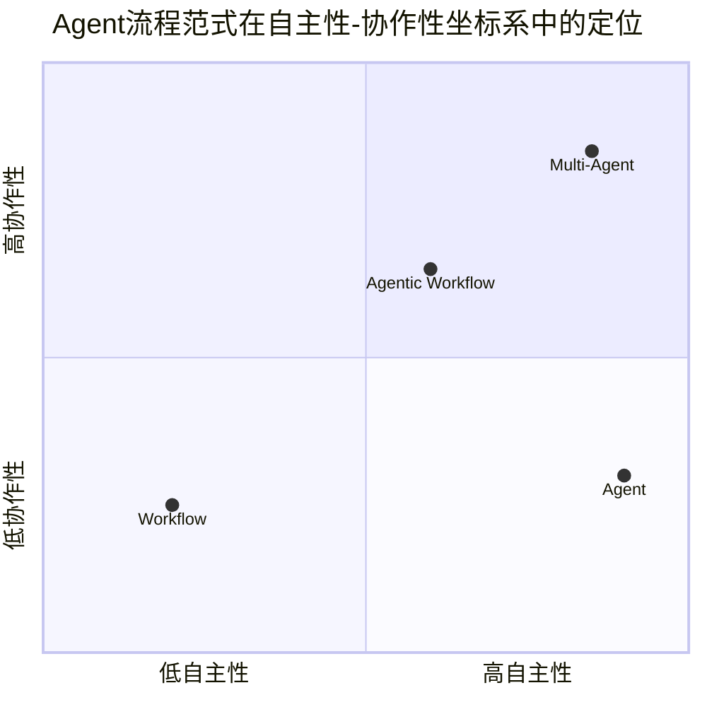

# Agent 流程串联的范式

LLM Agent 的流程串联没有单一的"最优解"，而是发展出了一系列适用于不同场景的范式。这些范式按自主性与协作性的高低，可以划分为四种类型，形成了一条从"固定流水线"到"智能协作团队"的演进路线。

---

## 核心设计范式概览

下图展示了四种范式在**自主性**与**协作性**两个维度上的定位：

"Multi-Agent(多智能体协作)"
"Agentic Workflow (智能体工作流)"
"Workflow (预定义工作流)"
"Agent (自主智能体)"

---

## 四大主流范式详解

### 1. Workflow（预定义工作流）

**定位**：低自主性，低协作性。像高精度的流水线，开发者预先固定每一个步骤和分支逻辑。

- **技术实现**：主要包括**提示链（Prompt Chaining）**、**路由（Routing）**和**并行化（Parallelization）**
- **代表框架**：LangGraph、CrewAI、n8n
- **适用场景**：逻辑极其固定的企业级自动化和耗时敏感的生产线，如简历自动筛选、常规报表生成

### 2. Agent（自主智能体）

**定位**：高自主性，低协作性。像一个能力全面的单兵，LLM 拥有高度的自主决策权，独立负责接收目标、制定计划、调用工具和完成任务。

- **技术核心**：自主**规划（Planning）**为基础，结合 ReAct 等框架，进行"推理-行动-观察"的循环
- **代表框架**：各类通用开发框架
- **适用场景**：需要探索和动态调整的复杂开放式任务，如市场调研、旅行路线规划

### 3. Agentic Workflow（智能体工作流）

**定位**：中高自主性，中等协作性。结合 Workflow 和 Agent 的优点，在一套灵活但有一定结构约束的框架内，赋予 LLM 一定的自主决策权。

- **技术核心**：AI 在其中扮演"评价者"和"优化者"，对初始结果进行批评和迭代修改。常采用"评估器-优化器"的循环来提升输出质量
- **代表框架**：LangGraph、CrewAI、n8n
- **适用场景**：可能是绝大多数企业应用的理想选择。既保证了部分流程的稳定可控，又让 AI 在关键节点发挥智能

### 4. Multi-Agent（多智能体协作）

**定位**：高自主性，高协作性。像一个专业的专家团队，多个具备不同专长和工具的 Agent 通过沟通、协作或竞争来完成复杂任务。

- **协作策略**：包括**协作/合作（Collaborative/Cooperative）**、**顺序（Sequential）**、**竞争（Competitive）**和**层级（Hierarchical）**等
- **编排架构**：多智能体系统的典型特征是其中至少包含一个"规划者/管理者"角色，将任务分解并分发给专业 Agent 处理
- **代表框架**：OpenAI Agents SDK、Microsoft AutoGen、CrewAI、LangGraph
- **适用场景**：需要多种专业技能协作解决的高复杂度任务，如自动化软件开发、方案策划

---

## 如何选择？

| 你的场景 | 推荐范式 |
|---------|---------|
| 需要极致的稳定性和可预测性，流程明确固定 | **Workflow** |
| 任务定义明确但步骤存在不确定性，且有机会迭代优化 | **Agentic Workflow**（多数商业化 Agent 应用的可靠选择） |
| 目标明确但达成路径完全未知，单一 Agent 能处理 | **Agent（自主智能体）** |
| 任务极其复杂，需要多种专业技能协作 | **Multi-Agent**（当前前沿研究方向） |

---

## 重要机制与前沿演进

除了四大核心范式，还存在一些重要的补充机制和前沿方向：

- **高效预处理**：部署一个"路由器（Router Agent）"作为第一道关卡，先对用户指令进行意图分类，再将任务路由至最合适的流程
- **动态降本增效**：可以采用**动态 Agent 选择**技术，通过**语义缓存（Semantic Cache）**层，在运行时动态选择最相关的 Agent，而非调用全部，以降低 Token 成本和延迟
- **前沿探索**：核心方向包括**"自进化（Self-Evolving）"**和**"动态编排（Dynamic Orchestration）"**，即让 AI Agent 系统拥有元认知能力，能够根据环境和任务变化，动态调整或自动生成最优的协作模式