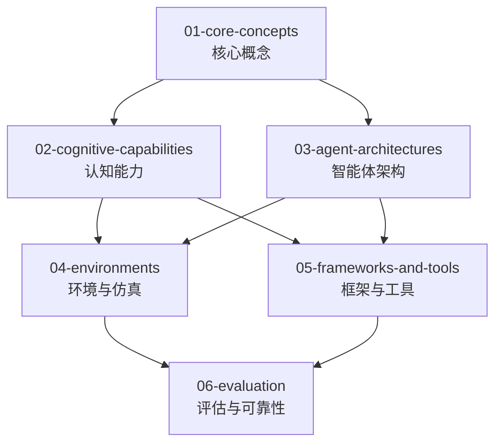

# AI 智能体 (Agentic AI)

## 目录结构

```
agentic/
├── 01-core-concepts/                  # 核心概念
│   ├── definition-and-taxonomy/
│   ├── reactive-vs-deliberative/
│   └── cognitive-architectures-intro/
│
├── 02-cognitive-capabilities/         # 认知能力
│   ├── planning/
│   │   ├── task-decomposition/
│   │   ├── plan-and-execute/
│   │   └── tree-of-thoughts/
│   ├── memory/
│   │   ├── short-term-memory/
│   │   ├── long-term-memory/
│   │   └── retrieval-methods/
│   ├── tool-use/
│   │   ├── api-calling/
│   │   ├── code-interpreter/
│   │   └── web-browsing/
│   └── self-reflection/
│       ├── critique-models/
│       └── iterative-refinement/
│
├── 03-agent-architectures/            # 智能体架构
│   ├── single-agent-patterns/
│   │   ├── react/
│   │   ├── ra-aid/
│   │   └── autogpt-pattern/
│   ├── multi-agent-systems/
│   │   ├── collaborative/
│   │   ├── competitive/
│   │   └── organizational-structures/
│   └── human-agent-interaction/
│
├── 04-environments/     # 环境与仿真
│   ├── simulated-environments/
│   ├── sandboxing-and-safety/
│   └── benchmarking-frameworks/
│
├── 05-frameworks-and-tools/           # 框架与工具
│   ├── langchain-agents/
│   ├── autogen/
│   ├── crewai/
│   └── custom-agent-dev/
│
└── 06-evaluation/                    # 评估与可靠性
    ├── task-completion-metrics/
    ├── safety-and-robustness/
    └── human-evaluation/
```

## 开源仓库与工具存放指南

Agentic AI 相关的开源仓库、框架笔记和项目实践，按功能主题放入对应目录：

| 内容类型 | 放入目录 | 示例 |
|---------|---------|------|
| 智能体框架（LangChain, AutoGen, CrewAI 等） | `05-frameworks-and-tools/` | langchain-agents, autogen, crewai |
| 单智能体架构模式（ReAct, AutoGPT 等） | `03-agent-architectures/single-agent-patterns/` | ReAct, RA-AID |
| 多智能体协作系统 | `03-agent-architectures/multi-agent-systems/` | MetaGPT, ChatDev |
| 工具使用与技能框架 | `02-cognitive-capabilities/tool-use/` | 工具调用协议、MCP |
| 评估基准与论文 | `06-evaluation/` | AgentBench, SWE-bench |
| 环境仿真平台 | `04-environments/` | WebArena, OSWorld |

## 学习路径

推荐学习顺序：



## 相关资源

- [LLM](../llm/) — Agent的核心引擎
- [RAG](../rag/) — Agent的知识检索能力
- [知识图谱](../knowledge-graph/) — Agent的结构化知识
- [具身智能](../embodied-intelligence/) — Agent的物理落地

---

*最后更新: 2026-05-03*
