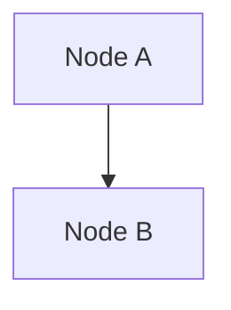
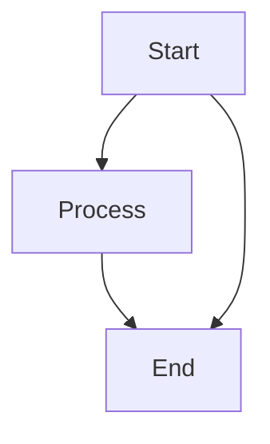
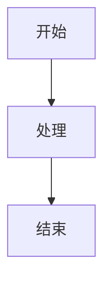
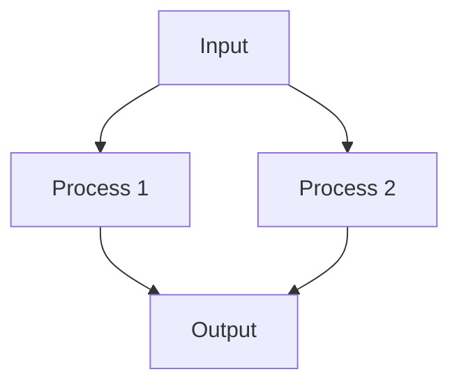
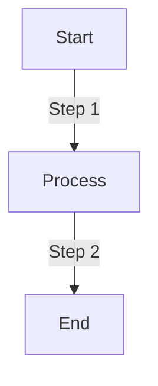
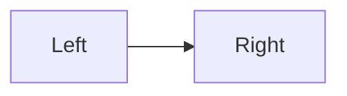
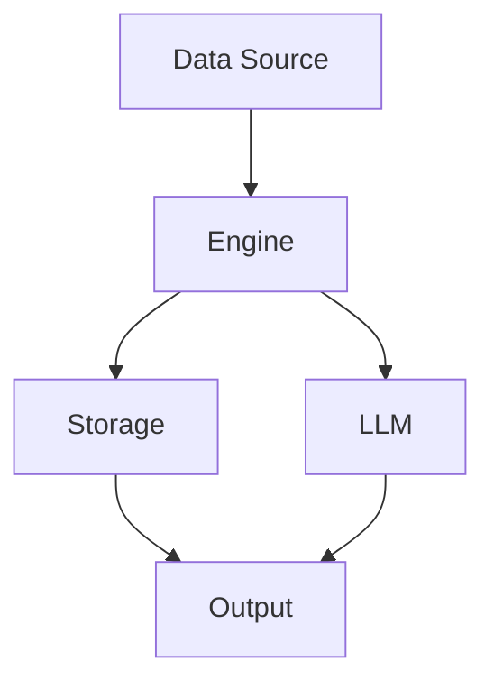

# Mermaid 降级兼容性测试

针对 yarkdown 等旧版 Mermaid 渲染器的降级测试

---

## 测试 1: 最基础语法 (graph TD)


## 测试 2: 基础带标签


## 测试 3: 多条边


## 测试 4: 中文标签


## 测试 5: 复杂连接


## 测试 6: 带描述的边


## 测试 7: 不同方向


## 测试 8: 简单架构图


---

## 不兼容语法（避免使用）

以下语法在旧版 Mermaid 中可能报错：

```mermaid
%% 不要使用 flowchart 关键字
%% flowchart TD
%%     A-->B

%% 不要使用 subgraph
%% graph TD
%%     subgraph Group
%%         A-->B
%%     end

%% 不要使用特殊形状
%% graph TD
%%     A([Round])-->B[(DB)]
%%     B-->C{{Diamond}}

%% 不要使用复杂箭头
%% graph TD
%%     A==>B
%%     B-.->C
```

---

## 诊断记录

| 测试编号 | 结果 | 备注 |
|:---------|:-----|:-----|
| 1 | | |
| 2 | | |
| 3 | | |
| 4 | | |
| 5 | | |
| 6 | | |
| 7 | | |
| 8 | | |

**渲染环境**：
- 编辑器：VS Code
- 插件：vscode-yarkdown
- 报错信息：
