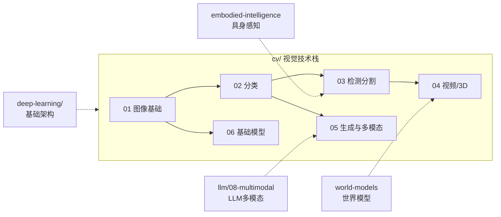

# 计算机视觉 (Computer Vision)

## 分类依据

CV 目录按"从基础到应用、从感知到生成"的递进逻辑组织：

- **01-04（感知理解）**：图像 → 分类 → 检测分割 → 视频/3D，输入到输出的复杂度递增
- **05（生成与多模态）**：从理解转向生成，并跨出纯视觉与文本/语言交互
- **06（基础模型）**：通用的预训练范式，不绑定具体下游任务
- **07（应用与工具）**：工程化落地的总结

## 边界说明

| 内容 | 适合放 CV | 不适合放 CV |
|------|----------|------------|
| 视觉核心任务（分类、检测、分割、识别） | 02-04, 07 | — |
| 图像/视频生成（GAN、扩散模型、文生图） | 05 | 通用生成模型架构放 `deep-learning/03-architectures/generative-models/` |
| 视觉为中心的图文模型（BLIP、CLIP） | 05 | LLM 为中心的多模态模型（LLaVA、Qwen-VL）放 `llm/08-multimodal/vlm/` |
| 音频/语音处理 | — | 放 `llm/08-multimodal/audio/` |
| 通用神经网络架构（CNN、Transformer 原理） | — | 放 `deep-learning/01-neural-network-fundamentals/`、`deep-learning/03-architectures/` |
| 3D 感知与重建 | 04 | 3D 生成放 `world-models/` |
| 机器人视觉感知 | — | 放 `embodied-intelligence/02-perception/` |

## 与其他目录的关系



- **deep-learning/** 提供 CNN、Transformer 等架构基础，CV 目录使用这些架构解决视觉任务
- **llm/08-multimodal/** 以 LLM 为中心的多模态，与 CV 的`05-generative-and-multimodal/` 互补（见上表）
- **embodied-intelligence/02-perception/** 聚焦机器人场景下的视觉感知，CV 的通用方法可作为其理论基础
- **world-models/** 的视频生成方向与 CV 的`04-video-and-3d-vision/` 有交集，WM 侧重环境建模与预测

## 目录结构

```
cv/
├── 01-image-fundamentals/              # 图像基础
│   ├── image-processing-basics/
│   │   ├── filtering/
│   │   └── edge-detection/
│   └── feature-extraction/
│
├── 02-image-classification/            # 图像分类
│   ├── classic-backbones/
│   ├── efficient-models/
│   └── training-tricks/
│
├── 03-detection-and-segmentation/      # 目标检测与分割
│   ├── two-stage-detectors/
│   ├── one-stage-detectors/
│   ├── instance-segmentation/
│   ├── semantic-segmentation/
│   └── panoptic-segmentation/
│
├── 04-video-and-3d-vision/             # 视频与3D视觉
│   ├── video-understanding/
│   ├── optical-flow/
│   ├── 3d-reconstruction/
│   └── nerf-and-3d-gaussian-splatting/
│
├── 05-generative-and-multimodal/       # 生成与多模态
│   ├── image-generation/
│   ├── text-to-image/
│   │   └── dall-e/
│   └── multimodal-models/
│
├── 06-foundation-models/  # 自监督与基础模型
│   ├── contrastive-learning/
│   ├── masked-image-modeling/
│   └── vision-foundation-models/
│
└── 07-applications-and-tools/          # 应用与工具
    ├── ocr/
    ├── face-recognition/
    └── deployment-and-optimization/
```

## 学习路径

**基础阶段**
- `01-image-fundamentals/` — 图像处理基础、特征提取

**核心阶段**
- `02-image-classification/` — 经典骨干网络、高效模型
- `03-detection-and-segmentation/` — 检测与分割

**进阶阶段**
- `04-video-and-3d-vision/` — 视频理解、3D重建、NeRF
- `05-generative-and-multimodal/` — 图像生成、多模态模型
- `06-foundation-models/` — 对比学习、基础模型
- `07-applications-and-tools/` — OCR、人脸识别、部署优化

## 相关资源

- [深度学习基础](../deep-learning/) — CNN等基础架构
- [多模态LLM](../llm/08-multimodal/vlm/) — 视觉语言模型
- [具身智能](../embodied-intelligence/) — 视觉在机器人中的应用
- [世界模型](../world-models/) — 视频生成与预测

---

*最后更新: 2026-05-11*
