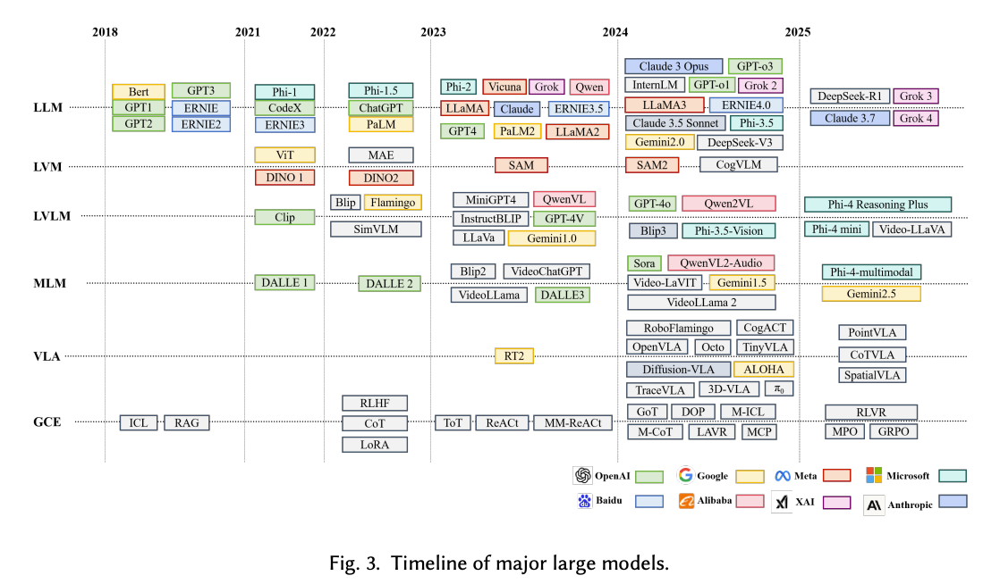
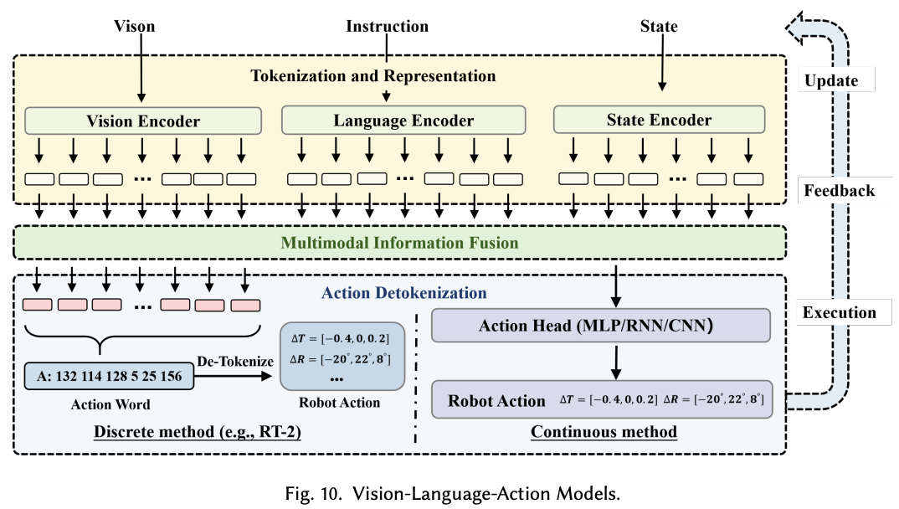
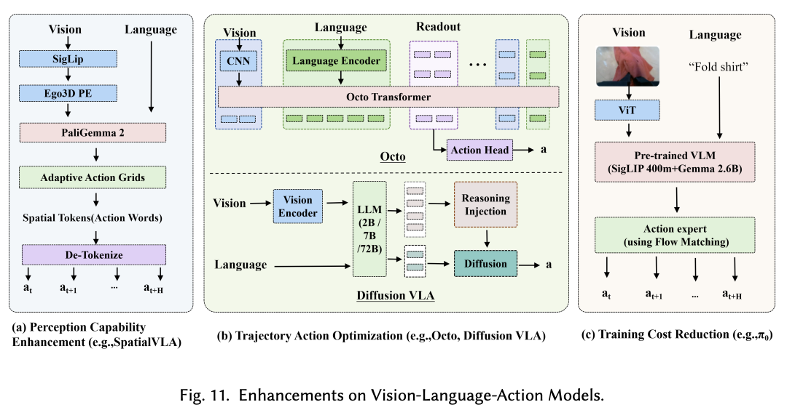
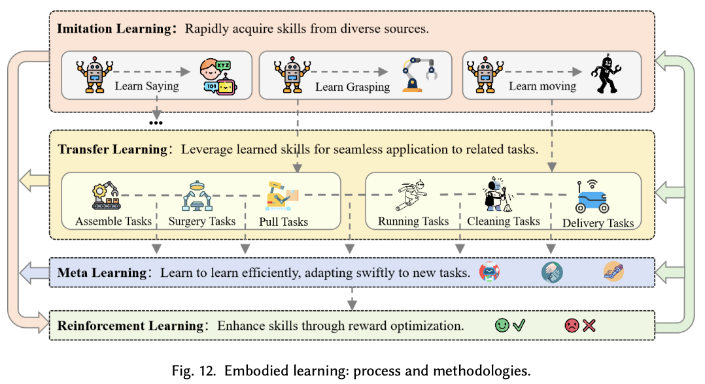

# 大模型赋能的具身AI：决策制定与具身学习综述

**论文信息**
- 论文标题：Large Model Empowered Embodied AI: A Survey on Decision-Making and Embodied Learning
- 中文标题：大模型赋能的具身AI：决策制定与具身学习综述
- 作者：Wenlong Liang, Rui Zhou, Yang Ma, Bing Zhang, Songlin Li, Yijia Liao, Ping Kuang
- 机构：电子科技大学（University of Electronic Science and Technology of China）
- arXiv: [2508.10399](https://arxiv.org/abs/2508.10399)
- 领域：机器人学（cs.RO）

---

## 一、论文整体思路

### 1.1 研究背景

具身AI（Embodied AI）旨在开发具有物理形态的智能系统，这些系统能够感知、决策、行动和学习，在现实世界环境中进行操作，为实现通用人工智能（AGI）提供了一条有前景的路径。

尽管经过数十年的研究探索，让实体代理在开放动态环境中执行通用任务并达到人类级别的智能仍然是一个重大挑战。近年来，大模型的重大突破彻底革新了具身AI，通过提升感知、交互、规划和学习能力来实现这一目标。

### 1.2 核心问题

本综述聚焦于两个核心问题：
1. **自主决策制定**：如何利用大模型实现从感知到行动的决策过程？
2. **具身学习**：如何利用大模型提升智能体的学习能力？

### 1.3 论文结构

论文采用"纵横向双重分析方法"：
- **横向分析**：比较不同方法的优劣（如分层vs端到端、模仿学习vs强化学习）
- **纵向分析**：追溯核心模型或方法的演进历程

---

## 二、大模型分类



论文将赋能具身AI的大模型分为以下几类：

### 2.1 大语言模型（LLM）
- **代表模型**：GPT系列、LLaMA、Vicuna、Deepseek-R1
- **核心能力**：语言理解、任务规划、指令遵循
- **应用场景**：高层任务分解、代码生成、知识推理

### 2.2 多模态大语言模型（MLLM）
- **视觉语言模型（VLM）**：Flamingo、Qwen-VL、Gemini-1.5、GPT-4o
- **核心能力**：跨模态理解、语义推理、视觉感知
- **优势**：能够桥接高层多模态输入和底层运动动作序列

### 2.3 视觉-语言-动作模型（VLA）
- **代表模型**：RT-2、OpenVLA、Octo、CrossFormer、HPT
- **核心能力**：端到端地从视觉和语言输入直接输出机器人动作
- **特点**：统一的多模态表示与感知-决策-执行一体化架构

### 2.4 世界模型（World Model）
- **代表模型**：RSSM、JEPA、DreamerV3、Sora
- **核心能力**：预测未来状态、内部模拟、知识增强
- **作用**：构建外部世界的内部表示，支持规划与学习

---

## 三、自主决策制定范式

论文将自主决策制定分为两种主要范式：

### 3.1 分层决策制定（Hierarchical Decision-Making）

分层方法保持了传统具身智能的阶段分解，同时利用大模型增强各个组件。

#### 三层架构

**第一层：感知与交互（Perception & Interaction）**
- 功能：解析感官输入（视觉、语言、本体感知）
- 技术方案：使用预训练的多模态骨干网络
- 大模型赋能：ViT、CLIP、DINOv2等视觉编码器

**第二层：高层规划（High-level Planning）**
- 功能：将任务目标分解为可执行的子目标序列
- 大模型应用：
  - **PDDL规划**：生成结构化的规划领域定义语言
  - **自然语言规划**：生成自然语言形式的计划
  - **代码生成规划**：生成可执行代码
- 核心能力：零样本/少样本任务分解、子目标生成、约束满足
- 代表工作：Inner Monologue、Progprompt、Socratic Models

**第三层：底层执行（Low-level Execution）**
- 功能：将子目标映射为控制动作
- 执行模块：强化学习智能体、模仿学习控制器
- 大模型赋能：扩散策略（Diffusion Policy）、Transformer策略

#### 反馈与自反思（Feedback & Self-reflection）

决策过程涉及迭代优化：
- 行动后，模型可以重新提示自己或寻求人类/环境反馈来纠正错误
- 代表工作：Reflexion、Inner Monologue

#### 分层架构的优缺点

| 优势 | 劣势 |
|------|------|
| 模块化设计，易于调试和解释 | 层间协调复杂 |
| 可利用成熟的控制算法 | 整体优化受限 |
| 大模型可灵活替换 | 实时性受限 |

### 3.2 端到端决策制定（End-to-End Decision-Making）

端到端范式以VLA模型为代表，尝试直接从多模态感官输入映射到机器人动作，无需显式的中间表示。



#### VLA模型架构三阶段流程

**阶段1：Tokenization（标记化）**
- 视觉Token化：使用ViT将图像分割成patch并编码
- 语言Token化：使用分词器将文本转换为Token序列
- 动作Token化：将连续动作离散化或保持连续表示

**阶段2：Multimodal Fusion（多模态融合）**
- 基于Transformer的融合架构
- 交叉注意力机制整合视觉和语言特征
- 统一的表示空间

**阶段3：Action Generation（动作生成）**
- **离散动作输出**：将动作空间离散化为Token
- **连续动作输出**：使用扩散模型或流匹配方法

#### VLA模型的增强方向



**感知增强**：
- 3D感知能力（点云编码）
- 多视角融合
- 时序建模

**动作生成增强**：
- 扩散策略（Diffusion Policy）
- Action Chunking（动作分块）
- 流匹配（Flow Matching）

**部署效率增强**：
- 模型量化
- 知识蒸馏
- 模型剪枝

#### 端到端架构的优缺点

| 优势 | 劣势 |
|------|------|
| 端到端优化，整体性能更好 | 可解释性差 |
| 减少模块间信息损失 | 数据需求大 |
| 部署相对简单 | 大模型推理延迟高 |

### 3.3 两种范式的对比

| 维度 | 分层范式 | 端到端范式 |
|------|----------|------------|
| 架构设计 | 模块化 | 一体化 |
| 可解释性 | 高 | 低 |
| 数据需求 | 中等 | 高 |
| 优化方式 | 分层优化 | 端到端优化 |
| 实时性 | 中等 | 取决于模型大小 |
| 泛化能力 | 依赖各模块 | 依赖数据多样性 |
| 代表模型 | Inner Monologue, Progprompt | RT-2, OpenVLA, π0 |

---

## 四、具身学习方法



### 4.1 模仿学习（Imitation Learning）

模仿学习通过从专家演示中学习来获取技能。其核心思想是让智能体通过模仿专家的行为来学习技能，而非直接与环境交互探索。

#### 专家行为（Expert Demonstration）的定义

在模仿学习中，专家行为指的是能够正确完成任务的示范数据，是模仿学习的核心数据来源。

**来源形式**：

| 类型 | 描述 |
|------|------|
| **人类演示** | 人类操作员通过遥操作设备控制机器人完成任务的轨迹数据 |
| **最优策略** | 假设存在一个"专家策略" $\pi^*$，能够完美完成任务 |
| **轨迹数据** | 状态-动作对 $\tau = (s_0, a_0, s_1, a_1, ...)$ 的序列 |

**数学定义**：

模仿学习假设存在一个专家策略 $\pi^*(a|s)$，能够给出在状态 $s$ 下的"正确"动作 $a$。学习目标是最小化与专家策略的差距：
$$\min_\pi \mathbb{E}_{s \sim D}[d(\pi(a|s), \pi^*(a|s))]$$

**数据采集方式**：

| 方式 | 描述 |
|------|------|
| **遥操作** | 通过VR手柄、力反馈设备远程控制机器人 |
| **动捕系统** | 记录人类手部动作并映射到机械臂 |
| **直接示教** | 人工移动机械臂完成动作 |
| **事后标注** | 从其他方法（Planner）生成的轨迹中筛选高质量样本 |

**关键假设**：

模仿学习有效性的前提假设：
1. **专家策略足够好**：能够处理训练中遇到的所有状态
2. **覆盖充分**：演示数据覆盖足够多的状态-动作对
3. **分布一致性**：训练分布与测试分布相近

> **注**：这与强化学习不同——强化学习通过与环境交互、获得奖励来定义"什么是好行为"，而模仿学习直接假设专家演示的就是"正确的行为"。

#### 行为克隆（Behavior Cloning）

形式化为标准监督学习，目标函数为：
$$L(\pi) = -\mathbb{E}_{\tau \sim D}[\log \pi(a|s)]$$

其中D是演示数据集，即在给定状态 $s$ 下，最大化采取专家动作 $a$ 的对数概率。

#### 大模型赋能模仿学习

**策略网络构建**：
- **扩散策略（Diffusion-based Policies）**：擅长建模复杂动作分布，适用于离线RL设置
- **Transformer策略**：将RL重新定义为序列建模问题
- **LLM策略**：直接在轨迹数据上微调预训练语言模型

**代表工作**：
- **EmbodiedGPT**：融合ViT视觉编码器与LLaMA-7B LLM，通过可学习的Embodied-former桥接
- **RT-2, RT-H**：整合视觉、语言和动作规划，使用联合Token化和Transformer架构

#### 模仿学习的挑战

- 分布偏移（Distribution Shift）
- 数据效率低
- 缺乏错误恢复能力

### 4.2 强化学习（Reinforcement Learning）

强化学习通过与环境的迭代交互来优化策略。

#### 大模型赋能强化学习

**奖励函数设计**：
- 使用LLM设计奖励函数
- 从语言描述自动生成奖励
- 基于VLM的视觉奖励

**策略网络构建**：
- 扩散策略用于建模专家行为的完整分布
- Transformer策略用于序列决策
- LLM策略利用预训练知识和推理能力

#### 强化学习方法

- **PPO（Proximal Policy Optimization）**：近端策略优化
- **SAC（Soft Actor-Critic）**：柔性演员-评论家
- **RLHF**：基于人类反馈的强化学习
- **GRPO**：群组相对策略优化
- **DPO**：直接偏好优化

#### 强化学习的挑战

- 样本效率低
- 奖励设计困难
- 在真实环境中训练不安全

### 4.3 迁移学习（Transfer Learning）

迁移学习将一个环境（源域）中学到的知识或策略迁移到另一个环境（目标域）中，从而减少目标域的学习成本。

#### 具身智能中迁移学习的主要场景

**1. 仿真到真实迁移（Sim-to-Real Transfer）**

这是具身智能中最典型的迁移学习场景：

| 方面 | 源域（仿真） | 目标域（真实） |
|------|-------------|---------------|
| 数据 | 大量、低成本 | 稀缺、昂贵 |
| 安全性 | 无风险 | 有风险 |
| 局限 | 与真实存在差距 | 采样效率低 |

**主要方法**：
- **域随机化（Domain Randomization）**：在仿真中随机化光照、纹理、物理参数等
- **域适应（Domain Adaptation）**：学习仿真与真实之间的映射
- **渐进迁移**：逐步从仿真过渡到真实环境

**2. 跨任务迁移**

将一个任务学到的能力迁移到新任务：
- 例如：学会"抓取"后，迁移到"抓取并放置"
- 利用大模型的泛化能力实现零样本/少样本迁移

**3. 跨形态迁移**

将一个机器人平台学到的策略迁移到另一个平台：
- 不同机械臂构型
- 不同自由度
- 不同末端执行器

**4. 跨场景迁移**

将一个场景学到的策略迁移到新场景：
- 不同光照条件
- 不同背景环境
- 不同物体摆放

#### 大模型赋能的迁移学习

大模型通过以下方式增强迁移学习：

| 方式 | 描述 |
|------|------|
| **预训练知识** | 从互联网数据学到的通用知识作为迁移基础 |
| **多任务学习** | 同时学习多个任务，共享底层表示 |
| **元学习** | 学习"如何学习"，快速适应新任务 |

#### 迁移学习的挑战

- **仿真-真实差距**：物理、视觉、动力学差异
- **负迁移**：源域知识可能干扰目标域学习
- **领域偏移**：源域与目标域分布不一致

### 4.4 元学习（Meta-Learning）

元学习的目标是让智能体"学会如何学习"，从而能够快速适应新任务。

#### 核心思想

传统学习：针对单个任务学习策略
元学习：学习一个能够快速适应新任务的学习算法

#### 典型方法

| 方法类型 | 描述 | 代表工作 |
|----------|------|----------|
| **基于优化的方法** | 学习一个好的初始化参数 | MAML |
| **基于记忆的方法** | 利用记忆模块存储经验 | Meta-SGD |
| **基于度量的方法** | 学习任务间的相似性度量 | Prototypical Networks |

#### 在具身AI中的应用

- **快速适应新任务**：少量演示即可学会新技能
- **跨平台泛化**：适应不同机器人形态
- **在线学习**：在交互过程中持续改进

### 4.5 具身学习方法对比

下表总结了四种主要具身学习方法的优势、局限性和应用场景：

| 方法 | 优势 | 局限性 | 应用场景 |
|------|------|--------|----------|
| **模仿学习** | • 通过模仿专家演示实现快速策略学习<br>• 对于有高质量数据的任务效率高 | • 依赖多样化、高质量的演示数据<br>• 对新任务或稀疏数据场景适应性有限 | • 机器人操作<br>• 结构化导航<br>• 有专家指导的人机交互 |
| **强化学习** | • 通过试错在动态不确定环境中优化策略<br>• 在有清晰奖励信号的任务中表现出色 | • 需要大量样本和计算资源<br>• 对奖励函数和折扣因子敏感 | • 自主导航<br>• 自适应人机交互<br>• 动态任务优化 |
| **迁移学习** | • 在相关任务间迁移知识，提升学习效果<br>• 适合复用已有技能 | • 任务差异显著时存在负迁移风险<br>• 需要任务相似性保证有效性 | • 跨多样化环境导航<br>• 具有共享结构的操作任务<br>• 跨任务技能复用 |
| **元学习** | • 用少量数据快速适应新任务<br>• 适用于高度多样化的具身任务 | • 需要大量预训练和大规模数据集<br>• 通用元策略学习资源消耗大 | • 跨多样化任务和环境的导航、操作或交互中的快速适应 |

**方法选择建议**：

- **数据充足、任务固定** → 模仿学习
- **动态环境、有明确目标** → 强化学习
- **有相关任务经验可复用** → 迁移学习
- **需要快速适应新任务** → 元学习
- **混合策略**：先用模仿学习提供初始策略减少探索，再用强化学习通过环境交互优化

---

## 五、训练数据

训练数据是具身AI模型性能的基础。不同类型的数据在模型训练的不同阶段发挥不同作用。

### 5.1 数据类型与来源

#### 互联网图文数据

**特点**：规模最大、成本最低

**代表数据集**：
- **COCO**：目标检测、图像描述
- **VQA系列**：视觉问答
- **CapsFusion**：大规模图文对
- **WebLI**：网络规模图文数据

**作用**：
- 预训练VLM/LLM部分，赋予模型语义理解能力
- 帮助机器人理解"什么是苹果"、"什么是桌子"等基础概念
- 提供基础的视觉问答推理能力

**局限**：静态数据，缺乏动作和物理交互信息

#### 机器人操作数据

**仿真数据**：
- **RLBench**：多种桌面操作任务
- **CALVIN**：长序列操作任务
- **LIBERO**：语言条件操作任务
- **SimplerEnv**：简化仿真环境

**真实机器人数据**：
- **OXE（Open X-Embodiment）**：开源跨具身数据集
- **DROID**：大规模机器人演示数据
- **BridgeData**：桥接仿真与真实数据

**特点**：
- 包含完整的动作信息
- 状态-动作对轨迹数据
- 可直接用于模仿学习

**采集方式**：
- 遥操作（VR手柄、力反馈设备）
- 动捕系统（记录人类动作映射到机械臂）
- 直接示教（人工移动机械臂）

#### 视频数据

**特点**：学习操作技能和常识

**代表数据集**：
- **Ego4D**：第一人称视角视频
- **Something-Something**：人类动作识别

**作用**：
- 学习人类操作模式
- 获取物理常识
- 预训练视觉理解能力

**视频数据的使用方法**：

视频数据在具身AI训练中有多种使用方式：

**1. 视频预训练（Video Pretraining）**

先在大规模视频数据上预训练，再在机器人数据上微调：

| 方法 | 描述 |
|------|------|
| **SWIM** | 利用互联网规模的人类视频数据理解丰富的人类交互，先在大量第一人称视频上预训练，再用机器人数据微调适应机器人领域 |
| **GR00T** | NVIDIA的视频预训练方法，用于人形机器人技能学习 |
| **mimic-video** | 使用Cosmos世界模型作为骨干，在纯RGB视频上预训练物理动力学和动作规划，实现10倍样本效率提升 |

**2. 学习"做什么"与"怎么做"分离**

**MimicPlay方法**：
- 从**人类视频数据**学习"做什么"（高层规划/子目标预测）
- 从**机器人遥操作数据**学习"怎么做"（底层执行）
- 解耦学习架构：人类视频提供意图和规划信息，机器人数据提供精确执行能力

**3. 联合训练（Joint Training）**

**EgoMimic方法**：
- 将人类数据和机器人数据**同等对待**作为具身演示数据
- 从两种数据源学习**统一策略**
- 关键发现：1小时人类数据的价值显著高于1小时机器人数据

**4. 人到机器人迁移（Human-to-Robot Transfer）**

关键发现：
- 当VLA在足够多样化的场景、任务和具身上预训练时，人到机器人的迁移能力**涌现出现**
- 多样化预训练产生**具身无关表示**，对齐人类和机器人轨迹
- 人类视频 + 机器人数据联合训练可显著提升泛化能力

**5. 视频数据处理流程**

| 步骤 | 描述 |
|------|------|
| 数据采集 | 第一人称视角（Ego4D）、智能眼镜（Project Aria）、智能手机采集 |
| 特征对齐 | 将未来人类动作的潜在表示对齐到机器人动作空间 |
| 无动作标签学习 | 通过观察视频学习环境动力学和任务逻辑，无需显式动作标签 |
| 跨域对齐 | 解决人类与机器人之间的感知、动作和运动学差距 |

### 5.2 数据特点对比

| 数据类型 | 数据量 | 采集成本 | 动作信息 | 物理交互 |
|----------|--------|----------|----------|----------|
| 互联网图文 | 极大 | 低 | 无 | 无 |
| 仿真数据 | 大 | 低 | 有 | 有（近似） |
| 真实机器人数据 | 小 | 高 | 有 | 有 |
| 视频数据 | 大 | 中 | 无（隐含） | 无 |

### 5.3 数据挑战

#### 数据稀缺性
- 机器人操作数据采集成本高昂
- 与互联网图文数据相比，操作数据量级差距巨大
- 难以覆盖所有任务场景

#### 长尾分布问题
- 罕见场景数据不足
- 边缘情况难以覆盖
- 影响模型泛化能力

#### 数据一致性问题
- 不同操作员习惯不同，导致数据风格不一致
- 不同机器人的动作空间和坐标系定义不同
- 数据格式标准化困难

#### 仿真-真实差距（Sim-to-Real Gap）
- 物理参数差异（摩擦力、质量等）
- 视觉差异（光照、纹理、材质）
- 动力学差异

### 5.4 数据增强与合成

#### 域随机化（Domain Randomization）
- 随机化光照、纹理、物理参数
- 提高模型对环境变化的鲁棒性

#### 数据增强
- 图像变换（旋转、缩放、颜色抖动）
- 时序扰动（速度变化、时间扭曲）

#### 合成数据生成
- 利用世界模型生成合成轨迹
- 通过仿真环境大规模生成数据
- 利用扩散模型生成新场景

---

## 六、世界模型（World Model）

本综述首次将世界模型系统性地纳入具身AI综述，展示了其设计方法和关键作用。

### 6.1 世界模型的定义

世界模型（World Model）作为环境的内部模拟器或表示，使智能系统能够：
- 预测未来状态
- 理解因果关系
- 在不依赖昂贵现实世界交互的情况下做出合理决策

世界模型为智能系统提供了丰富的认知框架，促进在复杂动态环境中更高效的学习、决策和适应。

### 6.2 世界模型的作用

**三大核心作用**：
1. **前瞻性规划模拟**：在内部模拟中验证计划的可行性
2. **合成数据生成**：为学习生成训练数据
3. **上下文增强**：为鲁棒决策提供知识增强

### 6.3 世界模型架构演进

**四大架构类别**：潜空间模型、JEPA架构、Transformer世界模型、扩散世界模型

#### 1. 潜空间模型（Latent Space Models）

在压缩的潜在空间中建模世界动态，代表性工作：

| 模型 | 描述 |
|------|------|
| **PlaNet** | 最早采用RSSM架构的模型之一 |
| **DreamerV1** | 引入循环状态空间模型（RSSM），在DMC等像素控制基准测试中表现优异 |
| **DreamerV2** | 通过引入离散潜在变量扩展框架，在Atari上达到人类水平表现 |
| **DreamerV3** | 整合归一化与训练稳定机制，成为首个在广泛视觉控制任务中达到顶尖性能的通用世界模型 |
| **DayDreamer** | 在物理机器人上部署Dreamer风格模型，验证现实世界适用性 |
| **TransDreamer** | 用Transformer替代RNN以更好地捕捉长程依赖关系 |

**核心思想**：通过变分自编码和状态空间建模将高维观测编码为紧凑、可预测的潜在轨迹，利用想象的rollout高效学习策略。

#### 2. JEPA架构（Joint Embedding Predictive Architecture）

- 通过预测潜在表示来学习
- 避免重建计算（reconstructive computation）
- 更高效的表示学习

#### 3. Transformer世界模型

利用注意力机制建模长程依赖，代表性工作：

| 模型 | 描述 |
|------|------|
| **Genie** | 基于空间-时间Transformer，在大量无标注互联网视频数据上通过自监督学习训练，超越传统RSSM |
| **TWM** | 基于Transformer-XL的世界模型，利用段级循环机制捕捉环境状态间的长期依赖 |
| **iVideoGPT** | 使用VQ-VAE将视频、动作和奖励token化为多模态序列，自回归预测未来token |

#### 4. 扩散世界模型

使用扩散过程生成未来状态，代表性工作：

| 模型 | 描述 |
|------|------|
| **Sora** | OpenAI发布，实现前所未有的照片级真实感和长时视频生成，首次达到工业级电影质量内容生成 |
| **Cosmos** | 统一层次化扩散渲染器与自回归骨干，支持实时文本编辑并保证跨域视觉一致性 |
| **RoboDreamer** | 将复杂指令分解为细粒度短语并拼接对应视频片段，实现未见任务的零样本组合 |
| **Pandora** | 用扩散帧合成增强自回归骨干，支持实时文本编辑 |
| **Occ-Sora** | 采用基于扩散的4D占据生成模型模拟3D世界演化 |

### 6.4 世界模型在决策制定中的应用

#### 计划验证
- 在执行前验证计划的可行性
- 预测潜在失败模式
- 通过想象的rollout评估不同策略

#### 知识增强
- 提供物理常识
- 理解因果关系
- 支持长程规划

#### 基于模型的强化学习（MBRL）

世界模型在MBRL中作为动力学模型：
- 无需依赖手工设计的物理引擎或稀疏奖励信号
- 通过想象的rollout模拟未来状态并规划动作
- 降低样本复杂度，提升复杂高维环境中的决策能力

### 6.5 世界模型在具身学习中的应用

#### 状态转移预测
- 预测动作的后果
- 支持模型预测控制
- 在潜在想象中训练策略

#### 数据生成

世界模型，特别是基于扩散的世界模型，可用于合成数据：

| 应用 | 描述 |
|------|------|
| **轨迹生成** | 生成合成机器人操作轨迹 |
| **场景生成** | 生成多样化训练场景 |
| **Corner Case生成** | 生成罕见、边缘情况数据 |
| **视频合成** | 生成高质量操作视频 |

**优势**：解决真实世界数据采集昂贵、多样化数据难以获取的问题

#### 代表性应用

| 方法 | 应用领域 | 描述 |
|------|----------|------|
| **SWIM** | 机器人操作 | 利用互联网规模人类视频数据，先在大量第一人称视频上预训练，再用机器人数据微调 |
| **RoboTransfer** | 视觉策略迁移 | 融合多视角几何与显式场景控制的几何一致性视频扩散框架 |
| **盘古世界模型** | 自动驾驶 | 神经模拟器生成高保真数字环境，支持智能驾驶和具身AI系统训练 |

### 6.6 世界模型的挑战与展望

#### 当前挑战
- **长时预测一致性**：保持长时间跨度的预测一致性
- **物理规律建模**：准确建模复杂物理现象
- **计算效率**：大模型推理延迟
- **真实世界验证**：仿真到真实的迁移

#### 未来方向
- 更强的物理常识建模能力
- 与LLM/VLM的深度集成
- 实时交互式世界模型
- 跨域泛化能力

### 6.7 四种世界模型架构对比

#### 发展脉络

```
传统RL（无模型）
    ↓
潜空间模型（RSSM/Dreamer）← 最早成熟，当前主流基础
    ↓
┌───────────┬───────────────┐
↓           ↓               ↓
JEPA    Transformer WM    扩散世界模型
(理论探索)  (序列建模改进)   (高保真生成，当前最热)
```

#### 详细对比

| 维度 | 潜空间模型 | JEPA架构 | Transformer世界模型 | 扩散世界模型 |
|------|-----------|----------|---------------------|--------------|
| **核心思想** | 在压缩潜在空间建模动力学 | 预测潜在表示而非重建 | 用注意力建模序列依赖 | 用扩散过程生成未来状态 |
| **代表工作** | Dreamer系列、PlaNet | I-JEPA | Genie、TWM、iVideoGPT | Sora、Cosmos、RoboDreamer |
| **优势** | 计算高效、成熟稳定 | 避免重建损失、表示学习更纯粹 | 长程依赖建模强 | 生成质量最高、视觉保真 |
| **劣势** | 长时预测能力有限 | 理论探索阶段、应用较少 | 计算资源需求大 | 推理慢、难以实时交互 |
| **实时性** | 较好 | 较好 | 中等 | 较差 |
| **生成质量** | 中等 | 中等 | 中高 | 最高 |

#### 应用场景适配

| 应用场景 | 推荐架构 | 原因 |
|----------|----------|------|
| **机器人实时控制** | 潜空间模型 | 推理快，满足实时性要求 |
| **长时任务规划** | Transformer世界模型 | 长程依赖建模能力强 |
| **高保真视频生成** | 扩散世界模型 | 生成质量最高 |
| **数据合成/增强** | 扩散世界模型 | 多样性好，质量高 |
| **通用具身智能** | 扩散+Transformer融合 | 兼顾质量和一致性 |

#### 业界发展趋势

**主流方向：扩散世界模型 + Transformer结合**

| 趋势 | 描述 | 代表工作 |
|------|------|----------|
| **扩散+Transformer融合** | 结合两者优势，扩散保证质量，Transformer保证一致性 | Sora、Cosmos、Genie |
| **大规模预训练** | 在互联网视频数据上预训练世界模型 | Sora、SWIM |
| **实时交互改进** | 解决扩散模型推理慢的问题 | Pandora、Cosmos |
| **潜在空间+扩散** | 在潜在空间做扩散，兼顾效率和质量 | Latent Diffusion、Stable Video |

**结论**：
- **潜空间模型**：仍是基础，DreamerV3等是当前最成熟的方案
- **扩散世界模型**：是当前研究热点，Sora等展示了工业级生成的潜力
- **Transformer世界模型**：正在成为主流，展示长程建模优势
- **JEPA架构**：更多是理论探索，实际应用较少
- **未来方向**：多种架构融合，取长补短

---

## 七、代表性工作梳理

### 6.1 分层决策代表性工作

| 模型 | 年份 | 输入模态 | 功能层级 | 应用场景 |
|------|------|----------|----------|----------|
| MineDojo | 2022 | 图像+语言 | 高层规划 | Minecraft游戏 |
| PaLM-E | 2023 | 图像+语言+本体感知 | 低层控制 | 具身操作 |
| Inner Monologue | 2023 | 图像+语言 | 高层规划 | 室内导航与操作 |
| Progprompt | 2023 | 语言 | 高层规划 | 任务规划 |

### 6.2 端到端决策代表性工作

| 模型 | 年份 | 输入模态 | 动作输出 | 应用场景 |
|------|------|----------|----------|----------|
| RT-2 | 2023 | 图像+语言 | 离散Token | 具身操作 |
| OpenVLA | 2024 | 图像+语言 | 连续动作 | 具身操作 |
| Octo | 2024 | 图像+语言+本体感知 | 连续动作 | 具身操作 |
| Cogagent | 2024 | 图像+语言 | 连续动作 | 指令遵循 |
| CrossFormer | 2024 | 图像+语言 | 连续动作 | 具身操作 |
| HPT | 2024 | 图像+语言 | 连续动作 | 具身操作 |

### 6.3 学习方法代表性工作

**模仿学习**：
- ACT（Action Chunking Transformer）
- Diffusion Policy
- 3D Diffuser Actor

**强化学习**：
- DQN、AlphaGo、PPO、SAC
- RLHF、GRPO

---

## 八、挑战与未来方向

### 7.1 当前挑战

#### 数据层面的挑战
- **数据稀缺**：机器人操作数据采集成本高
- **长尾分布**：罕见场景数据不足
- **数据质量**：不同操作员习惯导致的数据不一致

#### 模型层面的挑战
- **实时推理**：大模型推理延迟难以满足高频控制需求
- **内存管理**：大模型内存占用与端侧资源限制的矛盾
- **泛化能力**：对新场景、新任务的零样本泛化能力有限

#### 架构层面的挑战
- **分层协调**：分层架构中层间信息传递和协调复杂
- **端云协同**：如何有效利用云端大模型和边缘轻量模型

#### 学习层面的挑战
- **仿真到真实差距**：Sim-to-Real迁移困难
- **安全学习**：真实环境中的探索存在安全风险
- **持续学习**：如何在不断变化的环境中持续改进

### 7.2 未来研究方向

#### 架构创新
- 发展更高效的模型架构
- 探索统一的多模态表示
- 优化端云协同架构

#### 学习范式
- 结合模仿学习和强化学习的优势
- 发展更高效的迁移学习方法
- 探索在线持续学习

#### 世界模型
- 发展更精确的世界模型
- 探索世界模型与策略学习的深度集成
- 利用世界模型进行安全规划

#### 多智能体系统
- 多机器人协作
- 人机协作
- 分布式决策

#### 可信与安全
- 可解释性增强
- 安全约束机制
- 鲁棒性验证

---

## 九、总结

### 8.1 核心贡献

本综述的主要贡献包括：

1. **聚焦大模型赋能视角**：从具身AI的角度系统梳理大模型的赋能作用
2. **全面覆盖决策制定**：深入比较分层与端到端两种决策范式
3. **系统阐述学习方法**：全面回顾模仿学习和强化学习在具身AI中的应用
4. **首次整合世界模型**：系统性地将世界模型纳入具身AI综述框架
5. **纵横向双重分析**：提供宏观概览和深度洞察

### 8.2 关键启示

1. **大模型是具身AI的核心驱动力**：LLM、MLLM、VLA和世界模型共同推动了具身智能的发展
2. **分层与端到端各有优势**：应根据具体应用场景选择合适的架构
3. **学习方法需要互补**：模仿学习提供基础能力，强化学习实现自我进化
4. **世界模型是关键基础设施**：支持规划、学习和决策的多重功能
5. **AGI的有前景路径**：大模型赋能的具身AI为通用人工智能提供了可行路径

### 8.3 与其他综述的对比

| 综述类型 | 相关综述 | 大模型 | 决策制定 | 具身学习 | 世界模型 |
|----------|----------|--------|----------|----------|----------|
| 专题型 | [29,104,113,151,191,225] | √ | × | × | × |
| 学习型 | 2024综述 | × | √ | × | √ |
| VLA专题 | [7,227] | × | × | × | √ |
| 本综述 | - | √ | √ | √ | √ |

---

## 参考文献

1. Liang W, Zhou R, Ma Y, et al. Large Model Empowered Embodied AI: A Survey on Decision-Making and Embodied Learning. arXiv:2508.10399, 2025.
2. RT-2: Vision-Language-Action Models Transfer Web Knowledge to Robotic Control (Brohan et al., 2023)
3. OpenVLA: An Open-Source Vision-Language-Action Model (Driess et al., 2024)
4. EmbodiedGPT: Bridging Embodied AI and Large Language Models (Mu et al., 2023)
5. DreamerV3: Mastering Diverse Domains through World Models (Hafner et al., 2023)

---

*文档创建日期：2026年4月20日*
*论文来源：arXiv:2508.10399*