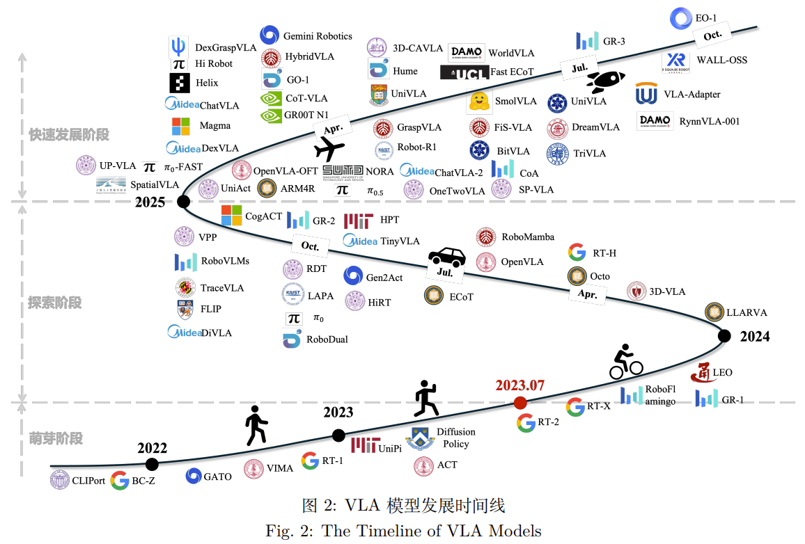
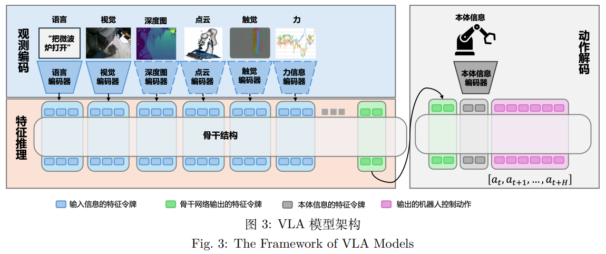
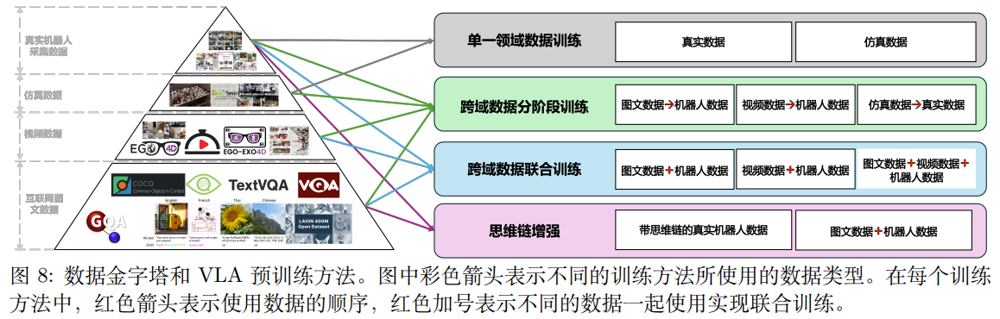

# 面向具身操作的视觉-语言-动作模型综述

**论文信息**
- 论文标题：Survey of Vision-Language-Action Models for Embodied Manipulation
- 中文标题：面向具身操作的视觉-语言-动作模型综述
- 作者：李浩然、陈宇辉、崔文博、刘卫恒、刘锴、周明才、张正涛、赵冬斌
- 机构：中国科学院自动化研究所、北京中科慧灵机器人技术有限公司、中国科学院大学人工智能学院
- 发表期刊：自动化学报，2026年第1期，18-51页
- arXiv: [2508.15201](https://arxiv.org/abs/2508.15201)
- DOI: 10.16383/j.aas.c250394

---

## 一、论文整体思路

### 1.1 研究背景

具身智能（Embodied AI）通过智能体与环境不断交互来提升智能体能力，近年来受到学术界和产业界的广泛关注。相比于传统的互联网智能或离身智能从数据中获取智能，具身智能系统通过控制"本体"与环境交互，从而获得智能。

传统机器人系统面临的核心挑战：
- 多模块解耦系统容易受到模块短板效应的影响
- 基于逻辑编排的决策模块和基于搜索或优化的规划与控制模块难以应对开放环境下多样性任务需求
- 大模型（LLM和VLM）虽然具备语义理解能力，却无法感知机器人的物理执行限制
- 早期视觉模仿学习存在泛化能力差、数据依赖性强等问题

### 1.2 VLA模型的提出

视觉-语言-动作（Vision-Language-Action, VLA）模型通过结合大模型技术，将视觉感知、语义推理与动作生成深度融合，使机器人能够直接从多模态输入中预测连续控制指令，实现从环境理解到物理执行的闭环耦合。VLA模型于2023年7月首次提出，目标是构建一个通用策略，输入为视觉和语言，输出为机器人控制动作。

---

## 二、VLA模型发展历程

论文将VLA模型的发展划分为三个阶段：

### 2.1 萌芽阶段（2023年7月之前）

**核心问题**：如何让机器人听懂人话？

**解决方案**：引入语言编码器（CLIP/T5）

**代表模型**：
- **CLIPort**：结合了CLIP的语义理解和Transporter Network的空间操作能力，采用双通路架构
- **RT-1（Robotics Transformer 1）**：Google DeepMind推出的基于Transformer的模型，输入图像和文本，输出离散化的动作Token
- **GATO**：DeepMind的通才智能体，一个模型同时玩游戏、聊天和控制机械臂
- **VIMA**：引入多模态Prompt，支持更复杂的任务描述

**局限性**：
- 动作离散化导致精度低：RT-1把动作强行变成离散的Token，损失了控制精度
- 缺乏物理常识：这些模型大多从零训练或仅使用少量数据，没有大规模互联网数据的"世界知识"，泛化能力差

### 2.2 探索阶段（2023年7月-2024年）

**核心问题**：如何让机器人具备常识？

**解决方案**：继承VLM大模型权重（RT-2），引入扩散模型（Diffusion）

**代表模型**：
- **RT-2**：首个真正意义上的VLA模型，继承PaLM和PaLI-X的预训练权重，将机器人动作表示为Token
- **Octo**：开源的通用机器人策略，使用扩散模型生成动作
- **OpenVLA**：开源的VLA模型，基于Llama架构

**局限性**：
- 大模型太慢，无法实时控制
- 容易遗忘通用知识

### 2.3 快速发展阶段（2024年至今）

**核心问题**：如何既聪明又快？

**解决方案**：分层架构（大脑规划+小脑执行）+ 视频预训练

**代表模型**：
- **π0**：Physical Intelligence推出，采用流匹配方法生成连续动作
- **GR00T**：NVIDIA推出，基于视频预训练
- **Hume**：采用分层架构设计

**发展动力**：大小脑之间配合难，训练数据依然不够多，开始转向世界模型和强化学习微调

---

## 三、VLA模型架构

论文提出VLA模型的核心架构包含三大组件：

### 3.1 观测编码器（Observation Encoder）——"眼睛与感官"

负责将机器人看到的图像、听到的语言、摸到的触觉信息转换成神经网络能理解的向量（Tokens）。

#### 视觉编码（Visual Encoder）
- **发展趋势**：从CNN（如ResNet, EfficientNet）转向Transformer（如ViT）
- **CNN流派**：早期模型如RT-1、Octo使用ResNet/EfficientNet，优点是推理快，对纹理敏感
- **ViT流派**：现代模型（如RT-2, OpenVLA）倾向于使用在大规模互联网数据上预训练好的ViT（如SigLIP, DINOv2），优点是语义理解能力更强，能泛化到没见过的物体
- **3D感知**：部分模型（如3D-VLA）引入点云编码器（PointNet++等）来处理3D空间关系

#### 语言编码（Language Encoder）
- 使用预训练语言模型（如T5、BERT）编码自然语言指令

#### 多模态传感器
- 扩展的"视觉"概念包括深度图像、激光雷达点云、触觉或力信号等

### 3.2 特征推理主干（Feature Reasoning Backbone）——"大脑"

这是核心处理单元，主要基于Transformer架构，负责整合和推理多模态特征。

**主流架构**：
- **Standard Transformer**：早期基础方案
- **DiT（Diffusion Transformer）**：结合扩散模型和Transformer
- **Mamba**：新型序列建模架构
- **MoE（Mixture of Experts）**：专家混合架构

### 3.3 动作解码器（Action Decoder）——"执行器"

负责将推理后的特征转换为可执行的机器人动作。

**主要方法**：
- **离散Token（Binning）**：早期方案，将连续动作空间离散化
- **Diffusion Policy（扩散策略）**：当前主流方案，生成连续动作序列
- **Action Chunking**：动作分块，一次性预测多步动作

### 3.4 分层架构

受人类认知中System 1（快思考）和System 2（慢思考）的启发，分层架构将复杂任务分解，解决单层VLA模型难以处理长时域任务的问题。

#### 3.4.1 核心概念

单层VLA模型使用单个Transformer结构同时处理复杂的任务描述、多个时刻的任务观测以及多个时刻的动作输出，很难处理长时域任务。分层VLA模型将VLA任务拆解为**长时域复杂任务理解**与**短时域动作生成**，使用两个模型分别完成相应任务。

#### 3.4.2 双层架构

**上层策略（System 2, S2 - 大脑）**：
- **模型**：预训练的大型VLM/VLA（如GPT-4V、Gemini）
- **任务**：慢思考、规划
- **功能**：处理语言指令，理解任务目标，提取环境中的关键信息，分解为子任务，输出中间表示或子目标
- **优势**：发挥预训练VLM优秀的复杂文本理解和场景泛化能力

**下层策略（System 1, S1 - 小脑）**：
- **模型**：小型的动作策略网络（如Diffusion Policy）
- **任务**：快执行
- **功能**：接收上层指令和机器人本体信息，结合当前观测，高频（50Hz+）输出电机控制信号
- **优势**：灵活的动作生成能力，是一个相对独立的闭环系统

**与单层VLA的区别**：单层VLA模型中也有使用单独的模型生成动作，但分层VLA系统的短时序动作生成模型会接受图像输入，是一个相对独立的闭环系统。而单层VLA模型中的单独动作生成模块依赖于VLA输出的特征，无法独立于VLA骨干单独运行。

#### 3.4.3 三层架构

除了常见的双层架构，也有研究工作提出了**3层结构的VLA模型**，通过在S2和S1之间嵌入视频预测模型作为运动感知模块（System 3, S3），从而弥补VLA方法忽略动态信息的问题。

**代表模型**：
- **TriVLA**：提出3层系统，解决双层系统对于环境中动态部分缺乏理解的问题

#### 3.4.4 层间通信原语

不同层之间如何高效地通信是分层系统的核心。目前的工作使用的通信原语大致可以分为3类：

| 通信原语 | 描述 | 优点 | 缺点 | 代表方法 |
|----------|------|------|------|----------|
| **文本语言** | 使用自然语言作为层间信息传递媒介 | 预训练VLM容易理解且擅长生成；具有良好的可解释性 | 信息的离散化一定程度上丢失了任务与环境信息 | Hi Robot, DexGraspVLA |
| **动作轨迹** | 使用机械臂操作轨迹作为层间信息传递 | 机器人容易理解且具有物理意义；让下层策略更容易生成跟随上层轨迹的动作 | 需要上层策略具备轨迹生成能力 | Hume, π0-FAST |
| **隐特征向量** | 通过隐空间向量隐式传递信息 | 可以在训练时传播梯度，实现端到端训练 | 缺乏可解释性 | HiRT, GR00T N1, GO-1 |

**具体实现方式**：

1. **文本语言原语**：
   - **Hi Robot**：使用2个模型，其中一个负责将复杂的指令和用户反馈处理成简单的原子指令，另外一个模型将该原子指令生成执行动作
   - **DexGraspVLA**：利用预训练的VLM通过语言模式直接生成待抓取的目标位置，大大缩减了动作生成系统的指令跟随难度

2. **动作轨迹原语**：
   - 通过系统S2生成长时域动作轨迹并作为系统S1的条件，指导其生成更精细的动作
   - **Hume**：训练分层控制系统的S2系统通过预测值函数评估生成动作序列的质量

3. **隐特征向量原语**：
   - **HiRT**：将系统S2通过处理视觉和语言信息后获得的多个特征进行池化，并将其作为系统S1的条件
   - **GR00T N1**：使用交叉注意力机制将来自系统S2的特征与系统S1更精细地融合
   - **GO-1**：设计了隐空间规划作为分层系统之间的通信原语，不仅可以使模型预测长时域动作，并且可以充分利用不同领域的数据

#### 3.4.5 分层架构的优势

1. **平衡泛化与实时性**：完美平衡了泛化能力（靠上层VLM）和实时控制能力（靠下层小模型）
2. **灵活的下层策略**：下层策略比较灵活，可以实现比较高的推理速度，从而满足机器人控制的实时性要求
3. **处理长时域任务**：可以处理复杂的长时序任务
4. **问题诊断**：能够及时诊断模型理解是否出现问题

#### 3.4.6 代表性模型

| 模型 | 架构特点 | 通信方式 | 发表时间 |
|------|----------|----------|----------|
| Hume | S2预测值函数评估动作序列质量 | 动作轨迹 | arXiv 2025 |
| GR00T N1 | 双系统架构，交叉注意力融合特征 | 隐特征向量 | arXiv 2025 |
| HiRT | S2特征池化后作为S1条件 | 隐特征向量 | - |
| GO-1 | 隐空间规划作为通信原语 | 隐特征向量 | IROS 2025 |
| TriVLA | 3层系统，S3为运动感知模块 | 多层传递 | arXiv 2025 |
| Hi Robot | 语言原子指令作为通信原语 | 文本语言 | - |
| DexGraspVLA | VLM生成目标位置 | 文本语言 | arXiv 2025 |

#### 3.4.7 发展趋势

由于数据的限制，单层VLA模型同时处理复杂任务理解和动作生成的能力有限，分层VLA模型可能会成为越来越多的选择。从2025年初，以分层架构为代表的新一代VLA模型逐渐发挥优势。

---

## 四、训练数据

根据大语言模型和多模态大模型的训练经验，获得面向开放环境的通用VLA模型需要使用海量的训练数据。相比于大模型预训练所使用的数据集，目前积累的机器人领域的数据量级相差甚远。此外，目前已有工作表明，仅依赖机器人轨迹数据训练的VLA模型面临严重的泛化问题。如何扩展VLA模型训练数据，成为当前VLA领域的重点研究方向之一。

英伟达的研究人员提出了**VLA训练数据金字塔**的概念，将VLA预训练过程中使用的数据划分成3种类型：互联网数据、仿真数据和真实机器人采集数据。为了更好的梳理数据与训练方法，考虑到目前基于视频预训练VLA模型方法的发展，本文把互联网数据中的图文数据和视频数据分开，将目前VLA预训练数据集划分成4类：互联网图文数据、视频数据、仿真数据和真实机器人采集数据。

### 4.1 互联网图文数据

VLA模型控制机械臂实现操作的前提是理解环境和任务，海量的互联网图文数据能够帮助机器人构建通用知识和通用场景理解能力，为实现视觉泛化奠定基础。

**特点**：规模最大、成本最低，主要用于预训练VLM部分，赋予模型语义理解能力。目前很多VLA模型通过继承预训练的VLM模型权重，并没有显式地用到这些数据，但是所继承的VLM在预训练过程中通常会使用这些数据。

**局限性**：静态数据，缺乏动作和物理交互信息。

| 名称 | 描述 | 规模 | 支持任务 | 相关方法 |
|------|------|------|----------|----------|
| CapsFusion | 大规模图像-文本对数据集，为多模态预训练设计，旨在解决现有图像-文本数据集的噪声问题和低质量标注问题 | 120M 图像-文本对 | 图像描述生成，多模态预训练 | π0 |
| COCO | 大规模图像数据集，包含80个物体类别和91种材料类别，每张图片5个语句描述，且有250k个带关键点标注的行人 | 330k 图片 | 目标检测，实例分割、关键点检测，图像描述生成 | π0, ChatVLA, ChatVLA-2 |
| GQA | 大规模视觉问答数据集，专注于真实世界的视觉推理和组合性问答 | 22.6M 问题，113K 图像 | 组合性推理，视觉问答 | ChatVLA, ChatVLA-2 |
| LAION-400M | 大规模图像-文本对数据集，包含图像URL、图像和图像描述的嵌入、图像与描述之间的相似性评分，以及元数据 | 400M 图像-文本对 | 图文检索，图文生成，多模态预训练 | UniPi |
| PixMo | 大规模图像-文本对数据集，图像涵盖70多个主题，每张图像描述由3位标注者通过语音生成 | 712k 图像，1.3M 描述 | 图像描述生成，多模态预训练 | π0 |
| TextVQA | 大规模视觉问答数据集，要求模型理解图像中的文本内容来回答问题 | 28k 图片，45.3k 问题，453k 回答 | 文本推理，视觉问答 | ChatVLA, ChatVLA-2 |
| VQAv2 | 大规模开放式问答数据集，由人工标注，面向开放世界视觉问答任务 | 265k 图片，443k 问题，4.43M 回答 | 常识推理，视觉问答 | π0 |
| WebLI | 超大规模多语言图像-文本对数据集，涵盖36种语言和多样化文化背景，旨在提升视觉语言模型在全球范围内的泛化能力与文化适应性 | 10B 图像-文本对 | 光学字符识别，图文检索，图像描述生成，视觉问答，多模态预训练 | RT-2 |

### 4.2 视频数据

在海量图文数据训练下，大模型能够理解静态环境，但是对于动态环境以及如何完成任务仍然没有先验。人类活动大规模视频数据则用于构建VLA模型对于动态环境理解和动作操作模式的理解基础。

**特点**：包含丰富多样的运动技能和任务完成过程，但不包含动作信息，很难直接用于VLA动作生成。

| 名称 | 描述 | 规模 | 支持任务 | 相关方法 |
|------|------|------|----------|----------|
| Ego-4D | 大规模第一人称视角视频数据集，涵盖数百种场景，由来自全球74个地点和9个不同国家的931名参与者拍摄 | 3670 小时视频 | 视频理解，多模态感知 | GO-1, GR-1, GR00T N1, Magma, UniVLA |
| Ego-Exo-4D | 由Ego-4D数据集扩展的大规模第一/第三人称视角的多模态视频数据集，增加多视角同步捕捉，专注于技能活动研究 | 1286 小时视频 | 跨视角表征学习，技能理解，多模态感知 | GR00T N1 |
| EPIC-KITCHENS-100 | 大规模第一人称视角视频数据集，包含45个厨房环境下的动作识别，捕捉了多种家庭活动 | 100 小时视频，20M 帧 | 动作识别，环境理解，多模态推理，场景泛化 | ARM4R, CoT-VLA, GR-2, GR00T N1, Magma, HPT |
| Howto100M | 大规模叙述视频数据集，主要是教学视频，其中内容创建者教授复杂的任务，并明确解释屏幕上的视觉内容 | 136M 视频片段 | 图像描述生成，多模态预训练 | GR-2 |
| Kinetics-700 | 大规模视频数据集，涵盖700种人类动作类别，包含人与物体及人与人之间的互动 | 650k 个视频 | 动作识别，视频理解 | GR-2 |
| Something-Something V2 | 大规模带标记视频数据集，包含人类使用日常物品执行的174种基本动作 | 220k 视频片段 | 动作识别，自监督学习，多模态推理 | CoT-VLA, GR-2, LAPA, Magma, TriVLA, VPP |

### 4.3 仿真数据

仿真数据是以低成本方式生成海量训练数据的重要来源，可以帮助构建VLA模型中场景理解与动作生成之间的关联关系。

**主要仿真环境和数据集**：

| 环境/数据集 | 仿真引擎 | 输入 | 机器人 | 任务特点 |
|-------------|----------|------|--------|----------|
| RLBench | CoppeliaSim | RGB/D，语言指令 | Franka Emika Panda | 100种大规模、带语言标注的多样化操作任务 |
| CALVIN | PyBullet | RGB/D，语言指令 | Franka Emika Panda | 长序列、语言指令驱动的桌面操作任务，引入多模态信息 |
| LIBERO | MuJoCo | RGB/D，语言指令 | Franka Emika Panda | 130个不同任务，专注终身学习，支持程序化生成 |
| Meta-World | MuJoCo | RGB/D | Sawyer | 50种用于元学习/多任务学习的桌面操作任务 |
| RoboMimic | MuJoCo | RGB/D，语言指令 | Franka Emika Panda | 基于人类演示的模仿学习任务集 |
| SimplerEnv | SAPIEN | RGB/D，语言指令 | WindowX, Google Robot | 多样化、语言指令驱动的桌面操作任务 |

**仿真数据集汇总**：

| 名称 | 描述 | 规模 | 支持任务 | 相关方法 |
|------|------|------|----------|----------|
| DexMimicGen | 大规模仿真数据集，涵盖涉及精密操作和灵巧手场景下多种复杂操作任务，通过人类演示与仿真生成 | 21k 轨迹 | 灵巧操作学习，精细控制，仿真到现实迁移 | GR00T N1, GR00T N1.5 |
| RoboCasa | 大规模仿真数据集，提供120种厨房场景与2500个3D物体，结合大语言模型生成任务与自动轨迹生成 | 超过100k 轨迹 | 策略学习，环境理解，多模态预训练，仿真到现实迁移 | GR00T N1 |
| SynGrasp-1B | 大规模合成动作数据集，专注于机器人抓取技能的学习，涵盖240个物体类别和10k个物体 | 1B 帧 | 抓取策略学习，仿真到现实迁移，跨任务泛化 | GraspVLA |

**仿真数据的优势**：以低成本的方式生成海量的数据；具有更强的可复现性，评估结果更客观；可以程序化生成多样化任务。

**仿真数据的局限性**：对于柔性或可变形物体的模拟保真度不足；复杂任务的专家轨迹生成困难；任务种类和场景的多样性有限；仿真环境与真实环境存在差异性（Sim-to-Real Gap）；渲染简单，轨迹分布呈现明显单峰分布，导致VLA模型评估结果与真实环境差异较大。

### 4.4 真实机器人采集数据

大量的仿真机器人轨迹数据可以构建VLA模型中场景理解与动作生成之间的关联关系，但是由于仿真环境中机器人与真实机器人动力学差异以及视觉环境差异，导致仿真数据训练的VLA模型很难直接用到真实的机器人和任务中。因此，构建大规模的真实场景和任务多样性丰富的机器人数据集，是实现VLA在真实世界和机器人上泛化的前提。

| 名称 | 描述 | 规模 | 支持任务 | 相关方法 |
|------|------|------|----------|----------|
| AgiBot World | 大规模多场景数据集，涵盖家居、餐饮、工业、商超及办公5大核心场景，涵盖超过100种真实场景和3000多种日常物品，其中80%的任务为长程任务 | 1M 轨迹，2976.4 小时交互数据 | 多任务学习，跨场景泛化，多模态预训练，仿真与真实结合训练 | GO-1, GR00T N1 |
| BC-Z | 大规模机器人模仿学习数据集，涵盖100种操作任务，通过专家远程操作与自主收集，支持零样本任务泛化和语言与视频条件下的策略学习 | 25.8k 轨迹 | 多任务学习，跨场景泛化，多模态预训练 | π0, CoT-VLA, TraceVLA, UniPi |
| Bridge Data | 大规模多任务操作数据集，涵盖使用WidowX机械臂在10个环境中收集的71个厨房任务 | 7.2k 轨迹 | 多任务学习，跨场景泛化，多模态预训练 | UniPi, GR-2 |
| Bridge Data V2 | 大规模多任务操作数据集，使用WidowX机械臂在24个环境中收集，涵盖广泛任务与环境变化，支持图像和语言条件下的多任务学习与技能泛化 | 60k 轨迹 | 多任务学习，跨场景泛化，多模态预训练 | π0, ECoT, LAPA, NORA, RDT, TraceVLA |
| DROID | 大规模真实机器人操作数据集，覆盖564个多样化场景和86种任务类型，支持丰富动作和环境组合，促进机器人通用操作技能学习 | 76k 条轨迹，350 小时交互数据 | 多任务学习，多机器人协同学习，跨场景泛化，多模态预训练 | π0, DiVLA, DreamVLA, HybridVLA, NORA, RDT, SpatialVLA, UniAct |
| Mobile ALOHA | 大规模数据集，支持双臂移动操作，涵盖厨房、实验室等多场景下的复合任务学习，通过人类示教与自动采集数据 | 500 轨迹 | 多任务学习，导航学习，多模态预训练 | RDT |
| FrodoBots-2k | 大规模多模态数据集，遥控操作收集涵盖视频、GPS、IMU、音频与人类控制数据，覆盖全球10多座城市，支持移动机器人导航与感知研究 | 2k 小时交互数据 | 驾驶策略学习，跨场景泛化，多模态预训练 | HPT |
| OXE | 大规模多机器人操作数据集，涵盖22种机器人的527种技能和160k项任务，提供标准化格式支持，促进跨形态经验迁移与通用策略学习 | 超过1M 条轨迹 | 多任务学习，跨场景泛化，多模态预训练 | π0, CogAct, CoT-VLA, DiVLA, GR00T N1, HPT, HybridVLA, LAPA, NORA, RDT, RoboVLMs, SpatialVLA, TriVLA, UniAct, UniVLA, VPP |
| RDT-1B | 大规模机器人操作数据集，涵盖单臂、双臂与移动机械臂等多种机器人形态 | 超过1M 轨迹 | 多任务学习，跨形态泛化，跨场景泛化，多模态预训练 | RDT |
| RH20T | 大规模多模态机器人操作数据集，包含4种主流机械臂、4种夹爪和3种力传感器共7种机器人硬件配置组合，涵盖147种任务与42种技能 | 110k 序列，50M 帧 | 力觉感知融合，多形态技能泛化，多模态预训练 | RDT |
| RoboSet | 大规模真实机器人操作数据集，专注于厨房环境，包含动觉示教与遥操示教的多视角轨迹及丰富场景变化 | 28.5k 轨迹 | 多任务学习，变化场景适应，多模态预训练 | RDT |
| RoboMIND | 大规模机器人操作数据集，涵盖479种任务、96种物体类别，38种操作技能及多种机械臂与人形机器人，支持任务执行性能提升与失败案例分析 | 107k 成功轨迹，5k 失败轨迹 | 多任务学习，失败分析与自适应改进，多模态预训练 | HybridVLA |
| RT-1 | 大规模真实机器人数据集，包含13台机械臂上采集的带语言指令标注的视频，涵盖700多种任务，支持零样本泛化和复杂操作技能学习 | 130k 视频片段 | 多任务学习，跨场景泛化，多模态预训练 | Gen2Act, GR-2, RDT, RT-1, RT-2, TraceVLA |

### 4.5 数据挑战与发展趋势

#### 数据规模与多样性挑战

相比于LLM和VLM的训练数据规模，包含机器人动作的VLA训练数据集无论是从物体种类多样性、视角多样性、场景多样性以及数据规模等角度都相差甚远。

**主要问题**：
- 当继承LLM/VLM权重后，使用规模相对较小的机器人数据集训练VLA时，会由于数据比例的巨大差异导致VLA模型过拟合到机器人轨迹数据中，丧失LLM/VLM预训练过程中获得的泛化能力
- 现阶段的具身操作机器人难以通过人工操作的方式在真实的作业环境中长期积累大量的真实需求数据集
- 只能通过对相似的作业环境和任务进行模拟与仿真，导致难以发挥"数据飞轮"优势，实现真实场景数据的快速积累

#### 多模态信息缺失

目前机器人轨迹数据中所包含的模态信息主要以视觉和机器人状态信息为主，种类相对单一，缺乏深度、触觉、听觉、力觉等多维信息，从而导致难以构建真正的多模态VLA模型。

**各模态的重要性**：
- **深度信息**：高效的几何理解是提高VLA模型空间泛化和操作精度的关键之一，将深度信息融合到VLA架构中是推动模型落地的关键因素
- **力觉信息**：在密集接触场景下提供额外的接触反馈信号，可用于构建更安全和交互更友好的VLA模型；考虑到传感器发展程度，融合力信号的VLA模型可能会更先一步进入工业场景
- **触觉信息**：相比于力信号，触觉提供了更丰富的信息，是VLA解决接触场景的理想信号来源

#### 解决方案与未来方向

**短期突破**：
- 充分利用数据金字塔中底层的数据（互联网图文数据、视频数据），激发预训练VLM的潜力
- 使用低成本的图文数据与机器人轨迹一起进行联合训练，已被验证是一种非常高效且有前景的预训练模式

**长期发展**：
- 人类真正生活和作业场景的数据是驱动VLA发展的关键
- 需要解决异构数据与视听语言数据的对齐难题
- 实现真正的多模态统一表征
- 发展交互式学习范式，结合强化学习提升自适应能力

---

## 五、预训练方法

### 5.1 知识蒸馏
- 从大型VLM/LLM中蒸馏知识到VLA模型
- 代表：RT-2从PaLM和PaLI-X蒸馏

### 5.2 大规模预训练
- 在组合数据集上训练大型VLA模型
- 使用互联网规模数据赋予模型世界知识

### 5.3 视频预训练
- 利用大量视频数据预训练视觉理解能力
- 代表：GR00T使用视频预训练

---

## 六、后训练方法

论文将后训练方法分为三类：

### 6.1 监督微调（Supervised Fine-Tuning, SFT）

**比喻**：老师手把手教，学生照做

**主要目标**：适应特定机器人/任务

**数据来源**：人类专家演示

**训练成本**：中等

**当前痛点**：泛化差，难以自我修正

### 6.2 强化学习微调（Reinforcement Learning Fine-Tuning, RLFT）

**比喻**：学生自己做题，老师打分

**主要目标**：突破性能上限，自我进化

**数据来源**：环境交互反馈（Reward）

**训练成本**：高（需要交互/奖励设计）

**当前痛点**：现实世界训练不安全，收敛难

**主要方法**：
- PPO（Proximal Policy Optimization）
- DPO（Direct Preference Optimization）
- GRPO（Group Relative Policy Optimization）

### 6.3 推理扩展（Inference-time Scaling）

**比喻**：动笔前先在草稿纸上演算

**主要目标**：提高决策准确性和安全性

**数据来源**：模型自身生成的候选动作

**训练成本**：无（但推理成本高）

**当前痛点**：推理太慢，不适合高频控制

**代表工作**：V-GPS、FOREWARN、RoboMonkey

### 6.4 VLA后训练方法汇总

**表3：VLA后训练方法汇总**

#### 监督微调

| 相关工作 | 主要贡献/优势 | 缺陷 | 适用场景 | 发表/时间 |
| --- | --- | --- | --- | --- |
| π0 | 提出基于流匹配的动作解码器，在高质量真实机器人数据上通过监督微调，有效提升模型在复杂、长程任务中的执行稳定性与成功率 | 对专家数据的质量与覆盖度较为敏感，分布外泛化与跨场景迁移受限，需要进行域内微调 | 适用于长时序任务及不便进行在线探索的真实部署环境 | RSS 2025 |
| GO-1 | 在海量互联网异构视频与真实机器人数据上预训练，并结合MoE结构，仅需少量真实数据的监督微调即可实现快速适应新任务与新场景，显著降低数据需求 | 预训练数据噪声与域间分布差异产生错误对齐；MoE带来训练与推理的系统复杂度与算力开销，缺乏稀有技能与密集接触场景真机数据 | 数据相对稀缺但任务多样、需快速落地的新场景迁移 | IROS 2025 |
| GR00T N1 | 在多样化人形机器人感知与控制数据上预训练，结合快速反射与规划推理的双系统架构，后训练后既具备高反应速度，又能进行复杂任务规划，在多种场景中展现出鲁棒的人形机器人控制能力 | 依赖大规模高质量人形数据与复杂系统集成，训练与推理的算力/工程成本高；密集接触工况或强约束环境中需要额外安全策略与调参 | 需要同时具备灵敏即时反应和高层规划的人形机器人应用，例如服务场景、多步骤装配、移动操作与协作任务 | arXiv 2025 |
| GR-1 | 在400k条跨形态机器人数据上进行模仿预训练，构建首个开放的多任务、多机器人形态统一策略基线，在少量目标机器人真实数据上通过监督微调进行后训练，实现了"单模型多机器人"控制的可行性，并显著降低多形态适配成本 | 依赖大规模异构数据的质量与覆盖度；对极端工况/特定形态的细粒度控制可能仍需额外调参，且通才策略在个别边缘任务上可能不如专才策略 | 多形态、多任务的统一部署与快速落地，以及对维护成本敏感、需快速切换任务的服务/工业场景 | CoRL 2023 |
| GR-2 | 在GR-1框架基础上加入视觉-语言-动作三模态对齐，并引入更大规模的互联网视频自监督数据进行预训练，在少量目标机器人真实数据上通过监督微调进行后训练，进一步提升了复杂指令理解和跨场景任务执行的泛化能力 | 依赖互联网视频与多模态对齐质量，可能受噪声与域间偏移影响；模型规模与训练/对齐流程复杂，密集接触任务的安全性与精细控制仍需额外工程与人为监督 | 真机数据稀缺但可获取大量弱标视频的应用；需快速适配新环境/新任务的指令驱动型操作；跨机器人形态迁移与多步骤长程任务执行 | arXiv 2024 |
| GR-3 | 采用跨域数据联合训练，将预训练数据规模扩展至百万级，重点强化语言指令理解与零样本跨环境泛化能力，在少量目标机器人真实数据上通过监督微调进行后训练，显著提升了在未见任务与新环境中的执行稳定性与成功率 | 高度依赖大规模异构数据的质量与对齐，数据清洗与标注成本高；训练与部署的系统/算力开销较大，密集接触与高精度控制仍可能需要额外专用微调策略 | 数据分布多样、需频繁迁移的新环境任务；指令驱动的长程多步骤操作 | arXiv 2025 |
| Helix | 首个人形VLA，在Figure人形的大规模感知与控制数据上进行预训练，可对整个人形上半身输出高频连续控制，在少量目标任务的真实机器人数据上通过监督微调进行后训练，实现精确且稳定的上肢协调控制 | 训练数据仅限于当前机器人形态，迁移到异构人形可能需额外标定与微调；高频连续控制带来训练与推理算力/实时性压力，密集接触场景仍需安全机制与细致调参 | 需要精细上肢操作与稳定协同的人形应用，例如装配、工具使用、开关/旋钮操作与服务场景 | arXiv 2025 |
| HPT | 分层提示微调，将LLM生成的文字描述拆分为"层次化结构"与"语义文本"两路提示并同步学习，在多任务机器人数据上预训练后，用少量目标任务的真实数据监督微调后训练，保持语言理解能力同时显著提升任务执行的稳定性与泛化性 | 需要高质量的层次化指令生成与标注，分层提示设计与超参较多、工程复杂度偏高；对密集接触/高频闭环控制仍可能需额外控制器或安全机制配合 | 语义复杂、步骤明确的多步骤操作，例如装配、烹饪式流程、服务机器人任务 | NeurIPS 2024 |
| Magma | 微软提出的多模态基础模型，可同时感知视觉与语言并输出动作，在少量目标机器人真实数据上通过监督微调进行后训练，实现了从数字智能体到实体机器人的高效迁移，在真实环境任务中表现出稳定的感知-行动能力 | 预训练与对齐流程复杂，对多模态同步标注与时间对齐敏感；推理开销与系统集成成本较高，密集接触或高精度操作仍需专才策略与安全约束 | 需要从仿真/视频智能体快速落地到真实机器人、任务多样且数据相对有限的应用，例如服务机器人、仓储与装配等真实场景的多任务部署 | CVPR 2025 |
| Octo | 首个完全开源的通用Transformer Diffusion架构，在少量目标机器人真实数据上通过监督微调进行后训练，实现了跨机器人形态的快速适配与任务迁移，在多样任务中保持高执行性能 | 扩散式动作生成推理开销较大，对密集接触/高精度操作仍可能需要专用微调方法与安全机制；性能对专家数据分布与对齐质量较为敏感 | 跨形态迁移与多任务统一基线搭建、研究与工业落地的可复现方案，以及以少量目标数据完成快速适配的真实部署 | CoRL 2023 |
| OpenVLA | 7B参数开源VLA，在少量目标机器人真实数据上通过监督微调后训练，内置多机器人形态的适配能力，从而实现了高效迁移，显著降低了跨形态适配成本并且可以保持任务的执行性能 | 模型规模与推理开销较大，对实时性与边缘设备部署有压力；在密集接触/高精度任务上仍依赖高质量对齐与额外标定与安全机制 | 作为跨形态统一基线与研究/工业的可复现方案，在数据有限的场景进行快速适配与任务迁移，可在多机器人形态间共享策略 | CoRL 2024 |
| RDT | 首个双臂操作扩散基础模型，在稀缺数据场景下能够生成多模态动作分布，在少量目标任务的真实双臂机器人数据上通过监督微调进行后训练，显著提升了在复杂协作操作任务中的稳定性与成功率 | 性能对指令—动作对齐质量与专家轨迹丰富度敏感；在密集接触、强时延约束或高频闭环控制任务上仍受限，需要额外控制器与安全机制 | 指令驱动的多任务桌面操作与服务场景、数据有限但可快速收集少量演示的部署 | ICLR 2024 |
| RoboFlamingo | 以OpenFlamingo作为视觉-语言底座，在少量目标机器人真实演示数据上通过监督微调进行后训练，在多任务指令条件下显著提升了执行成功率与泛化能力 | 性能对指令—动作对齐质量与专家轨迹丰富度敏感；在密集接触、强时延约束或高频闭环控制任务上仍受限，需要额外控制器与安全机制 | 指令驱动的多任务桌面操作与服务场景、数据有限但可快速收集少量演示的部署 | ICLR 2024 |
| RT-2 | 使用互联网数据和机器人轨迹数据预训练实现端到端机器人控制，在少量目标机器人的真实演示数据上通过动作映射进行后训练，赋予模型"语义推理"能力，并在未见场景下显著提升任务成功率 | 依赖大规模跨域数据的对齐与清洗；对密集接触/高精度控制需额外控制器与安全机制支持，推理与部署成本较高；操作泛化能力较差 | 指令驱动、语义复杂且环境多变的服务/家居/仓储任务 | CoRL 2023 |
| UniVLA | 将视觉、语言与动作离散化为统一令牌序列，并用单一自回归Transformer进行统一建模，在结合世界模型预训练后，在少量目标机器人真实数据上通过监督微调进行后训练，显著提升了长时序任务的迁移能力与执行稳定性 | 离散化与自回归解码在高频控制下存在时延与信息损失风险；世界模型预训练和对齐流程复杂，对数据质量与时间对齐敏感 | 需要长程规划与多步骤执行的指令驱动任务、跨形态/跨场景迁移场景 | RSS 2025 |
| VPP | 将视频扩散模型的未来表征嵌入策略网络，以隐式方式学习逆动力学，在少量目标任务的真实机器人数据上通过监督微调进行后训练，显著提升了长时预测下的控制稳定性与样本效率 | 依赖视频扩散模型的质量与时序对齐，训练/推理开销较高；在密集接触与精细力控任务中可能存在动力学失配，需额外控制器或微调 | 长程、多步骤、需要前瞻规划的操作，例如装配、整理、导航取放 | ICML 2025 |

#### 强化微调

| 相关工作 | 主要贡献/优势 | 缺陷 | 适用场景 | 发表/时间 |
| --- | --- | --- | --- | --- |
| ConRFT | 在预训练VLA的基础上，采用一致性策略并结合人为干预，通过在线强化学习在真实机器人上进行强化微调后训练；仅需45–90分钟即可将任务成功率提升至96% | 需要在线交互与人类干预，工程与系统集成复杂度较高；对一致性目标/超参较敏感，迁移到密集接触或新设备时仍需额外调参与校准 | 真实机器人上的快速任务适配与性能冲刺，尤其是密集接触、风险较高且需稳定性的工业/服务场景 | RSS 2025 |
| GRAPE | 利用VLM将复杂任务分解为子目标并生成轨迹级偏好奖励，在真实机器人交互数据上通过直接偏好优化（DPO）进行后训练，无需额外人工标注即可提升任务成功率与人类偏好的一致性 | 偏好可信度受VLM评估与分解粒度影响，可能引入噪声或阶段性误导；对长程依赖与接触密集场景仍需精心设计阶段/约束，训练稳定性对数据分布较敏感 | 难以手工设计奖励、但能获取交互数据的真实部署；需要对齐人类偏好（安全、舒适、效率等）的服务/家居/协作操作，以及多目标权衡的长程任务 | ICRA 2024 |
| iRe-VLA | 提出迭代式RL-SFT环（内环强化微调，外环监督微调），在真实与仿真任务数据上仅更新轻量动作解码器进行后训练，实现了高样本效率的稳定收敛，并在多任务中保持良好的泛化性能 | 依赖在线交互与环路调度，例如PPO超参、数据混合比例，对安全与复位机制有要求；骨干冻结限制了感知侧的进一步提升 | 真机/仿真均可交互、真实数据有限但需快速适配与稳健收敛的多任务部署 | ICRA 2025 |
| PARL | 在预训练VLA的基础上，通过Q函数迭代优化动作，并以模仿学习方式学习这些优化后的动作，在真实机器人数据进行后训练，稳定提升了模型的任务执行性能 | 质量高度依赖Q函数的准确性与覆盖度；若Q学习出现过估计，将把错误信号蒸馏进策略；在线阶段仍需一定交互与工程调参（候选采样、优化步数等） | 具备一定离线数据或Q容易训练的真实/仿真操控任务；希望在不改动大模型骨干的前提下，以低风险方式持续提升任务执行性能的工业与服务场景 | ICLR 2024 |
| Policy Decorator | 将大型离线模仿策略作为基础策略，在真实机器人数据上在线叠加可学习残差控制器，结合受控探索与信任域优化进行强化微调后训练，实现对下层策略模型不可知、稳定且高效的性能提升 | 性能上限仍受基础策略能力与误差耦合制约；残差与主策略的协同需要细致的权重/约束设计，可能引入额外超参调试成本 | 已有成熟模仿策略部署、需在真实环境中快速提效且不希望改动主干的部署 | ICLR 2025 |
| ReinboT | 将强化学习的累计回报目标显式融入VLA损失函数，在真实机器人数据上通过稳定的训练流程进行训练，提升了任务执行性能并保持训练收敛的稳定性 | 价值学习容易受到奖励设计/标注与时序的影响；引入回报条件与价值分支增加系统与算力开销 | 具备一定真实交互或离线回放数据、希望在不大改骨干的前提下系统性提效的多任务部署 | ICML 2025 |
| RIPT-VLA | 在1-demo监督微调起点上，通过交互式强化微调并结合RLOO确保梯度稳定，在仿真环境中完成全部实验，成功率可提升至97%，验证了在极少示例条件下的高效任务学习能力 | 主要在仿真中验证，真实部署的感知噪声与复位/安全成本未充分评估；对二元成功信号与采样分组策略敏感，探索策略易陷入局部最优 | 数据极度稀缺但可进行大量模拟交互的场景；具有明确成败判据的短/中程操控任务 | CVPR 2025 |
| RLDG | 在真实机器人上通过强化学习生成高质量的自监督轨迹，并将这些"内生数据"蒸馏回大模型，无需额外人类示范即可迭代提升模型性能，实现真机环境下的高效自我改进 | 依赖稳健的在线RL基础设施与安全复位机制，训练易受奖励设计/不稳定性影响；真机交互与算力成本仍不低，且策略采样数据可能带来偏置与遗忘风险，需要精心设计蒸馏流程 | 具备在线交互条件且对数据采集成本敏感、希望实现策略自我进化的真实机器人应用 | arXiv 2025 |
| TGRPO | 融合了轨迹相对优势和步骤相对优势两个层次的优势信号，改进了GRPO的组级优势估计，使算法更适合VLA的在线强化学习训练 | 需要精心设计轨迹级和步骤级的优势估计权重；对采样分组策略和超参敏感 | 需要细粒度优势估计的VLA在线强化学习训练场景 | arXiv 2025 |
| VLA-RL | 提出了轨迹级强化学习微调范式微调自回归模型，使用微调后的VLM作为过程奖励模型，缓解稀疏奖励问题 | 依赖VLM作为过程奖励模型的准确性；轨迹级优化可能忽略步骤级细节 | 需要缓解稀疏奖励问题的VLA强化学习微调场景 | arXiv 2025 |

#### 推理扩展

| 相关工作 | 主要贡献/优势 | 缺陷 | 适用场景 | 发表/时间 |
| --- | --- | --- | --- | --- |
| FOREWARN | 利用VLM的轨迹评估能力，对VLA生成的多个候选动作规划进行评估筛选，在真实机器人数据上完成全部训练与验证，避免了奖励函数设计和值函数学习的需求，并提升了任务执行的稳定性与成功率 | 依赖VLM评估的可靠性与无偏性，易受分布外场景与部分可观测性的影响；多候选采样与评估带来计算与时延开销 | 难以手工设计奖励的真实部署任务、需要快速稳健提效而不改动训练流程的场景，以及评估器判断可靠性高下的工业与服务机器人应用 | RSS 2025 |
| Hume | 训练分层控制系统的S2系统通过预测值函数以评估生成动作序列的质量，在仿真与真实机器人数据进行训练与验证，提升了动作决策的可靠性与任务执行性能 | 分层架构与价值评估带来系统与推理复杂度、实时性开销；价值学习对数据与超参敏感 | 需要深度推理与高频控制并存的复杂长程任务，例如装配、工具使用与多步骤服务操作 | arXiv 2025 |
| ITPS | 在动作生成过程中允许人类通过交互方式输入轨迹偏好，并通过引导扩散过程生成期望的动作序列，在仿真与真实机器人数据进行训练与验证，提升了模型对人类意图的响应能力与任务执行的可控性 | 需在线人机交互与额外推理开销；偏好可行度低或引导强度不当可能导致过度约束或目标漂移，对实时性与稳定性提出更高要求 | 需要按用户偏好动态定制行为的服务/协作任务、对安全与舒适有要求的真实部署 | ICRA 2025 |
| RoboMonkey | 提出一种"采样-验证"的推理期扩展框架，并验证了动作误差与生成样本数量之间近似符合幂律关系，在仿真与真实机器人数据进行评估，有效降低了推理过程中的动作错误率并提升了任务成功率 | 依赖高质量验证器与评估信号，分布外场景可能失效；多候选采样与验证增加推理时延与算力开销，在实时高频控制与密集接触任务中需谨慎权衡 | 允许较大推理预算以换取稳健性的部署，例如离线规划、低速高精度操作、关键任务执行前的安全校验 | RSS 2025 |
| V-GPS | 针对同一指令在VLA上并行采样多条候选动作轨迹，并利用实时视觉估计进行评分，选择并平滑最优轨迹后下发控制，在仿真与真实机器人数据进行验证，有效提升了安全性与成功率 | 依赖在线视觉感知与评分器可靠性，多候选采样与评估增加推理时延与算力开销；在密集接触操作中，视觉滞后与估计误差导致评分偏差 | 对安全与稳健性要求高、允许一定推理预算的真实部署，例如抓取与装配、拥挤/狭窄环境操作 | CoRL 2024 |
 
### 6.5 三种方法对比总结

| 维度 | 监督微调(SFT) | 强化微调(RLFT) | 推理扩展 |
|------|--------------|---------------|----------|
| 主要目标 | 适应特定机器人/任务 | 突破性能上限 | 提高准确性和安全性 |
| 数据来源 | 人类专家演示 | 环境交互反馈 | 模型自身生成 |
| 训练成本 | 中等 | 高 | 无（推理成本高） |
| 当前痛点 | 泛化差，难自我修正 | 现实训练不安全 | 推理太慢 |
| 适用场景 | 操作精度不高、数据获取容易、任务多样性高的场景 | 操作精度要求高的特定场景，如密集接触任务 | 安全性要求高、允许推理预算的场景 |

**发展趋势**：将三种方法结合，先用SFT打底，再用RLFT在仿真器里提升能力，最后部署时加上推理扩展来保证安全。

---

## 七、模型评估

### 7.1 核心评估指标：泛化能力

#### 形态泛化（Morphology Generalization）
- 模型能否适应不同的机器人本体（如不同的机械臂、不同的手爪）
- 能否适应本体参数的变化（如关节长度、电机性能变化）
- 评估模型在跨机器人形态迁移时的适应性

#### 任务泛化（Task Generalization）
- 对未见过的任务和物体的零样本（Zero-shot）泛化能力
- 评估模型对新任务指令的理解和执行能力
- 测试模型在多步骤长程任务中的表现

#### 环境泛化（Environment Generalization）
- 对不同环境条件（光照、背景、视角变化）的适应能力
- 评估模型在真实场景与仿真场景之间的迁移能力
- 测试模型对环境干扰的鲁棒性

### 7.2 评估方法

#### 真实环境评估
在真实机器人上直接测试模型性能，是最直接的评估方式，但成本高、效率低。评估内容包括：
- 开放指令抓取
- 柔性物体操作
- 双臂协作
- 多机器人协作
- 长程任务执行

#### 仿真器评估
使用仿真环境进行大规模、可重复的测试，成为VLA模型评估的主流方法。主流仿真器包括：

**表5：仿真器与VLA模型评估**

| 仿真器 | 特点 | 主要评估内容 | 代表性VLA模型 |
|--------|------|--------------|---------------|
| CALVIN | 基于Play表的桌面操作基准，支持长程任务组合 | ABC→D泛化测试、长程任务成功率 | RT-X, OpenVLA, Octo |
| LIBERO | 多任务桌面操作基准，包含空间推理和目标泛化测试 | Spatial/Object Goal/Long任务成功率 | π0, OpenVLA, GR00T N1, UniVLA |
| SimplerEnv | 基于RLBench的简化评估环境，支持多种任务 | 桌面操作任务成功率 | RT-1, RT-2, Octo, OpenVLA |
| RLBench | 多任务机器人学习基准，包含多种操作技能 | 单任务成功率、多任务泛化 | RT-1, RT-2, BC-Z |
| ManiSkill | 高效的机器人操作仿真平台，支持GPU并行 | 操作任务成功率、样本效率 | ManiGaussian等 |

#### 世界模型评估
利用世界模型预测未来状态，评估动作序列的质量，无需真实执行即可预估成功率。这种方法可以大幅降低评估成本，但依赖世界模型的准确性。

### 7.3 LIBERO基准测试结果

**表6：VLA模型在LIBERO基准上的性能对比**

| 模型 | Spatial | Object Goal | Long | Average |
|------|---------|-------------|------|---------|
| π0 | 97% | 99% | 96% | 94% |
| OpenVLA | 85% | 88% | 79% | 77% |
| GR00T N1 | 94% | 98% | 93% | 94% |
| Hume | 97% | 99% | 99% | 98% |
| UniVLA | 97% | 97% | 96% | 95% |
| RT-2 | 81% | 84% | 73% | 71% |
| Octo | 78% | 82% | 71% | 69% |
| RT-1 | 72% | 75% | 65% | 63% |

**说明**：
- **Spatial**：测试空间推理能力，要求模型理解物体间的空间关系
- **Object Goal**：测试目标泛化能力，要求模型操作未见过的物体
- **Long**：测试长程任务执行能力，要求模型完成多步骤任务链
- **Average**：综合平均成绩

### 7.4 SimplerEnv基准测试结果

**表7：VLA模型在SimplerEnv基准上的性能对比**

| 模型 | Pick Coke Can | Move Near | Open Drawer | Stack Wine | Put In Cabinet | Average |
|------|---------------|-----------|-------------|------------|----------------|---------|
| π0 | 96% | 89% | 85% | 72% | 88% | 86% |
| OpenVLA | 82% | 75% | 71% | 58% | 74% | 72% |
| Octo | 78% | 71% | 68% | 52% | 70% | 68% |
| RT-2 | 80% | 73% | 70% | 55% | 72% | 70% |
| RT-1 | 75% | 68% | 62% | 45% | 65% | 63% |

**说明**：
- **Pick Coke Can**：抓取可乐罐，测试基础抓取能力
- **Move Near**：移动物体靠近目标位置，测试精确定位能力
- **Open Drawer**：打开抽屉，测试铰链物体操作能力
- **Stack Wine**：堆叠酒瓶，测试精细操作和稳定性
- **Put In Cabinet**：将物体放入柜子，测试遮挡场景下的操作能力

### 7.5 CALVIN基准测试结果

CALVIN是评估长程任务执行能力的重要基准，测试模型从ABC环境训练后在D环境中的零样本泛化能力。

| 模型 | 1步成功率 | 5步成功率 | 平均任务长度 |
|------|-----------|-----------|--------------|
| RT-X | 75% | 42% | 3.1 |
| OpenVLA | 82% | 51% | 3.8 |
| Octo | 78% | 48% | 3.5 |
| GR-1 | 85% | 55% | 4.0 |

### 7.6 真实机器人评估

真实机器人评估是验证VLA模型实用性的最终环节，主要包括以下测试场景：

| 评估场景 | 测试内容 | 代表性工作 |
|----------|----------|------------|
| 开放世界抓取 | 在杂乱环境中识别并抓取指令指定的物体 | RT-2, π0 |
| 柔性物体操作 | 操作可变形物体（布料、食物等） | VIMA, UniVLA |
| 双臂协作 | 两个机械臂协同完成复杂任务 | RDT, ACT |
| 长程任务执行 | 完成多步骤任务链（如"收拾厨房"） | RT-H, SOCRATES |
| 跨形态迁移 | 在不同机器人上部署同一模型 | GR-1, OpenVLA |

### 7.7 VLA模型泛化能力现状

当前VLA模型的泛化能力评估呈现出以下特点：

**形态泛化**：
- 现有模型在形态泛化方面仍面临挑战
- 跨机器人迁移需要一定量的目标形态微调数据
- 统一动作空间表示是解决形态泛化的关键方向

**任务泛化**：
- 零样本任务泛化能力有限，通常需要少量演示数据
- 长程任务的规划和执行仍需改进
- 语言指令理解能力已取得显著进展

**环境泛化**：
- 仿真到真实的迁移存在"Sim2Real Gap"
- 视觉干扰（光照、背景）对模型性能影响较大
- 环境随机化数据有助于提升鲁棒性

---

## 八、挑战与未来方向

### 8.1 核心挑战

#### 数据稀缺与长尾问题
- 机器人操作数据采集成本高
- 罕见场景数据不足
- 不同机器人动作空间不一致

#### 泛化能力不足
- 视觉鲁棒性：对光照、背景干扰、视角变化过分敏感
- 跨形态泛化：难以跨不同构型的机器人通用
- 跨任务泛化：零样本泛化能力有限

#### 精细操作能力受限
- 密集接触任务成功率较低
- 缺乏触觉和力觉信息融合
- 高频闭环控制困难

#### 实时推理与部署
- 模型参数量大与端侧算力有限
- 推理延迟难以满足高频控制需求

### 8.2 未来发展方向

#### 架构创新
- 开发更统一和自适应的VLA架构
- 增强基础模型的推理能力（因果、时序、空间）
- 探索更高效的模型压缩和加速方法

#### 多模态融合
- 引入更丰富的感知模态（触觉、力觉、3D）
- 解决异构数据与视听语言数据的对齐难题
- 实现真正的多模态统一表征

#### 分层规划
- 发展更先进的分层规划架构
- 优化大小脑协同机制
- 探索端云协同部署策略

#### 学习范式
- 发展交互式学习范式
- 结合强化学习提升自适应能力
- 利用世界模型进行预测和规划

#### 安全与可信
- 建立安全约束机制
- 发展可解释性方法
- 建立鲁棒的评估协议，缩小仿真到真实差距

---

## 九、总结

VLA模型代表了具身智能领域的范式转变，通过集成视觉、语言和动作能力，实现了通用机器人控制。本综述系统回顾了VLA模型的发展历程、核心方法、训练策略和评估体系，分析了当前面临的挑战并展望了未来发展方向。

**核心贡献**：
1. 系统梳理了VLA模型的三阶段发展历程
2. 提出了VLA模型的三组件架构框架（观测编码器、特征推理主干、动作解码器）
3. 全面总结了训练数据、预训练方法、后训练方法和评估体系
4. 深入分析了VLA模型面临的挑战和未来发展方向

**关键启示**：
- VLA模型的发展与大模型技术进步密切相关
- 分层架构是平衡泛化能力与实时控制的有效方案
- 数据多样性和质量是模型性能的关键因素
- 多模态融合和强化学习是重要的研究方向

---

## 参考文献

1. Li Hao-Ran, Chen Yu-Hui, Cui Wen-Bo, et al. Survey of Vision-Language-Action Models for Embodied Manipulation. Acta Automatica Sinica, 2025.
2. RT-1: Robotics Transformer for Real-World Control (Brohan et al., 2022)
3. RT-2: Vision-Language-Action Models Transfer Web Knowledge to Robotic Control (Brohan et al., 2023)
4. OpenVLA: An Open-Source Vision-Language-Action Model (Driess et al., 2024)
5. π0: A Vision-Language-Action Flow Model (Physical Intelligence, 2024)

---

*文档创建日期：2026年4月20日*
*论文来源：arXiv:2508.15201*