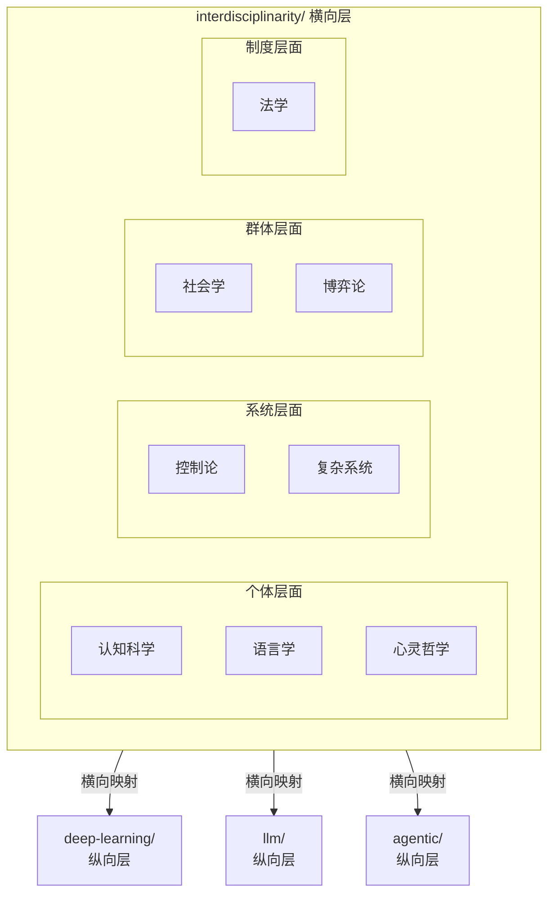

# 跨学科（Interdisciplinarity）

> 当技术纵深到一定程度，最关键的突破往往来自学科边界的碰撞。
> 本目录不按技术栈纵向组织，而是以**外部学科视角**横向切入，探讨其对 AI / ML 的启发与映射。

## 排序逻辑

按 **个体认知 → 符号与语言 → 哲学反思 → 系统方法 → 宏观涌现 → 群体组织 → 策略与利益 → 制度与治理** 递进排列：

```
个体层面          01 认知科学与神经科学  ── 大脑如何工作
  │              02 语言学与语用学      ── 个体如何表达
  │              03 心灵哲学            ── 认知与语言的本体论反思
  ▼
系统层面          04 控制论与系统论      ── 系统如何调节
  │              05 复杂系统与涌现      ── 系统如何涌现
  ▼
群体层面          06 社会学与组织管理    ── 群体如何组织
  │              07 经济学与博弈论      ── 群体如何博弈
  ▼
制度层面          08 法学与治理          ── 群体如何约束
```

> **过渡说明**：从 05 复杂系统到 06 社会学，是从"自然系统的自发涌现"转向"人工群体的有意组织"——前者回答"秩序如何从无到有"，后者回答"秩序如何被设计维持"。

## 定位

现有仓库按技术领域纵向分层（ML → DL → LLM → Agent → …），本目录是**横向交叉层**：

- 同一跨学科主题可能关联多个技术目录（如认知科学同时关联 DL、LLM、Agent）
- 反过来，同一技术目录可被多个学科视角审视（如 Multi-Agent 同时被社会学和博弈论照亮）
- 各笔记中会链接到具体技术目录，形成网状引用

## 使用指南

### 阅读路径

| 读者背景 | 建议起点 | 理由 |
|---|---|---|
| ML 工程师 / 系统架构师 | [04 控制论与系统论](#04-控制论与系统论) 或 [06 社会学与组织管理](#06-社会学与组织管理) | 反馈回路、组织协调等概念与 Agent 架构直接对应 |
| 研究人员 / 理论探索者 | [03 心灵哲学](#03-心灵哲学) 或 [02 语言学与语用学](#02-语言学与语用学) | 深入探讨能力边界、语义基础和理解的本质 |
| 产品经理 / 策略制定者 | [07 经济学与博弈论](#07-经济学与博弈论) 或 [08 法学与治理](#08-法学与治理) | 激励设计、合规框架与治理机制 |
| 通用读者 | [01 认知科学与神经科学](#01-认知科学与神经科学) | 概念最贴近直觉，表格化程度最高 |

### 映射方法论：四个问题

在阅读或撰写任何跨学科笔记时，可围绕以下框架建立映射：

1. **这个学科的核心张力是什么？**（如：效率 vs 柔性、个体理性 vs 集体最优）
2. **该张力在 LLM / ML 系统中有无同构表现？**（如：推理延迟 vs 深度、探索 vs 利用）
3. **该学科发展出了哪些解决方案或理论模型？**（如：组织双元性、机制设计）
4. **这些解决方案能否转译为工程架构或训练策略？**（如：动态路由、奖励塑形）

> 撰写新笔记时，建议遵循 [template.md](./template.md) 的结构化模板。

## 目录结构

```
interdisciplinarity/
│
├── 01-cognitive-neuroscience/              # 认知科学与神经科学
│   ├── neural-networks-as-brain-models/     # 神经网络作为脑模型
│   ├── attention-and-consciousness/          # 注意力机制与意识
│   ├── memory-systems/                       # 记忆系统（工作记忆/长期记忆 vs RAG/Context）
│   └── learning-theories/                   # 学习理论（赫布学习、预测编码 vs 反向传播）
│
├── 02-linguistics-and-pragmatics/           # 语言学与语用学
│                                            # （语义/语用、言语行为、对话结构）
│
├── 03-philosophy-of-mind/                   # 心灵哲学
│                                            # （意向性、具身认知、中文房间、功能主义等）
│
├── 04-cybernetics-systems/                   # 控制论与系统论
│                                            # （反馈回路、自调节、稳态）
│
├── 05-complex-emergence/                   # 复杂系统与涌现
│
├── 06-sociology-and-organization/           # 社会学与组织管理
│   ├── ambidexterity-and-paradox/          # 双元性与悖论（流程与效率平衡）
│   ├── social-network-analysis/             # 社会网络分析（嵌入理论、结构洞）
│   ├── institutional-theory/                # 制度理论（合法性、制度同形）
│   ├── organizational-forms/                # 组织形式理论（科层制/市场/网络）
│   ├── coordination-theory/                 # 协调理论（任务依赖、沟通机制）
│   ├── social-capital/                      # 社会资本理论（信任、互惠、合作）
│   └── organizational-ecology/              # 组织生态学（密度依赖、生态位）
│
├── 07-economics-game-theory/            # 经济学与博弈论
│                                            # （机制设计、激励对齐、拍卖理论等）
│
└── 08-law-and-governance/                   # 法学与治理
                                             # （责任归属、合规、AI治理框架）
```

## 各领域概览

### 01 认知科学与神经科学

探讨人脑认知机制对深度网络架构、训练范式和智能体设计的启发。

| 外部学科概念 | AI/ML 对应 | 关联目录 |
|---|---|---|
| 预测编码 (Predictive Coding) | 自监督学习、下一 token 预测 | → [`llm/03-training/pre-training/`](../llm/03-training/pre-training/) |
| 工作记忆 / 长期记忆 | Context Window / RAG | → [`rag/`](../rag/) |
| 注意力机制 (Visual Attention) | Transformer Self-Attention | → [`deep-learning/03-architectures/transformers/`](../deep-learning/03-architectures/transformers/) |
| 赫布学习 (Hebbian Learning) | 局部学习规则、脉冲网络 | → [`deep-learning/01-neural-network-fundamentals/`](../deep-learning/01-neural-network-fundamentals/) |
| 认知架构 (SOAR, ACT-R) | Agent 认知架构 | → [`agentic/01-foundations/cognitive-architectures-intro/`](../agentic/01-foundations/cognitive-architectures-intro/) |

### 02 语言学与语用学

LLM 的母学科——探讨语言学理论对理解大语言模型能力与局限的不可替代性。

| 外部学科概念 | AI/ML 对应 | 关联目录 |
|---|---|---|
| 语用学 (Pragmatics) / 言语行为理论 | 对话 Agent 的意图理解与生成 | → [`agentic/02-single-agent/tool-use/`](../agentic/02-single-agent/tool-use/) |
| 乔姆斯基层级 / 普遍语法 | LLM 语法能力的理论边界 | → [`llm/02-models/emergent-abilities/`](../llm/02-models/emergent-abilities/) |
| 话语分析 (Discourse Analysis) | 长文本连贯性、多轮对话管理 | → [`llm/04-serving/prompt-engineering/`](../llm/04-serving/prompt-engineering/) |
| 语义学 (Semantics) / 组合性 | LLM 的语义组合能力与幻觉 | → [`llm/06-explainability/`](../llm/06-explainability/) |
| 社会语言学 (Sociolinguistics) | 多语言/多文化 LLM 对齐 | → [`llm/08-safety-and-society/safety-and-alignment/`](../llm/08-safety-and-society/safety-and-alignment/) |

### 03 心灵哲学

意向性、意识困难问题、中文房间、具身认知、功能主义等哲学论证对 AI 能力边界的反思。

**核心追问**：

| 追问 | 与 AI/ML 的关联 |
|---|---|
| 中文房间论证 → 对"理解"定义的影响 | 如果 LLM 通过了所有语言测试，但内部仅做符号操作，我们是否应称其"理解"了语义？这与涌现能力评估的基准设计直接相关。 |
| 意向性 (Intentionality) → Agent 目标表示的本体论 | 当一个 Agent 输出"我想要…"时，这是关于世界的状态表征（真意向性），还是训练分布中的统计模式（伪意向性）？ |
| 功能主义 vs 生物自然主义 → 智能是否 substrate-independent | 如果智能可以被充分功能化，那么 Transformer 是否已足够；如果生物自然主义成立，具身智能是否是必要条件？ |
| 意识的困难问题 (Hard Problem) → LLM 是否可能具有现象意识 | 若未来 LLM 展现出需要现象意识才能解释的行为，我们的评估框架是否应纳入主观报告？ |

### 04 控制论与系统论

从反馈、调节、稳态的视角理解 Agent 感知-行动闭环与具身控制。

| 外部学科概念 | AI/ML 对应 | 关联目录 |
|---|---|---|
| 负反馈 / 正反馈 | RL 奖励调节、策略梯度 | → [`reinforce-learning/`](../reinforce-learning/) |
| 自调节系统 (Self-regulation) | Agent 自反思与纠错 | → [`agentic/02-single-agent/self-reflection/`](../agentic/02-single-agent/self-reflection/) |
| 稳态 (Homeostasis) | Agent 目标维持与安全约束 | → [`agentic/05-environments/sandboxing-and-safety/`](../agentic/05-environments/sandboxing-and-safety/) |
| 黑箱系统 (Black Box) | 可解释性与机制可解释性 | → [`llm/06-explainability/mechanistic/`](../llm/06-explainability/mechanistic/) |
| 感知-动作闭环 (Perception-Action Loop) | 具身智能控制回路 | → [`embodied-intelligence/02-perception/`](../embodied-intelligence/02-perception/) |

### 05 复杂系统与涌现

复杂适应系统、相变、自组织临界性等概念对理解 LLM 涌现能力和 Agent 集体行为的意义。

**核心追问**：

| 追问 | 与 AI/ML 的关联 |
|---|---|
| 自组织临界性 → 训练过程中的相变现象 | LLM 能力的"涌现"是否可类比于物理系统的相变？如果是，是否存在可预测的控制参数（如规模、数据多样性）？ |
| 涌现 (Emergence) → Multi-Agent 系统中的非预设协作 | 当多个 Agent 交互时，系统级能力是否必然超出各 Agent 的局部设计？如何区分"有益涌现"与"失控涌现"？ |
| 复杂适应系统的鲁棒性-脆弱性权衡 → 大模型的泛化与对抗攻击 | 复杂系统常在特定扰动下表现出意料之外的脆弱性，这对 LLM 的对抗鲁棒性评估有何启示？ |
| 多尺度分析 → LLM 从神经元到行为的层次解释 | 微观权重更新、中层表示、宏观行为之间的因果链条如何建立？这是否需要超越还原论的新分析工具？ |

### 06 社会学与组织管理

从人类组织形态出发，审视多智能体系统的协作、治理与涌现行为。

| 外部学科概念 | AI/ML 对应 | 关联目录 |
|---|---|---|
| 韦伯式科层制 | 层级式 Multi-Agent | → [`agentic/03-multi-agent/organizational/`](../agentic/03-multi-agent/organizational/) |
| 市场机制 / 价格信号 | 竞价式 Agent 协调 | → [`agentic/03-multi-agent/coordination/`](../agentic/03-multi-agent/coordination/) |
| 社会网络 / 结构洞 | Agent 通信拓扑优化 | → [`06-sociology-and-organization/social-network-analysis/`](./06-sociology-and-organization/social-network-analysis/) |
| 制度主义 (Institutionalism) | Agent 规范与约束设计 | → [`06-sociology-and-organization/institutional-theory/`](./06-sociology-and-organization/institutional-theory/) |
| 组织生态学 | Agent 种群竞争与生态位 | → [`06-sociology-and-organization/organizational-ecology/`](./06-sociology-and-organization/organizational-ecology/) |
| 社会资本 / 信任 | Agent 间信任评估 | → [`agentic/07-evaluation/safety-and-robustness/`](../agentic/07-evaluation/safety-and-robustness/) |
| 组织学习 | Multi-Agent 经验共享 | → [`agentic/03-multi-agent/shared-memory/`](../agentic/03-multi-agent/shared-memory/) |

### 07 经济学与博弈论

机制设计、激励兼容、拍卖理论、合作/非合作博弈等对 Agent 对齐和多智能体激励设计的框架支撑。

### 08 法学与治理

AI 安全对齐、责任归属与治理框架的法律与制度基础。

| 外部学科概念 | AI/ML 对应 | 关联目录 |
|---|---|---|
| 责任归属 (Liability) | Agent 行为的法律责任主体 | → [`agentic/07-evaluation/safety-and-robustness/`](../agentic/07-evaluation/safety-and-robustness/) |
| 合规 (Compliance) | 数据合规、模型合规审计 | → [`llm/08-safety-and-society/safety-and-alignment/`](../llm/08-safety-and-society/safety-and-alignment/) |
| 权利理论 (Rights Theory) | AI 权利、人格与道德地位 | → [`llm/08-safety-and-society/social-impact/`](../llm/08-safety-and-society/social-impact/) |
| 规则制定 (Rulemaking) | AI 治理框架与标准制定 | → [`agentic/05-environments/sandboxing-and-safety/`](../agentic/05-environments/sandboxing-and-safety/) |
| 程序正义 (Procedural Justice) | 算法公平性与可申诉性 | → [`llm/05-evaluation/evaluation-methods/`](../llm/05-evaluation/evaluation-methods/) |

---

## 与纵向技术栈的关系



---

*最后更新: 2026-05-11*
