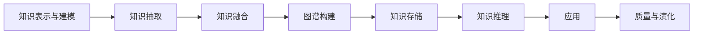

# 知识图谱总览

## 知识图谱生命周期

## 与仓库其他目录的关系

| 本目录内容 | 关联目录 | 说明 |
|-----------|---------|------|
| GraphRAG 检索架构 | [../rag/03-advanced-patterns/graph-rag/](../rag/03-advanced-patterns/graph-rag/) | RAG 视角的图增强检索 |
| LLM 推理 | [../llm/04-serving/](../llm/04-serving/) | LLM 作为抽取/推理工具 |
| 可解释性 | [../llm/06-explainability/](../llm/06-explainability/) | KG 驱动的模型解释 |

---

*最后更新: 2026-05-11*
