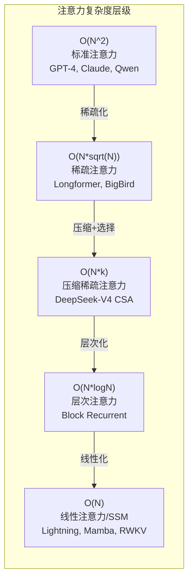
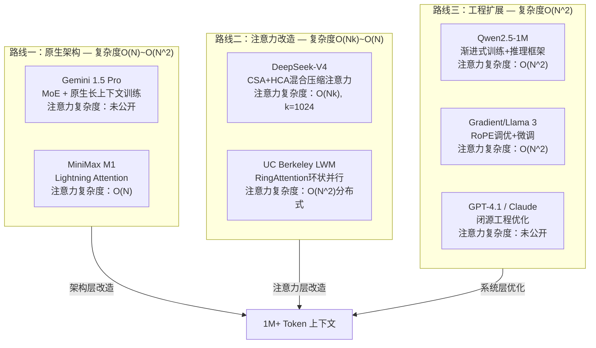
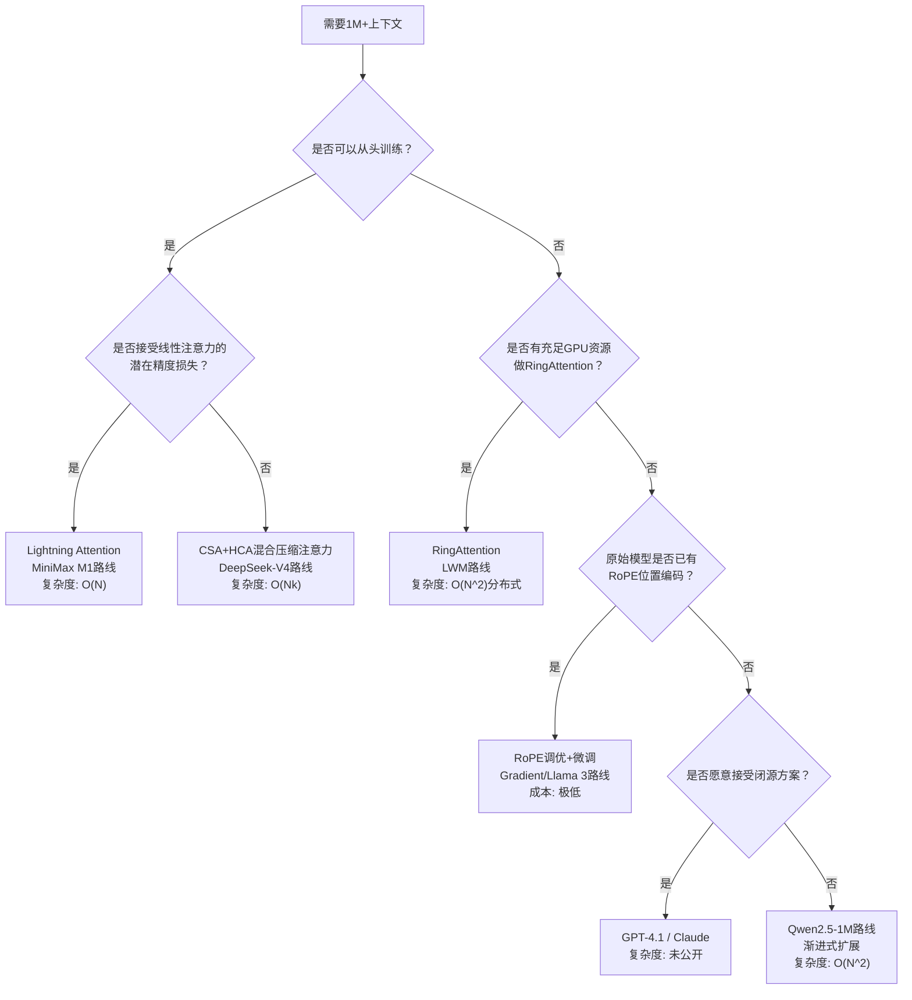

# 百万Token长上下文：模型技术综述

**文档信息**
| 维度 | 内容 |
|------|------|
| 文档版本 | v2.0 |
| 覆盖范围 | 业界实现1M+上下文的主要模型及技术路线，含数学形式化与工程深度分析 |
| 最后更新 | 2026年4月 |
| 伴生索引 | [models/README.md](./README.md) - 各模型论文索引 |
| 综述参考 | [surveys/](../surveys/) - 长上下文综述论文集 |
---

## 导读

大语言模型从4K上下文迈向1M（百万Token），需要跨越三道数学瓶颈：**计算量爆炸**（$O(N^2d)$ 注意力在1M下增长10,000倍）、**KV缓存膨胀**（单请求占用数GB显存）、**长程依赖衰减**（中间信息检索呈U型退化）。本文以这三道瓶颈为线索，系统梳理业界实现1M+上下文的完整技术版图。

**四大技术路线**各有取舍：**原生架构**路线（Gemini 1.5 Pro、MiniMax M1）从底层重新设计注意力，Lightning Attention实现 $O(N)$ 线性复杂度，检索精度损失尚待验证；**注意力改造**路线（DeepSeek-V4）以"先压缩、再选择、后计算"的CSA+HCA混合压缩注意力将1M推理FLOPs降至27%、KV缓存降至10%，是当前效率提升最显著的方案；**工程扩展**路线（Qwen2.5-1M、Gradient/Llama 3）通过RoPE调优+渐进微调以极低成本将现有模型扩展至1M，但未改变 $O(N^2)$ 注意力本质；**闭源工程优化**路线（GPT-4.1、Claude）保持全精度注意力并辅以Context Compaction等系统层优化，NIAH召回率高达99.4%，但技术细节不透明。

**核心趋势**：竞争已从"能不能做到"转向"做得有多高效"——稀疏化（参数稀疏MoE + 上下文稀疏压缩注意力）是共同方向；评估基准从"单针检索"向"多跳推理"乃至"长程理解"演进，当前模型在后者仍有显著瓶颈。

---

## 一、问题定义：长上下文的数学瓶颈

### 1.1 标准注意力的计算复杂度

标准Transformer注意力机制的计算流程为：

$$\text{Attention}(Q, K, V) = \text{softmax}\left(\frac{QK^T}{\sqrt{d_k}}\right)V$$

其中 $Q \in \mathbb{R}^{N \times d_k}$，$K, V \in \mathbb{R}^{N \times d_v}$，$N$ 为序列长度。

**FLOPs 分析**：

| 步骤 | 计算 | FLOPs |
|------|------|-------|
| $QK^T$ | 矩阵乘法 $(N \times d_k) \times (d_k \times N)$ | $2Nd_kN = 2N^2d_k$ |
| Softmax | 对 $N \times N$ 矩阵逐行归一化 | $O(N^2)$ |
| $\text{softmax}(\cdot)V$ | 矩阵乘法 $(N \times N) \times (N \times d_v)$ | $2N^2d_v$ |
| **单层单头总计** | | $\approx 4N^2d$ （设 $d_k = d_v = d$） |

对于 $L$ 层、$h$ 个注意力头的模型（通常 $h \times d = d_{model}$），单次前向传播的注意力总 FLOPs 为：

$$\text{FLOPs}_{\text{attn}} \approx 4L \cdot N^2 \cdot d_{model}$$

**当 $N$ 从 10K 扩展到 1M 时**，注意力计算量增长 $(100)^2 = 10{,}000$ 倍。以 LLaMA-3 70B 为例（$L=80$，$d_{model}=8192$）：

| 上下文长度 | 注意力 FLOPs | 预填充延迟（A100估算） |
|-----------|-------------|-------------------|
| 4K | $4.3 \times 10^{13}$ | ~0.02s |
| 128K | $4.4 \times 10^{16}$ | ~2s |
| 1M | $2.6 \times 10^{18}$ | ~120s |

### 1.2 KV缓存的显存膨胀

自回归解码时，每个token的Key和Value状态需要持久存储，避免重复计算。KV缓存的显存占用为：

$$\text{KV Cache} = 2 \times N \times d_{model} \times L \times b$$

其中 $b$ 为每个参数的字节数，因子2对应Key和Value各一份。

**LLaMA-3 70B 的KV缓存估算**（$d_{model}=8192$，$L=80$，FP16=2bytes）：

| 上下文长度 | KV缓存大小 | A100 80GB 可同时服务的请求数 |
|-----------|-----------|--------------------------|
| 4K | ~10 MB | ~8000 |
| 128K | ~320 MB | ~250 |
| 1M | ~2.5 GB | ~32 |

> 注：GQA（Grouped Query Attention）可将KV缓存缩小 $g/h$ 倍（$g$ 为KV头数，$h$ 为Query头数）。LLaMA-3 70B 使用 $g=8$，$h=64$，KV缓存可缩小8倍。但即便如此，1M上下文下单请求仍需 ~312MB。

**KV缓存的显存膨胀是1M上下文推理的核心瓶颈**——它不仅占用大量GPU显存，还直接限制了批处理大小和服务吞吐量。

### 1.3 长程依赖衰减：Lost in the Middle

斯坦福大学2023年的研究 *"Lost in the Middle: How Language Models Use Long Contexts"* 发现，LLM在长上下文中的检索能力呈显著的U型曲线：

```
检索准确率
    ^
    |  ████████                              ████████
    |  ████████                              ████████
    |  ████████                              ████████
    |  ████████        ████████              ████████
    |  ████████        ████████              ████████
    |  ████████        ████████              ████████
    |  ████████        ████████              ████████
    +--+--------+--------+--------+--------+--------+--> 信息位置
       开头      1/4      1/2      3/4      末尾
```

- **开头和末尾**：检索准确率高（Primacy Effect + Recency Effect）
- **中间位置**：检索准确率显著下降，在13个模型上平均降低约10-20pp
- **上下文越长，中间衰减越严重**：200K上下文的中间衰减幅度远大于2K

**根本原因**：Softmax注意力的概率质量在远距离token上趋于均匀分布。当 $N$ 极大时，$QK^T/\sqrt{d_k}$ 的方差增大，Softmax输出的熵升高，导致"注意力稀释"——模型无法有效区分哪些远距离token更相关。

### 1.4 位置编码的外推性瓶颈

主流LLM使用的RoPE（旋转位置编码）在训练长度内表现良好，但外推到更长序列时性能骤降。

RoPE对位置 $m$ 的编码为：

$$\text{RoPE}(x_m, m) = \begin{pmatrix} x_m^{(1)} \cos(m\theta_1) - x_m^{(2)} \sin(m\theta_1) \\ x_m^{(2)} \cos(m\theta_1) + x_m^{(1)} \sin(m\theta_1) \\ \vdots \\ x_m^{(d-1)} \cos(m\theta_{d/2}) - x_m^{(d)} \sin(m\theta_{d/2}) \\ x_m^{(d)} \cos(m\theta_{d/2}) + x_m^{(d-1)} \sin(m\theta_{d/2}) \end{pmatrix}$$

其中 $\theta_i = 10000^{-2i/d}$。

**外推性差的根源**：当位置 $m$ 超出训练范围时，$\cos(m\theta_i)$ 和 $\sin(m\theta_i)$ 的值在训练期间从未出现过，模型的注意力权重计算缺少对应的位置先验。低频分量（$\theta_i$ 较小）的外推性优于高频分量，因为低频分量的周期更长，值域变化更平缓。

### 1.5 三大瓶颈的量化总结

| 瓶颈 | 数学表达 | 10K→1M增长 | 核心影响 |
|------|---------|-----------|---------|
| 计算量爆炸 | $O(N^2 \cdot d)$ | 10,000x | 预填充延迟不可接受 |
| KV缓存膨胀 | $O(N \cdot d \cdot L)$ | 100x | 显存不足，批处理能力骤降 |
| 注意力稀释 | $\text{Var}(\text{softmax}(QK^T/\sqrt{d})) \uparrow$ | U型衰减加剧 | 中间信息检索失效 |
| 位置编码失效 | $\cos(m\theta_i), m > L_{\text{train}}$ | 未见过的值 | 长序列位置感知丢失 |

---

## 二、技术路线分类与复杂度分析

### 2.1 注意力机制复杂度层级

从标准注意力到1M上下文，注意力机制的演进形成了一条清晰的复杂度递降链：



| 复杂度类别 | 代表机制 | 1M下的相对计算量 | 信息完整性 |
|-----------|---------|----------------|-----------|
| $O(N^2)$ | 标准全量注意力 | 10,000x基准 | 完整 |
| $O(N\sqrt{N})$ | 滑动窗口+全局token | ~316x基准 | 局部完整+全局稀疏 |
| $O(Nk)$, $k \ll N$ | 压缩+Top-k选择 | ~10x基准（k=1024） | 有损但可控 |
| $O(N\log N)$ | 层次/递归注意力 | ~20x基准 | 有损 |
| $O(N)$ | 线性注意力/SSM | 1x基准 | 高度有损 |

### 2.2 三条技术路线

实现1M上下文的技术路线，按对Transformer架构的改造深度可分为三层：



**三条路线的核心区别**：

| 维度 | 原生架构 | 注意力改造 | 工程扩展 |
|------|---------|-----------|---------|
| 改造深度 | 训练框架+模型架构 | 注意力层替换/增强 | 参数调整+推理优化 |
| 注意力复杂度 | O(N) ~ O(N^2) | O(Nk) ~ O(N) | O(N^2)（标准注意力） |
| 训练成本 | 极高（需从头训练） | 高（需重新预训练） | 低（微调+扩展） |
| 效率上限 | 最高（架构即优化） | 高（复杂度降低） | 受限于O(N^2)天花板 |
| 信息完整性 | 取决于注意力类型 | 有损但可控 | 完整但昂贵 |
| 代表模型 | Gemini 1.5 Pro, MiniMax M1 | DeepSeek-V4, LWM | Qwen2.5-1M, Llama 3, GPT-4.1, Claude |
| 信息透明度 | 部分公开 | 开源为主 | 闭源为主 |

### 2.3 位置编码扩展方法

对于"工程扩展"路线，位置编码调整是关键技术环节。以下是主流方法的技术对比：

#### 2.3.1 Position Interpolation (PI)

**核心思想**：不改变RoPE的频率，而是将新位置索引线性映射到训练范围内。

$$m' = \frac{m \cdot L_{\text{train}}}{L_{\text{new}}}$$

其中 $L_{\text{train}}$ 为训练时的最大位置，$L_{\text{new}}$ 为目标上下文长度。

**优点**：实现简单，无需修改模型代码
**缺点**：分辨率降低——相邻token的位置差异被压缩，高频信息丢失

#### 2.3.2 NTK-aware Scaling

**核心思想**：调整RoPE的基础频率 $b$，使位置编码能外推到更长范围。

$$\theta_i' = (b \cdot s)^{-2i/d}$$

其中 $s$ 为缩放因子。直觉理解：增大 $b$ 相当于"拉伸"位置编码的周期，使高频分量的值域不超出训练范围。

**与PI的关键区别**：PI压缩位置索引（内插），NTK-aware拉伸频率（外推）。NTK-aware保留了高频分量的分辨率，因此对局部依赖的建模更精确。

**缺点**：大缩放因子下仍需微调

#### 2.3.3 YaRN（Yet another RoPE extensioN）

**核心思想**：将注意力头中的不同频率分量分区处理——低频分量用外推，高频分量用内插。

$$\theta_i' = \begin{cases} \theta_i & \text{if } \theta_i < \theta_{\text{low}} \quad \text{(低频：不调整，天然外推)} \\ f(\theta_i, s) & \text{if } \theta_i \geq \theta_{\text{low}} \quad \text{(高频：内插或混合)} \end{cases}$$

同时引入注意力温度调整：$q^T k \leftarrow q^T k / \sqrt{s}$，补偿缩放后的注意力分数偏移。

**优点**：结合了内插和外推的优势，无需微调即可扩展
**缺点**：超参数多（分区阈值、温度系数），调参空间大

#### 2.3.4 ALiBi（Attention with Linear Biases）

**核心思想**：完全不用位置编码，转而在注意力分数上加线性偏置。

$$\text{score}(q_i, k_j) = \frac{q_i^T k_j}{\sqrt{d}} + m \cdot (i - j)$$

其中 $m$ 是每个注意力头独有的斜率，几何级数分布（$m = 2^{-8/n}, \dots, 2^{-8}$）。

**优点**：无需位置编码训练，天然支持任意长度
**缺点**：线性偏置的归纳偏置过强，长上下文下的表达能力受限；与RoPE不兼容

#### 2.3.5 对比总结

| 方法 | 数学操作 | 需要微调 | 外推能力 | RoPE兼容 | 计算开销 | 代表应用 |
|------|---------|---------|---------|---------|---------|---------|
| PI | $m' = m \cdot L_{\text{train}}/L_{\text{new}}$ | 是 | 中等 | 是 | 极低 | Meta原论文 |
| NTK-aware | $b' = b \cdot s$ | 视缩放比 | 较好 | 是 | 极低 | CodeLlama, Llama 3 |
| YaRN | 分区处理 + 温度调整 | 通常否 | 好 | 是 | 低 | Qwen2.5-1M |
| ALiBi | $+m(i-j)$ 线性偏置 | 否 | 有限 | 否 | 低 | BLOOM |

---

## 三、各模型技术方案详解

### 3.1 Google Gemini 1.5 Pro — 业界首个1M上下文

**基本信息**

| 维度 | 内容 |
|------|------|
| 发布时间 | 2024年2月（预览），2024年5月（GA） |
| 上下文窗口 | 1M token（最长可达10M实验性） |
| 技术路线 | 原生架构 |
| 论文 | [arXiv:2403.05530](http://arxiv.org/abs/2403.05530) |

**技术原理**

Gemini 1.5 Pro是业界首个宣布原生支持1M上下文的模型。其核心技术方案：

**1. Sparse MoE架构与长上下文的协同**

Gemini 1.5 Pro采用Sparsely-Gated Mixture-of-Experts架构。MoE与长上下文存在天然协同：

- **计算解耦**：标准稠密模型中，1M上下文的注意力计算量正比于 $N^2 \cdot d_{model}$。MoE将前馈层（FFN）的计算量与注意力层解耦——每token只激活 $k$ 个专家（通常 $k=1$ 或 $2$），FFN的FLOPs与序列长度无关（每token固定）
- **注意力层仍是瓶颈**：MoE并不改变注意力的 $O(N^2)$ 复杂度。1M上下文下，注意力计算量仍然是主要瓶颈。Gemini 1.5 Pro可能采用了某种注意力优化方案，但具体技术未公开
- **参数效率**：MoE允许模型在保持大总参数量的同时控制激活参数量，间接降低了KV缓存的维度需求

**2. 原生长上下文训练**

与后期扩展不同，Gemini 1.5 Pro从预训练阶段即支持长序列：

- **多阶段训练**：推测采用从短到长的渐进式序列长度调度（4K → 32K → 128K → 1M），类似DeepSeek-V4的策略
- **大规模基础设施**：Google的TPU Pod提供了足够的显存和算力支持1M序列的训练
- **多模态统一**：1M上下文不仅适用于文本，还支持视频帧（每秒1帧）和音频的统一编码

**3. 效率数据**

- Needle In A Haystack测试中在1M全长度上保持了>99%的召回率
- 论文报告在1M上下文下，单个查询的延迟在秒级别（具体数值取决于硬件配置）
- 支持高达10M token的实验性上下文窗口

**关键创新**

- 首次证明1M上下文在生产环境中的可行性
- MoE+长上下文的架构范式成为后续模型（DeepSeek-V4等）的参考
- 多模态统一上下文窗口

**局限性**

- 闭源，核心技术（注意力优化方案、训练基础设施细节）未公开
- 1M上下文的推理成本未披露
- 10M上下文仅为实验性，未正式发布

---

### 3.2 MiniMax M1 — Lightning Attention，首个开源1M推理模型

**基本信息**

| 维度 | 内容 |
|------|------|
| 发布时间 | 2025年6月 |
| 上下文窗口 | 1M token |
| 技术路线 | 原生架构（Lightning Attention） |
| 论文 | [arXiv:2506.13585](http://arxiv.org/abs/2506.13585) |

**技术原理**

MiniMax M1的核心创新是**Lightning Attention**（闪电注意力），一种通过数学重写实现线性复杂度的注意力变体。

**1. 线性注意力的数学原理**

标准注意力的核心计算瓶颈在于 $QK^T$ 的 $O(N^2)$ 复杂度。线性注意力通过核函数近似Softmax，将计算重写为可累积求和的形式：

$$\text{LinearAttn}(Q, K, V) = \frac{\phi(Q) \cdot (\phi(K)^T V)}{\phi(Q) \cdot (\phi(K)^T \mathbf{1})}$$

其中 $\phi(\cdot)$ 是特征映射函数（如ELU+1或ReLU）。

关键洞察：$\phi(K)^T V$ 是一个 $d \times d$ 的矩阵（而非 $N \times N$），可以**逐token累积求和**：

$$S_t = S_{t-1} + \phi(k_t) v_t^T$$

每个token只需与累积矩阵 $S_t$ 做矩阵乘法即可获得注意力输出，复杂度降为 $O(Nd^2)$。当 $d \ll N$ 时（1M上下文下必然如此），这等价于 $O(N)$。

**2. Lightning Attention的Tiling策略**

线性注意力的原始实现存在GPU利用率低的问题——累积求和是严格的顺序操作，无法并行。Lightning Attention通过**分块计算（Tiling）**解决：

```
将序列分为 T 个块，每块 B 个token：
Block 1: [t_1, ..., t_B]
Block 2: [t_{B+1}, ..., t_{2B}]
...

块内：标准注意力（O(B^2)，B较小故可接受）
块间：线性注意力累积（O(Nd^2)）
```

- **块内计算**：在每个块内使用标准Softmax注意力，保证局部依赖的精确性
- **块间累积**：跨块的依赖用线性注意力的累积矩阵传递，保证长程信息流
- **硬件友好**：块内计算可充分并行化，块间累积为逐块更新，两者流水线执行

**3. 混合架构**

MiniMax M1在模型中交替使用Lightning Attention和标准注意力：

- **Lightning Attention层**：处理长程依赖（跨块信息流），复杂度O(N)
- **标准注意力层**：处理局部精确依赖（块内注意力），复杂度O(N)（因为块大小固定）

这种混合架构借鉴了Mamba+Attention混合模型（如Jamba）的设计思路，在效率和精度之间取得平衡。

**4. 测试时间计算缩放**

MiniMax M1支持在推理时动态调整计算深度（Test-Time Compute Scaling），允许在更长的思考链（Chain-of-Thought）中投入更多计算来提升答案质量。1M上下文为这种策略提供了充足的"思考空间"。

**关键创新**

- 全球首个开源1M上下文推理模型
- Lightning Attention通过数学重写+Tiling策略，首次在1M规模上验证了线性注意力的生产可行性
- 混合架构（线性+标准注意力）兼顾了长程效率和局部精度

**局限性**

- 线性注意力的核函数近似在理论上会丢失Softmax的精确匹配能力，对"大海捞针"类精确检索任务可能弱于全精度注意力
- 特征映射函数 $\phi$ 的选择对性能有显著影响，目前没有理论最优解
- 作为新架构，推理框架的生态成熟度不如标准Transformer

---

### 3.3 DeepSeek-V4 — CSA+HCA混合压缩注意力

**基本信息**

| 维度 | 内容 |
|------|------|
| 发布时间 | 2026年4月24日 |
| 上下文窗口 | 1M token |
| 技术路线 | 注意力改造 |
| 总参数/激活参数 | 1.6T / 49B（Pro），284B / 13B（Flash） |
| 论文 | [arXiv:2604.02433](http://arxiv.org/abs/2604.02433) |

**技术原理**

DeepSeek-V4的混合压缩注意力是当前对标准注意力改造最深入的方案。其设计哲学是"参数稀疏化+上下文稀疏化"的双重稀疏范式：

```
V2 → 参数稀疏化（MoE：总参数大，每token只激活一小部分专家）
V3 → 参数稀疏化深化（更高效的MoE + 无辅助损失的负载均衡）
V4 → 参数稀疏化 + 上下文稀疏化（MoE + 压缩注意力：不仅参数稀疏，KV缓存和注意力计算也稀疏）
```

**1. CSA（压缩稀疏注意力）— 复杂度分析**

CSA的设计思想是"先压缩、再选择、后计算"，三步将 $O(N^2)$ 降至 $O(Nk)$：

**步骤一：Token级压缩** — $O(N) → O(N/m)$

每 $m$ 个原始token通过学习式加权压缩为1个压缩KV条目（默认 $m=4$）：

$$\text{CompressedKV}_i = \sum_{j=1}^{m} \alpha_{ij} \cdot \text{KV}_{ij} + \beta_i$$

其中 $\alpha_{ij}$ 为学习权重（通过位置偏置和softmax归一化获得），$\beta_i$ 为位置偏置项。

- 压缩后序列长度：$N' = N/m = N/4$
- 压缩块间采用**滑动窗口重叠策略**，避免边界信息丢失
- 复杂度：$O(N \cdot m \cdot d) = O(Nd)$，线性

**步骤二：Lightning Indexer动态筛选** — $O(N') → O(k)$

压缩后并非对所有条目计算注意力，而是通过Lightning Indexer进行动态Top-k选择：

- Query端：降维到 $d_c=1024$，升维到多头索引查询，经ReLU激活
- Key端：生成"索引键"用于匹配打分
- Top-k选择：Pro版选1024个，Flash版选512个

- 复杂度：索引计算 $O(N'd_c)$，Top-k选择 $O(N')$，总计 $O(N'd)$

**步骤三：MQA计算** — $O(k \cdot d)$

选中的 $k$ 个压缩块与滑动窗口保留的128个原始token拼接，送入多查询注意力（MQA）计算。

- 计算量：$O(k \cdot d)$，其中 $k=1024$ 或 $512$
- **与序列长度 $N$ 无关**——这是CSA实现近线性复杂度的关键

**CSA总复杂度**：$O(Nd) + O(N'd) + O(kd) = O(Nd + kd)$，当 $k \ll N$ 时近似 $O(Nd)$

**2. HCA（重度压缩注意力）— 全局结构感知**

| 对比维度 | CSA | HCA |
|----------|-----|-----|
| 压缩比 $m'$ | 4 | 128 |
| Lightning Indexer | 有 | 无 |
| Top-k选择 | 有（512/1024） | 无 |
| 注意力类型 | 稀疏MQA | 全量MQA |
| 目标 | 中段关联的精准检索 | 全局结构的粗粒度感知 |
| 计算量 | $O(Nd + kd)$ | $O(Nd/128 \cdot d) = O(Nd^2/128)$ |

HCA以128:1的极端压缩比生成压缩条目，总量极少，省掉了筛选环节，直接全量计算。代价是信息粒度极粗，但能捕获全局脉络。

**3. CSA与HCA交错配置**

CSA和HCA在模型层间交替叠用，形成"粗细结合"的多尺度注意力：

- **CSA层**："这一段和哪几段相关？" — 中距离精准关联检索
- **HCA层**："整篇文章的主题脉络是什么？" — 全局粗粒度感知
- **滑动窗口**（128 token）："最近几个token之间的关系" — 近距离精确依赖
- **注意力沉降（Sink Logit）**：可学习的sink logit，让注意力头可以选择"什么都不关注"，避免远距离噪声干扰

```
┌──────────────────────────────────────────────────────┐
│              DeepSeek-V4 混合注意力层                  │
│                                                       │
│  ┌──────────┐  ┌──────────┐  ┌──────────┐           │
│  │   CSA    │  │   HCA    │  │   CSA    │  ...       │
│  │ 压缩稀疏 │  │ 重度压缩 │  │ 压缩稀疏 │            │
│  │ m=4, k=1024│ │ m=128   │  │ m=4, k=1024│          │
│  └──────────┘  └──────────┘  └──────────┘           │
│        + 滑动窗口（128 token）                         │
│        + 注意力沉降（Sink Logit）                      │
└──────────────────────────────────────────────────────┘
```

**4. 效率提升量化**（1M token场景，基准：DeepSeek-V3.2）

| 指标 | V4-Pro | V4-Flash | 计算方式 |
|------|--------|----------|---------|
| 单token推理FLOPs（等效FP8） | **27%** | **10%** | 相对V3.2的MLA全量注意力 |
| KV缓存大小 | **10%** | **7%** | 压缩+混合精度（FP8/BF16） |

**5. 异构KV缓存管理**

混合注意力有多种不同类型的KV，传统PagedAttention无法适配。V4设计了三层存储架构：

| 层级 | 位置 | 内容 | 访问频率 | 说明 |
|------|------|------|---------|------|
| L1 | GPU显存 | 最近128 token KV + CSA/HCA尾料 | 每token | 高速小容量 |
| L2 | CPU内存 | 已压缩CSA/HCA块（每512 token → 32+1条目） | 每新块时 | 中速中容量 |
| L3 | 磁盘 | 共享前缀缓存（相同系统提示等） | 多请求复用 | 低速大容量 |

对齐策略：每种压缩比的最小公倍数 $\text{LCM}(4, 128) = 512$，每512个原始token产32个CSA条目+1个HCA条目，避免碎片化。

**6. 训练稳定性工程**

- **mHC（流形约束超连接）**：通过Sinkhorn-Knopp迭代将残差连接的混合矩阵投影到Birkhoff多面体（双随机矩阵空间），约束信号放大<2x，训练开销仅增6.7%
- **Muon优化器**：对梯度矩阵做Newton-Schulz迭代的矩阵级正交化，比AdamW收敛更快
- **预判路由**：路由网络使用历史参数（非当前步参数），打破MoE路由的正反馈循环，防止Loss Spike
- **SwiGLU截断**：线性分量限制在[-10, 10]，消除数值outliers
- **渐进式序列长度训练**：4K → 32K → 128K → 1M

**关键创新**

- 双重稀疏范式（MoE参数稀疏 + 压缩注意力上下文稀疏）首次在1.6T参数规模上验证
- 1M上下文下推理FLOPs降至27%/KV缓存降至10%，是当前效率提升最显著的方案
- 三层异构KV缓存是百万上下文从实验室走进生产环境的关键工程基础设施

**局限性**

- 压缩注意力在理论上存在信息损失，极端精准匹配场景可能弱于全精度注意力
- 异构KV缓存增加了推理系统的工程复杂度
- 作为全新架构，生产环境验证时间较短

---

### 3.4 阿里云 Qwen2.5-1M — 后期扩展开源实践

**基本信息**

| 维度 | 内容 |
|------|------|
| 发布时间 | 2025年1月 |
| 上下文窗口 | 1M token |
| 技术路线 | 工程扩展（后期扩展） |
| 基础模型 | Qwen2.5（32K上下文） |
| 论文 | [arXiv:2501.15383](http://arxiv.org/abs/2501.15383) |

**技术原理**

Qwen2.5-1M是将已有的Qwen2.5模型从32K上下文扩展到1M的工程实践，是"后期扩展"路线的标杆案例。

**1. 渐进式上下文扩展**

从32K到1M并非一步到位，而是通过多阶段训练逐步扩展：

```
阶段1: 32K → 64K    (RoPE base调整 + 短期微调)
阶段2: 64K → 128K   (长文本数据微调)
阶段3: 128K → 256K  (更长序列微调)
阶段4: 256K → 512K  (长序列微调)
阶段5: 512K → 1M    (最终阶段微调)
```

每一步都需要：
- 调整RoPE的base频率以适配新的上下文长度
- 在对应长度的数据上微调，使模型适应扩展后的位置编码
- 验证模型在当前长度下的检索质量，确保没有严重退化

**2. RoPE频率调整**

Qwen2.5-1M采用了YaRN式的混合缩放策略：

- 高频分量：保持原始频率（外推），保留局部精度
- 低频分量：调整base频率（内插），确保长距离位置编码的值域不超出训练范围
- 注意力温度调整：补偿缩放后的注意力分数偏移

**3. 推理框架优化**

1M上下文的推理需要专门的框架支持，Qwen2.5-1M的技术报告详细介绍了其推理框架设计：

- **KV缓存分页管理**：类似PagedAttention的虚拟内存管理，将KV缓存分为固定大小的page，按需分配和释放，避免显存碎片
- **前缀缓存**：多个请求共享相同的系统提示时，复用已计算的KV缓存，避免重复预填充
- **混合精度推理**：KV缓存使用INT8/INT4量化，降低显存占用
- **Chunked Prefill**：将1M token的预填充分块执行，避免单次预填充的显存峰值过高

**关键创新**

- 首个将百万长文本能力开源并实用的模型，提供了完整的训练和推理框架
- 验证了"短上下文模型→1M"的后期扩展路线在工程上的可行性
- 技术报告的工程细节（推理框架、分页管理、分块预填充）对复现极具价值

**局限性**

- 后期扩展的质量上限受限于原始模型架构（O(N^2)注意力未改变）
- 1M上下文下的推理FLOPs和KV缓存仍为标准注意力的量级，无法与CSA/HCA等架构级优化相比
- 长上下文微调需要大量长文本数据，数据收集和清洗成本高

---

### 3.5 UC Berkeley LWM — RingAttention，学术首创

**基本信息**

| 维度 | 内容 |
|------|------|
| 发布时间 | 2024年2月 |
| 上下文窗口 | 1M token |
| 技术路线 | 注意力改造（RingAttention） |
| 论文 | [arXiv:2402.08268](http://arxiv.org/abs/2402.08268) |

**技术原理**

LWM（Large World Model）提出了**RingAttention**，一种将注意力计算分布到多个设备上的方案，核心解决的是**训练时的显存瓶颈**而非推理效率。

**1. RingAttention的数学模型**

标准注意力需要每个设备持有完整的KV序列才能计算，这在1M上下文下不可行。RingAttention将序列分块并环状传递：

设有 $P$ 个设备，序列分为 $P$ 个块 $[K_1, K_2, ..., K_P]$，$[V_1, V_2, ..., V_P]$：

```
时刻 0:  设备 i 持有 (Q_i, K_i, V_i)
时刻 1:  设备 i 持有 (Q_i, K_{i+1}, V_{i+1})    ← KV块沿环传递
时刻 2:  设备 i 持有 (Q_i, K_{i+2}, V_{i+2})
...
时刻 P-1: 设备 i 持有 (Q_i, K_{i-1}, V_{i-1})    ← 完成一轮
```

在每个时刻，设备 $i$ 用本地的 $Q_i$ 和当前持有的 $K_j, V_j$ 计算局部注意力：

$$O_i^{(t)} += \text{softmax}\left(\frac{Q_i K_j^T}{\sqrt{d}}\right) V_j$$

$P$ 个时刻后，每个设备累积了完整的注意力输出。

**2. 通信-计算重叠**

RingAttention的关键工程优化是将KV块的环状通信与注意力计算**流水线化**：

```
时间 ──────────────────────────────────────────────>

设备0: [计算Attn(Q_0,K_0)] [通信K_0→1] [计算Attn(Q_0,K_1)] [通信K_1→2] ...
设备1: [通信K_1→2] [计算Attn(Q_1,K_1)] [通信K_0←0] [计算Attn(Q_1,K_0)] ...
```

当块大小足够大时，通信延迟被计算时间完全隐藏，实现接近零开销的跨设备注意力。

**3. 复杂度分析**

| 指标 | 标准注意力 | RingAttention |
|------|-----------|---------------|
| 每设备显存 | $O(N \cdot d)$ | $O(N/P \cdot d)$ |
| 每设备计算量 | $O(N^2 \cdot d)$ | $O(N^2 \cdot d / P)$ |
| 通信量 | 无 | $O(N \cdot d)$（每步传一个KV块） |
| 总计算量 | $O(N^2 \cdot d)$ | $O(N^2 \cdot d)$（不变） |

RingAttention**不降低总计算量**，但将显存需求分摊到 $P$ 个设备，使得单设备无法容纳的1M上下文变得可行。

**关键创新**

- 学术界首个开源1M上下文模型
- RingAttention是"用通信换显存"的典型方案，在有限GPU资源下训练1M上下文的唯一可行路径
- 同时处理视频和语言模态的统一长上下文框架

**局限性**

- 仅解决训练时的显存瓶颈，不降低推理的计算复杂度
- 跨设备通信带来额外延迟，不适合低延迟推理场景
- 推理时仍需多个设备协作，部署成本高

---

### 3.6 Gradient / Llama 3 — RoPE参数调优，最低成本扩展

**基本信息**

| 维度 | 内容 |
|------|------|
| 发布时间 | 2024年 |
| 上下文窗口 | 1M+ token |
| 技术路线 | 工程扩展（RoPE调优） |
| 基础模型 | Llama 3（8K上下文） |
| 论文 | 无对应arXiv论文，仅为技术博客/演示 |

**技术原理**

Gradient的工作展示了将现有短上下文模型低成本扩展到1M+的最简路线。

**1. NTK-aware缩放的具体实现**

Llama 3原始RoPE base为 $b = 500{,}000$，支持8K上下文。扩展到1M需要缩放因子 $s = 1{,}000{,}000 / 8{,}192 \approx 122$。

NTK-aware调整后的base频率为：

$$b' = b \cdot s^{d/(d-2)}$$

其中 $d$ 为RoPE编码的维度。这一调整使位置编码能外推到更长范围，同时保持高频分量的分辨率。

**2. 渐进扩展策略**

从8K到1M+的扩展并非一步完成：

```
8K → 32K → 128K → 512K → 1M+
 │      │       │       │      │
 │      │       │       │      └─ 最终验证
 │      │       │       └─ 长序列微调
 │      │       └─ 中长序列微调
 │      └─ 中等序列微调
 └─ 基础RoPE调整
```

每一步：
1. 调整RoPE base到对应长度
2. 在该长度的数据上微调数百步
3. 验证Needle In A Haystack的召回率

**3. 成本分析**

这种方法的最大优势是**极低的训练成本**：
- 不需要从头预训练
- 每阶段仅需数百步微调
- 不需要修改模型架构
- 不需要额外的推理框架

**关键创新**

- 最低成本的1M上下文扩展方案
- 证明RoPE调优+微调足以将8K模型扩展到1M+
- 为资源有限的研究者提供了可行的长上下文路线

**局限性**

- 质量不如原生长上下文模型——扩展后的模型在长上下文理解（而非简单检索）上表现较弱
- O(N^2)注意力未改变，1M下的推理成本极高
- 极端长上下文（>500K）下的检索精度有衰减
- 缺乏系统性论文支撑，复现细节不够完整

---

### 3.7 OpenAI GPT-4.1 — 闭源1M，技术未公开

**基本信息**

| 维度 | 内容 |
|------|------|
| 发布时间 | 2025年 |
| 上下文窗口 | 1M token |
| 技术路线 | 闭源，未公开 |
| 论文 | 暂未发布，仅有官方博客/API文档 |

**已知信息**

- GPT-4.1系列支持1M上下文窗口
- 在编码、指令遵循等任务上有显著提升
- 具体的注意力机制、训练策略、推理优化方案均未公开

**技术推测**

基于GPT-4系列的已知架构特征（稠密Transformer + 可能的MoE变体），GPT-4.1的1M上下文可能采用：
- 标准注意力 + 大规模推理优化（类似Claude的工程路线）
- 可能的KV缓存压缩（类似Gisting/AutoCompressor）
- 可能的MoE架构以降低1M下的FFN计算量

以上均为推测，无公开信息佐证。

**局限**

- 技术透明度为零，无法进行架构层面的分析
- 仅能通过API行为推测其长上下文能力

---

### 3.8 Anthropic Claude — 100K→200K→1M渐进演进

**基本信息**

| 维度 | 内容 |
|------|------|
| 首次100K | 2023年7月（Claude 2.0） |
| 首次200K | 2023年11月（Claude 2.1） |
| 首次1M | 2026年2月（Opus 4.6 / Sonnet 4.6，beta） |
| 1M GA | 2026年4月（Opus 4.7） |
| 技术路线 | 闭源工程优化 |
| 信息来源 | Anthropic System Cards、模型卡片、官方博客 |

**演进时间线**

| 时间 | 模型 | 上下文窗口 | 关键指标 |
|------|------|-----------|---------|
| 2023.07 | Claude 2.0 | 100K | 首次突破10万token |
| 2023.11 | Claude 2.1 | 200K | NIAH 94.5%召回率 |
| 2024.03 | Claude 3 Opus | 200K | NIAH 99.4%召回率（200K全长度） |
| 2025.09 | Sonnet 4.5 | 200K→1M | 首次扩展至1M |
| 2026.02 | Opus 4.6 / Sonnet 4.6 | 1M（beta） | Agent Teams + Context Compaction |
| 2026.04 | Opus 4.7 | 1M（GA） | 确定性采样，移除temperature参数 |

**技术路线分析**

Anthropic是长上下文的**早期先行者**——2023年7月就实现了100K，比Gemini 1.5 Pro的1M早7个月，比大多数开源模型早一年以上。但其从200K到1M的跨越用了近2年半，进度明显慢于后来者。

**1. Context Compaction（上下文自动压缩）**

Claude 4.6系列引入了Context Compaction，在长Agent会话中自动压缩上下文：

- **触发条件**：当对话历史接近上下文窗口限制时自动触发
- **压缩方式**：推测为"摘要式压缩"——将早期对话内容压缩为更短的摘要，保留关键信息，丢弃冗余细节
- **与CSA的区别**：CSA在token级别压缩KV对（信息粒度更细），Context Compaction在语义级别压缩对话历史（信息粒度更粗但更灵活）
- **设计目标**：使Agent可以持续工作数小时而不超出token限制，而非一次性处理1M token的输入

**2. Prompt缓存**

Claude API支持系统提示和重复前缀的缓存复用：
- 相同的系统提示在多个请求间共享KV缓存
- 长文档的预计算结果可缓存复用
- 降低了1M上下文的重复预填充成本

**3. 全精度注意力 + 高召回率**

Claude 3 Opus在200K上下文上达99.4%的NIAH召回率，远高于同期模型。这暗示Anthropic保持了**全精度标准注意力**，通过推理框架优化（而非架构改造）来扩展上下文。

**技术路线推测**：**以工程优化为主，架构改造为辅**

判断依据：
1. 从100K到1M用了近3年，如果是架构级改造，进度应更快
2. 1M在4.6系列为beta、4.7才GA，说明工程打磨周期长，符合"工程优化"的特征
3. NIAH 99.4%的高召回率暗示全精度注意力仍在使用
4. Context Compaction是系统层面优化，不是注意力机制改造

**关键特点**

- 长上下文质量极高（NIAH 99.4%）
- Agent场景的深度优化（Context Compaction支持持续数小时的Agent工作）
- 从早期就建立了长上下文技术领先

**局限性**

- 完全闭源，技术细节未公开
- 从200K到1M的跨越耗时过长
- 推理效率和成本未披露
- O(N^2)注意力未改变，1M下的推理成本推测仍然很高

---

## 四、核心技术专题

### 4.1 注意力机制演进：从O(N^2)到O(N)

1M上下文的实现方案，本质上都围绕一个核心问题：**如何降低注意力的计算复杂度**。以下是主要技术路线的数学推导与对比。

#### 4.1.1 标准注意力：O(N^2)

$\text{Attn}(Q,K,V) = \text{softmax}\left(\frac{QK^T}{\sqrt{d}}\right)V$

- 每个query需与所有 $N$ 个key计算点积
- 总计算量：$O(N^2 d)$
- 1M上下文下：$10^{12} \times d$ 级别的FLOPs，不可接受

#### 4.1.2 稀疏注意力：O(N * sqrt(N))

**代表：Longformer, BigBird**

核心思想：每个token只关注局部窗口+少量全局token。

$\text{SparseAttn}(Q,K,V) = \text{softmax}\left(\frac{QK^T \odot M}{\sqrt{d}}\right)V$

其中 $M$ 为稀疏掩码矩阵：

- **局部窗口**：每个token只关注前后 $w$ 个邻居，计算量 $O(Nwd)$
- **全局token**：少量特殊token（如[CLS]）关注所有位置，计算量 $O(N \cdot g \cdot d)$，$g$ 为全局token数
- **随机连接**：少量随机远距离连接，计算量 $O(N \cdot r \cdot d)$

总复杂度：$O(N(w + g + r)d)$，当 $w, g, r \approx \sqrt{N}$ 时为 $O(N\sqrt{N}d)$

**优点**：保持了Softmax的精确匹配能力
**缺点**：稀疏模式需要精心设计，不同任务的最优模式不同

#### 4.1.3 压缩稀疏注意力：O(Nk)

**代表：DeepSeek-V4 CSA**

$\text{CSA}(Q,K,V) = \text{MQA}(Q, [\text{TopK}(\text{Compress}(K,V)); K_{\text{window}}], \cdot)$

- 压缩步骤：$N \rightarrow N/m$，计算量 $O(Nd)$
- 筛选步骤：$N/m \rightarrow k$，计算量 $O(Nd/m)$
- 注意力计算：$O(kd)$，与 $N$ 无关

总复杂度：$O(Nd + kd)$，当 $k \ll N$ 时近似 $O(Nd)$

**优点**：兼具稀疏选择的精准性和压缩的高效率
**缺点**：压缩是有损的，信息丢失不可逆

#### 4.1.4 线性注意力：O(N)

**代表：MiniMax M1 Lightning Attention, Performer, Linear Transformer**

$\text{LinearAttn}(Q,K,V) = \frac{\phi(Q) \cdot (\phi(K)^T V)}{\phi(Q) \cdot (\phi(K)^T \mathbf{1})}$

核心变换：通过结合律 $(\phi(K)^T V)$ 先计算 $d \times d$ 的中间矩阵（而非 $N \times N$），再与 $\phi(Q)$ 相乘：

$\underbrace{\phi(Q)}_{N \times d} \cdot \underbrace{(\phi(K)^T V)}_{d \times d} \quad \text{vs} \quad \underbrace{\text{softmax}(QK^T)}_{N \times N} \cdot \underbrace{V}_{N \times d}$

- 左侧：$O(Nd^2)$，当 $d \ll N$ 时为 $O(N)$
- 右侧：$O(N^2 d)$

**代价**：核函数 $\phi$ 是Softmax的近似，精确匹配能力下降

#### 4.1.5 状态空间模型：O(N)

**代表：Mamba, RWKV, RetNet**

$h_t = A h_{t-1} + B x_t, \quad y_t = C h_t$

- 每个token的计算量为 $O(d^2)$（矩阵乘法），与序列长度无关
- 总复杂度：$O(Nd^2)$，当 $d \ll N$ 时为 $O(N)$
- 训练时可并行（通过卷积模式），推理时为递归模式

**优点**：理论上的最优复杂度，推理时 $O(1)$ 状态更新
**缺点**：递归结构的信息容量受限于状态维度 $d$，长程依赖建模能力不如注意力

#### 4.1.6 混合架构：当前趋势

纯注意力太贵，纯SSM太弱，混合架构成为当前趋势：

| 模型 | 注意力层 | SSM/线性层 | 复杂度 | 效果 |
|------|---------|-----------|--------|------|
| Jamba | 少量 | 多数Mamba层 | O(N) | 接近纯注意力模型 |
| MiniMax M1 | 标准注意力+Lightning | Lightning Attention | O(N) | 1M生产级 |
| DeepSeek-V4 | CSA+HCA | 无SSM | O(Nk) | 1M最高效率 |

**设计原则**：用SSM/线性注意力处理长程低精度依赖，用标准/稀疏注意力处理短程高精度依赖。

### 4.2 KV缓存管理技术对比

KV缓存是1M上下文推理的显存瓶颈。以下是三种主要管理方案的技术对比：

#### 4.2.1 PagedAttention（vLLM）

**核心思想**：将KV缓存分为固定大小的"页"（page），按需分配，类似操作系统的虚拟内存管理。

```
传统KV缓存（连续分配）：
┌──────────────────────────────────────────┐
│ Request 1: ████████                      │  ← 浪费的预留空间
│ Request 2:     ██████████████            │
│ Request 3:                 ██████        │
└──────────────────────────────────────────┘

PagedAttention（分页管理）：
┌───┬───┬───┬───┬───┬───┬───┬───┬───┬───┐
│P1 │P2 │P3 │P1 │P4 │P2 │P5 │P3 │P6 │...│
└───┴───┴───┴───┴───┴───┴───┴───┴───┴───┘
  R1  R1  R2  R1  R3  R2  R3  R2  R3
```

- **页大小**：通常16或32 token
- **优点**：消除显存碎片，支持2-4x的批处理大小提升
- **缺点**：页内仍有浪费（最后不满一页），1M上下文下的页表管理开销增大
- **适用**：标准注意力模型的推理优化，不涉及注意力机制改造

#### 4.2.2 DeepSeek-V4异构KV缓存

**核心思想**：根据KV数据的压缩状态和访问频率，分层存储到不同介质。

| 特性 | PagedAttention | V4异构KV缓存 |
|------|----------------|-------------|
| 缓存结构 | 统一的分页块 | 三层递进式（GPU/CPU/磁盘） |
| 压缩感知 | 不支持混合压缩 | 专门处理CSA/HCA不同压缩比 |
| 对齐策略 | 固定page大小 | LCM对齐避免碎片化 |
| 前缀复用 | 需要特殊适配 | 原生支持磁盘前缀缓存 |
| 显存效率 | 2-4x提升 | 10x+提升（压缩+分层） |

V4方案的关键数学约束：$\text{LCM}(4, 128) = 512$，每512个原始token产32个CSA条目+1个HCA条目，确保两种压缩结果可以对齐存储。

#### 4.2.3 KV缓存量化压缩

**核心思想**：降低KV缓存的数据精度，用更少的字节存储每个参数。

| 精度 | 每参数字节数 | 相对FP16 | 精度损失 |
|------|------------|---------|---------|
| FP16 | 2 | 1x | 无 |
| BF16 | 2 | 1x | 极小 |
| FP8 | 1 | 0.5x | 小 |
| INT8 | 1 | 0.5x | 小（需校准） |
| INT4 | 0.5 | 0.25x | 中等（需校准） |
| 混合精度 | 1-2 | 0.5-1x | 可控 |

DeepSeek-V4的混合精度策略：
- **RoPE维度**：BF16（保证位置编码精度，64维）
- **非RoPE维度**：FP8（压缩缓存体积，$d-64$维）

有效压缩比：$\frac{64 \times 2 + (d-64) \times 1}{d \times 2} \approx 0.5 + \frac{32}{d}$，对于 $d=5120$ 约为52%。

#### 4.2.4 上下文压缩

**代表方法**：Gisting, AutoCompressor, Prompt Compression

| 方法 | 压缩方式 | 压缩率 | 需要训练 | 信息损失 |
|------|---------|--------|---------|---------|
| Gisting | 将前缀压缩为少量软token | 10-50x | 是 | 中等 |
| AutoCompressor | 递归压缩上下文 | 可变 | 是 | 可控 |
| Prompt压缩 | 选择性保留重要token | 2-5x | 否 | 低 |
| Context Compaction (Claude) | 语义级摘要压缩 | 可变 | 是 | 中等 |

**与KV缓存量化的区别**：量化降低精度但不改变token数量；压缩直接减少token数量（或KV条目数量），从根源上降低缓存大小。

### 4.3 训练策略：如何在1M序列上训练

1M上下文的训练面临显存和计算的双重挑战。以下是关键训练策略：

#### 4.3.1 渐进式序列长度调度

从短序列开始训练，逐步扩展到1M：

```
阶段1: 4K tokens     大批量，快速学习基础语言模式
  ↓
阶段2: 32K tokens    中等批量，学习中程依赖
  ↓
阶段3: 128K tokens   小批量，学习长程依赖
  ↓
阶段4: 1M tokens     极小批量，极限上下文学习
```

**数学分析**：每阶段的显存需求近似为 $O(L^2 d)$（注意力）+ $O(Ld)$（KV缓存+激活），从4K到1M的显存增长约 $\frac{(10^6)^2}{(4 \times 10^3)^2} = 62{,}500$ 倍。因此：
- 短序列阶段可用大批量（如4096），高效利用GPU
- 长序列阶段必须用极小批量（如1-4），甚至需要跨设备切分

#### 4.3.2 序列并行

RingAttention将序列维度切分到多个设备，每设备只处理 $N/P$ 个token的KV：

$\text{Memory per device} = O\left(\frac{N}{P} \cdot d \cdot L\right)$

使得1M序列的训练在 $P$ 足够大时成为可能。

#### 4.3.3 激活重计算与梯度检查点

长序列的激活值占用大量显存。选择性重计算策略：

- **全重计算**：丢弃所有中间激活，反向传播时重新计算。显存节省最大但计算量翻倍
- **选择性重计算**：只保留注意力矩阵（占用大但重计算贵），丢弃FFN中间激活（占用小但重计算便宜）
- **梯度检查点**：在部分层保存完整激活，其余层重计算

| 策略 | 显存节省 | 额外计算 | 适用场景 |
|------|---------|---------|---------|
| 全重计算 | ~70% | 100%增加 | 显存极度紧张 |
| 选择性重计算 | ~50% | 30%增加 | 推荐默认策略 |
| 梯度检查点 | ~30-50% | 30-60%增加 | 折中方案 |

#### 4.3.4 混合精度训练

| 精度 | 训练加速 | 显存节省 | 数值稳定性 | 适用 |
|------|---------|---------|-----------|------|
| FP32 | 基准 | 基准 | 最佳 | 调试 |
| BF16 | 2-3x | 50% | 好 | 主流训练 |
| FP8 | 3-4x | 75% | 需要额外技巧 | DeepSeek-V4 |
| 混合（BF16+FP8） | 2-3x | 50-75% | 可控 | V4的路由专家 |

DeepSeek-V4的路由专家使用FP4量化感知训练——在训练时即模拟4-bit推理的数值行为，使模型在推理时可直接用FP4权重而无需额外量化。

### 4.4 检索增强 vs 原生长上下文

当上下文需求超过模型窗口时，RAG（检索增强生成）是另一种解决路径：

| 维度 | RAG | 原生长上下文 |
|------|-----|------------|
| 最大长度 | 理论无限 | 受限于上下文窗口 |
| 信息完整性 | 依赖检索质量 | 输入完整 |
| 推理开销 | 检索+推理，较低 | 单次推理，较高 |
| 跨文档推理 | 受限于检索范围 | 天然支持 |
| 延迟 | 检索延迟+推理延迟 | 单次推理延迟 |
| 精确检索 | 依赖检索系统质量 | 注意力直接匹配 |

**互补而非互斥**：实际系统中，RAG和长上下文常常结合使用——用RAG筛选相关文档，再用1M上下文窗口对筛选后的文档进行深度推理。

---

## 五、技术路线对比分析

### 5.1 复杂度与效率对比

| 模型 | 注意力复杂度 | 1M下KV缓存 | 1M下推理FLOPs | 训练成本 | 开源 |
|------|------------|-----------|--------------|---------|------|
| Gemini 1.5 Pro | 未公开 | 未公开 | 未公开 | 极高 | 否 |
| MiniMax M1 | $O(Nd^2)$ | $O(Nd)$ | 显著降低 | 极高 | 是 |
| DeepSeek-V4 Pro | $O(Nd + kd)$, $k=1024$ | V3.2的10% | V3.2的27% | 高 | 是 |
| DeepSeek-V4 Flash | $O(Nd + kd)$, $k=512$ | V3.2的7% | V3.2的10% | 高 | 是 |
| Qwen2.5-1M | $O(N^2 d)$ | 高 | 高 | 低 | 是 |
| LWM | $O(N^2 d/P)$ | 分布式 | 高 | 中 | 是 |
| Gradient / Llama 3 | $O(N^2 d)$ | 高 | 高 | 极低 | 是 |
| GPT-4.1 | 未公开 | 未公开 | 未公开 | 未公开 | 否 |
| Claude | $O(N^2 d)$（推测） | 高（推测） | 高（推测） | 未公开 | 否 |

### 5.2 长上下文质量对比

| 模型 | 评估基准 | 得分 | 上下文长度 | 评估类型 |
|------|---------|------|-----------|---------|
| Gemini 1.5 Pro | Needle In A Haystack | >99% | 1M | 单针检索 |
| DeepSeek-V4 Pro | MRCR 1M | 83.5 | 1M | 多跳推理+比较 |
| DeepSeek-V4 Pro | CorpusQA 1M | 62.0 | 1M | 语料问答 |
| Claude 3 Opus | Needle In A Haystack | 99.4% | 200K | 单针检索 |
| Claude 2.1 | Needle In A Haystack | 94.5% | 200K | 单针检索 |

> **评估基准说明**：Needle In A Haystack测试"1M token中能不能找到那根针"（单针检索），MRCR测试"1M token中能不能同时找到多根针并比较"（多跳推理）。MRCR远比NIAH困难，分数不可直接比较。

### 5.3 技术路线选择决策树



### 5.4 适用场景分析

| 场景 | 推荐路线 | 理由 | 代表模型 |
|------|---------|------|---------|
| 大规模生产部署，成本敏感 | 注意力改造 | KV缓存和推理FLOPs大幅降低 | DeepSeek-V4 |
| 学术研究，资源有限 | RoPE调优 | 最低GPU需求和训练成本 | Gradient/Llama 3 |
| 需要极致检索精度 | 原生架构/工程优化 | 全精度注意力+高质量召回 | Gemini 1.5 Pro, Claude |
| Agent持续工作 | 工程优化 | Context Compaction专门优化Agent场景 | Claude |
| 开源可复现 | 注意力改造/工程扩展 | 完整开源+技术报告 | DeepSeek-V4, Qwen2.5-1M |
| 多模态长上下文 | 原生架构 | 原生多模态支持 | Gemini 1.5 Pro, LWM |
| 需要理论最优复杂度 | 线性注意力 | O(N)复杂度，推理成本与序列长度线性相关 | MiniMax M1 |

---

## 六、论文与参考索引

| 模型/项目 | 技术路线 | 论文 | 链接 | 核心技术 |
|-----------|---------|------|------|---------|
| Google Gemini 1.5 Pro | 原生架构 | *Gemini 1.5: Unlocking multimodal understanding across millions of tokens of context* | [arXiv:2403.05530](http://arxiv.org/abs/2403.05530) | MoE + 原生长上下文训练 |
| MiniMax M1 | 原生架构 | *MiniMax-M1: Scaling Test-Time Compute Efficiently with Lightning Attention* | [arXiv:2506.13585](http://arxiv.org/abs/2506.13585) | Lightning Attention (O(N)) |
| DeepSeek-V4 | 注意力改造 | *DeepSeek-V4 Technical Report* | [arXiv:2604.02433](http://arxiv.org/abs/2604.02433) | CSA+HCA混合压缩注意力 |
| Qwen2.5-1M | 工程扩展 | *Qwen2.5-1M Technical Report* | [arXiv:2501.15383](http://arxiv.org/abs/2501.15383) | 渐进式扩展+YaRN+推理框架 |
| UC Berkeley LWM | 注意力改造 | *World Model on Million-Length Video And Language With RingAttention* | [arXiv:2402.08268](http://arxiv.org/abs/2402.08268) | RingAttention环状并行 |
| Gradient / Llama 3 | 工程扩展 | 无arXiv论文 | 技术博客 | NTK-aware缩放+微调 |
| OpenAI GPT-4.1 | 闭源 | 暂未发布 | 官方博客 | 技术未公开 |
| Anthropic Claude | 闭源 | — | System Cards | Context Compaction + 工程优化 |

### 综述论文参考

| 综述 | 覆盖范围 | 链接 | 仓库笔记 |
|------|---------|------|---------|
| 长上下文语言建模综合综述 | 架构-训练-评估管线 | [arXiv:2503.17407](http://arxiv.org/abs/2503.17407) | [笔记](../surveys/Comprehensive_Survey_Long_Context_LM_2503.17407.md) |
| Transformer架构进展 | 注意力+位置编码改进 | [arXiv:2311.12351](http://arxiv.org/abs/2311.12351) | [笔记](../surveys/Advancing_Transformer_Architecture_Long_Context_2311.12351.md) |
| Transformer上下文扩展方法 | PI/NTK/YaRN/压缩/检索 | [arXiv:2503.13299](http://arxiv.org/abs/2503.13299) | [笔记](../surveys/Transformer_Context_Extension_Survey_2503.13299.md) |
| 论长上下文大语言模型 | 四维全景+10个开放问题 | [arXiv:2502.17129](http://arxiv.org/abs/2502.17129) | [笔记](../surveys/Thus_Spake_Long_Context_LLM_2502.17129.md) |
| 长上下文推理优化综述 | 模型+计算+系统三级 | [DOAJ](https://doaj.org/article/e23dc9d6d575493cb01595ee91ccb1b8) | [笔记](../surveys/Long_Context_LLM_Inference_Optimization_Survey.md) |

---

## 七、关键趋势与展望

### 7.1 效率是核心战场

1M上下文的竞争已从"能不能做到"转向"做得有多高效"。DeepSeek-V4将1M下的推理FLOPs降至V3.2的27%、KV缓存降至10%，表明**架构级优化**的收益远大于工程级优化。

当前效率层级的量化对比：

| 方案 | 1M下相对推理成本 | 1M下相对KV缓存 | 实现复杂度 |
|------|----------------|---------------|-----------|
| 标准注意力 | 100% | 100% | 低 |
| 稀疏注意力 | ~30% | ~30% | 中 |
| 压缩稀疏注意力(V4 Pro) | 27% | 10% | 高 |
| 压缩稀疏注意力(V4 Flash) | 10% | 7% | 高 |
| 线性注意力 | ~5% | ~5% | 中 |
| SSM | ~1% | ~1% | 高（架构重构） |

### 7.2 闭源与开源的透明度鸿沟

Gemini、GPT-4.1、Claude三家闭源模型均未公开1M上下文的技术实现细节。而DeepSeek-V4、Qwen2.5-1M、LWM等开源模型提供了完整的技术报告。

关键差距：
- **效率数据**：闭源模型不披露1M下的FLOPs和KV缓存占用，无法进行成本对比
- **架构细节**：闭源模型不公开注意力优化方案，无法判断是架构级还是工程级优化
- **评估基准**：闭源模型主要公布NIAH分数（简单检索），缺乏MRCR等更严格的评估

### 7.3 从"装得下"到"用得好"

当前长上下文评估的层级：

```
Level 1: 单针检索 — "1M token中能不能找到那根针？"
         代表: Needle In A Haystack
         大多数模型已达到>95%

Level 2: 多跳推理 — "1M token中能不能同时找到多根针并比较？"
         代表: MRCR
         DeepSeek-V4 Pro: 83.5，仍需提升

Level 3: 长程理解 — "能不能理解1M token中的因果逻辑和论证结构？"
         代表: 暂无成熟基准
         当前模型的瓶颈

Level 4: 创造性综合 — "能不能基于1M token的信息生成全新的综合分析？"
         代表: 暂无
         未来方向
```

### 7.4 稀疏化是共同方向

无论是DeepSeek-V4的"参数稀疏化+上下文稀疏化"，还是MiniMax M1的线性注意力，核心思路都是**稀疏化**——不再对每个token与所有历史token计算注意力。

稀疏化的三个层次：

1. **参数稀疏化**（MoE）：每token只激活部分专家 → 降低FFN计算量
2. **上下文稀疏化**（压缩注意力）：每token只关注部分历史 → 降低注意力计算量
3. **记忆稀疏化**（Engram/条件记忆）：只激活与当前任务相关的记忆 → 进一步降低缓存开销（DeepSeek的Engram研究）

这三个层次可以叠加，DeepSeek-V4已实现了前两层的叠加，第三层可能在后续版本中出现。

---

*创建日期：2026年4月 | 版本：v2.0（深度重写版）| 主要数据来源：各模型技术报告、论文、官方博客、综述笔记*
