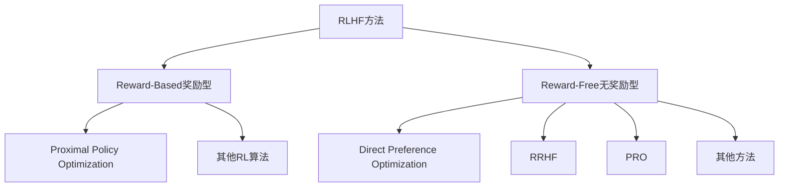

# Is DPO Superior to PPO for LLM Alignment? A Comprehensive Study

## 论文信息

- **论文标题**: Is DPO Superior to PPO for LLM Alignment? A Comprehensive Study
- **中文标题**: DPO真的优于PPO吗？LLM对齐方法的全面研究
- **作者**: Shusheng Xu, Wei Fu, Jiaxuan Gao, Wenjie Ye, Weilin Liu, Zhiyu Mei, Guangju Wang, Chao Yu, Yi Wu
- **机构**: 清华大学、OpenPsi Inc.、上海期智研究院
- **arXiv**: [2404.10719](https://arxiv.org/abs/2404.10719)
- **代码**: [github.com/openpsi-project/ReaLHF](https://github.com/openpsi-project/ReaLHF)
- **发表时间**: 2024年4月

---

## 一、核心贡献

本文通过**理论分析**和**大规模实证研究**，对DPO与PPO进行了全面对比，揭示了DPO的根本局限性和PPO的优化空间：

1. **理论证明DPO的固有局限性**
   - 定理4.1：PPO的解空间是DPO解空间的**真子集**
   - DPO可能产生利用OOD（分布外）数据的偏差解

2. **发现PPO的三大关键优化因素**
   - 优势归一化（Advantage Normalization）
   - 大批量训练（Large Batch Size）
   - 参考模型指数移动平均更新（Reference Model EMA）

3. **跨任务类型的全面实验验证**
   - 对话生成（HH-RLHF）
   - 代码生成（APPS、CodeContest）
   - 安全性对齐（SafeRLHF）
   - PPO在所有任务上均优于DPO

4. **揭示DPO失败的根本原因**
   - 分布偏移（Distribution Shift）问题
   - 偏好数据覆盖范围限制
   - 对基座模型质量的敏感性

---

## 二、背景与问题

### 2.1 RLHF方法分类



### 2.2 一个令人困惑的现象

| 应用场景 | 主流方法 | 代表产品 | 成功原因 |
|----------|----------|----------|----------|
| 工业级产品 | PPO (Reward-Based) | ChatGPT, Claude | 实际应用中表现更稳定、性能上限更高 |
| 学术benchmarks | DPO (Reward-Free) | Mistral, Zephyr | 实现简单、训练快速、易于复现 |

**核心问题**：为什么学术界和工业界选择了不同的路线？DPO真的优于PPO吗？

**现象背后的矛盾**：

1. **ChatGPT和Claude的成功**：这两款最受欢迎的AI产品都使用PPO进行RLHF
2. **学术benchmarks的DPO主导**：在大多数学术评测中，基于DPO的模型（如Zephyr、Mistral）取得了最先进的结果
3. **理论优势vs实践效果**：DPO理论上避免了奖励模型的复杂性，但工业界仍选择更复杂的PPO

**两个需要回答的根本问题**：
1. DPO在RLHF领域真的优于PPO吗？
2. PPO在常见RLHF基准测试中的性能能否得到实质性改善？

### 2.3 研究假设

本文提出两个需要验证的假设：
1. DPO可能存在**理论上的根本局限**
2. PPO的性能可能通过**优化实现细节**大幅提升

---

## 三、理论基础

### 3.1 RLHF的数学框架

**语言模型作为策略**：

$$ \pi_\theta(y|x) = \prod_t \pi_\theta(y_t|x, y_{<t}) $$

**RLHF优化目标**：

$$J_r(\pi_\theta) = \mathbb{E}_{x \sim p_{data}, y \sim \pi_\theta} \left[ r(x,y) - \beta \log \frac{\pi_\theta(y|x)}{\pi_{ref}(y|x)} \right]$$

其中：
- $r(x,y)$: 奖励函数（人类偏好）
- $\pi_{ref}$: 参考策略（通常为SFT模型）
- $\beta$: KL散度惩罚系数

### 3.2 PPO方法

PPO采用**Actor-Critic架构**：

1. **奖励模型学习**（如果无ground-truth奖励）：

$$\mathcal{L}_R(r_\phi) = -\mathbb{E}_{(x,y_w,y_l)\sim D} \left[ \log \sigma(r_\phi(x,y_w) - r_\phi(x,y_l)) \right]$$

2. **策略优化**（使用GAE估计优势函数）：

$$\mathcal{L}_{PPO}(\pi_\theta) = -\mathbb{E} \left[ \min\left( r_t(\theta) \hat{A}_t, \text{clip}(r_t(\theta), 1-\epsilon, 1+\epsilon) \hat{A}_t \right) \right]$$

其中 $r_t(\theta) = \frac{\pi_\theta(a_t|s_t)}{\pi_{\theta_{old}}(a_t|s_t)}$ 是重要性采样比率。

### 3.3 DPO方法

DPO的核心推导：

**最优策略的闭式解**：

$$\pi^*(y|x) = \frac{1}{Z(x)} \pi_{ref}(y|x) \exp\left(\frac{1}{\beta} r(x,y)\right)$$

**隐式奖励函数**：

$$r_\phi(x,y) = \beta \log \frac{\pi_\theta(y|x)}{\pi_{ref}(y|x)} + C(x)$$

**DPO损失函数**：

$$\mathcal{L}_{DPO}(\pi_\theta) = -\mathbb{E}_{(x,y_w,y_l)\sim D} \left[ \log \sigma\left( \beta \log \frac{\pi_\theta(y_w|x)}{\pi_{ref}(y_w|x)} - \beta \log \frac{\pi_\theta(y_l|x)}{\pi_{ref}(y_l|x)} \right) \right]$$

---

## 四、DPO的理论局限性

### 4.1 核心定理

**定理4.1**：给定真实奖励$r$和偏好数据集$D$，令：
- $\Pi_{PPO}$: PPO训练得到的策略集合
- $\Pi_{DPO}$: DPO训练得到的策略集合

则有：

$$\Pi_{PPO} \subsetneq \Pi_{DPO}$$

即：**PPO的解空间是DPO解空间的真子集**。

### 4.2 定理证明概要

**第一步**：证明$\Pi_{PPO} \subseteq \Pi_{DPO}$

对于任意$\pi \in \Pi_{PPO}$，可以构造对应的奖励函数：

$$r_\pi(x,y) = \beta \log \frac{\pi(y|x)}{\pi_{ref}(y|x)}$$

该奖励函数满足DPO的优化目标，因此$\pi \in \Pi_{DPO}$。

**证明逻辑**：
- 让$R$是最小化奖励学习损失Eq.(4)的奖励模型类
- 存在从策略到奖励函数的一对一映射：$f(\pi)(x,y) = \beta \log \frac{\pi(y|x)}{\pi_{ref}(y|x)}$
- 可以证明最小DPO损失与最小奖励学习损失相同
- 对于任何PPO找到的解$\pi_{PPO}$，可以构造相应的奖励$r^* = f(\pi_{PPO})$满足$\pi_{PPO}$最大化$J_{r^*}(\pi)$
- 因此$\pi_{PPO}$也能最小化DPO损失

**第二步**：证明存在$\pi \in \Pi_{DPO}$但$\pi \notin \Pi_{PPO}$

**反例构造**（Table 1 in paper）：

考虑一个简单的无状态MDP，3个动作：

| 策略 | $y_1$ | $y_2$ | $y_3$ |
|------|-------|-------|-------|
| $\pi_{ref}$ | 0.5 | 0.5 | 0 |
| $\pi_{DPO}$ | 0.1 | 0.0 | 0.9 |
| $\pi_{PPO}$ | 1 | 0 | 0 |

**偏好数据**: 仅包含单个偏好对$(y_w=y_1, y_l=y_2)$

**DPO的行为分析**：
- DPO的损失：$\mathcal{L}_{DPO} = \log(1 + (a/b)^\beta)$，其中$a = \frac{\pi(y_1|x)}{\pi(y_2|x)}$，$b = \frac{\pi_{ref}(y_1|x)}{\pi_{ref}(y_2|x)}$
- 当$b \to 0$（即$\pi(y_2|x) \to 0$）时，损失可以最小化
- DPO可以将概率从$y_2$转移到$y_3$（即使$y_3$从未在偏好数据中出现）
- DPO可能产生$\pi_{DPO} = [0.1, 0.0, 0.9]$这样的策略

**PPO的约束**：
- PPO受$\pi_{ref}$约束，根据Eq.(8)，当$\pi_{ref}(y_3|x)=0$时，必须$\pi_{PPO}(y_3|x)=0$
- 因此PPO不可能产生DPO那样的策略
- 这证明了存在$\pi_{DPO} \notin \Pi_{PPO}$

**根本原因**：奖励模型错误指定（Reward Misspecification）
- 偏好数据集的分布覆盖范围狭窄
- 学习到的奖励模型可能为OOD样本分配高值
- DPO会开发这些OOD响应来最小化损失，但可能损害实际性能

### 4.3 分布偏移（OOD）问题

**核心问题**：DPO可能给**分布外**的响应分配过高概率。

**实验设计**（Figure 1 in paper）：

创建一个合成场景来验证定理4.1：
- 离散的提示空间和响应空间，大小均为8
- 策略$\pi_\theta$和奖励模型$r_\phi$被建模为MDP
- 手动强制最优响应在索引对角线上
- 偏好数据集随机创建在此约束下，每个输入仅覆盖有限的偏好对

**可视化分析**（Figure 1）：

```
图1展示：
- 暗色圆点：偏好数据集中的数据点
- 浅色圆点：偏好数据集之外的数据点
- 红色圆圈和橙色圆圈：OOD响应，未被偏好数据集覆盖

DPO的行为：
- DPO给标记为红色的OOD数据点分配了约0.23的概率
- 参考模型$\pi_{ref}$对这些数据点仅分配0.11的概率
- DPO给未覆盖的OOD数据点分配了比参考模型更高的概率

PPO的行为：
- PPO通过KL散度约束，保持了对OOD数据点的低概率
- 在$\pi_\theta$和$\pi_{ref}$之间保持适当的距离
- PPO为OOD数据点分配了接近参考模型的概率
```

**关键洞察**：

1. **分布覆盖是根本问题**：DPO对分布偏移高度敏感的根本原因是偏好数据集的分布覆盖范围狭窄

2. **DPO的偏差倾向**：在实践中，学习到的奖励模型可能对OOD样本分配高值，这可能导致不可预测的行为

3. **PPO的天然保护机制**：
   - 显式KL正则化：PPO在损失中显式包含KL约束
   - 参考模型约束：PPO通过$\pi_{ref}$限制策略变化
   - 这为OOD响应提供了"防火墙"

4. **实际影响**：在分布偏移的情况下，DPO提升性能无法得到保证，可能退化为生成有偏差的策略

### 4.4 为什么PPO更安全？

| 机制 | PPO | DPO |
|------|-----|-----|
| **在线采样** | 可以探索偏好数据之外的响应 | 仅限于偏好数据中的响应 |
| **KL约束** | 显式约束$\pi_\theta$与$\pi_{ref}$的距离 | 仅在损失中隐式体现 |
| **奖励模型验证** | 可以对OOD响应打分 | 隐式奖励可能不可靠 |

---

## 五、PPO的三大关键优化

### 5.1 优势归一化（Advantage Normalization）

**问题**：原始优势函数$\hat{A}_t$的尺度不稳定，导致训练波动。

**解决方案**：

$$\hat{A}_t^{norm} = \frac{\hat{A}_t - \text{mean}(\hat{A})}{\text{std}(\hat{A}) + \epsilon}$$

**效果**：
- 稳定PPO训练过程
- 在HH-RLHF上：Helpfulness从-2.62提升到1.69

### 5.2 大批量训练（Large Batch Size）

**问题**：小batch导致梯度估计方差大，尤其影响复杂任务。

**实验结果**（CodeContest数据集）：

| Batch Size | Pass@1 | Pass@100 |
|------------|--------|----------|
| 64 (基线) | 4.3% | 6.0% |
| 大增益 | 5.1% | 12.8% |

**提升幅度**：+18.6%（Pass@1），+113%（Pass@100）

**关键洞察**：代码生成等复杂任务对batch size更敏感。

### 5.3 参考模型EMA更新（Reference Model EMA）

**问题**：PPO主模型快速变化，而参考模型固定，导致KL约束失效。

**解决方案**：

$$\pi_{ref}^{(t)} = \alpha \cdot \pi_{ref}^{(t-1)} + (1-\alpha) \cdot \pi_\theta^{(t)}$$

**直觉**：参考模型应该"跟随"主模型的更新，保持合理的相对距离。

**效果**：
- CodeContest Pass@5: 从12.8%提升到13.7%
- HH-RLHF Helpfulness: 持续提升

### 5.4 消融实验总结

| 优化技巧 | HH-RLHF | APPS (Intro/Inter/Comp) | CodeContest |
|----------|---------|-------------------------|-------------|
| 基线PPO | 0.706 | 10.1% / 2.4% / 1.1% | 6.0% |
| + 优势归一化 | 0.716 | 11.4% / 4.6% / 2.8% | 9.4% |
| + 大批量 | 0.716 | 14.6% / 7.5% / 5.1% | 12.8% |
| + 参考模型EMA | **0.718** | **18.0%** / **9.1%** / **6.8%** | **13.7%** |

**实验配置详情**：

**基座模型**：
- HH-RLHF：Llama2-7B
- APPS和CodeContest：CodeLlama-34B（部分实验使用CodeLlama-13B）

**评估指标**：
- HH-RLHF：OpenAssistant奖励模型评分
- APPS：Pass@5（5次尝试中至少一次通过测试的概率）
- CodeContest：Pass@5（5次尝试中至少一次通过测试的概率）

**关键发现**：

1. **优势归一化的稳定作用**：
   - 在所有任务上都带来提升
   - 在代码任务上尤为显著（APPS竞赛级别+1.7%，CodeContest+3.4%）
   - 防止训练过程中的梯度尺度不稳定

2. **大批量训练的威力**：
   - 对话任务（HH-RLHF）无明显提升
   - 代码任务（APPS和CodeContest）带来巨大收益
   - APPS入门级别从10.1%提升到14.6%（+44.6%）
   - 代码生成等复杂任务对batch size高度敏感

3. **参考模型EMA的持续改进**：
   - 在所有任务上都带来额外提升
   - CodeContest Pass@5：从12.8%提升到13.7%（+7.0%）
   - 特别适合需要持续优化的任务

**任务复杂度的影响**：

Figure 2显示，在APPS数据集上，增加PPO的批量大小持续提高所有难度级别的性能：
- Introductory（入门）：10.1% → 18.0%（+78.2%）
- Intermediate（面试）：3.9% → 9.1%（+133.3%）
- Competition（竞赛）：1.1% → 6.8%（+518.2%）

相反，使用小批量（如64）进行PPO训练会对基础SFT模型的性能产生负面影响，导致入门级别性能仅为33.7%。

**结论**：三个技巧的组合使PPO在挑战性任务上实现了显著的性能提升，大批量训练在代码生成等复杂任务上带来的收益最为显著。

---

## 六、实证研究

### 6.1 实验设置

**任务类型**：
1. **HH-RLHF**：对话生成，评估Helpfulness和Harmlessness
2. **APPS**：代码生成，三个难度级别（入门/面试/竞赛）
3. **CodeContest**：竞赛级代码生成
4. **SafeRLHF**：安全性对齐，多目标优化

**评估指标**：
- **HH-RLHF**：OpenAssistant奖励模型评分、GPT-4对比
- **代码任务**：Pass@k（k次尝试中至少一次通过测试的概率）
- **SafeRLHF**：Helpfulness奖励、Harmlessness奖励、Safety Rate

### 6.2 主要实验结果

#### 6.2.1 HH-RLHF对话任务

| 方法 | OpenAssistant奖励 | vs Chosen Win | vs SFT Win |
|------|-------------------|---------------|------------|
| RRHF | 0.523 | 28% | 29% |
| PRO | 0.529 | 37% | 34% |
| DPO | 0.611 | 55% | 53% |
| DPO-Iter | 0.678 | 55% | 54% |
| **PPO** | **0.718** | **57%** | **58%** |

**关键发现**：
- PPO在所有指标上均优于DPO
- 即使是迭代DPO（DPO-Iter），仍不及优化后的PPO
- PPO相比DPO提升：奖励+17.5%（0.718 vs 0.611）
- GPT-4评估显示PPO响应比DPO响应更受青睐（42% win vs 30%）

**评估细节**：
- 使用OpenAssistant奖励模型进行评估（未参与训练）
- 使用GPT-4直接比较PPO和DPO的输出
- PPO和DPO都明显优于数据集中的chosen响应和SFT模型输出
- 这表明两种方法都成功实现了对齐目标

#### 6.2.2 代码生成任务（CodeContest）

| 方法 | Pass@1 | Pass@10 | Pass@100 |
|------|--------|---------|----------|
| SFT | 0.9% | 4.3% | 12.0% |
| DPO | 0.0% | 0.0% | 0.0% |
| DPO-Iter | 3.5% | - | 3.2% |
| **PPO (34B)** | **22.4%** | - | **19.7%** |
| AlphaCode-41B | 16.4% | - | - |

**历史性突破**：
- PPO-34B在CodeContest上达到22.4%的Pass@1（10@1k）
- 超越AlphaCode-41B（16.4%），**模型规模更小但性能更强**
- 提升幅度：从16.4%到22.4%，绝对提升6%，相对提升36.6%
- 证明了PPO在复杂推理任务上的优势
- DPO完全失败：训练一轮后，DPO模型输出许多无意义的代码片段，通过率为0

**DPO失败的原因**：
- 代码生成任务需要探索偏好数据之外的响应空间
- DPO无法生成训练数据中未出现的正确代码
- 即使使用迭代DPO（DPO-Iter），性能仍远不如PPO
- 这验证了理论分析：DPO在挑战性任务上存在根本局限

**APPS任务结果**：

| 模型 | Introductory | Intermediate | Competition |
|------|---------------|---------------|-------------|
| CodeLlama-34B SFT | 38.6% | 10.1% | 3.9% |
| CodeLlama-34B DPO-Iter | 34.2% | 9.3% | 3.7% |
| CodeLlama-34B PPO | **44.4%** | **18.0%** | **9.1%** |

**关键观察**：
- DPO-Iter在所有模型规模上都未能改善SFT模型的性能
- 随着模型规模增加，PPO的改进更加明显
- 在代码生成任务上，大批量训练带来的收益最为显著

#### 6.2.3 安全性对齐（SafeRLHF）

在Helpfulness vs Safety的多目标优化中：

| 方法 | Helpfulness↑ | Harmlessness↓ | Safety Rate↑ |
|------|---------------|---------------|--------------|
| SFT | -2.62 | 1.50 | 41.6% |
| DPO | -4.19 | -0.97 | 55.4% |
| DPO-Iter.4 | -2.96 | -11.07 | 99.9% |
| **PPO** | **1.69** | **-12.08** | **99.5%** |

**PPO的优势**：
- Helpfulness显著优于所有DPO变体（1.69 vs -2.96）
- Safety Rate达到99.5%
- 实现了更好的多目标平衡

### 6.3 DPO失败案例分析

#### 6.3.1 分布偏移的影响

**实验设计**：

- **基座模型1**：SFT(Alpaca) —— 在Alpaca数据集上训练
- **基座模型2**：SFT(Safe) —— 在SafeRLHF数据集上训练
- **对齐数据**：SafeRLHF —— 分布与Alpaca不同

**实验配置**：
- DPO训练时使用不同的基座和参考模型
- PPO训练配置：优化后的版本（包含三大技巧）

**实验结果对比**：

| 配置 | ∆Helpfulness↑ | Safety Rate↑ |
|------|-----------------|--------------|
| SFT (Alpaca基座) | -2.62 | 41.6% |
| DPO (Alpaca基座) | -4.19 | 55.4% |
| +SFT(Safe) | 4.47 | 99.6% |
| DPO (Safe基座) | -1.62 | 71.8% |
| PPO (Alpaca基座) | **1.69** | **99.5%** |

**关键洞察**：

1. **DPO对分布匹配的高度敏感性**：
   - 使用不匹配的基座（Alpaca）训练DPO时，Helpfulness严重下降（-4.19）
   - 使用匹配的基座（Safe）后，Helpfulness显著改善（-1.62）
   - 这说明DPO对基座模型与偏好数据的分布匹配非常敏感

2. **PPO的分布鲁棒性**：
   - PPO在Alpaca基座上就达到了99.5%的Safety Rate
   - Helpfulness达到1.69，远超所有DPO配置
   - PPO对这种分布偏移更具鲁棒性

3. **基座质量的重要性**：
   - 在Safe基座上，DPO的Helpfulness从-4.19提升到-1.62（+2.57）
   - 但仍未达到PPO的水平（1.69）
   - 说明基座质量对对齐效果有重要影响

**根本原因分析**：

- **DPO的静态学习**：DPO在固定偏好数据集上优化，无法适应不同的分布
- **PPO的动态学习**：PPO通过在线采样，可以在不同分布上探索和学习
- **KL正则化的保护**：PPO的显式KL约束防止策略偏离参考模型过远

**实验意义**：

验证了分布偏移是DPO性能不佳的关键因素，解释了为什么：
- 学术benchmarks上DPO表现较好（基座和偏好数据分布匹配）
- 工业应用中PPO更优（需要处理多变的真实分布）

#### 6.3.2 偏好数据质量的影响

**数据过滤实验**：

SafeRLHF数据集的特点：
- 偏好对的形式：$(x, y_1, y_2, l_h, l_s, b_1, b_2)$
- $l_h, l_s$：在helpfulness和safety上的偏好标签（1或2）
- $b_1, b_2$：两个响应的二进制安全标签（正或负）
- 目标：当两个选项都安全时，优先选择更有帮助的响应；否则优先选择更安全的响应

**过滤策略**：

1. **过滤dual-unsafe**：移除两个响应都有害的偏好对
2. **过滤dual-safe**：移除两个响应都安全的偏好对

**实验结果**：

| 数据过滤策略 | ∆Helpfulness↑ | Harmlessness↓ | Safety Rate↑ |
|-------------|-----------------|---------------|--------------|
| 原始数据 | -4.19 | -0.97 | 55.4% |
| 过滤dual-unsafe | 2.46 | -4.88 | 80.8% |
| 过滤dual-safe | -2.86 | -6.82 | 95.8% |

**详细分析**：

**过滤dual-unsafe的效果**：
- Safety Rate：55.4% → 80.8%（+25.4%）
- Helpfulness：-4.19 → 2.46（+6.65）
- 这表明移除有争议的偏好对可以显著改善DPO性能

**过滤dual-safe的权衡**：
- Safety Rate：55.4% → 95.8%（+40.4%）
- Helpfulness：-4.19 → -2.86（+1.33）
- Helpfulness仍然很差，说明过度过滤高质量数据会损害性能

**关键洞察**：

1. **数据一致性的重要性**：
   - DPO对数据质量和一致性要求更高
   - 过滤矛盾或噪声数据可以带来显著改善

2. **数据多样性的平衡**：
   - 过度过滤dual-safe数据会损害Helpfulness
   - 需要在安全性和有用性之间找到平衡

3. **与PPO的对比**：
   - PPO（1.69 Helpfulness, 99.5% Safety Rate）仍远优于最佳DPO配置
   - 说明即使数据质量改善，DPO仍无法达到PPO的性能水平

**迭代DPO的改进**：

| DPO迭代次数 | ∆Helpfulness↑ | Harmlessness↓ | Safety Rate↑ |
|------------|-----------------|---------------|--------------|
| DPO | -4.19 | -0.97 | 55.4% |
| DPO-Iter.1 | -3.22 | -5.23 | 86.7% |
| DPO-Iter.2 | -3.27 | -8.83 | 99.7% |
| DPO-Iter.3 | -3.26 | -10.21 | 99.9% |
| DPO-Iter.4 | -2.96 | -11.07 | 99.9% |

**迭代DPO的方法**：
- 使用SFT(Safe)生成新响应
- 使用学习的奖励模型进行偏好标注
- 迭代更新参考模型为最新的DPO模型

**观察**：
- DPO-Iter在Safety Rate上达到了与PPO相当的水平（99.9%）
- 但Helpfulness仍然远低于PPO（-2.96 vs 1.69）
- 这表明即使缓解了分布偏移，DPO在挑战性任务上仍有局限

**实验结论**：

1. DPO的性能可以通过以下方式改善：
   - 额外SFT匹配分布
   - 过滤噪声和有争议的偏好对
   - 生成新响应并使用奖励模型标注进行迭代训练

2. 但即使在接近完美标注器的情况下，DPO在挑战性任务（如代码生成）上的性能仍不令人满意

3. 这验证了理论分析：DPO存在根本性局限，仅靠数据质量改善无法解决

---

## 七、技术洞察

### 7.1 为什么DPO在学术界更流行？

| 因素 | 影响 |
|------|------|
| **实现简单** | 无需维护奖励模型、价值模型 |
| **训练快速** | 单阶段优化，无在线采样开销 |
| **内存友好** | 只需加载策略和参考模型 |
| **数据效率** | 在固定偏好数据上表现不错 |

但这些便利性以**性能上限**为代价。

### 7.2 PPO的真正优势

1. **在线学习能力**
   - PPO可以探索偏好数据之外的响应空间
   - 通过采样发现新的高奖励区域

2. **显式奖励建模**
   - 奖励模型可以泛化到未见的响应
   - 提供了对OOD数据的"防火墙"

3. **灵活的优化目标**
   - 可以结合多种奖励信号
   - 易于扩展到多目标优化

### 7.3 方法选择的决策框架

```
任务复杂度评估：
├── 简单任务（对话风格、基本指令遵循）
│   └── DPO足够，且更简单高效
├── 中等复杂度（常规代码生成、问答）
│   └── 优化后的PPO有明显优势
└── 高复杂度（竞赛代码、复杂推理）
    └── PPO是必须的，且需全部优化技巧

资源约束评估：
├── 计算资源充足
│   └── 使用完整优化的PPO
└── 计算资源受限
    └── 可考虑DPO，但需注意分布匹配
```

---

## 八、实践建议

### 8.1 PPO优化检查清单

- [ ] **启用优势归一化**：稳定训练，提升收敛
- [ ] **使用大批量**：代码任务尤其重要，尽可能增大
- [ ] **参考模型EMA**：设置合适的衰减系数（如0.995）
- [ ] **奖励模型质量**：确保奖励模型在验证集上表现良好
- [ ] **KL系数调优**：$\beta$值需要根据任务调整

### 8.2 DPO使用注意事项

- [ ] **分布匹配**：确保基座模型与偏好数据来源相似
- [ ] **数据清洗**：过滤噪声和矛盾的偏好对
- [ ] **迭代训练**：如果可能，使用模型生成+奖励模型标注进行迭代
- [ ] **性能监控**：在复杂任务上监控OOD行为

### 8.3 混合策略

对于资源充足且追求最佳效果的场景，可以考虑：

```
SFT → DPO（快速warmup）→ PPO（精细优化）
```

或：

```
使用DPO训练奖励模型 → PPO进行策略优化
```

---

## 九、总结与展望

### 9.1 核心结论

1. **DPO并非 universally superior**：理论分析和实验证明DPO存在根本性局限
2. **PPO的上限更高**：在充分优化的情况下，PPO在所有测试任务上均优于DPO
3. **分布偏移是关键**：DPO对基座模型与偏好数据的分布匹配高度敏感
4. **优化细节至关重要**：PPO的性能高度依赖于实现细节（优势归一化、batch size、EMA）

### 9.2 对学术界的启示

- **重新审视基准测试**：当前的学术benchmarks可能不能反映工业级应用的复杂度
- **关注实现细节**：RL方法的性能对实现细节高度敏感
- **理论指导实践**：理论分析（如定理4.1）可以帮助我们理解方法的根本局限

### 9.3 对工业界的启示

- **ChatGPT/Claude的选择是正确的**：PPO在工业级应用中表现更稳定、上限更高
- **资源投入方向**：如果追求最佳效果，应该投资于PPO的优化而非DPO的调参
- **风险管理**：对于安全性关键的应用，PPO的OOD鲁棒性更有价值

### 9.4 未来研究方向

1. **理论深化**
   - 更完整的DPO-PPO理论比较框架
   - 分布偏移的量化分析方法

2. **算法改进**
   - 结合DPO简单性和PPO能力的混合方法
   - 自适应的在线/离线学习切换

3. **评估体系**
   - 更能反映工业级复杂度的benchmarks
   - OOD行为的标准化评估方法

4. **效率优化**
   - 降低PPO计算成本的技术
   - 更高效的在线采样策略

---

## 附录：实现细节

### A.1 PPO实现技术细节

**基础框架**：
- 基于DeepSpeed-Chat (Yao et al., 2023)框架
- 采用标准PPO算法的实现

**关键修改**：

1. **标量奖励**：
   - 使用每个响应的标量奖励
   - 而非每个token的稠密奖励
   - 简化训练过程，适合数据有限的场景

2. **省略辅助SFT损失**：
   - 在PPO训练过程中省略了SFT损失项
   - 主要原因：数据量有限
   - 避免SFT损失与奖励学习之间的干扰

**标准PPO技术**：
- Value Loss Clipping：稳定价值函数学习
- Generalized Advantage Estimation (GAE)：改进优势估计
- Entropy Bonus：鼓励探索

### A.2 奖励模型训练细节

**奖励模型配置**：
- 架构：与主模型相同的架构（通常基于Transformer）
- 输出：单标量值（而非序列级奖励）

**训练过程**：
- 损失函数：二元交叉熵损失

$$ \mathcal{L}_R(r_\phi) = -\mathbb{E}_{(x,y_w,y_l)\sim D} \left[ \log \sigma(r_\phi(x,y_w) - r_\phi(x,y_l)) \right] $$

- 优化器：Adam（常见配置）
- 学习率：通常为$10^{-5}$到$10^{-4}$范围

**训练数据**：
- 偏好对$(x, y_w, y_l)$：人工标注的两个响应，哪个更好
- 可选：直接奖励反馈：如果ground-truth奖励可用，可跳过奖励模型训练

### A.3 DPO实现细节

**单轮DPO**：
- 在原始偏好数据集上训练一轮
- 快速收敛，但可能受分布偏移影响

**迭代DPO (DPO-Iter)**：
- 生成新响应并使用奖励模型标注
- 迭代更新参考模型
- 更好地适应数据分布
- 在SafeRLHF任务上显著改善了性能

**KL惩罚系数$\beta$**：
- 控制策略与参考模型的偏离程度
- 典型值范围：0.1-0.5
- 需要根据具体任务调整

### A.4 评估指标说明

**HH-RLHF评估**：

- OpenAssistant奖励模型评分：
  - Helpfulness：帮助性评分
  - Harmlessness：无害性评分
  - 范围：通常为-10到+10

- GPT-4对比：
  - 模型输出直接与GPT-4比较
  - 评分：0-5（5个维度）
  - 维度：相关性、准确性、质量、安全性等

**代码生成评估**：

- Pass@k定义：k次尝试中至少一次通过测试的概率
- 评估方式：
  - 公开测试集：在问题描述中的测试用例
  - 隐藏测试集：未公开的测试用例，更有挑战性

- k的选择：
  - Pass@1：第一次尝试就成功，反映模型质量
  - Pass@5, Pass@10：多次尝试的成功率，反映可靠性
  - Pass@100：大规模评估，反映综合能力

**SafeRLHF评估**：

- 多目标优化：Helpfulness vs Harmlessness vs Safety
- Helpfulness：相对于Beaver基座的提升
- Harmlessness：相对于Beaver基线的降低
- Safety Rate：二进制安全性指标

### A.5 超参数配置

**PPO训练超参数**：

| 参数 | 典型值 | 说明 |
|------|---------|------|
| Batch Size | 大：512-2048；小：64 | 任务复杂度决定 |
| Learning Rate | $10^{-5}$ - $10^{-4}$ | 奖励模型和策略可能不同 |
| KL Coefficient ($\beta$) | 0.1-0.2 | 控制策略变化程度 |
| GAE Lambda | 0.95-0.99 | 广义优势估计的折扣因子 |
| Entropy Coefficient | 0.01-0.05 | 鼓励探索 |
| Ref. EMA Decay ($\alpha$) | 0.995-0.999 | 参考模型EMA衰减率 |

**DPO训练超参数**：

| 参数 | 典型值 | 说明 |
|------|---------|------|
| Learning Rate | $10^{-6}$ - $10^{-5}$ | 通常比PPO稍低 |
| KL Coefficient ($\beta$) | 0.1-0.5 | 与PPO类似 |
| Warmup Steps | 100-1000 | 学习率预热步数 |
| Gradient Clipping | 1.0 | 梯度裁剪阈值 |

### A.6 硬件配置

**训练硬件**：
- GPU：A100 80GB
- 数据并行：根据模型大小可能需要多卡
- 混合精度：bfloat16（常用配置）

**推理硬件**：
- 代码生成：需要较大显存（尤其是CodeLlama-34B）
- 评估：可能需要批量处理
