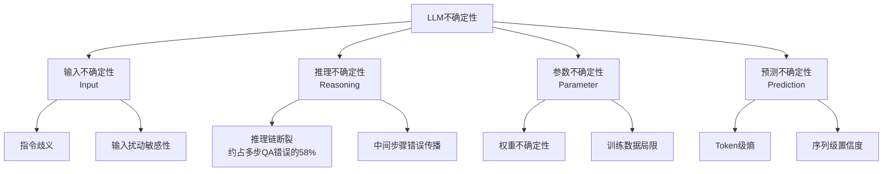
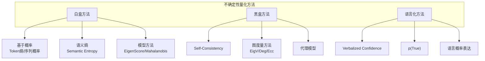
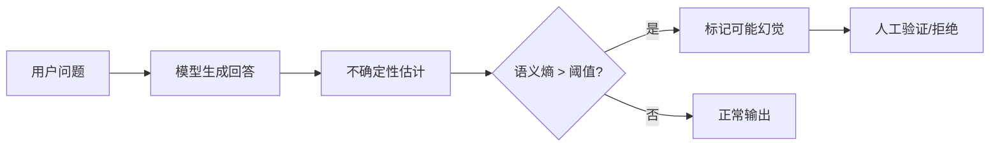

# LLM校准与不确定性量化：技术综述

**文档信息**
| 维度 | 内容 |
|------|------|
| 文档版本 | v2.3 |
| 覆盖范围 | LLM校准与不确定性量化的核心方法、理论框架与应用实践 |
| 最后更新 | 2026年4月 |
| 伴生索引 | [papers/README.md](./papers/README.md) - 核心论文索引 |
| 基础理论 | [ECE基础](/traditional-ml/model-selection/evaluation-metrics/SUMMARY.md) - 校准误差理论 |

---

## 快速导航

> **适合读者**：希望系统了解LLM可靠性的研究者、工程师、产品经理

| 你是谁 | 你想了解什么 | 推荐阅读路径 |
|-------|-------------|-------------|
| 入门者 | LLM不确定性是什么？为什么重要？ | [导读](#导读) → [一、问题定义](#一问题定义llm的不确定性挑战) → [二、方法体系](#二不确定性量化方法体系) |
| 研究者 | 四维分类法、最新方法对比 | [一.2 四维分类法](#12-四维不确定性分类法) → [二 方法对比表](#25-方法对比) → [七、趋势展望](#七关键趋势与展望) |
| 工程师 | 如何选择方法、如何部署？ | [六、实践指南](#六实践指南) → [方法选择决策树](#61-方法选择决策树) |
| Agent开发者 | Agent场景的特殊挑战 | [七.1 Agent不确定性](#71-agent不确定性从累积到约减acl-2026) → [UQ in LLM Agents](./papers/UQ_LLM_Agents_2602.05073.md) |

---

## 导读

大语言模型（LLM）在自然语言生成中展现出强大能力，但其输出的可靠性面临严峻挑战：**幻觉问题**（Hallucination，模型自信地输出错误信息）和**置信度不可靠**（模型无法正确表达不确定性）。这两个问题在高风险应用（医疗诊断、法律咨询、金融决策）中可能导致严重后果。

**核心问题**：如何让LLM"知道自己不知道"？

本文以**不确定性量化**（Uncertainty Quantification, UQ）和**校准**（Calibration）两条主线，系统梳理LLM可靠性评估的完整技术版图：

- **四维不确定性分类法**（KDD 2025）将LLM不确定性分为输入/推理/参数/预测四个维度，比传统**认知/偶然二分法**（Aleatoric/Epistemic）更全面
- **语义熵**（Semantic Entropy）是当前最有效的不确定性度量方法，在幻觉检测任务上AUROC达到0.82+
- **黑盒图度量方法**（EigV/Deg/Ecc）仅用m=3次生成即可超越白盒基线
- **语言化置信度**（Verbalized Confidence）使RLHF模型的**ECE**（Expected Calibration Error，期望校准误差）相对降低约50%

**四条技术路线**各有适用场景：
- **白盒方法**（语义熵、Token熵）可访问模型内部概率，效果最优
- **黑盒方法**（图度量、Self-Consistency）仅通过API调用，适用闭源模型
- **语言化方法**（Verbalized Confidence、p(True)）直接向模型询问置信度
- **Agent方法**（条件不确定性约减，Conditional Uncertainty Reduction）处理多步交互场景

**核心趋势**：研究重心从"如何估计不确定性"走向三个前沿——(1) Agent场景的交互式不确定性；(2) 从评估工具到数据生成指导工具（如ECE驱动知识盲点定位）；(3) **语义熵探测器**（Semantic Entropy Probes, SEPs）等高效近似方法降低计算成本。

---

## 一、问题定义：LLM的不确定性挑战

### 1.1 为什么需要不确定性量化（Uncertainty Quantification, UQ）？

传统评估指标（准确率、F1、BLEU）只衡量**输出质量**，不衡量**置信度可靠性**（Calibration Quality）。

**与传统模型的根本差异**：传统分类模型通过 softmax 天然输出**置信度**（Confidence），校准（Calibration）问题是"让已有概率值更可靠"。LLM 输出的是文本，**默认不提供置信度信号**，因此 LLM 的不确定性研究面临两层问题：

```
传统模型：固有输出置信度 → 需要校准（让概率值可靠）
LLM：    默认不输出置信度 → 需要引出（Elicitation）→ 引出后需要校准
         └── LLM独有的前置问题 ──┘   └── 与传统模型相同 ──┘
```

**置信度信号的用途**：当系统需要基于置信度做自动决策时，不可靠的置信度会导致安全机制失效：

| 系统机制 | 依赖置信度的决策 | 过度自信（Overconfidence）的后果 |
|---------|----------------|--------------|
| 幻觉检测（Hallucination Detection） | 高不确定性 → 标记可能幻觉 | 幻觉未被拦截 |
| 选择性生成（Selective Generation） | 低置信度 → 拒绝回答或转人工 | 错误答案直接输出 |
| RAG检索增强 | 低置信度 → 触发外部检索 | 跳过检索输出错误 |
| 知识盲点定位 | 高ECE → 优先补充训练数据 | 盲点未被识别 |
| Agent决策 | 低置信度 → 请求更多信息 | 盲目执行错误动作 |

> 如果 LLM 只作为对话工具直接输出文本（不使用置信度信号做决策），校准质量不构成直接风险。校准的价值在于**为系统级决策提供可靠的不确定性信号**。

### 1.2 四维不确定性分类法

KDD 2025 综述提出了比传统**认知/偶然二分法**（Aleatoric/Epistemic Dichotomy）更全面的框架：



| 维度 | 来源 | 对应方法 | 是否含认知+偶然 |
|------|------|---------|---------------|
| **输入不确定性** | 指令歧义、输入变异 | Prompt扰动、释义方法 | 是 |
| **推理不确定性** | 推理路径分歧、中间错误 | CoT-UQ、步骤级置信度 | 是 |
| **参数不确定性** | 权重不确定性、知识边界 | MC Dropout、集成方法 | 是 |
| **预测不确定性** | 生成多样性、解码随机 | 语义熵、Token级熵 | 是 |

### 1.3 语义等价：预测不确定性的核心挑战

传统不确定性方法在自然语言场景中的核心挑战是**语义等价**：

| 问题 | 回答1 | 回答2 | 语义相同？ | 传统熵判断 |
|------|-------|-------|----------|-----------|
| 法国首都？ | 巴黎 | It's Paris | 是 | 不同（错误）|
| 法国首都？ | 巴黎 | The capital of France is Paris | 是 | 不同（错误）|

> 语义等价示例来自 Semantic Uncertainty 论文（ICLR 2023）：当模型在 "Paris"、"It's Paris"、"The capital of France is Paris" 之间摇摆时，传统方法会误判为高不确定性，但实际上模型对这些回答的含义是确定的。

### 1.4 Token级 vs 语义级不确定性

**核心论点**（ICLR 2026 Position Paper）：Token级不确定性对LLM根本不充分，语义级不确定性是必要的范式转变。

| 指标 | Token级 (Perplexity) | 语义级 (Semantic Entropy) | 改善幅度 |
|------|---------------------|-------------------------|---------|
| ECE | 31.50% | 13.53% | **-57%** |
| AUROC | 54.07% | 80.94% | **+27pp** |

**根本原因**：Token级不确定性衡量"选择哪个Token"，而LLM可靠性取决于"表达了什么含义"——两者存在**语义鸿沟**（Semantic Gap）。

### 1.5 传统不确定性类型

| 类型 | 英文 | 定义 | 特点 | 示例 |
|------|------|------|------|------|
| **偶然不确定性** | Aleatoric Uncertainty | 数据固有噪声 | 不可通过更多数据减少 | "苹果怎么样？"歧义 |
| **认知不确定性** | Epistemic Uncertainty | 模型知识不足 | 可通过更多数据减少 | 训练后新事件 |

> 在 Agent 场景中，传统认知/偶然二分法进一步失效——可交互动作（Interactive Action）使认知不确定性可被"约减"（Reducible），需要新的分类框架（详见第七节）。

---

## 二、不确定性量化方法体系

### 2.0 方法总览

| 方法 | 不确定性维度 | 访问需求 | 计算成本 | AUROC | 推荐场景 |
|------|-------------|---------|---------|-------|---------|
| **语义熵** | 预测不确定性 | 白盒 | 中 | 0.82+ | 高价值决策 |
| **图度量(Deg)** | 预测不确定性 | 黑盒 | 中 | 0.84 | 闭源模型+选择回答 |
| **图度量(EigV)** | 预测不确定性 | 黑盒 | 中 | 0.82 | 闭源模型+评估难度 |
| **Self-Consistency** | 预测不确定性 | 黑盒 | 高 | 0.79 | 闭源模型 |
| **p(True)** | 预测不确定性 | 黑盒 | 低 | 0.76 | 实时应用 |
| **Token熵** | 预测不确定性 | 白盒 | 低 | 0.74 | 快速评估 |
| **CoT-UQ** | 推理不确定性 | 白盒 | 中 | - | 多步推理任务 |
| **MC Dropout** | 参数不确定性 | 白盒 | 高 | - | 知识边界评估 |

### 2.1 方法分类



### 2.2 白盒方法

#### 2.2.1 Token级方法

**最大Token概率**：
$$U_{\text{max-prob}} = 1 - \max_{t} p(w_t | w_{<t})$$

**Token熵**：
$$H_t = -\sum_{w \in V} p(w | w_{<t}) \log p(w | w_{<t})$$

**优点**：计算简单，无需额外采样
**缺点**：忽略语义信息

#### 2.2.2 语义熵（Semantic Entropy）—— 核心方法

**三步计算流程**：

```
Step 1: 多次生成 → 对问题生成K个回答
Step 2: 语义聚类 → 使用NLI判断语义等价，将语义相同的回答聚类
Step 3: 计算语义熵 → 计算聚类级别的熵
```

**数学表达**：

$$SE = -\sum_{c=1}^{C} p(c) \log p(c)$$

其中 $C$ 是语义聚类数量，$p(c)$ 是聚类 $c$ 的概率。

**效果**：在幻觉检测任务上AUROC达到0.82+，显著优于传统方法。

### 2.3 黑盒方法

#### 2.3.1 Self-Consistency

多次采样，计算答案一致性：

$$\text{Confidence} = \frac{\max_c n_c}{K}$$

其中 $n_c$ 是最常见答案的出现次数，$K$ 是总采样次数。

#### 2.3.2 图度量方法（Generating with Confidence, TMLR 2024）

基于NLI语义相似度构建图，提出三种图度量指标：

```
输入问题 → 生成m个回答 → NLI蕴含相似度矩阵 → 相似度图 → 图度量
```

| 指标 | 类型 | 原理 | 用途 |
|------|------|------|------|
| **EigV** | 不确定性 | 图拉普拉斯矩阵特征值之和 | 整体问题难度评估 |
| **Deg** | 置信度 | 节点度数（语义支持度） | 特定回答的可靠性 |
| **Ecc** | 置信度 | 节点离心率（图中心距离） | 特定回答的可靠性 |

**关键发现**：
- NLI蕴含相似度效果最佳，优于Jaccard和NLI矛盾
- **仅需m=3次生成**即可获得良好效果
- 黑盒NLI方法**可超越白盒基线**（AUROC 0.82 vs 0.75）

#### 2.3.3 不确定性与置信度的区分

| 概念 | 定义 | 特点 |
|------|------|------|
| **不确定性** | 对固定输入，潜在预测的分散程度 | 响应无关，无法区分单个回答 |
| **置信度** | 对特定预测/生成的信心 | 响应特定，可区分不同回答质量 |

### 2.4 语言化方法

#### 2.4.1 Verbalized Confidence

直接向模型询问置信度：

```
Please answer the following question and provide your confidence
level from 0% to 100%:
Question: {question}
Answer: [Your answer]
Confidence: [0-100]%
```

#### 2.4.2 p(True)

让模型自我判断答案正确性：

```
问题: {question}
答案: {answer}
这个答案是否正确？回答 True 或 False。
```

#### 2.4.3 语言概率表达（1S-human / 1S-opt）

使用语言表达替代数字概率（"Almost certain"、"Likely"等），通过人类调查映射为数值。1S-opt 进一步用校准集优化映射。

### 2.5 方法对比

| 方法 | 访问需求 | 计算成本 | AUROC | 推荐场景 |
|------|---------|---------|-------|---------|
| **语义熵** | 白盒 | 中 | 0.82+ | 高价值决策 |
| **图度量(Deg)** | 黑盒 | 中 | 0.84 | 闭源模型+选择回答 |
| **图度量(EigV)** | 黑盒 | 中 | 0.82 | 闭源模型+评估难度 |
| **Self-Consistency** | 黑盒 | 高 | 0.79 | 闭源模型 |
| **p(True)** | 黑盒 | 低 | 0.76 | 实时应用 |
| **Token熵** | 白盒 | 低 | 0.74 | 快速评估 |

> Token级方法的局限性详见 [1.4 Token级 vs 语义级不确定性](#14-token级-vs-语义级不确定性)

---

## 三、幻觉检测应用

### 3.1 幻觉检测流程



### 3.2 幻觉类型与检测

| 幻觉类型 | 特征 | 不确定性特征 |
|---------|------|-------------|
| **编造（Confabulation）** | 模型不确定时任意生成 | 高语义熵 |
| **事实错误** | 与已知事实矛盾 | 取决于模型知识 |
| **逻辑矛盾** | 前后不一致 | 高Self-Consistency熵 |

### 3.3 阈值设置建议

| 应用场景 | 语义熵阈值 | 行为策略 |
|---------|-----------|---------|
| **高风险（医疗、法律）** | 0.3 | 转人工处理 |
| **中风险（客服、教育）** | 0.5 | 附置信度声明 |
| **低风险（推荐、娱乐）** | 0.7 | 正常输出 |

---

## 四、校准方法

### 4.1 校准的定义

**完美校准**：当模型说"90%确信"时，实际应该有90%的正确率。

$$P(\hat{Y} = Y \mid \hat{P} = p) = p, \quad \forall p \in [0, 1]$$

### 4.2 RLHF对校准的影响与恢复

#### 4.2.1 RLHF校准退化现象（Just Ask for Calibration, EMNLP 2023）

无监督预训练产生的LLM条件概率校准良好，但RLHF微调显著降低校准质量：

```
预训练模型 → 条件概率校准良好
    ↓ RLHF微调
RLHF模型 → 条件概率校准退化（过度自信）
```

**实验证据**：Llama-2-70B-Chat 的条件概率比 Llama-2-70B-Base 校准更差。

#### 4.2.2 语言化置信度恢复校准

**核心发现**：语言化置信度（Verbalized Confidence）比条件概率校准更好：

| 模型 | 条件概率 ECE | 语言化概率 ECE | 相对改善 |
|------|-------------|---------------|---------|
| GPT-4 | 0.22 | 0.11 | **50%↓** |
| ChatGPT | 0.28 | 0.15 | **46%↓** |
| Claude | 0.25 | 0.13 | **48%↓** |

**原因**：
- 条件概率被RLHF奖励模型扭曲
- 语言化概率依赖预训练中学到的概率概念，受RLHF影响较小

#### 4.2.3 最佳策略：CoT + 数值置信度

| 策略 | TriviaQA ECE | 说明 |
|------|-------------|------|
| 条件概率 | 0.28 | RLHF后退化 |
| 1S-num | 0.17 | 直接问数字 |
| **1S-num-top (CoT)** | **0.15** | 先推理再评估，最佳 |
| 1S-opt | 0.16 | 校准集优化映射 |

### 4.3 LLM校准方法总览

```
校准方法
├── 后处理方法
│   ├── Temperature Scaling：单参数温度调整
│   ├── Conformal Prediction：统计置信区间
│   └── 分箱方法：Histogram Binning
│
├── 语言化方法
│   ├── Verbalized Confidence：直接询问置信度
│   ├── p(True)：自我判断
│   └── 语言概率表达：1S-human / 1S-opt
│
├── 训练时方法
│   ├── LACIE：听众感知微调
│   ├── 校准损失函数
│   └── Conformal Linguistic Calibration
│
└── 数据驱动方法
    └── ECE知识盲点定位 → 指导合成数据生成
```

### 4.4 ECE用于知识盲点定位（GraphGen, arXiv 2505.20416）

GraphGen 将 ECE 从全局评估指标转变为逐三元组的诊断工具：

```
传统 ECE 用途：评估模型整体校准质量
    ↓ 转化
GraphGen 中的 ECE：定位每个知识点的掌握程度
```

**方法**：

1. 对 KG 中每条边（三元组），生成正例改写 $R_{ij}$ 和否定陈述 $\neg R_{ij}$
2. 用 Prompt 获取模型置信度，计算 comprehension score：

$$C_{R_i} = \frac{1}{2n}\left(\sum_{j=1}^{n} P(t|R_{ij}) + \sum_{j=1}^{n} P(f|\neg R_{ij})\right)$$

3. ECE = $|1 - C_{R_i}|$，高 ECE = 知识盲点
4. 优先选择高 ECE 三元组进行合成数据增强

| 维度 | 传统 ECE | GraphGen ECE |
|------|---------|-------------|
| 粒度 | 全局/分桶级 | 逐三元组级 |
| 目的 | 评估校准质量 | 定位知识盲点 |
| 用途 | 诊断/报告 | 指导数据生成 |

---

## 五、评估指标与基准

### 5.1 评估指标

| 指标 | 用途 | 公式/说明 |
|------|------|---------|
| **AUROC** | 不确定性预测准确率 | $\frac{1}{|C^+||C^-|} \sum_{c_i \in C^+} \sum_{c_j \in C^-} \mathbb{I}(c_i > c_j)$ |
| **ECE** | 校准质量 | $\sum_{m=1}^M \frac{|B_m|}{n} |\text{acc}(B_m) - \text{conf}(B_m)|$ |
| **Brier Score** | 概率预测准确性 | $\frac{1}{N}\sum_{i=1}^N(p_i - y_i)^2$ |
| **AURC** | 拒绝效果 | 拒绝不确定样本的效果曲线 |

### 5.2 GRACE：人类校准基线（ACL 2025）

**核心问题**：现有校准评估只能模型间对比，无法回答"校准质量是否足够好"？

**GRACE 数据集**：人机竞赛数据，每个问题由5个逐步变简单的线索组成：

```
问题示例："这是什么城市？"
  ├── 线索1（最难）: 这座城市在2012年举办了夏季奥运会
  ├── 线索2: 它是英国人口最多的城市
  ├── ...
  └── 线索5（最易）: 它是英国的首都
答案：伦敦
```

**CALSCORE 指标**：融入人类表现的细粒度校准评估

| 维度 | ECE | Brier Score | CALSCORE |
|------|-----|------------|----------|
| 人类参照 | 无 | 无 | **有** |
| 评估粒度 | 聚合 | 聚合 | **逐问题** |

**核心思想**：在人类还未答对时，模型如果高置信度答对 → 奖励；高置信度答错 → 重罚。

> 详见 [GRACE](./papers/GRACE_Granular_Benchmark_Calibration_2502.19684.md)

### 5.3 基准测试框架：LM-Polygraph

**功能**：开源的LLM不确定性量化工具包

**支持方法**：语义熵、Self-Consistency、p(True)、Token熵、EigenScore

**基准结果**：

| 任务类型 | 最佳方法 | AUROC |
|---------|---------|-------|
| 事实问答 | 语义熵 | 0.85 |
| 数学推理 | Self-Consistency | 0.76 |
| 对话任务 | p(True) | 0.74 |
| 代码生成 | Token熵 | 0.72 |

---

## 六、实践指南

### 6.1 方法选择决策树

```
是否可以访问模型内部概率？
├── 是（白盒）
│   ├── 追求效果 → 语义熵
│   └── 追求效率 → Token熵
│
└── 否（黑盒）
    ├── 需要选择特定回答 → 图度量Deg/Ecc
    ├── 需要评估问题难度 → 图度量EigV
    ├── 计算资源充足 → Self-Consistency
    └── 计算资源有限 → p(True) / Verbalized Confidence
```

### 6.2 置信度引出策略选择

| 场景 | 推荐策略 | 原因 |
|------|---------|------|
| 闭源模型 | 1S-num-top (CoT) | 效果最佳，ECE降低50% |
| 开源模型（可用logits） | 条件概率 + Temperature Scaling | 可直接校准 |
| 实时场景 | 1S-num | 无需CoT，更快 |
| 需要可解释性 | 1S-opt | 语言表达 + 校准映射 |

### 6.3 最佳实践

```
部署不确定性量化
├── 1. 评估访问权限与计算资源
│   ├── 白盒 → 语义熵（效果优先）
│   └── 黑盒 → 图度量/p(True)（成本优先）
│
├── 2. 选择置信度引出方式
│   ├── 闭源 → 语言化置信度（1S-num-top）
│   └── 开源 → 条件概率 + Temperature Scaling
│
└── 3. 制定策略
    ├── 高风险：严格阈值 + 人工审核
    └── 一般应用：适中阈值 + 置信度声明
```

---

## 七、关键趋势与展望

### 7.1 Agent不确定性：从累积到约减（ACL 2026）

传统 UQ 将不确定性视为**累积过程**，但在 Agent 场景中失效——Agent 的可交互动作可以**约减**而非仅累积不确定性：

```
传统视角：U = u₁ + u₂ + u₃（累积）
Agent视角：U(s_t) = f(s_{t-1}, a_t, o_t)（可增可减）
```

**四大技术挑战**：

| 挑战 | 说明 |
|------|------|
| 估计器选择 | 现有UQ估计器的弱点被Agent框架放大 |
| 异构实体不确定性 | 外部工具/数据库的不同分布难以统一量化 |
| 交互式不确定性动态 | 加权平均聚合不适用于开放环境 |
| 缺乏细粒度基准 | 轨迹级、步骤级评估基准稀缺 |

### 7.2 效率是核心战场

| 方法 | 相对计算成本 | AUROC |
|------|-------------|-------|
| 完整语义熵 | 5-10x | 0.82 |
| SEPs（语义熵探测器） | 1x | 0.80 |
| 图度量(EigV, m=3) | 3x | 0.82 |
| p(True) | 1x | 0.76 |

### 7.3 从评估工具到行动指导

| 阶段 | ECE的角色 | 代表工作 |
|------|----------|---------|
| 评估 | 量化校准质量 | On Calibration of Modern NN (ICML 2017) |
| 诊断 | 定位具体问题 | RLHF校准退化分析 (EMNLP 2023) |
| **行动** | **指导数据生成** | **GraphGen ECE盲点定位 (2505.20416)** |

### 7.4 趋势总览

| 方向 | 说明 | 时间线 |
|------|------|--------|
| Agent UQ | 可交互动作的条件不确定性约减 | 2025-2026 前沿 |
| 跨模态UQ | 视觉-语言模型的联合不确定性 | 2025+ |
| ECE驱动数据生成 | 从评估到行动的闭环 | 2025+ |
| 高效近似 | SEPs等低成本方法 | 进行中 |
| 统一评估基准 | 标准化UQ评估协议 | 待建立 |

---

## 八、论文与参考索引

### 综合综述（快速入门推荐）

| 论文 | 发表 | 核心价值 | 笔记 |
|------|------|---------|------|
| UQ and Confidence Calibration in LLMs: A Survey | KDD 2025 | **四维不确定性分类法**，方法总览表 | [链接](./papers/UQ_Confidence_Calibration_LLM_Survey_KDD2025_2503.15850.md) |
| Uncertainty Estimation in LLMs: Theory Meets Practice | arXiv 2410 | 理论到实践桥梁，**适合入门** | [链接](./papers/Uncertainty_Estimation_LLM_Survey_2410.15326.md) |
| Uncertainty Measurement for LLMs | arXiv 2502 | **Flex-ECE**，生成任务校准 | [链接](./papers/Uncertainty_Measurement_LLM_Survey_2502.04567.md) |
| Survey of Calibration for Black-Box LLMs | arXiv 2412 | **闭源模型**置信度估计 | [链接](./papers/Survey_Calibration_BlackBox_LLMs_2412.md) |
| UQ in LLM Agents | ACL 2026 | **Agent场景**不确定性 | [链接](./papers/UQ_LLM_Agents_2602.05073.md) |

### 核心方法论文

| 论文 | arXiv | 核心贡献 | 笔记 |
|------|-------|---------|------|
| Semantic Uncertainty | 2302.09664 | 提出语义熵，AUROC 0.82+ | [链接](./papers/Semantic_Uncertainty_2302.09664.md) |
| Detecting Hallucinations with Semantic Entropy | Nature 2024 | 幻觉检测应用，Nature发表 | [链接](./papers/Detecting_Hallucinations_Semantic_Entropy_Nature_2024.md) |
| Generating with Confidence | 2305.19187 | 黑盒图度量UQ（EigV/Deg/Ecc），m=3即可 | [链接](./papers/Generating_with_Confidence_Blackbox_UQ_2305.19187.md) |
| Just Ask for Calibration | 2305.14975 | 语言化置信度，ECE降低50% | [链接](./papers/Just_Ask_for_Calibration_2305.14975.md) |
| Can LLMs Express Uncertainty? | 2306.13063 | 置信度表达能力评估 | [链接](./papers/Can_LLMs_Express_Uncertainty_2306.13063.md) |
| Benchmarking UQ with LM-Polygraph | 2406.15627 | 基准测试框架，方法对比 | [链接](./papers/Benchmarking_UQ_LM_Polygraph_2406.15627.md) |
| GraphGen: ECE知识盲点定位 | 2505.20416 | ECE驱动的合成数据生成 | [链接](./papers/GraphGen_ECE_Blind_Spot_2505.20416.md) |
| From Tokens to Meaning | ICLR 2026 | Token级不充分，语义级必要 | [链接](./papers/From_Tokens_to_Meaning_ICLR2026.md) |
| GRACE: Granular Benchmark | ACL 2025 | 人机校准对比基准 | [链接](./papers/GRACE_Granular_Benchmark_Calibration_2502.19684.md) |

### 工具资源

- LM-Polygraph: https://github.com/IINemo/lm-polygraph
- Semantic Uncertainty: https://github.com/lorenzkuhn/semantic-uncertainty
- GraphGen: https://github.com/open-sci/GraphGen

---

*创建日期：2026年4月 | 版本：v2.1 | 主要数据来源：核心论文、基准测试、综述研究*

**v2.3 更新内容**：
- **结构优化**：Token级vs语义级移至问题定义章节（1.4节）
- **章节重命名**："工具与框架"→"评估指标与基准"，更准确反映内容
- **指标前置**：AUROC/ECE/Brier等评估指标集中在第五章
- **内容整合**：删除重复的评估指标说明（原6.3节）

**v2.2 更新内容**：
- 新增 GRACE 人类校准基线（5.3节）
- 补充 CALSCORE 指标与传统指标对比

**v2.1 更新内容**：
- 新增快速导航表格（按读者类型推荐阅读路径）
- 新增方法总览表（含不确定性维度、访问需求）
- 新增 Token级 vs 语义级 对比（ICLR 2026）
- 综述论文独立分类，标注核心价值
- 更新核心方法论文表，补充最新论文
