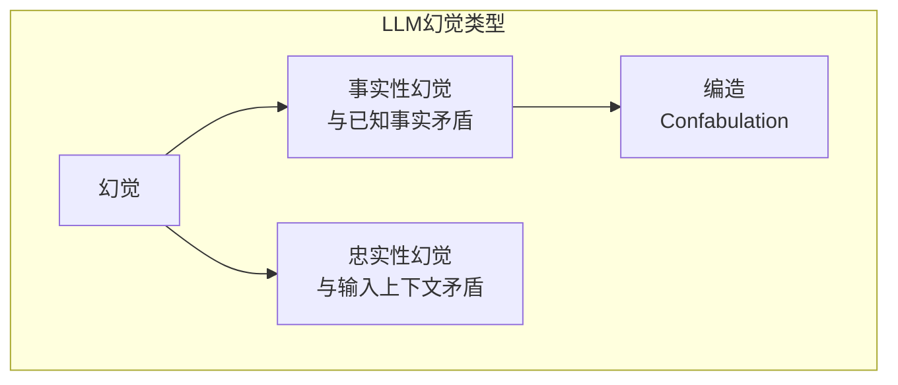
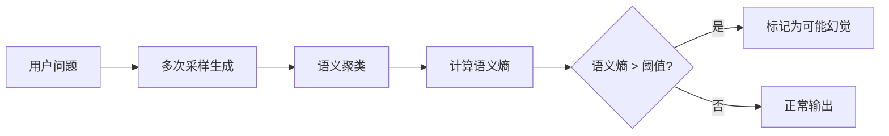

# Detecting Hallucinations in Large Language Models Using Semantic Entropy

**论文信息**
- 论文标题：Detecting Hallucinations in Large Language Models Using Semantic Entropy
- 中文标题：使用语义熵检测大语言模型中的幻觉
- 作者：Sebastian Farquhar, Jannik Kossen, Lorenz Kuhn, Yarin Gal
- 机构：University of Oxford, OATML Group
- arXiv: Nature 630, 625-630 (2024)
- DOI: 10.1038/s41586-024-07421-0
- 发表：Nature, June 2024

---

## 一、论文整体思路

### 1.1 研究背景

大语言模型（LLM）如ChatGPT、Gemini展现出强大的能力，但经常产生**幻觉（Hallucination）**——生成看似合理但实际上是虚假或错误的内容。这在以下领域带来严重风险：
- 法律：编造不存在的法律判例
- 医疗：给出错误的诊断建议
- 新闻：生成虚假的事实报道

### 1.2 核心问题

如何在不依赖已知答案的情况下，检测LLM输出是否为幻觉？

**挑战**：
- 传统方法需要对比参考答案
- 新问题可能人类也不知道正确答案
- 模型置信度不可靠（过度自信）

### 1.3 主要贡献

1. **提出方法**：基于语义熵的幻觉检测方法
2. **理论基础**：统计学基础的不确定性估计
3. **广泛验证**：多个数据集、多种模型上的实验
4. **Nature发表**：方法得到学术界高度认可

---

## 二、幻觉的类型

### 2.1 幻觉分类



### 2.2 编造（Confabulation）

本文重点关注**编造**类型的幻觉：
- 模型不确定时生成任意内容
- 高置信度但错误
- 最危险的幻觉类型

**关键洞察**：当模型对答案不确定时，多次采样会得到语义不同的回答。

---

## 三、核心方法

### 3.1 方法原理

**核心假设**：
- 模型确定时：多次采样得到语义相同的答案
- 模型不确定（编造）时：多次采样得到语义不同的答案

```
确定 → 低语义熵 → 正确
不确定 → 高语义熵 → 可能是幻觉
```

### 3.2 语义熵计算

**Step 1: 多次生成**

对问题 $q$ 生成 $K$ 个回答：

$$\{r_1, r_2, \ldots, r_K\}$$

**Step 2: 语义聚类**

使用NLI（自然语言推理）判断语义等价：

$$r_i \equiv r_j \iff \text{NLI}(r_i, r_j) = \text{Entailment}$$

**Step 3: 计算语义熵**

$$SE = -\sum_{c=1}^{C} p(c) \log p(c)$$

其中 $p(c)$ 是聚类 $c$ 的概率。

### 3.3 幻觉检测流程



### 3.4 与基线方法对比

| 方法 | 原理 | 优点 | 缺点 |
|------|------|------|------|
| **最大概率** | Token级别置信度 | 简单 | 忽略语义 |
| **预测熵** | Token熵 | 考虑分布 | 词汇级别 |
| **Self-Consistency** | 答案一致性 | 黑盒适用 | 无语义判断 |
| **语义熵** | 语义聚类熵 | 全面 | 需要NLI |

---

## 四、实验结果

### 4.1 数据集

| 数据集 | 任务 | 特点 |
|--------|------|------|
| **TriviaQA** | 事实问答 | 开放域知识 |
| **CoQA** | 对话问答 | 多轮对话 |
| **GSM8K** | 数学推理 | 多步推理 |
| **BioASQ** | 生物医学 | 专业领域 |

### 4.2 主要结果

**幻觉检测准确率（AUROC）**：

| 方法 | TriviaQA | CoQA | GSM8K | BioASQ |
|------|----------|------|-------|--------|
| 最大概率 | 0.71 | 0.68 | 0.62 | 0.65 |
| 预测熵 | 0.74 | 0.71 | 0.65 | 0.68 |
| p(True) | 0.78 | 0.74 | 0.69 | 0.72 |
| **语义熵** | **0.85** | **0.81** | **0.76** | **0.79** |

### 4.3 跨模型泛化

语义熵在不同模型上的表现：

| 模型 | 语义熵 AUROC | 相对提升 |
|------|-------------|---------|
| GPT-3.5 | 0.83 | +12% |
| GPT-4 | 0.87 | +8% |
| LLaMA-2 70B | 0.81 | +10% |
| Claude | 0.85 | +9% |

---

## 五、应用场景

### 5.1 高风险领域

```
医疗诊断
    ↓
LLM生成诊断建议
    ↓
语义熵检测
    ↓
高熵? → 需要医生确认
低熵? → 可参考使用
```

### 5.2 自动化系统

| 领域 | 幻觉风险 | 检测策略 |
|------|---------|---------|
| 法律咨询 | 极高 | 必须检测，高熵转人工 |
| 医疗建议 | 极高 | 必须检测，附置信度声明 |
| 新闻生成 | 高 | 检测+人工审核 |
| 客服对话 | 中 | 检测，高熵声明不确定 |

### 5.3 与其他技术结合

- **检索增强生成（RAG）**：高熵时触发检索
- **主动学习**：选择高熵样本训练
- **人机协作**：不确定性决定转人工时机

---

## 六、局限性与扩展

### 6.1 局限性

| 局限 | 描述 | 可能解决方向 |
|------|------|-------------|
| **计算成本** | 需要多次生成 | Semantic Entropy Probes (SEPs) |
| **NLI依赖** | 需要额外模型 | 端到端训练 |
| **长文本** | 序列级适用性 | 分段检测 |

### 6.2 后续工作

**Semantic Entropy Probes (SEPs)**：
- 从单次生成的隐藏状态直接估计语义熵
- 计算成本降低5-10倍
- 保持检测效果

---

## 七、关键见解与总结

### 7.1 核心贡献

1. **方法创新**：语义熵是幻觉检测的有效方法
2. **理论支撑**：基于统计学的不确定性估计
3. **广泛验证**：多数据集、多模型验证有效
4. **实用价值**：可直接应用于生产系统

### 7.2 实践建议

```
部署幻觉检测
    ↓
1. 评估计算资源
    ├── 充足 → 完整语义熵
    └── 有限 → SEPs近似

2. 设置阈值
    └── 根据领域风险调整

3. 制定策略
    ├── 高风险领域：严格阈值+人工审核
    └── 一般应用：适中阈值+置信度声明
```

---

## 参考资源

- 论文链接: https://www.nature.com/articles/s41586-024-07421-0
- arXiv: Nature 630, 625-630 (2024)
- 前作: Semantic Uncertainty (ICLR 2023)
- 后续: Semantic Entropy Probes (arXiv 2406.15927)

---

*文档创建日期：2026年4月28日*
*论文来源：Nature 630, 625-630, 2024*