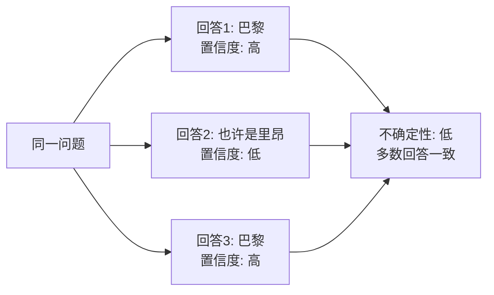
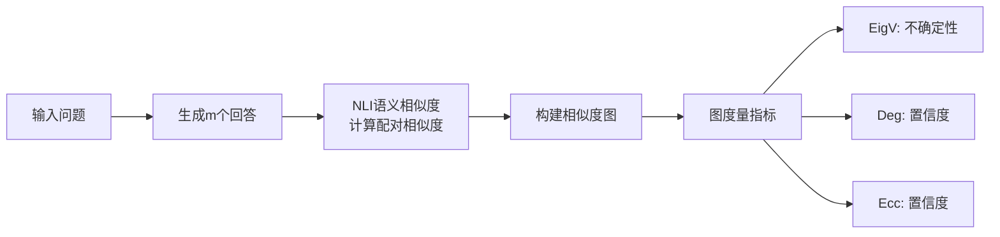

# Generating with Confidence: Uncertainty Quantification for Black-box Large Language Models

**论文信息**
- 论文标题：Generating with Confidence: Uncertainty Quantification for Black-box Large Language Models
- 中文标题：带置信度生成：黑盒大语言模型的不确定性量化
- 作者：Zhen Lin, Shubhendu Trivedi, Jimeng Sun
- 机构：University of Illinois Urbana-Champaign
- arXiv: [2305.19187](https://arxiv.org/abs/2305.19187)
- 发表：TMLR 2024 (ICLR 2025 Journal Track)

---

## 一、论文整体思路

### 1.1 研究背景

随着 GPT-4、Claude 等闭源 LLM 的普及，用户通常只能通过 API 访问模型输出，无法获取内部 logits 或隐藏状态。传统 UQ 方法大多假设白盒访问，这在实际部署中越来越不现实。

### 1.2 核心问题

**黑盒场景下的UQ挑战**：
- 无法获取Token级概率
- 无法访问模型内部状态
- 只能观察到生成的文本输出

### 1.3 主要贡献

1. **区分不确定性与置信度**：明确不确定性（响应无关的分散度）和置信度（响应特定的可靠度）的概念差异
2. **基于图的UQ方法**：利用NLI语义相似度构建图，提出三种图度量指标
3. **黑盒超越白盒**：NLI语义方法在多个基准上超越白盒基线

---

## 二、核心概念：不确定性与置信度

### 2.1 概念区分

| 概念 | 定义 | 特点 | 示例 |
|------|------|------|------|
| **不确定性** | 对固定输入，潜在预测的分散程度 | 响应无关 | 模型对问题的整体不确定程度 |
| **置信度** | 对特定预测/生成的信心 | 响应特定 | 对某个具体回答的信心 |

### 2.2 为什么需要区分



- 不确定性衡量整体分散度，无法区分单个回答的质量
- 置信度可以区分不同回答的可靠性

---

## 三、核心方法：基于图的UQ

### 3.1 方法概述



### 3.2 相似度计算

使用 NLI 模型（DeBERTa-large-mnli）计算语义相似度：

| 相似度函数 | 说明 | 效果 |
|-----------|------|------|
| **NLI蕴含** (a_NLI,entail) | 使用NLI蕴含分数作为相似度 | **最佳** |
| NLI矛盾 | 使用NLI矛盾分数（反向） | 中等 |
| Jaccard相似度 | 词汇级别的交集/并集 | 较差 |

### 3.3 图构建与度量

**图构建**：将 m 个回答作为节点，相似度作为边权重，构建相似度图 G。

**三种图度量指标**：

#### EigV（特征值）—— 不确定性度量

基于相似度图的谱性质：

$$\text{EigV} = \sum_{i} \lambda_i$$

其中 $\lambda_i$ 是图归一化拉普拉斯矩阵的特征值。

- 高 EigV → 回答分散 → 高不确定性
- 低 EigV → 回答一致 → 低不确定性

#### Deg（度）—— 置信度度量

基于节点度数：

$$\text{Deg}(v_i) = \sum_{j} w_{ij}$$

- 高度数 → 该回答被其他回答语义支持 → 高置信度
- 低度数 → 该回答孤立 → 低置信度

#### Ecc（离心率）—— 置信度度量

基于节点离心率：

$$\text{Ecc}(v_i) = \max_{j} d(v_i, v_j)$$

- 低离心率 → 该回答靠近图中心 → 高置信度
- 高离心率 → 该回答远离其他回答 → 低置信度

### 3.4 算法伪代码

```python
def blackbox_uq(model, question, m=5):
    # Step 1: 生成m个回答
    responses = [model.generate(question) for _ in range(m)]

    # Step 2: 计算NLI蕴含相似度矩阵
    S = np.zeros((m, m))
    for i in range(m):
        for j in range(m):
            if i != j:
                S[i][j] = nli_entail(responses[i], responses[j])

    # Step 3: 构建图并计算度量
    # 不确定性: EigV
    L = np.diag(S.sum(axis=1)) - S  # 拉普拉斯矩阵
    D_norm = np.diag(1.0 / np.sqrt(S.sum(axis=1)))
    L_norm = D_norm @ L @ D_norm
    eigv = np.sum(np.linalg.eigvalsh(L_norm))

    # 置信度: Deg
    deg = S.sum(axis=1)  # 每个回答的置信度

    # 置信度: Ecc
    dist = floyd_warshall(1 - S)  # 最短路径
    ecc = dist.max(axis=1)  # 每个回答的离心率

    return eigv, deg, ecc  # 不确定性, 置信度, 置信度
```

---

## 四、实验结果

### 4.1 实验设置

| 模型 | 类型 | 说明 |
|------|------|------|
| ChatGPT (gpt-3.5-turbo) | 闭源 | 黑盒API |
| GPT-4 | 闭源 | 黑盒API |
| LLaMA | 开源 | 对照组 |
| Vicuna | 开源 | 对照组 |

| 数据集 | 任务类型 |
|--------|---------|
| TriviaQA | 事实问答 |
| CoQA | 对话式问答 |

### 4.2 主要结果

**关键发现1：NLI蕴含相似度效果最佳**

| 相似度函数 | AUROC (TriviaQA) | AUROC (CoQA) |
|-----------|-----------------|-------------|
| Jaccard | 0.72 | 0.68 |
| NLI矛盾 | 0.76 | 0.73 |
| **NLI蕴含** | **0.82** | **0.79** |

**关键发现2：少量采样即可有效**

| 采样数 m | EigV性能 | Deg性能 |
|---------|---------|---------|
| m=3 | 良好 | 良好 |
| m=5 | 较好 | 较好 |
| m=10 | 最佳 | 最佳 |

仅需 m=3 个生成即可获得良好的UQ效果。

**关键发现3：黑盒方法可超越白盒基线**

| 方法类型 | 方法 | AUROC |
|---------|------|-------|
| 白盒 | Token概率 | 0.71 |
| 白盒 | 预测熵 | 0.75 |
| **黑盒** | **EigV + NLI** | **0.82** |
| **黑盒** | **Deg + NLI** | **0.84** |

### 4.3 不确定性 vs 置信度

| 场景 | 推荐度量 | 原因 |
|------|---------|------|
| 整体问题难度评估 | EigV（不确定性） | 不需要区分单个回答 |
| 选择性生成/过滤 | Deg/Ecc（置信度） | 需要评估特定回答的可靠性 |

---

## 五、选择性NLG应用

### 5.1 应用框架

```
输入问题
  ↓
生成多个回答 + UQ度量
  ↓
置信度阈值判断
  ├── 高置信度 → 直接输出
  ├── 中置信度 → 提示用户确认
  └── 低置信度 → 转交人工/拒绝回答
```

### 5.2 覆盖率-准确率权衡

| 置信度阈值 | 覆盖率 | 准确率 |
|-----------|--------|--------|
| 0.3 | 95% | 65% |
| 0.5 | 80% | 78% |
| 0.7 | 60% | 88% |
| 0.9 | 30% | 95% |

---

## 六、关键见解与总结

### 6.1 核心结论

1. **黑盒不意味着无能为力**：NLI语义方法可超越白盒基线
2. **相似度选择是关键**：NLI蕴含 > NLI矛盾 > Jaccard
3. **少量采样足够**：m=3 即可获得良好效果
4. **不确定性和置信度应区分使用**

### 6.2 局限性

- 依赖外部NLI模型（引入额外误差和开销）
- 需要多次生成（API成本增加）
- 主要在QA任务上验证，开放式生成待验证
- 不解决校准问题（关注排序而非绝对校准）

### 6.3 未来方向

- 结合分布无关的校准方法
- 扩展到更长的开放式生成
- 减少所需采样次数
- 探索不确定性与置信度度量的交互

---

## 参考资源

- 论文链接: https://arxiv.org/abs/2305.19187
- 相关论文: "Semantic Uncertainty" (2302.09664) — 语义聚类思路的关联
- 相关论文: "LM-Polygraph" (2406.15627) — UQ方法基准对比

---

*文档创建日期：2026年4月29日*
*论文来源：arXiv:2305.19187, TMLR 2024*
