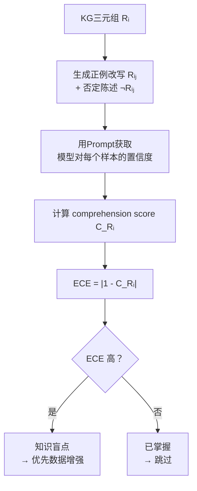

# GraphGen: ECE驱动的知识盲点定位与合成数据生成

**论文信息**
- 论文标题：GraphGen: Enhancing Supervised Fine-Tuning for LLMs with Knowledge-Driven Synthetic Data Generation
- 中文标题：GraphGen：基于知识图谱引导的LLM监督微调合成数据增强
- 作者：Zihong Chen, Wanli Jiang, Jinzhe Li, Zhonghang Yuan, Huanjun Kong, Wanli Ouyang, Nanqing Dong
- 机构：Shanghai Artificial Intelligence Laboratory, Shanghai Innovation Institute, The Chinese University of Hong Kong
- arXiv: [2505.20416](https://arxiv.org/abs/2505.20416)
- 代码：[GitHub](https://github.com/open-sci/GraphGen)

> **本文档仅聚焦 ECE 相关内容**，即论文中如何利用 ECE 定位 LLM 知识盲点并指导合成数据生成。论文的 KG 构建、k-hop 子图采样、风格控制生成等非 ECE 内容不做详述。

---

## 一、ECE 在 GraphGen 中的角色

### 1.1 核心思路

GraphGen 利用 ECE 作为**知识盲点检测器**：

```
传统 ECE 用途：评估模型整体校准质量
    ↓ 转化
GraphGen 中的 ECE：定位模型对每个具体知识点的掌握程度
```

将 ECE 从**全局评估指标**转变为**逐三元组的诊断工具**，用于识别模型在哪些知识点上置信度与实际能力不匹配。

### 1.2 问题定义

在知识图谱（KG）中，每条边对应一个三元组 $(h, r, t)$，其文本描述可视为一个声明 $s$，该声明在现实中为真，即 $P_{\text{real}}(s) = 1$。

**理想情况**：若模型真正理解该知识点，其对 $s$ 的预测置信度应接近1。
**实际情况**：模型对某些知识点过度自信（高置信但实际不懂）或欠自信（低置信但实际掌握）。

ECE 正是用来衡量这种"置信度与真实概率不匹配"的度量。

### 1.3 论文对 ECE 概念的说明

论文引用 Guo et al. (2017) 的 ECE 原则，并将其适配到 LLM 知识掌握的场景：

**ECE 的核心原则**（传统定义）：

> 一个模型被认为是校准良好的，如果其预测置信度（即 softmax 概率）与真实正确概率一致。

即：当模型说"90%确信"时，该预测在实际中应有约90%的概率是正确的。

**GraphGen 对 ECE 概念的转化**：

论文将上述原则从**模型-样本对**的校准评估，转化为**模型-知识点对**的掌握度评估：

| 维度 | 传统 ECE 概念 | GraphGen 的 ECE 概念 |
|------|-------------|-------------------|
| 校准的含义 | 置信度与准确率一致 | 置信度与真实概率一致 |
| "真实概率"来源 | 数据集标签（0或1） | 知识先验（KG三元组为真，$P=1$） |
| "置信度"来源 | softmax输出 | 正例+否定样本的综合判断 |
| 概念转化 | 模型整体校准 → 标量 | 模型对某知识点校准 → 逐点得分 |

**论文的关键推理**：

> 对于 LLM，对一个概念的真正理解，只有在模型的置信度估计与现实正确概率匹配时才实现。

因此，若 KG 中某三元组为真（$P=1$），而模型对其置信度 $C_{R_i}$ 偏离1，则存在"理解损失"（comprehension loss），即 ECE。这一概念转化使得 ECE 可以精确定位模型在**哪个具体知识点**上理解不足，而非仅给出整体校准质量的标量评估。

---

## 二、ECE 驱动的知识盲点检测

### 2.1 方法流程



### 2.2 生成正负样本

对 KG 中每条边的声明 $R_i$，使用 LLM 生成 $n$ 个正例改写和 $n$ 个否定陈述：

```
原始声明 Rᵢ: "巴黎是法国的首都"
  ├── 正例改写 Rᵢ₁: "法国的首都城市是巴黎"
  ├── 正例改写 Rᵢ₂: "巴黎作为法国的政治中心"
  ├── 否定陈述 ¬Rᵢ₁: "巴黎不是法国的首都"
  └── 否定陈述 ¬Rᵢ₂: "法国的首都是里昂"
```

### 2.3 置信度引出

使用同一个 Prompt 对所有样本问"正确的概率"：

```
陈述: {statement}
这个陈述正确的概率是多少？（0%-100%）
```

**模型输出**（即"正确的概率"）：

| 样本 | 陈述内容 | 实际真假 | 模型**应该**输出 | 模型**不理解时**可能输出 |
|------|---------|---------|----------------|---------------------|
| $R_{i1}$ | "法国的首都城市是巴黎" | 真 | 接近100% | 偏低（如60%） |
| $R_{i2}$ | "巴黎作为法国的政治中心" | 真 | 接近100% | 偏低（如50%） |
| $\neg R_{i1}$ | "巴黎不是法国的首都" | 假 | 接近0% | 偏高（如40%） |
| $\neg R_{i2}$ | "法国的首都是里昂" | 假 | 接近0% | 偏高（如30%） |

### 2.4 计算理解得分（Comprehension Score）

论文将模型对正例的"正确判断能力"和对否定的"错误识别能力"统一为一个得分：

$C_{R_i} = \frac{1}{2n}\left(\sum_{j=1}^{n} \underbrace{P(t|R_{ij})}_{\text{正例→判为正确}} + \sum_{j=1}^{n} \underbrace{P(f|\neg R_{ij})}_{\text{否定→判为错误}}\right)$

其中 $P(f|\neg R_{ij}) = 1 - P(\text{正确}|\neg R_{ij})$（将"正确的概率"取反得到"错误的概率"）。

**用上面的示例计算**（$n=2$）：

```
P(t|Rᵢ₁) = 0.60    (模型说正例1有60%正确)
P(t|Rᵢ₂) = 0.50    (模型说正例2有50%正确)
P(正确|¬Rᵢ₁) = 0.40 → P(f|¬Rᵢ₁) = 1 - 0.40 = 0.60
P(正确|¬Rᵢ₂) = 0.30 → P(f|¬Rᵢ₂) = 1 - 0.30 = 0.70

C_Rᵢ = (0.60 + 0.50 + 0.60 + 0.70) / (2×2) = 2.40 / 4 = 0.60
```

**对比：模型完全理解时**：

```
P(t|Rᵢ₁) = 0.95, P(t|Rᵢ₂) = 0.95
P(正确|¬Rᵢ₁) = 0.05 → P(f|¬Rᵢ₁) = 0.95
P(正确|¬Rᵢ₂) = 0.03 → P(f|¬Rᵢ₂) = 0.97

C_Rᵢ = (0.95 + 0.95 + 0.95 + 0.97) / 4 = 0.955
```

| 场景 | $C_{R_i}$ | 含义 |
|------|-----------|------|
| 模型不理解 | 0.60 | 对正例欠自信 + 对否定不敏感 |
| 模型理解 | 0.955 | 对正例高置信 + 对否定敏锐拒绝 |
| 理想极限 | 1.0 | 完美区分真假 |

**核心直觉**：$C_{R_i}$ 衡量的是"模型答对的能力"——对真陈述能判真，对假陈述能判假，两者都答对才算真正理解。

### 2.5 ECE 计算（Comprehension Loss）

KG 中三元组为真，真实概率 $P(R_i) = 1$，模型置信度为 $C_{R_i}$，则：

$\text{ECE}(R_i) = |1 - C_{R_i}|$

论文称之为 **comprehension loss**（理解损失）：

| 场景 | $C_{R_i}$ | $\text{ECE}(R_i)$ | 含义 |
|------|-----------|-------------------|------|
| 模型理解 | 0.955 | 0.045 | 几乎无理解损失 |
| 模型不理解 | 0.60 | 0.40 | 理解损失大 → 知识盲点 |
| 理想极限 | 1.0 | 0 | 完全理解 |

- $\text{ECE} \approx 0$：模型对该知识点掌握良好
- $\text{ECE}$ 高：模型对该知识点存在盲点，需要补充训练数据

消融实验验证：训练于高 comprehension loss 数据的模型性能优于随机选择或低 loss 数据，说明 ECE 驱动的选择策略有效定位了长尾知识盲点。

---

## 三、ECE 驱动的数据增强策略

### 3.1 高 ECE 优先

```
所有KG三元组
    ↓ 计算每个三元组的ECE
    ↓ 按ECE降序排序
高ECE三元组 → 模型未掌握的知识点
    ↓ 优先选择这些三元组
    ↓ k-hop邻域子图采样
    ↓ 风格控制生成QA对
合成训练数据
```

### 3.2 ECE 与长尾知识

高 ECE 的三元组通常对应**长尾知识**——训练数据中罕见的知识点：

| ECE 水平 | 知识类型 | 典型特征 |
|---------|---------|---------|
| 低 ECE | 常见知识 | 模型在预训练中见过多次 |
| 中 ECE | 中频知识 | 部分掌握，偶有错误 |
| **高 ECE** | **长尾知识** | 训练数据稀缺，模型掌握不足 |

通过优先选择高 ECE 三元组，GraphGen 将数据增强资源集中在模型最需要的知识点上，避免在已知知识上浪费计算。

### 3.3 与传统 ECE 用法的对比

| 维度 | 传统 ECE 用法 | GraphGen 中的 ECE |
|------|-------------|-----------------|
| **粒度** | 全局/分桶级 | 逐三元组级 |
| **目的** | 评估模型整体校准质量 | 定位具体知识盲点 |
| **用途** | 诊断/报告 | 指导数据生成 |
| **输入** | 模型预测 + 真实标签 | 正例改写 + 否定陈述 |
| **输出** | 标量校准误差 | 优先级排序 |
| **后续动作** | 人工分析 | 自动数据增强 |

---

## 四、ECE 模块的实现

### 4.1 伪代码

```python
def ece_driven_blind_spot_detection(kg, model, n_paraphrases=5):
    """ECE驱动的知识盲点检测"""
    ece_scores = {}

    for triple in kg.triples:
        s = triple_to_statement(triple)  # 三元组转声明

        # Step 1: 生成正例改写和否定陈述
        positives = generate_paraphrases(model, s, n=n_paraphrases)
        negatives = generate_negations(model, s, n=n_paraphrases)

        # Step 2: 获取模型置信度（Prompt问"正确的概率"）
        pos_confs = [ask_prob_correct(model, p) for p in positives]
        neg_confs_raw = [ask_prob_correct(model, n) for n in negatives]
        neg_confs = [1 - p for p in neg_confs_raw]  # 取反：正确概率→错误概率

        # Step 3: 计算理解得分 (comprehension score)
        # 正例判断正确的概率 + 否定判断错误的概率，取平均
        comprehension = (
            sum(pos_confs) + sum(neg_confs)
        ) / (2 * n_paraphrases)

        # Step 4: 计算ECE（真实概率=1）
        ece_scores[triple] = abs(1.0 - comprehension)

    # 按ECE降序排序，高ECE = 知识盲点
    ranked_triples = sorted(
        ece_scores.items(), key=lambda x: x[1], reverse=True
    )

    return ranked_triples
```

### 4.2 计算开销

| 步骤 | 开销 | 说明 |
|------|------|------|
| 正负样本生成 | $O(|E| \times n)$ | $|E|$ 为KG边数，$n$ 为每条边的样本数 |
| 置信度引出 | $O(|E| \times 2n)$ | 每个样本需一次模型推理 |
| ECE 计算 | $O(|E|)$ | 简单的算术运算 |

---

## 五、关键见解

### 5.1 ECE 的新用法

GraphGen 的核心创新不在于 ECE 公式本身，而在于**将 ECE 从评估工具转变为数据生成指导工具**：

```
传统流程：训练 → 评估ECE → 人工分析 → 调整
GraphGen流程：评估ECE → 自动定位盲点 → 自动生成数据 → 训练
```

### 5.2 正负样本策略

通过同时使用正例改写和否定陈述来评估置信度：
- 仅用正例：模型可能对改写形式欠自信但理解语义
- 加入否定：检验模型是否能区分真假，避免"盲目高自信"
- 取平均：综合衡量模型对知识点的真正掌握程度

### 5.3 局限性

- **成本较高**：每个三元组需生成多组正负样本并多次推理
- **依赖 Prompt 设计**：置信度引出的质量受 Prompt 影响
- **简化假设**：将真实概率统一设为1，忽略知识的模糊性
- **三元组粒度**：以单个三元组为评估单位，可能忽略组合知识

---

## 参考资源

- 论文链接: https://arxiv.org/abs/2505.20416
- 代码仓库: https://github.com/open-sci/GraphGen
- ECE 基础理论: [On Calibration of Modern Neural Networks](/traditional-ml/model-selection/evaluation-metrics/papers/On_Calibration_Modern_NN_1706.04599.md) (ICML 2017)

---

*文档创建日期：2026年4月29日*
*论文来源：arXiv:2505.20416*
