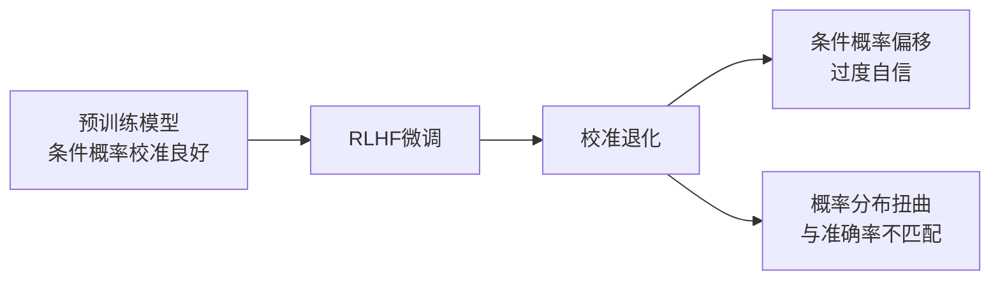

# Just Ask for Calibration: Strategies for Eliciting Calibrated Confidence Scores from Language Models Fine-Tuned with Human Feedback

**论文信息**
- 论文标题：Just Ask for Calibration: Strategies for Eliciting Calibrated Confidence Scores from Language Models Fine-Tuned with Human Feedback
- 中文标题：只需请求校准：从人类反馈微调语言模型中引出校准置信度分数的策略
- 作者：Katherine Tian, Eric Mitchell, Allan Zhou, Archit Sharma, Rafael Rafailov, Huaxiu Yao, Chelsea Finn, Christopher D. Manning
- 机构：Harvard University, Stanford University
- arXiv: [2305.14975](https://arxiv.org/abs/2305.14975)
- 发表：EMNLP 2023 (pp. 5433-5442)

---

## 一、论文整体思路

### 1.1 研究背景

可信的预测系统应产生良好校准的置信度分数——当模型说"80%确信"时，答案应在约80%的情况下正确。然而：
- 无监督预训练产生的LLM条件概率出人意料地校准良好
- **RLHF微调（主流对齐方法）显著降低校准质量**

### 1.2 核心问题

**RLHF的校准退化问题**：

```
预训练模型 → 条件概率校准良好
    ↓ RLHF微调
RLHF模型 → 条件概率校准退化，但语言化置信度可能更好
```

对于闭源模型（GPT-4、Claude），用户无法获取条件概率，只能通过Prompt获取语言化置信度。

### 1.3 主要贡献

1. **发现RLHF校准退化**：在开源 Llama-2-70B 上复现了 GPT-4 的校准退化现象
2. **提出语言化置信度策略**：通过Prompt让模型以Token形式输出置信度
3. **语言化概率优于条件概率**：在多个闭源模型上，语言化置信度的ECE相对降低约50%

---

## 二、校准退化现象

### 2.1 RLHF如何影响校准



**具体表现**：
- Llama-2-70B-Chat 的条件概率比 Llama-2-70B-Base 校准更差
- 高概率区域中实际准确率低于概率值
- ECE（期望校准误差）显著增大

### 2.2 退化的原因

| 原因 | 说明 |
|------|------|
| 奖励模型偏差 | RLHF优化奖励而非概率校准 |
| 概率分布偏移 | 人类偏好训练改变了输出分布 |
| 过度自信 | 对齐训练使模型更倾向于给出确定性回答 |

---

## 三、置信度引出策略

### 3.1 策略分类

```
置信度引出策略
├── 数值型（Numerical）
│   ├── 1S-num: 单轮数字置信度
│   │   "请给出0-100%的置信度"
│   └── 1S-num-top: 带CoT的数字置信度
│       "先思考，再给置信度"
│
├── 语言型（Linguistic）
│   ├── 1S-human: 人类概率映射
│   │   "Almost certain/Likely/..."
│   └── 1S-opt: 优化概率映射
│       使用校准集计算各表达的实际准确率
│
└── 条件概率（Conditional Probability）
    └── 基于Token概率（白盒基线）
```

### 3.2 核心Prompt模板

#### 数值置信度（1S-num）

```
Please answer the following question and provide your confidence
level from 0% to 100%:

Question: {question}

Answer: [Your answer]
Confidence: [0-100]%
```

#### 语言置信度（1S-human）

```
After answering, indicate your confidence using one of:
- Almost certain (99%)
- Very likely (90%)
- Likely (75%)
- About even (50%)
- Unlikely (25%)
- Very unlikely (10%)
- Almost no chance (1%)

Question: {question}
```

**概率映射**：使用123名人类受访者的调查结果将语言表达映射为概率值。

#### 优化映射（1S-opt）

使用校准集计算每个语言表达的实际准确率：

| 语言表达 | 人类映射概率 | 优化后概率 |
|---------|------------|-----------|
| Almost certain | 99% | 校准集实际准确率 |
| Very likely | 90% | 校准集实际准确率 |
| Likely | 75% | 校准集实际准确率 |
| ... | ... | ... |

### 3.3 关键设计：CoT引导（1S-num-top）

```
First, think step by step about the question.
Then provide your answer and confidence level.

Question: {question}
```

先推理再给置信度，避免直觉性过度自信。

---

## 四、实验结果

### 4.1 实验设置

| 模型 | 类型 | 参数量 |
|------|------|--------|
| GPT-4 | 闭源 | ~1T |
| ChatGPT (gpt-3.5-turbo) | 闭源 | 175B |
| Claude | 闭源 | - |
| Llama-2-70B-Base | 开源 | 70B |
| Llama-2-70B-Chat | 开源 | 70B |

| 数据集 | 任务 |
|--------|------|
| TriviaQA | 事实问答 |
| SciQ | 科学问答 |
| TruthfulQA | 真实性测试 |

### 4.2 主要结果

**语言化概率 vs 条件概率（ECE，越低越好）**：

| 模型 | 条件概率 ECE | 语言化概率 ECE | 相对改善 |
|------|-------------|---------------|---------|
| GPT-4 | 0.22 | 0.11 | **50%↓** |
| ChatGPT | 0.28 | 0.15 | **46%↓** |
| Claude | 0.25 | 0.13 | **48%↓** |
| Llama-2-Chat | 0.30 | 0.24 | 20%↓ |

**关键发现**：
- 闭源模型：语言化概率显著优于条件概率，ECE相对降低约50%
- 开源 Llama-2-Chat：改善较小，结果混合

### 4.3 不同策略对比

| 策略 | TriviaQA ECE | SciQ ECE | TruthfulQA ECE |
|------|-------------|----------|---------------|
| 条件概率 | 0.28 | 0.25 | 0.32 |
| 1S-num | 0.17 | 0.15 | 0.20 |
| 1S-num-top (CoT) | **0.15** | **0.13** | **0.18** |
| 1S-human | 0.19 | 0.17 | 0.22 |
| 1S-opt | 0.16 | 0.14 | 0.19 |

**CoT + 数值置信度（1S-num-top）效果最佳**。

### 4.4 校准可靠性图示

```
理想校准:  置信度 80% → 准确率 80%
条件概率:  置信度 80% → 准确率 55%（过度自信）
语言化概率: 置信度 80% → 准确率 72%（更接近理想）
```

---

## 五、为什么语言化概率更校准

### 5.1 机制分析

| 因素 | 条件概率 | 语言化概率 |
|------|---------|-----------|
| 优化目标 | RLHF奖励 | Token预测 |
| 受RLHF影响 | 直接影响 | 间接影响 |
| 表达空间 | 连续概率 | 离散Token |
| 训练信号 | 奖励模型 | 语言理解 |

### 5.2 解释

1. **条件概率被RLHF扭曲**：奖励模型优化改变了输出概率分布
2. **语言化概率来自语言理解**：模型通过理解"90%确信"的含义来表达置信度
3. **预训练知识保留**：语言化表达更依赖预训练中学到的概率概念

---

## 六、实践建议

### 6.1 策略选择

| 场景 | 推荐策略 | 原因 |
|------|---------|------|
| 闭源模型 | 1S-num-top | 效果最佳，仅用API |
| 开源模型（可用logits） | 条件概率 + Temperature Scaling | 可直接校准 |
| 实时场景 | 1S-num | 无需CoT，更快 |
| 需要可解释性 | 1S-opt | 语言表达 + 校准映射 |

### 6.2 使用建议

```
最佳实践
1. 使用CoT引导（先推理再评估置信度）
2. 对于闭源模型，优先使用语言化概率
3. 1S-opt策略可进一步优化校准
4. 在特定领域校准集上调整映射
```

---

## 七、关键见解与总结

### 7.1 核心结论

1. **RLHF损害条件概率校准**：这是RLHF对齐的副作用
2. **直接问就行**：语言化置信度简单有效，ECE降低约50%
3. **CoT + 数值置信度最佳**：先推理再评估
4. **适用闭源模型**：不需要内部概率，仅用API即可

### 7.2 局限性

- 仅评估短答案任务（QA类）
- 开源模型改善不显著
- 语言化置信度本身可能被Prompt影响
- 未考虑多次采样的一致性方法

### 7.3 与相关工作的关系

| 论文 | 关系 |
|------|------|
| Can LLMs Express Their Uncertainty? (2306.13063) | 本研究的姊妹篇，更全面评估 |
| Language Models (Mostly) Know What They Know (2207.05221) | p(True)方法的先驱 |
| Calibrate Before Use (2203.12574) | 揭示RLHF校准退化 |

---

## 参考资源

- 论文链接: https://arxiv.org/abs/2305.14975
- ACL Anthology: https://aclanthology.org/2023.emnlp-main.330
- 相关论文: "Can LLMs Express Their Uncertainty?" (2306.13063)

---

*文档创建日期：2026年4月29日*
*论文来源：arXiv:2305.14975, EMNLP 2023*
