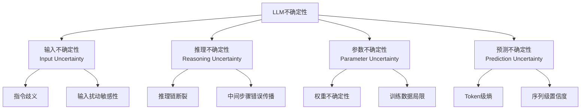

# Uncertainty Quantification and Confidence Calibration in Large Language Models: A Survey

**论文信息**
- 论文标题：Uncertainty Quantification and Confidence Calibration in Large Language Models: A Survey
- 中文标题：大语言模型的不确定性量化与置信度校准综述
- 作者：Xiaoou Liu, Tiejin Chen, Longchao Da, Chacha Chen, Zhen Lin, Hua Wei
- 机构：Arizona State University, University of Illinois Urbana-Champaign
- arXiv: [2503.15850](https://arxiv.org/abs/2503.15850)
- 发表：KDD 2025 (pp. 6107-6117)

---

## 一、论文整体思路

### 1.1 研究背景

LLM 在高风险场景（医疗、交通、机器人、教育）中被广泛部署，但其输出的可靠性难以保证。传统的不确定性分类（认知/偶然二分法）不足以描述 LLM 特有的不确定性来源。

### 1.2 核心问题

LLM 引入了独特的不确定性来源：
- 输入歧义性：指令不明确或可被多重解读
- 推理路径分歧：多步推理中链路断裂，约占多步QA错误的58%
- 解码随机性：采样策略导致的生成多样性
- 参数局限性：训练数据覆盖不足

传统的认知/偶然二分法无法充分刻画这些维度。

### 1.3 主要贡献

1. **四维不确定性分类法**：首次提出按输入、推理、参数、预测四个维度系统组织 LLM 不确定性
2. **系统方法综述**：按四个维度梳理现有 UQ 方法
3. **校准方法综述**：覆盖温度缩放、分箱方法、语言化置信度等
4. **应用场景梳理**：涵盖机器人、交通、医疗、教育四个领域

---

## 二、四维不确定性分类法

### 2.1 分类框架



### 2.2 各维度详解

| 维度 | 来源 | 典型场景 | 对应方法 |
|------|------|---------|---------|
| **输入不确定性** | 指令歧义、输入变异 | 同一问题的不同表述产生不同结果 | Prompt扰动、释义方法 |
| **推理不确定性** | 推理路径分歧、中间错误 | 多步推理中步骤出错导致最终错误 | CoT-UQ、步骤级置信度、SAR |
| **参数不确定性** | 权重不确定性、知识边界 | 模型对某些知识缺乏训练 | MC Dropout、贝叶斯方法、集成 |
| **预测不确定性** | 生成多样性、解码随机 | 同一输入产生不同输出 | 预测熵、语义熵、Token级熵 |

### 2.3 与传统分类的关系

每个维度都可能同时包含认知不确定性和偶然不确定性：

| 维度 | 认知不确定性 | 偶然不确定性 |
|------|------------|------------|
| 输入 | 训练数据中缺少类似指令 | 指令本身存在固有歧义 |
| 推理 | 缺乏该推理路径的训练 | 推理问题本身有多个合理路径 |
| 参数 | 权重估计不充分 | 模型容量有限 |
| 预测 | 对输出分布估计不精确 | 生成任务固有多样性 |

---

## 三、UQ 方法体系

### 3.1 输入不确定性方法

**Prompt扰动法**：通过改变输入表述观察输出变化

```python
def input_uq(model, question, n_perturbations=5):
    """通过输入扰动估计输入不确定性"""
    perturbations = perturb_question(question, n=n_perturbations)
    answers = [model.generate(q) for q in perturbations]
    # 语义一致性
    consistency = semantic_consistency(answers)
    uncertainty = 1 - consistency
    return uncertainty
```

### 3.2 推理不确定性方法

**CoT-UQ（Chain-of-Thought UQ）**：逐步评估推理链的可靠性

```
推理链不确定性评估流程：
问题 → 步骤1(置信度0.95) → 步骤2(置信度0.87) → 步骤3(置信度0.62) → 最终答案
                                                                    ↑
                                                            不确定性来源定位
```

**SAR（Semantic Awareness with Reasoning）**：结合语义感知的推理不确定性估计

### 3.3 参数不确定性方法

| 方法 | 原理 | 优点 | 缺点 |
|------|------|------|------|
| MC Dropout | 推理时保留Dropout多次前向 | 简单实现 | 需要修改模型 |
| 贝叶斯方法 | 对权重进行后验推断 | 理论完备 | 计算昂贵 |
| 深度集成 | 多模型预测一致性 | 效果最好 | 训练成本高 |

### 3.4 预测不确定性方法

| 方法 | 粒度 | 特点 |
|------|------|------|
| Token级熵 | 细粒度 | 每个Token的概率熵 |
| 序列似然 | 序列级 | 整个输出的联合概率 |
| 语义熵 | 语义级 | 考虑语义等价（核心方法） |
| p(True) | 全局 | 自我判断正确性 |

---

## 四、校准方法

### 4.1 方法分类

```
校准方法
├── 后处理方法
│   ├── Temperature Scaling：单参数温度调整
│   ├── Platt Scaling：逻辑回归校准
│   ├── Isotonic Regression：保序回归
│   └── 分箱方法：Histogram Binning
│
├── 语言化方法
│   ├── Verbalized Confidence：直接询问置信度
│   ├── p(True)：自我判断
│   └── Linguistic Likelihood：语言概率表达
│
└── 训练时方法
    ├── LACIE：听众感知微调
    ├── 校准损失函数
    └── Focal Loss变体
```

### 4.2 校准评估指标

| 指标 | 公式/说明 | 适用场景 |
|------|---------|---------|
| ECE | 加权分箱校准误差 | 分类/选择任务 |
| Brier Score | 均方概率误差 | 概率预测 |
| NLL | 负对数似然 | 概率质量评估 |
| AUROC | 预测准确性的区分能力 | 不确定性排序 |

---

## 五、应用场景

### 5.1 机器人

- 运动规划中的不确定性感知
- 抓取任务中的置信度引导
- 人机交互中的安全决策

### 5.2 交通

- 自动驾驶中的场景理解不确定性
- 路径规划的风险评估
- 多智能体交通的碰撞预测

### 5.3 医疗

- 诊断建议的置信度校准
- 药物交互的风险量化
- 医疗问答的幻觉检测

### 5.4 教育

- 知识评估的不确定性感知
- 自适应学习的难度估计
- 答案生成的可靠性标注

---

## 六、关键见解与总结

### 6.1 核心结论

1. **四维框架更全面**：比传统认知/偶然二分法更能描述LLM不确定性
2. **推理不确定性被低估**：约占多步QA错误的58%，但相关方法最少
3. **语义级方法是趋势**：从Token级到语义级的演进
4. **效率-性能权衡**：更准确的方法通常更昂贵

### 6.2 局限性

- 效率-性能权衡：集成等方法计算成本高
- 可解释性不足：UQ估计对终端用户不够直观
- 跨模态缺失：多模态LLM的UQ研究有限
- 评估不统一：缺乏标准化的UQ评估协议
- 干预策略欠缺：如何基于不确定性采取行动的研究不足

### 6.3 未来方向

| 方向 | 说明 |
|------|------|
| 可扩展UQ | 降低多次采样等方法的开销 |
| 跨模态UQ | 视觉-语言模型的联合不确定性 |
| 干预机制 | 基于不确定性信号的人机协作 |
| 标准化评估 | 统一的UQ基准测试协议 |
| Agent UQ | 交互式智能体的不确定性量化 |

---

## 参考资源

- 论文链接: https://arxiv.org/abs/2503.15850
- DOI: 10.1145/3711896.3736569
- KDD 2025 Tutorial: 同主题教程

---

*文档创建日期：2026年4月29日*
*论文来源：arXiv:2503.15850, KDD 2025*
