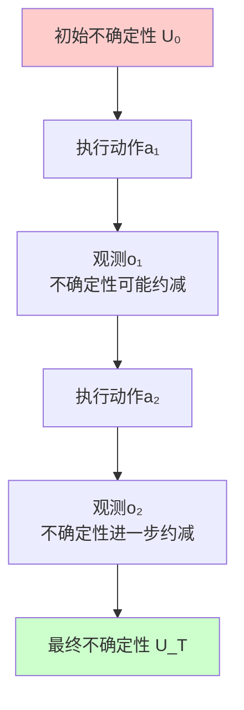
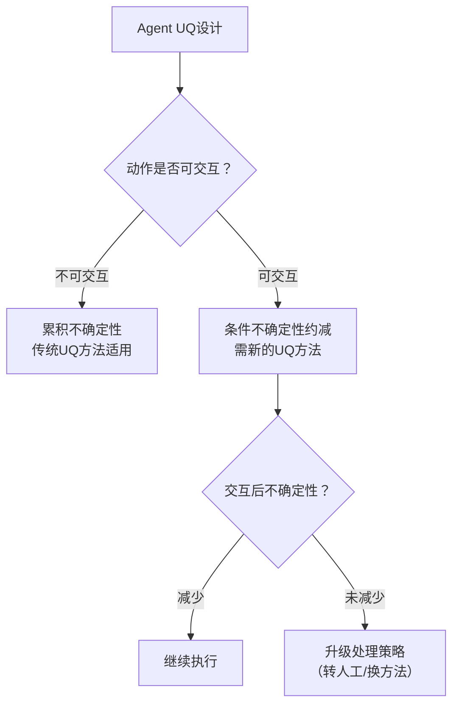

# Uncertainty Quantification in LLM Agents: Foundations, Emerging Challenges, and Opportunities

**论文信息**
- 论文标题：Uncertainty Quantification in LLM Agents: Foundations, Emerging Challenges, and Opportunities
- 中文标题：LLM智能体中的不确定性量化：基础、新兴挑战与机遇
- 作者：Changdae Oh, Seongheon Park, To Eun Kim, Jiatong Li, Wendi Li, Samuel Yeh, Xuefeng Du, Hamed Hassani, Paul Bogdan, Dawn Song, Sharon Li
- 机构：University of Wisconsin-Madison, University of Southern California, UC Berkeley
- arXiv: [2602.05073](https://arxiv.org/abs/2602.05073)
- 发表：ACL 2026 Main Conference

---

## 快速导航

> **适合读者**：研究或开发LLM Agent系统，关注可靠性的研究者/工程师

| 你想了解什么 | 跳转章节 |
|-------------|---------|
| Agent场景有哪些新挑战？ | [二、Agent不确定性的独特性](#二agent不确定性的独特性) |
| 传统UQ方法如何适配？ | [三、UQ方法在Agent中的适配](#三uq方法在agent中的适配) |
| 有哪些解决方案？ | [四、解决方案框架](#四解决方案框架) |
| 未来方向是什么？ | [五、未来方向](#五未来方向) |

**核心贡献**：
1. **Agent UQ分类法**：多步交互、工具调用、环境反馈、多Agent协作
2. **条件不确定性缩减**：基于上下文动态估计不确定性
3. **决策边界分析**：何时信任Agent、何时需要人工干预

---

## 一、论文整体思路

### 1.1 研究背景

LLM Agent 正在被部署到越来越复杂的任务中（代码生成、网络浏览、多步推理），但大多数 UQ 研究仍聚焦于单轮问答场景。Agent 场景引入了全新的不确定性来源：多步交互、工具调用、环境反馈、多Agent协作。

### 1.2 核心问题

**传统UQ框架无法适配Agent场景**：
- 传统方法将UQ视为"不确定性累积过程"
- Agent在开放世界中交互，不确定性不是简单的累积
- 需要新的框架来建模Agent轨迹中的可约减不确定性

### 1.3 主要贡献

1. **通用Agent UQ公式化**：首次提出涵盖广泛现有UQ设置的Agent UQ一般公式
2. **条件不确定性约减视角**：提出从"不确定性累积"到"条件不确定性约减"的新范式
3. **四大技术挑战**：识别Agent UQ的核心技术难题
4. **概念框架**：为设计Agent UQ提供可操作指导

---

## 二、从累积到约减：UQ视角的转变

### 2.1 传统视角：不确定性累积

```
传统UQ框架（适用于单轮QA）
问题 → LLM → 答案
         ↑
    不确定性在此处量化

Agent场景（传统视角失效）
问题 → 步骤1 → 步骤2 → 步骤3 → 答案
  ↓      ↓        ↓        ↓
 u₀    u₁        u₂       u₃
         ↓        ↓        ↓
      U_total = u₁ + u₂ + u₃  （累积？）
```

**累积视角的问题**：
- 忽略步骤间的条件依赖
- 无法刻画交互带来的不确定性变化
- 开放环境中不确定性可能被"约减"

### 2.2 新视角：条件不确定性约减



**核心思想**：
- Agent的动作可能**约减**而非仅**累积**不确定性
- 关键在于动作的"交互性"——可获取新信息来消除不确定性
- 通过显式建模可约减不确定性，指导Agent何时需要交互

### 2.3 两种不确定性类型

| 类型 | 特点 | Agent场景示例 |
|------|------|-------------|
| **不可约减不确定性** | 无法通过交互消除 | 任务本身固有的随机性 |
| **可约减不确定性** | 可通过交互消除 | 指令不明确→追问可消除歧义 |

---

## 三、通用Agent UQ公式化

### 3.1 问题形式化

Agent 在时间步 $t$ 的状态：

$$s_t = (o_1, a_1, o_2, a_2, \ldots, o_t)$$

其中 $o_i$ 为观测，$a_i$ 为动作。

**不确定性量化目标**：

$$U(s_t, a_t) = H(Y | s_t, a_t)$$

即给定当前状态和动作，输出 $Y$ 的条件熵。

### 3.2 统一现有框架

| 现有UQ设置 | Agent UQ的特例 |
|-----------|---------------|
| 单轮QA | 仅有一步，无交互 |
| 多轮对话 | 交互限于对话 |
| CoT推理 | 动作限于推理步骤 |
| 工具使用Agent | 动作包括工具调用 |
| 多Agent系统 | 多个Agent交互 |

### 3.3 可交互动作的关键作用

```
动作类型
├── 不可交互动作（信息保守）
│   ├── 内部推理步骤
│   └── 确定性输出
│   → 不确定性不减少
│
└── 可交互动作（信息获取）
    ├── 搜索查询 → 获取新信息
    ├── 追问用户 → 消除歧义
    └── 工具调用 → 获取精确数据
    → 可约减不确定性
```

---

## 四、四大技术挑战

### 4.1 挑战一：不确定性估计器的选择

**问题**：现有UQ估计器各有弱点，Agent框架放大了这些弱点。

| 估计器 | 单轮QA局限 | Agent场景放大效应 |
|--------|-----------|-----------------|
| 语义熵 | 需要多次采样 | 多步Agent采样成本指数增长 |
| p(True) | 可能不校准 | 长轨迹中误差累积 |
| 自一致性 | 语义等价判断 | 工具输出等价性判断更难 |
| Token概率 | 需要白盒访问 | 闭源API Agent无法使用 |

### 4.2 挑战二：异构实体的不确定性

**问题**：Agent 调用外部实体（搜索、代码执行、数据库），这些实体有不同的底层分布。

```
LLM Agent
  ├── 内部推理 → LLM自身不确定性
  ├── 搜索引擎 → 信息检索不确定性
  ├── 代码执行 → 确定性输出（但代码可能错误）
  ├── 数据库查询 → 数据不完整性
  └── 其他Agent → 异构不确定性

如何统一量化这些不同来源的不确定性？
```

### 4.3 挑战三：交互式系统的不确定性动态

**问题**：传统加权平均式不确定性聚合不适合开放环境中的交互系统。

```
传统聚合（不适用）：
U_total = w₁u₁ + w₂u₂ + ... + wₙuₙ

交互式动态（需要）：
U(s_t) = f(s_{t-1}, a_t, o_t)  ← 不确定性随交互变化
                                      可增可减
```

- 早期小错误可能不可逆地级联传播
- 交互可能消除某些不确定性
- 不同步骤的不确定性存在条件依赖

### 4.4 挑战四：缺乏细粒度基准

**问题**：现有基准以最终结果评估为主，缺乏轨迹级、步骤级的评估。

| 评估粒度 | 现有基准 | 缺失 |
|---------|---------|------|
| 任务级 | 较多 | - |
| 轨迹级 | 极少 | 逐步不确定性标注 |
| 轮次级 | 几乎没有 | 交互轮次的不确定性评估 |
| 动作级 | 无 | 每个动作决策的不确定性 |

---

## 五、概念框架与实践指导

### 5.1 Agent UQ设计框架



### 5.2 实践建议

| Agent类型 | UQ策略 | 估计器选择 |
|-----------|--------|-----------|
| 单步问答 | 传统UQ | 语义熵/p(True) |
| 多步推理 | 步骤级UQ | CoT-UQ + 逐步校准 |
| 工具使用Agent | 条件不确定性约减 | 交互后重新评估 |
| 多Agent系统 | 通信拓扑UQ | 张量分解方法 |

### 5.3 前沿应用

| 领域 | Agent UQ的价值 |
|------|--------------|
| 科学发现 | 量化假设生成的可信度 |
| 医疗决策 | 辅助诊断的不确定性感知 |
| 代码生成 | 检测生成代码的潜在错误 |
| 自主系统 | 安全关键场景的置信度保障 |

---

## 六、关键见解与总结

### 6.1 核心结论

1. **Agent UQ是新问题**：不能简单照搬单轮QA的UQ方法
2. **从累积到约减**：可交互动作使不确定性可被消除，这是Agent UQ的关键特性
3. **四大挑战需新方法**：估计器选择、异构实体、交互动态、细粒度基准
4. **实践需分场景**：不同Agent类型需要不同的UQ策略

### 6.2 与相关工作的关系

| 论文 | 关系 |
|------|------|
| UQ Confidence Calibration LLM Survey (KDD 2025) | LLM UQ基础，Agent是四维框架的新场景 |
| Semantic Uncertainty (ICLR 2023) | 核心UQ方法，但在Agent场景中成本问题突出 |
| Generating with Confidence (TMLR 2024) | 黑盒UQ方法，Agent中API限制更严格 |
| Kirchhof et al. (ICML 2025 Position) | 平行观点：传统认知/偶然二分法在Agent中失效 |

### 6.3 未来方向

| 方向 | 说明 |
|------|------|
| 可交互不确定性建模 | 显式建模动作如何改变不确定性 |
| 细粒度Agent基准 | 轨迹级、步骤级的不确定性评估 |
| 多Agent UQ | Agent间通信和协作的不确定性传播 |
| 人机协作UQ | 基于不确定性的智能人机交接 |

---

## 参考资源

- 论文链接: https://arxiv.org/abs/2602.05073
- 项目页面: 见arXiv论文中的项目链接
- 相关论文: "Position: UQ Needs Reassessment for LLM Agents" (ICML 2025)

---

*文档创建日期：2026年4月29日*
*论文来源：arXiv:2602.05073, ACL 2026*
