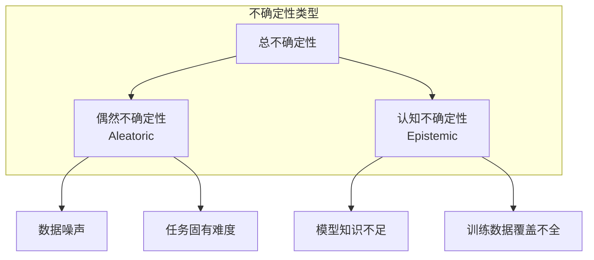

# A Survey of Uncertainty Estimation in LLMs: Theory Meets Practice

**论文信息**
- 论文标题：A Survey of Uncertainty Estimation in LLMs: Theory Meets Practice
- 中文标题：大语言模型不确定性估计综述：理论与实践
- 作者：Hsiu-Yuan Huang, Yutong Yang, Zhaoxi Zhang, Sanwoo Lee, Yunfang Wu
- 机构：Peking University, Seoul National University
- arXiv: [2410.15326](https://arxiv.org/abs/2410.15326)
- 发表时间：2024年10月

---

## 快速导航

> **适合读者**：希望从理论到实践全面了解LLM不确定性的入门者

| 你想了解什么 | 跳转章节 |
|-------------|---------|
| 不确定性有哪些类型？ | [二、不确定性类型](#二不确定性类型) |
| 有哪些估计方法？ | [三、不确定性估计方法](#三不确定性估计方法) |
| 如何选择合适的方法？ | [四、方法选择指南](#四方法选择指南) |
| 实践中有哪些挑战？ | [五、实践挑战](#五实践挑战) |

**核心特点**：理论与实践结合，从数学定义到实际部署，适合入门学习。

---

## 一、论文整体思路

### 1.1 研究背景

大语言模型（LLM）在各种任务中展现出强大能力，但其输出的可靠性仍然是一个关键问题。不确定性估计（Uncertainty Estimation）是评估模型输出可靠性的核心方法，对于高风险应用（医疗、法律、金融）尤为重要。

### 1.2 综述定位

本文是连接理论与实践的桥梁：
- **理论层面**：梳理不确定性的类型、数学定义
- **实践层面**：系统评估各类方法在LLM中的适用性
- **应用层面**：讨论实际部署中的挑战与解决方案

### 1.3 主要贡献

1. **系统性分类**：不确定性类型与方法体系
2. **理论与实践结合**：从数学定义到实际应用
3. **方法对比**：不同方法的优劣分析
4. **实践指南**：针对不同场景的方法选择建议

---

## 二、不确定性类型

### 2.1 经典分类



### 2.2 LLM特有的不确定性来源

| 来源 | 类型 | 描述 | 示例 |
|------|------|------|------|
| **输入歧义** | 偶然 | 问题本身有多种合理解读 | "苹果怎么样？" |
| **知识边界** | 认知 | 训练数据未覆盖 | 2024年以后的事件 |
| **推理链断裂** | 认知 | 多步推理中出错 | 复杂数学问题 |
| **幻觉** | 认知 | 编造虚假信息 | 不存在的事实 |
| **生成多样性** | 偶然 | 同一含义的多种表达 | "是的" vs "对的" |

### 2.3 不确定性的数学表示

**总不确定性**：

$$H(Y|X) = H(Y|X)_{\text{aleatoric}} + H(Y|X)_{\text{epistemic}}$$

**偶然不确定性**（不可约减）：

$$H(Y|X)_{\text{aleatoric}} = \mathbb{E}_{p(y|x)}[-\log p(y|x)]$$

**认知不确定性**（可通过更多数据减少）：

$$H(Y|X)_{\text{epistemic}} = \mathbb{E}_{p(\theta|D)}[D_{KL}(p(y|x,\theta) || p(y|x))]$$

---

## 三、不确定性估计方法

### 3.1 方法分类体系

```
LLM不确定性估计方法
├── 基于概率的方法
│   ├── Token级概率
│   │   ├── 最大概率
│   │   └── Token熵
│   ├── 序列级概率
│   │   ├── 序列概率
│   │   └── 归一化序列概率
│   └── 语义熵
│       └── 考虑语义等价
│
├── 基于采样的方法
│   ├── Self-Consistency
│   ├── Monte Carlo Dropout
│   └── Ensemble
│
├── 基于模型的方法
│   ├── 额外不确定性头
│   ├── 代理模型
│   └── 元学习
│
└── 基于提示的方法
    ├── p(True)
    ├── CoT-UQ
    └── 语言表达置信度
```

### 3.2 核心方法详解

#### 3.2.1 Token级方法

**最大Token概率**：

$$U_{\text{max-prob}} = 1 - \max_{t} p(w_t | w_{<t})$$

**Token熵**：

$$H_t = -\sum_{w \in V} p(w | w_{<t}) \log p(w | w_{<t})$$

**优点**：计算简单，无需额外采样
**缺点**：忽略语义信息

#### 3.2.2 语义熵

$$SE = -\sum_{c} P(C_c) \log P(C_c)$$

其中 $C_c$ 是语义聚类。

**优点**：考虑语义等价
**缺点**：需要NLI模型

#### 3.2.3 Self-Consistency

多次采样，计算答案一致性：

$$U_{\text{sc}} = 1 - \frac{\max_c n_c}{K}$$

其中 $n_c$ 是最常见答案的出现次数，$K$ 是总采样次数。

**优点**：适用于黑盒模型
**缺点**：计算成本高

#### 3.2.4 p(True)

让模型自己判断答案是否正确：

```
问题: {question}
答案: {answer}
这个答案是否正确？回答 True 或 False。
```

**优点**：简单直观
**缺点**：依赖模型的自我评估能力

### 3.3 方法对比

| 方法 | 白盒/黑盒 | 计算成本 | 语义感知 | 推荐场景 |
|------|----------|---------|---------|---------|
| 最大概率 | 白盒 | 低 | 否 | 快速评估 |
| Token熵 | 白盒 | 低 | 否 | Token级分析 |
| 语义熵 | 白盒 | 中 | 是 | 问答任务 |
| Self-Consistency | 黑盒 | 高 | 是 | 通用场景 |
| p(True) | 黑盒 | 低 | 部分 | 快速评估 |

---

## 四、应用场景

### 4.1 幻觉检测

```
不确定性高 → 可能是幻觉 → 需要验证
不确定性低 → 可能正确 → 直接使用
```

### 4.2 选择性预测

根据不确定性决定是否输出：

```
if uncertainty < threshold:
    return model_answer
else:
    return "我无法确定，请寻求更多帮助"
```

### 4.3 主动学习

选择高不确定性样本进行标注：

$$\text{Select} = \arg\max_{x} U(x)$$

### 4.4 人机协作

| 不确定性范围 | 策略 |
|-------------|------|
| 低 (0-0.3) | 自动处理 |
| 中 (0.3-0.7) | 提示用户确认 |
| 高 (>0.7) | 转交人工 |

---

## 五、挑战与未来方向

### 5.1 当前挑战

| 挑战 | 描述 | 可能解决方向 |
|------|------|-------------|
| **语义等价** | 不同表达相同含义 | 语义熵、语义聚类 |
| **黑盒访问** | 无法获取内部概率 | 采样方法、代理模型 |
| **长文本** | 序列级不确定性累积 | 分段评估 |
| **计算成本** | 多次采样成本高 | 高效近似方法 |

### 5.2 未来方向

1. **高效不确定性估计**：降低计算成本
2. **多模态不确定性**：扩展到图像、音频
3. **不确定性引导生成**：让模型主动表达不确定性
4. **校准与不确定性结合**：提高置信度可靠性

---

## 六、实践指南

### 6.1 方法选择决策树

```
是否可以访问模型内部概率？
├── 是（白盒）
│   ├── 追求效率 → 最大概率 / Token熵
│   └── 追求效果 → 语义熵
│
└── 否（黑盒）
    ├── 追求效率 → p(True)
    └── 追求效果 → Self-Consistency
```

### 6.2 评估指标

| 指标 | 用途 | 说明 |
|------|------|------|
| **AUROC** | 预测准确率的能力 | 越高越好 |
| **AURC** | 拒绝预测的效果 | 越高越好 |
| **ECE** | 校准质量 | 越低越好 |

---

## 关键见解与总结

### 核心要点

1. **不确定性是LLM可靠性的关键**：高风险场景必须考虑
2. **语义熵是当前最佳方法之一**：考虑语义等价，效果优异
3. **方法选择取决于场景**：白盒/黑盒、效率/效果权衡
4. **理论与实践需结合**：理解数学原理，选择合适方法

---

## 参考资源

- 论文链接: https://arxiv.org/abs/2410.15326
- 相关综述: "Uncertainty Quantification and Confidence Calibration in LLMs" (KDD 2025)
- 工具: LM-Polygraph

---

*文档创建日期：2026年4月28日*
*论文来源：arXiv:2410.15326*