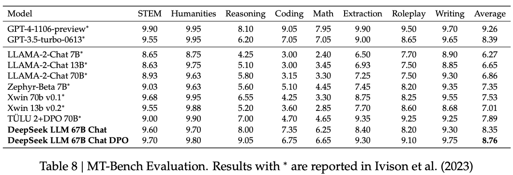

**DPO**（Direct Preference Optimization）是一种针对大型语言模型（LLMs）的优化方法，旨在通过人类偏好数据直接调整模型参数，无需显式构建奖励模型或复杂强化学习过程。 ‌DPO最早源自2023年Rafael Rafailov发表的《Direct Preference Optimization: Your Language Model is Secretly a Reward Model》，更多请细节参考该论文。

## 核心特点

在DPO之前，基于PPO（Proximal Policy Optimization）的RLHF一直是主流的对齐算法。但是PPO存在许多问题：

- **稳定性**：PPO有非常多影响效果的超参，并且训练过程耦合4个模型，训练的不稳定相对较差

- **效率与资源**：RLHF的训练分两个阶段，需要先训练奖励模型，然后同时加载4个模型进行训练，对算力和显存的占用较高

DPO通过收集用户对模型输出的偏好数据（如接受/拒绝的答案对），直接优化模型参数以对齐人类偏好，避免了传统 RLHF （ 强化学习从人类反馈 ）方法中复杂的奖励模型训练和强化学习优化过程。

其核心优势包括：

- ‌**简化训练流程**：无需显式拟合奖励模型，直接通过偏好数据优化策略；

- ‌**提高稳定性‌**：绕过强化学习的不稳定性，降低训练风险；

- **效率提升**：通过最大似然估计优化策略，减少计算成本。 ‌训练过程只需要加载一个模型（参考模型的结果可以提前录制）。

## 原理简述

DPO基于 Bradley-Terry模型 分析偏好数据，利用 KL散度 衡量模型输出与人类偏好的差异，并通过梯度更新调整参数。具体流程包括：

1. ‌**偏好采样‌**：收集用户对模型输出的接受/拒绝反馈；

2. ‌**奖励模型推导‌**：通过偏好数据推导奖励函数；

3. ‌**策略优化‌**：直接优化策略模型参数以最大化奖励函数。 ‌

该方法已被应用于语言模型优化，并展现出与RLHF相当的性能，但训练过程更高效且稳定。


## Bradley-Terry模型

DPO的奖励函数设计继承了Bradley-Terry模型，后者是一种用于分析成对比较（pairwise comparison）数据的统计模型，由Ralph A. Bradley和Milton E. Terry于1952年提出。其核心目标是通过量化不同个体或对象的相对强度，预测在直接对抗中某一方战胜另一方的概率。该模型广泛应用于体育排名、消费者偏好研究、搜索引擎排序、电竞匹配系统等领域。

### 1. 基本假设

- **隐式强度参数**：每个对象（如球队、产品）被赋予一个正实数参数 λ<sub>i</sub> 或者 θ<sub>i</sub>，表示其相对实力或偏好强度。

- **胜负概率公式**：  
  对于两个对象 \( i \) 和 \( j \)，模型假设 \( i \) 战胜 \( j \) 的概率为：  
  
  或通过重参数化（引入对数线性模型）：  
  
  P(i > j) = σ( λ<sub>i</sub> - λ<sub>j</sub> )
  
  这与逻辑回归的Sigmoid函数形式一致。

### 2. 参数估计

通过最大化观测数据的似然函数来估计参数。对于胜负记录矩阵 W ，其中 W<sub>ij</sub> 表示i战胜j的次数。似然函数为：  


## DPO的奖励函数

### 1. 奖励函数定义

DPO通过对比偏好对隐式的定义奖励信号。奖励函数可表示为参考模型与当前策略模型的对数概率比：  


其中，π<sub>θ</sub>​为当前策略模型，π<sub>ref</sub>​为参考模型（如预训练模型）。π<sub>θ</sub>(y|x)表述输入是x时，模型输出y的概率​，也就是条件概率。β为控制奖励强度的超参数。实际上，DPO的奖励函数中还存在一个难以计算的未知项，但在DPO的后续计算过程中，该项可以被抵消，因此这里没有展开，相关内容可以参考原论文。

### 2. 梯度更新方向

损失函数的梯度更新方向与隐式奖励信号直接相关。梯度会增加偏好输出 y<sub>w</sub> 的概率，同时降低非偏好输出 y<sub>l</sub> 的概率，权重由隐式奖励得分的差异决定。

### 3. 与显式奖励模型的对比

- **显式奖励模型（EX-RM）**：  
  通过独立训练的线性头预测奖励分数，作为“裁判”模型，直接对输出进行评分。
- **隐式奖励模型（IM-RM）**：  
  奖励信号隐含于策略模型与参考模型的概率差异中，模型本身既是“选手”又是“裁判”，避免了显式奖励模型的复杂性。

### 4. 与Bradley-Terry模型的关系

DPO的奖励函数在数学形式上直接继承了Bradley-Terry模型的成对比较机制。

| **维度**   | **Bradley-Terry模型** | **DPO奖励函数**                                       |
| -------- | ------------------- | ------------------------------------------------- |
| **核心目标** | 预测成对比较的胜负概率         | 量化输出的相对优劣                                         |
| **数学形式** | P(i>j)=λi​+λj​λi​​  | r(x, y) = β log(π<sub>θ</sub> / ​π<sub>ref</sub>) |
| **隐式排名** | 通过 λi​ 排序对象         | 通过奖励值排序输出                                         |
| **优化方向** | 最大化胜负概率的似然函数        | 最大化偏好输出的奖励信号                                      |

## DPO的损失函数

对于偏好数据集D = {x<sup>(i)</sup>, y<sub>w</sub><sup>(i)</sup>, y<sub>l</sub><sup>(i)</sup>}<sup>N</sup><sub>i=1</sub>，可以用奖励模型拟合这个数据集的分布，将问题建模为二分类问题，然后基于负对数似然损失（Loss）进行训练。DPO损失函数的公式为


其中

- σ为sigmoid函数，值域是(0, 1)

- β为超参数，用于控制奖励强度

- 偏好数据集D中，x是输入，y<sub>w</sub>即y<sub>win</sub> 是模型的优质回答，y<sub>l</sub>即y<sub>lose</sub> 是模型的劣质回答

可以看出，上述Loss中包含了 r(x, y<sub>w</sub>) 和 r(x, y<sub>l</sub>)，通过两者的差值计算二分类的损失。DPO的奖励来自于策略模型和参考模型，而不是独立的奖励模型，由于跳过了奖励模型的训练，直接优化策略模型，这就是DPO中Direct的含义。

模型训练的目标是最小化loss，因此可以得到目标函数：

```
J(θ​) = -L(θ​)
```

## DPO的梯度


## DPO的训练流程

模型的整体流程，通常先经过预训练、SFT，然后采用DPO。策略模型和参考模型一般直接复制SFT模型，但也可以选择比当前SFT模型更强的模型，此时需要关注策略模型和训练模型之间的匹配程度，主要考虑KL散度和数据分布。如图：


其中，DPO的训练流程包含数据收集、模型推理、计算动作概率和损、反向传播、更新参数等步骤，如下图：


## 超参对效果的影响

参数β是DPO（直接偏好优化）目标函数中的关键超参数，直接控制隐式奖励信号的强度，进而影响模型优化的方向、速度和稳定性。该参数在DPO中的作用类似于其在RLHF中的作用。体现在以下维度：

### 1. 奖励信号的缩放效应

DPO的隐式奖励函数为：  


β通过缩放对数概率比，直接决定奖励值的幅度。  

- **大β值**：放大奖励差异，使模型更关注高奖励输出（如用户明确偏好的回复）。  
- **小β值**：压缩奖励差异，使模型对偏好对的区分度降低，可能忽略细微偏好信号。

### 2. 训练动态的调控

- **梯度更新强度**：  
  β影响损失函数对模型参数的梯度大小。  
  
  - **大β值**：梯度更新更剧烈，加速模型向高奖励输出收敛，但可能引发训练不稳定（如损失震荡）。  
  - **小β值**：梯度更新更平缓，训练过程更稳定，但收敛速度可能变慢。

- **KL散度约束的平衡**：  
  如果将KL散度引入训练，总目标函数为：  
  
  β与λ共同作用，控制模型偏离参考模型的程度。  
  
  - **大β值**：需配合较小的λ，避免模型过度偏离参考模型（否则可能因奖励信号过强导致过拟合）。  
  - **小β值**：可适当增大λ，利用KL散度约束保持模型稳定性。

### 3. 模型性能的直接影响

简单概括

- **偏好对齐能力**：  
  
  - **大β值**：模型更积极学习偏好数据，可能提升在偏好对上的准确率（如对话系统中的回复相关性）。  
  - **小β值**：模型可能保留更多参考模型的语言能力，但偏好对齐效果减弱（如生成内容更流畅但偏离用户意图）。

- **泛化能力**：  
  
  - **大β值**：可能过拟合训练数据中的偏好对，导致在未见数据上表现下降（如新用户群体的偏好未被充分覆盖）。  
  - **小β值**：模型更保守，泛化能力更强，但可能牺牲部分偏好对齐精度。

### 4. 调优策略与最佳实践

- 渐进式调优法
  
  1. **初始设置**：从β=0.1开始，确保模型基本语言能力不受损。  
  2. **逐步增大β**：每次增加0.1~0.2，观察偏好对齐指标（如准确率、胜率）的变化。  
  3. **监控稳定性**：若损失函数出现震荡或模型性能下降，适当减小β或增大λ。  

- 基于任务复杂度的启发式调优
  
  1. **简单任务**（如二分类偏好）：β=0.5~1.0，奖励信号明确，需快速收敛。  
  2. **复杂任务**（如长文本生成）：β=0.1~0.3，保持模型探索能力，避免过拟合。  

### 5. 超参影响的总结

参数β是DPO中调控奖励信号强度、训练动态和模型性能的核心超参数。其取值需根据任务类型、数据规模和计算资源，通过实验逐步调整，以平衡偏好对齐能力与模型稳定性。

## DPO对模型能力的影响

SFT可以提供模型对指令的跟随能力、对话能力。DPO可以在模型具备一定对话能力后，让模型的输出结果更加符合人类偏好。

下图来自论文 https://arxiv.org/pdf/2404.14723 ，Mistral是法国一家公司发布的大模型。可以看出，与直接使用DPO、KTO对齐模型偏好相比，先做SFT在做偏好对齐有更好的效果。


deepseek团队曾经在deepseek 67b chat上做对比实验，评估DPO前后模型基础能力的变化，论文地址 https://arxiv.org/pdf/2401.02954 。结果如下（参考最后两行的数据）：




