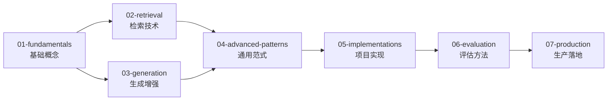

# RAG (Retrieval-Augmented Generation)

检索增强生成：通过外部知识检索提升 LLM 的事实准确性和时效性。

> **推荐阅读**：先看 [overview.md](./overview.md) 了解领域全貌，再按 [学习路径](#学习路径) 顺序深入各子目录。

## 目录结构

```
rag/
├── 01-fundamentals/                  # 基础概念
│   ├── naive-rag/
│   ├── rag-pipeline-overview/
│   └── what-is-rag/
│
├── 02-retrieval/                     # 索引与检索
│   ├── chunking-strategies/
│   ├── embedding-models/
│   ├── vector-databases/
│   └── advanced-retrieval/
│
├── 03-generation/                    # 生成与增强
│   ├── context-integration/
│   ├── generation-strategies/
│   └── evaluation-of-generation/
│
├── 04-advanced-patterns/             # 通用高级范式
│   ├── agentic-rag/
│   ├── modular-rag/
│   ├── multimodal-rag/
│   └── self-reflective-rag/
│
├── 05-implementations/               # 具体项目与方案
│   ├── graph-rag/
│   └── hipporag/
│
├── 06-evaluation/                    # 评估与基准
│   ├── end-to-end-metrics/
│   └── public-benchmarks/
│
└── 07-production/                    # 生产与生态
    ├── caching-and-scaling/
    ├── frameworks/
    ├── papers/
    └── security-and-privacy/
```

## 开源仓库与工具存放指南

| 仓库/工具 | 放入目录 | 说明 |
|-----------|---------|------|
| 通用 RAG 框架（LlamaIndex, LangChain RAG 等） | `07-production/frameworks/` | 工程化框架 |
| 具体 RAG 项目（GraphRAG, HippoRAG, LightRAG 等） | `05-implementations/` | 按项目名称独立目录 |
| RAG 评估套件（RAGAS, TruLens 等） | `06-evaluation/` | 评估工具 |

## 与其他目录的边界

| 内容 | 归属 | 说明 |
|------|------|------|
| Prompt 工程 | [../llm/04-serving/prompt-engineering/](../llm/04-serving/prompt-engineering/) | 通用技术 |
| LLM 推理优化 | [../llm/04-serving/](../llm/04-serving/) | 通用推理优化 |
| 知识图谱通用构建方法 | [../knowledge-graph/02-construction/](../knowledge-graph/02-construction/) | 实体抽取、关系抽取等基础方法 |
| 知识图谱在 RAG 中的应用 | `05-implementations/graph-rag/` | GraphRAG 等方案集中在此，不分散 |

## 学习路径



## 相关资源

- [LLM 推理](../llm/04-serving/) — 生成模块优化
- [知识图谱](../knowledge-graph/) — 结构化知识源
- [LLM 评估](../llm/05-evaluation/) — 通用评估方法
- [Agentic AI](../agentic/) — Agent 驱动的 RAG 范式

---

*最后更新: 2026-05-11*