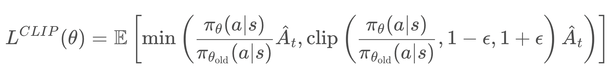

## 一、PPO的概念

PPO（Proximal Policy Optimization），即近端策略优化，是一种**策略梯度强化学习算法**，旨在通过限制策略更新的幅度，平衡探索与利用，解决传统策略梯度方法（如REINFORCE）训练不稳定、样本效率低的问题。其核心思想是：**在优化策略时，避免新旧策略差异过大导致性能崩溃**，通过“近端”约束实现稳定学习。

#### **关键公式**

1. **裁剪目标函数（Clipped Surrogate Objective）**  
   PPO的核心是通过裁剪策略比值（新旧策略的概率比）来限制更新幅度：  
   
   
   其中：  
   
   - <i>πθ</i>和<i>π</i>(<i>θ</i>old)分别为新旧策略，  
   - <i>Ât</i>为优势函数估计（如GAE），  
   - ε为裁剪系数（通常取0.1~0.3），控制更新幅度。

2. **优势函数估计（GAE）**  
   PPO使用广义优势估计（GAE）平衡偏差与方差：  
   <i>Ât</i> = Σl=0∞ (γλ)lδt+lV  
   其中：  
   
   - γ为折扣因子，λ为GAE平滑系数，  
   - δtV = rt + γV(st+1) - V(st) 为TD误差，  
   - V(s)为状态值函数。

## 二、PPO相关算法的演进过程

#### **1. 策略梯度方法的起源（1990s-2000s）**

- **REINFORCE（Williams, 1992）**  
  最早的策略梯度方法，通过蒙特卡洛采样估计梯度，但方差高、训练不稳定。  
  梯度公式：  
  ∇θJ(θ) = 𝔼[Σt=0T ∇θlog<i>πθ(at|st)</i> * Gt]  
  其中 Gt为累积回报。

- **Actor-Critic（1990s）**  
  引入值函数（Critic）估计优势函数，降低方差，但需同时训练策略（Actor）和值函数（Critic），增加了复杂性。

#### **2. 置信域策略优化（TRPO, 2015）**

- **核心思想**：通过约束新旧策略的KL散度，确保更新在“信任域”内：  
  maximize 𝔼[<i>Ât</i> * (<i>πθ(a|s)</i> / <i>πθold(a|s)</i>)]  
  s.t. 𝔼[KL(<i>πθold</i>, <i>πθ</i>)] ≤ δ  
- **问题**：TRPO需通过共轭梯度法求解约束优化问题，计算复杂度高，难以扩展到大规模神经网络。

#### **3. PPO的提出（2017）**

- **改进TRPO**：PPO用简单的裁剪目标函数替代KL约束，避免复杂优化，同时保留了更新幅度的限制。  
- **优势**：  
  - 计算效率高（仅需一阶优化），  
  - 易于实现（基于标准策略梯度框架），  
  - 在连续和离散控制任务中表现优异。

#### **4. PPO的变体与扩展**

- **PPO-Penalty（2017）**  
  用KL散度惩罚项替代裁剪：  
  <i>LKL(θ)</i> = 𝔼[<i>Ât</i> * (<i>πθ(a|s)</i> / <i>πθ__old(a|s)</i>)] - β * KL(<i>πθ__old</i>, <i>πθ</i>)  
  其中β为动态调整的惩罚系数。

- **分布式PPO（DPPO, 2017）**  
  通过多进程并行采集数据，加速训练，适用于大规模任务（如机器人控制、游戏AI）。

- **PPO+GAE（2018）**  
  结合广义优势估计（GAE）进一步降低方差，成为PPO的默认配置。

#### **5. 现代改进方向**

- **自适应裁剪系数**：根据训练动态调整ε，提升灵活性。  
- **状态表示学习**：结合对比学习或自监督学习，提升策略对复杂环境的感知能力。  
- **离线强化学习**：将PPO扩展到离线场景（如PPO-Offline），利用静态数据集训练策略。
