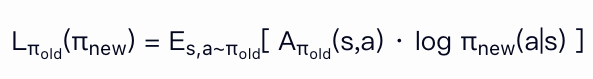
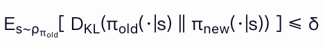
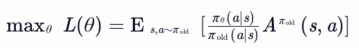

## 一、PPO的概念

PPO（Proximal Policy Optimization），即近端策略优化，是一种**策略梯度强化学习算法**，旨在通过限制策略更新的幅度，平衡探索与利用，解决传统策略梯度方法（如REINFORCE）训练不稳定、样本效率低的问题。其核心思想是：**在优化策略时，避免新旧策略差异过大导致性能崩溃**，通过“近端”约束实现稳定学习。

### 关键公式

1. **裁剪目标函数（Clipped Surrogate Objective）**  
   PPO的核心是通过裁剪策略比值（新旧策略的概率比）来限制更新幅度：  
   
   
   
   其中：  
   
   - <i>πθ</i>和<i>π</i><i>θ_old</i>分别为新旧策略
   - <i>Ât</i>为优势函数估计（如GAE）
   - ε为裁剪系数（通常取0.1~0.3），控制更新幅度。

2. **优势函数估计（GAE）**  
   PPO使用广义优势估计（GAE）平衡偏差与方差：  
   
   At = Σk=0∞ (γλ)k δt+k  
   
   其中：  
   
   - γ为折扣因子，λ为GAE平滑系数
   - δt = rt + γV(st+1) - V(st) 为TD误差
   - V(s)为状态值函数

## 二、TRPO

### 1. 算法核心思想

TRPO（Trust Region Policy Optimization，置信域策略优化）是一种基于策略梯度的强化学习算法，其核心目标是通过**置信域约束**解决传统策略梯度方法中步长选择困难的问题。通过限制新旧策略的差异幅度，确保每次更新在安全范围内，从而实现稳定的策略优化。

### 2. KL散度

KL散度（Kullback-Leibler Divergence），又称相对熵，是衡量两个概率分布差异的非对称性指标。其核心思想是，用分布 **Q** 近似表示分布 **P** 时会损失一定信息，可以将所损失的信息进行量化。

- 定义

对于离散概率分布 **P** 和 **Q**（定义在相同概率空间上），KL散度定义为：

DKL(P || Q) = ∑x P(x) · log( P(x) / Q(x) )

对于连续概率分布，求和替换为积分：

DKL(P || Q) = ∫ P(x) · log( P(x) / Q(x) ) dx

- 关键性质
  
  - **非负性**：DKL(P || Q) ≥ 0，当且仅当 **P = Q** 时取等号（吉布斯不等式）。
  - **非对称性**：DKL(P || Q) ≠ DKL(Q || P)，即交换分布顺序结果可能不同。
  - **无界性**：当 **Q(x) = 0** 且 **P(x) > 0** 时，KL散度为无穷大（要求 **Q** 的支撑集包含 **P** 的支撑集）。

- 直观解释
  
  - 若 **P** 是真实分布，**Q** 是模型预测分布，KL散度衡量用 **Q** 编码 **P** 的样本时所需的额外比特数（信息论视角）。
  
  - 最小化 KL散度等价于最大化数据似然（在变分推断和MLE中常见）。

### 3. 置信域

#### 3.1 置信域的定义

传统策略梯度方法直接沿梯度方向更新参数，但步长过大可能导致策略性能崩溃。置信域技术通过约束更新幅度，解决了这一难题。

置信域（Trust Region）是指**参数更新的一个区域**，在该区域内，当前模型的近似（如一阶泰勒展开）能够较好地代表真实的目标函数。通过限制参数更新的幅度，置信域方法可以避免因更新步长过大而导致的模型不稳定或性能下降。

#### 3.2 置信域的数学表达

##### 基本形式

置信域通常定义为参数空间中的一个球体，其半径由约束条件确定。例如，在TRPO中，置信域通过**KL散度约束**定义。

##### 几何解释

置信域可以视为参数空间中的一个“安全区域”，在此区域内：

- 近似模型（如一阶泰勒展开）与真实目标函数的误差较小。因此，在置信域内，优化近似目标，意味着真实目标能够得倒同步优化。
- 参数更新后，模型性能不会因近似误差而急剧下降。 

### 4. 置信域与TRPO

TRPO将置信域技术引入策略优化，其目标函数是一个**带约束的优化问题**

#### 4.1 目标函数

最大化期望回报的近似：

其中，Aπ_old(s,a) 是旧策略下的优势函数，衡量动作a在状态s下的相对价值。

#### 4.2 约束条件

通过KL散度约束控制策略更新幅度：

其中：

- πold 和 πnew 分别表示更新前后的策略。

- ρπ_old是旧策略下的状态分布。

- DKL 是KL散度，衡量两个动作分布的差异。

- δ 是置信域半径，控制策略更新的最大幅度。

- KL散度衡量的是新旧策略在动作概率分布 π(a|s)上的差异，而非参数θ之间的差异，尽管参数θ会影响概率分布。

#### 4.3 TRPO的目标

通过置信域，TRPO已经将目标转为一个带约束条件的优化问题。考虑到新旧策略在相同状态s下采取动作a的概率存在差异，这里对上文的公式替换为：

其中：

- πθ​(a∣s)：当前策略（参数为 θ）在状态 s 下选择动作 a 的概率；
- πold​(a∣s)：旧策略（参数为 θold​）在状态 s 下选择动作 a 的概率；
- Aπ_old​(s,a)：优势函数，表示在旧策略下，动作 a 相对于状态 s 的平均回报的优势。

这种替换，和重要性采样（Importance Sampling）技术相关。

## 三、重要性采样

### 1 定义与目标

重要性采样（Importance Sampling）是统计学中的一种蒙特卡洛方法，用于估计复杂概率分布 p(x)  下函数 f(x)  的期望值 Ex~p(x)[f(x)] 。其核心思想是通过从易于采样的**提议分布** q(x)  中获取样本，并通过**重要性权重**调整这些样本，以无偏估计目标分布的期望。

### 2 数学公式推导

目标期望值的表达式为：
Ex ∼ p(x)[f(x)] = ∫ f(x) p(x) dx
若直接从  p(x)  采样困难，可引入提议分布 (x) 积分改写为：
Ex ∼ p(x)[f(x)] = Ex ∼ q(x)[ p(x)/q(x) f(x) ]

其中，**重要性权重** w(x) = p(x) / q(x) 用于偿分布差异。通过从 q(x) 采样 N个样本 {x1, x2, ... , xN} 得倒期望的估计值为：
Ê[f(x)] = (1/N) ∑Ni=1 w(xi) f(xi)

### 3. 关键条件

- **提议分布 q(x) 的要求**：
  - q(x) > 0  当且仅当  p(x) > 0 （支撑集重叠）。
  
  - 易于采样（如均匀分布、正态分布）。
- **权重方差**：权重 w(x)  的方差决定估计效率，方差越小，收敛越快。理想情况下， q(x)  应接近  p(x) 。

### 4. 优缺点与改进方法

#### 4.1 优点

- **灵活性**：适用于高维积分和复杂分布，无需解析解。
- **样本利用率**：所有样本均参与估计，无拒绝或浪费。
- **无偏性**：理论上可保证估计的无偏性（需满足支撑集重叠条件）。

#### 4.2 缺点

- **方差问题**：若  q(x)  与 (x) 异大，权重方差高，导致估计不稳定。
- **计算成本**：高维空间中，权重计算可能成为瓶颈。
- **权重退化**：极端情况下，少数样本权重极大，主导估计结果。

#### 4.3 改进方法

- **提议分布优化**：
  - 选择与目标分布形态接近的  q(x) （如使用拉普拉斯近似或变分推断结果）。
  - 动态调整  q(x) （如自适应重要性采样）。
- **方差缩减技术**：
  - **多重重要性采样（MIS）**：结合多个提议分布，平衡采样效率。
  - **权重裁剪**：限制最大权重，避免个别样本主导估计。
  - **分层采样**：将积分域划分为子区域，分别采样并加权。
- **重采样方法**：
  - **重要性重采样（SIR）**：根据权重重新采样，生成更接近  p(x)  的样本集。
  - **加权蓄水池采样**：在流式数据中动态维护代表性样本。
