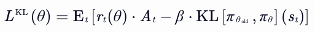
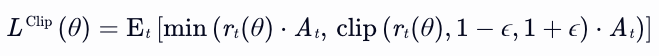
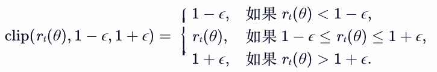
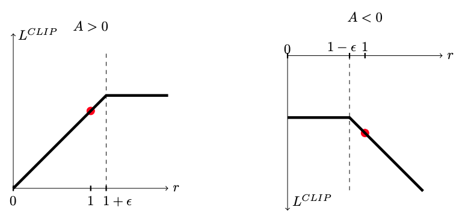
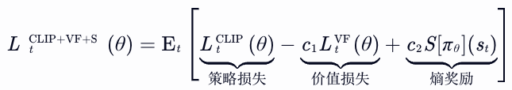
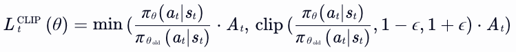
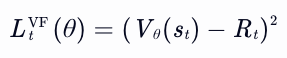
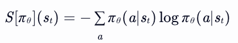

## 一、PPO核心思想

近端策略优化算法PPO（Proximal Policy Optimization）是一种基于策略梯度（Policy Gradient）的强化学习算法，通过**限制策略更新幅度**来平衡探索与利用，避免传统策略梯度方法中因过大更新导致的性能崩溃。其目标函数通过两种变体实现：**PPO-Penalty** 和 **PPO-Clip**。

## 二、PPO-Penalty

### 核心机制

PPO-Penalty即带KL惩罚项的PPO，在损失函数中显式添加一个KL散度项，作为对策略差异的惩罚，动态调整惩罚系数以控制策略更新幅度。

### 数学公式

目标函数为：

其中：

- <var>rt(θ)</var> = <var>πθ(at|st)</var> / <var>πθ__old(at|st)</var> 是策略比率，衡量在相同状态s下才选择同一个动作a的概率比，具体可以参考重要性采样
- <var>At</var> 为优势函数（Advantage Function）
- <var>β</var> 为惩罚系数，用于限制新旧策略的概率分布差异

### 关键点

- **KL散度约束**：通过惩罚项 <var>KL[πθ__old, πθ]</var> 限制新旧策略差异。

- **自适应β**：该参数对效果和稳定性有着显著影响，手动调节困难。因此，自适应KL惩罚（Adaptive KL Penalty）被剔除，通过训练中自动调整β增加训练稳定性。例如：
  
  - 若KL散度超过目标值（如1.5倍），增大β（如乘以2），加强惩罚。
  
  - 若KL散度低于目标值（如0.5倍），减小β（如除以2），放松约束。

## 三、PPO-Clip

### 核心机制

PPO-Clip即裁剪策略比率的PPO，直接对策略比率 <var>rt(θ)</var> 进行裁剪，避免其偏离1（即新旧策略差异过大），无需显式计算KL散度。

### 数学公式

损失函数为：

其中：

- clip[ rt(θ), 1-ε, 1+ε ] 将 <var>rt(θ)</var> 限制在 [1-ε, 1+ε] 区间内（通常 ε=0.2）
  
  

- 取 `min` 确保当优势函数 <var>At</var> 为正时，不增加过大比率；为负时，不减少过小比率。
  
  

### 关键点

- **简单高效**：无需计算KL散度，也不需要动态调整β，直接通过裁剪实现约束。
- **ε超参数**：控制裁剪范围，典型值 ε=0.1~0.3。

## 四、对比与总结

| **特性**    | **PPO-Penalty**  | **PPO-Clip**    |
| --------- | ---------------- | --------------- |
| **约束方式**  | KL散度惩罚项          | 策略比率裁剪          |
| **计算复杂度** | 需计算KL散度，动态调整β    | 仅需裁剪操作，计算更简单    |
| **超参数**   | β（动态调整）、KL目标值    | ε（固定裁剪范围）       |
| **实际效果**  | 对策略差异控制更精确，但调试复杂 | 实现简单，性能稳定，应用更广泛 |

## 五、统一目标函数

PPO通用形式，两种变体均可统一表示为：

LPPO(θ) = 𝔼t[ min( rt(θ)·At, f(rt(θ))·At ) ] + c·Vθ(st)

其中：

- <var>f(rt(θ))</var> 为约束函数（Penalty或Clip）
- <var>Vθ(st)</var> 为值函数损失项（可选）

通过这两种机制，PPO在保证探索效率的同时，显著提升了训练稳定性，成为当前强化学习领域的标杆算法之一。s

## 六、扩展损失函数

PPO通常需要一个策略网络和一个价值网络，前者输出动作，后者对结果进行评估。理论上，可以使用两个不同的网络，但是考虑到策略网络和价值网络具有一定相似性，两个模型之间有时会共享部分网络参数，为了兼顾两个不同的目标，需要将策略模型和价值模型的损失结合在一起。其次，为了增强模型的探索能力，再引入熵奖励，保证模型具有一定随机性。

以下是 **PPO扩展损失函数（结合了CLIP、价值网络与熵奖励）** 

### 1. 组成部分详解

#### 策略损失（CLIP Loss）

**数学形式**：

**作用**：

- **限制策略更新幅度**：通过裁剪概率比率，防止单步更新过大导致性能崩溃。
- **优势导向**：当  At > 0 时，鼓励增加高优势动作的概率；当 At < 0 时，鼓励降低低优势动作的概率。

#### 价值网络损失（Value Function Loss）

**数学形式**：

其中 Rt为实际回报（如折扣回报或GAE估计值）。

**作用**：

- **优化价值估计**：最小化预测价值 Vθ(st) 与实际回报 Rt 的差距，提升价值函数的准确性。
- **稳定优势计算**：精确的价值估计可减少优势函数 At 的偏差，从而提升策略梯度的质量。

#### 熵奖励（Entropy Term）

**数学形式**：

**作用**：

- **鼓励探索**：熵越大，策略越随机，避免过早收敛到次优解。
- **平衡利用**：通过正则化系数 c2 ，控制探索与利用的权衡。

### 2. 超参数c1和c2

| **超参数** | **作用**                              | **典型值**  |
| ------- | ----------------------------------- | -------- |
| c1      | 平衡价值损失与策略损失的权重。较大的 c1 会更注重价值函数的准确性。 | 0.5（默认）  |
| c2      | 控制熵奖励的强度。较大的 c2 会鼓励更多探索，但可能降低收敛速度。  | 0.01（默认） |

### 3. 扩展损失函数的优势

1. **多目标优化**：
   
   - **策略更新**：通过CLIP损失稳定策略更新。
   - **价值估计**：通过价值损失提升优势函数准确性。
   - **探索能力**：通过熵奖励维持策略的随机性。

2. **实现简单性**：
   
   - 仅需在标准PPO损失基础上添加两项，无需复杂修改。
   - 兼容自动微分框架（如PyTorch、TensorFlow）。

3. **性能提升**：
   
   - 在复杂任务（如机器人控制、游戏AI）中，结合价值估计和探索奖励可显著提升训练效率和最终性能。

## 七、TRPO和PPO

### 1. 核心思想

表1

| **维度**   | **TRPO（信任区域策略优化）**                                              | **PPO（近端策略优化）**                            |
| -------- | --------------------------------------------------------------- | ------------------------------------------ |
| **更新约束** | **硬约束**：通过KL散度限制新旧策略差异，确保每次更新在信任区域内。                            | **软约束**：通过裁剪（Clip）或KL惩罚项间接限制更新幅度，避免复杂约束求解。 |
| **优化目标** | 最大化带KL约束的期望回报                                                   | 最小化裁剪后的策略损失：                               |
| **设计哲学** | 数学严谨性优先，确保策略单调改进。                                               | 工程实用性优先，平衡稳定性与计算效率。                        |
| 优劣势      | 实现难点： - 需计算二阶导数（Fisher信息矩阵）和共轭梯度法求解约束优化问题。 - 代码复杂度高，计算成本大 | 实现优势： - 仅需一阶优化（梯度下降），代码简洁。 - 支持分布式训练 |

表2

| **区别点**   | **TRPO**    | **PPO-Penalty**  |
| --------- | ----------- | ---------------- |
| **约束类型**  | 硬性KL散度上限（δ） | 软性KL散度惩罚项（β动态调整） |
| **优化方法**  | 二阶优化（共轭梯度法） | 一阶优化（梯度下降）       |
| **超参数数量** | 1个（δ）       | 2个（β初始值、KL目标值）   |
| **计算成本**  | 高（二阶导数计算）   | 低（一阶导数）          |
| **收敛速度**  | 较慢（需精确求解约束） | 较快（自适应惩罚允许更大步长）  |
| **超参敏感性** | 高（需精细调整δ）   | 中（β可自适应调整）       |

### 2. 性能与效率对比

| **指标**    | **TRPO**      | **PPO**        |
| --------- | ------------- | -------------- |
| **收敛速度**  | 较慢（需精确求解约束问题） | 较快（软约束允许更大步长）  |
| **样本效率**  | 中等（依赖精确优势估计）  | 高（可复用数据多次更新）   |
| **计算成本**  | 高（二阶优化+共轭梯度）  | 低（一阶优化+并行计算）   |
| **超参敏感性** | 高（需精细调整δ和步长）  | 低（ε默认0.2，鲁棒性强） |

### 3. 适用场景建议

- **TRPO适用场景**
  
  - **高精度需求**：如机器人手术、自动驾驶路径规划，需严格限制策略突变。
  
  - **小批量数据**：数据采集成本高时（如医疗决策），需最大化单次更新效果。
  
  - **理论保障优先**：学术研究中需严格保证单调改进的场景。

- **PPO适用场景**
  
  - **快速迭代**：游戏AI（如《星际争霸》AlphaStar）、语言模型微调（RLHF）。
  
  - **大规模分布式**：云计算环境下的并行训练（如Meta的AI推荐系统）。
  
  - **工程简化**：工业控制中需快速部署且计算资源有限的场景。

### 4. 近期研究进展

1. **TRPO改进**：
   
   - 结合元学习（Meta-TRPO）：动态调整信任区域大小，提升多任务适应性。
   - 混合优化：将TRPO与一阶方法结合，降低计算成本。

2. **PPO扩展**：
   
   - **自适应PPO**：动态调整裁剪范围ε（如根据KL散度自动缩放）。
   - **多目标PPO**：同时优化策略、价值函数和熵项（如您之前提到的扩展损失）。

3. **跨领域应用**：
   
   - **TRPO**：在核聚变控制、量子计算优化等高风险领域展现潜力。
   - **PPO**：成为大语言模型（LLM）微调的主流算法（如ChatGPT的RLHF阶段）。
