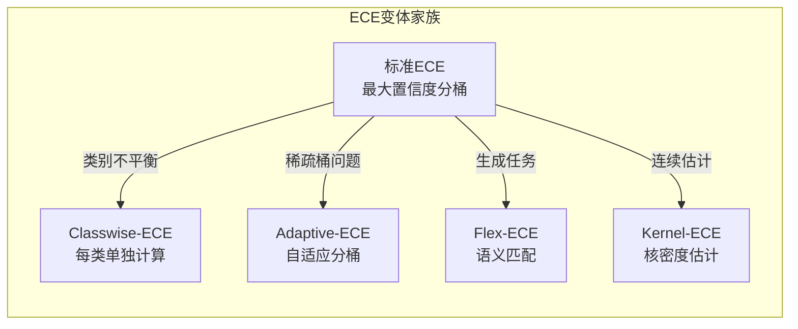
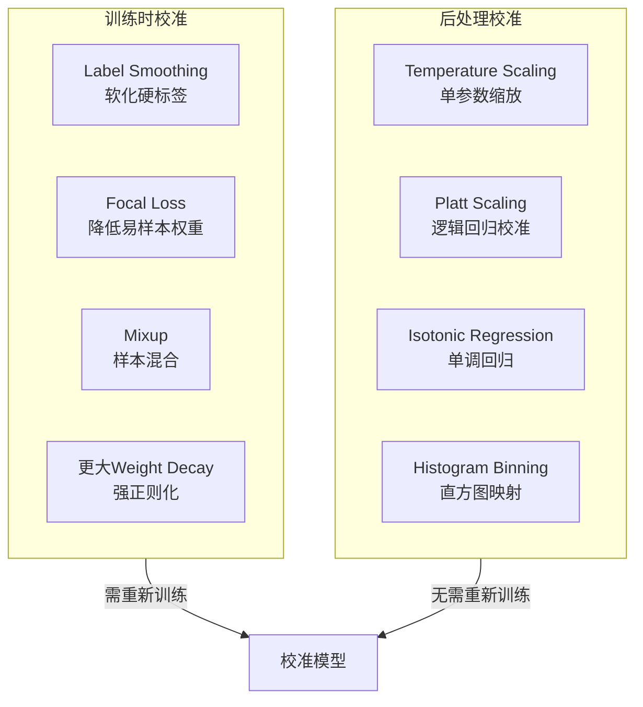

# 期望校准误差（ECE）：从理论到实践

**文档信息**
| 维度 | 内容 |
|------|------|
| 文档版本 | v1.0 |
| 覆盖范围 | ECE的定义、计算、变体、校准方法，以及深度学习/LLM中的应用 |
| 最后更新 | 2026年4月 |
| 伴生索引 | [papers/README.md](./papers/README.md) - ECE核心论文索引 |
| LLM扩展 | [llm/evaluation/calibration/](../../../llm/evaluation/calibration/) - LLM校准专题 |

---

## 导读

机器学习模型的预测由两部分组成：**预测结果**（是什么）和**置信度**（有多确定）。传统评估指标（准确率、F1、AUC）只关注前者，却忽略了后者是否可靠。一个准确率90%的模型，如果在其所有错误预测上都给出99%的置信度，在实际应用中可能带来灾难性后果。

**期望校准误差（Expected Calibration Error, ECE）** 正是衡量"置信度与准确率一致性"的核心指标。本文系统梳理ECE的理论基础、计算方法、主要变体、以及在不同领域的应用实践。

**核心发现**：
- 现代神经网络普遍存在**过度自信**问题——更深、更准的模型往往ECE更高
- **Temperature Scaling**是最简单有效的后处理校准方法，单参数优化即可显著降低ECE
- LLM生成任务需要**ECE变体**（如Flex-ECE、Semantic Entropy）来处理答案多样性
- 校准与准确率是**两个独立维度**，可以同时优化，但也可能需要权衡

---

## 一、问题定义：为什么需要校准？

### 1.1 准确率不够

考虑两个模型在相同测试集上的表现：

| 模型 | 准确率 | 错误预测的平均置信度 |
|------|--------|---------------------|
| Model A | 85% | 60% |
| Model B | 85% | 95% |

两个模型准确率相同，但Model B在错误时仍然"非常确信"。在医疗诊断场景中：
- Model A的错误预测置信度较低 → 医生可以识别并复核
- Model B的错误预测置信度很高 → 医生可能盲目信任，造成误诊

**核心问题**：准确率只告诉我们"预测对了吗"，不告诉我们"模型知道自己对不对"。

### 1.2 校准的定义

**完美校准（Perfect Calibration）**：

$$P(\hat{Y} = Y \mid \hat{P} = p) = p, \quad \forall p \in [0, 1]$$

即：当模型说"我有p的概率确信"时，实际上确实有p的比例是正确的。

**直观理解**：
- 模型说"80%是恶性肿瘤" → 在100个这样的预测中，应该有80个确实是恶性肿瘤
- 模型说"50%是恶性肿瘤" → 这种预测应该像抛硬币一样不确定

### 1.3 三种校准状态

```
校准状态示意

置信度 vs 准确率

过度自信（Overconfident）        完美校准                  欠自信（Underconfident）
    ↑                             ↑                              ↑
准确率|                           |                              |
    |   ●                         |    ●                         |       ●
    |      ●                      |   /                          |      /
    |         ●                   |  /                           |     /
    |            ●                | /                            |    /
    |               ●             |●                             |   ●
    +------------------→ 置信度   +------------------→ 置信度    +------------------→ 置信度
   0.5    0.7    0.9    1.0      0.5    0.7    0.9    1.0       0.5    0.7    0.9    1.0

    ECE > 0                       ECE = 0                        ECE > 0
    （曲线在对角线下方）           （曲线在对角线上）              （曲线在对角线上方）
```

### 1.4 校准的应用场景

| 场景 | 校准的重要性 | 未校准的风险 |
|------|-------------|-------------|
| **医疗诊断** | 置信度影响临床决策 | 过度自信导致误诊 |
| **自动驾驶** | 低置信度触发安全策略 | 过度自信导致事故 |
| **金融风控** | 置信度影响授信额度 | 错误评估风险 |
| **人机协作** | 置信度决定是否转人工 | 低效的人力分配 |
| **LLM应用** | 幻觉检测、安全对齐 | 输出不可靠信息 |

---

## 二、ECE的计算方法

### 2.1 标准ECE公式

**分桶（Binning）方法**：

1. 将置信度区间 [0,1] 分成 M 个等宽桶（通常 M=10 或 15）
2. 对每个桶计算置信度和准确率的差距
3. 加权平均得到ECE

$$ECE = \sum_{m=1}^{M} \frac{|B_m|}{N} \cdot |acc(B_m) - conf(B_m)|$$

其中：
- $B_m$：第m个桶中的样本集合
- $|B_m|$：第m个桶的样本数量
- $N$：总样本数
- $acc(B_m)$：第m个桶的实际准确率
- $conf(B_m)$：第m个桶的平均置信度

### 2.2 计算示例

假设有100个测试样本，分成10个桶：

| 桶 | 置信度范围 | 样本数 | 平均置信度 | 实际准确率 | 差距 | 加权贡献 |
|---|-----------|--------|-----------|-----------|------|---------|
| 1 | 0.0-0.1 | 5 | 0.08 | 0.00 | 0.08 | 0.004 |
| 2 | 0.1-0.2 | 5 | 0.15 | 0.20 | 0.05 | 0.0025 |
| ... | ... | ... | ... | ... | ... | ... |
| 9 | 0.8-0.9 | 30 | 0.85 | 0.70 | 0.15 | 0.045 |
| 10 | 0.9-1.0 | 40 | 0.95 | 0.80 | 0.15 | 0.060 |

$$ECE = 0.004 + 0.0025 + \cdots + 0.045 + 0.060 \approx 0.12$$

**解读**：ECE=0.12意味着平均而言，模型的置信度与实际准确率有12%的偏差。

### 2.3 ECE的优缺点

**优点**：
- 直观易懂
- 计算简单高效
- 广泛使用的标准度量
- 可通过可靠性图可视化

**缺点**：
- 分桶数量敏感：M太小平滑掉细节，M太大样本稀疏
- 忽略概率分布形状
- 只关注最大置信度类别
- 对类别不平衡敏感

### 2.4 Python实现

```python
import numpy as np

def calculate_ece(confidences, corrects, n_bins=10):
    """
    计算期望校准误差（ECE）
    
    参数:
        confidences: 模型置信度数组 (0~1)
        corrects: 对应位置是否预测正确 (0/1)
        n_bins: 分桶数量
        
    返回:
        ece: 期望校准误差
    """
    bin_boundaries = np.linspace(0, 1, n_bins + 1)
    ece = 0.0
    
    for i in range(n_bins):
        in_bin = (confidences > bin_boundaries[i]) & \
                 (confidences <= bin_boundaries[i + 1])
        prop_in_bin = np.mean(in_bin)
        
        if prop_in_bin > 0:
            avg_conf = np.mean(confidences[in_bin])
            avg_acc = np.mean(corrects[in_bin])
            ece += prop_in_bin * np.abs(avg_acc - avg_conf)
            
    return ece
```

---

## 三、ECE的主要变体

### 3.1 变体概览



### 3.2 核心变体详解

#### Classwise-ECE

**动机**：标准ECE只看最大置信度，忽略了对其他类别的校准。

**公式**：

$$Classwise\text{-}ECE = \frac{1}{C} \sum_{c=1}^{C} ECE_c$$

其中 $ECE_c$ 是针对类别c计算的ECE。

**适用场景**：
- 类别不平衡
- 长尾分布
- 需要评估每个类别的校准

#### Adaptive-ECE

**动机**：等宽分桶可能导致某些桶样本稀疏甚至为空。

**方法**：动态调整分桶边界，使每个桶的样本数大致相等。

**优点**：避免空桶，估计更稳定

#### Flex-ECE（LLM专用）

**动机**：生成任务的答案形式多样，"巴黎"和"法国首都"语义等价但精确匹配失败。

**公式**：

$$Flex\text{-}ECE = \sum_{m=1}^{M} \frac{|B_m|}{N} \cdot |conf(B_m) - sem\text{-}acc(B_m)|$$

其中语义准确率：

$$sem\text{-}acc(B_m) = \frac{1}{|B_m|} \sum_{i \in B_m} sim(generated_i, reference_i)$$

**适用场景**：LLM生成任务、答案多样化的场景

### 3.3 变体选择指南

| 场景 | 推荐变体 | 理由 |
|------|---------|------|
| 标准分类任务 | 标准ECE (M=15) | 简单有效，广泛接受 |
| 类别不平衡 | Classwise-ECE | 公平评估每个类别 |
| 样本量较小 | Adaptive-ECE | 避免稀疏桶 |
| LLM生成任务 | Flex-ECE | 语义匹配替代精确匹配 |
| 理论研究 | Kernel-ECE | 连续估计，无分桶偏差 |

---

## 四、其他校准度量

### 4.1 Brier Score

$$BS = \frac{1}{N} \sum_{i=1}^{N} \sum_{c=1}^{C} (p_{i,c} - y_{i,c})^2$$

**分解**：

$$BS = Reliability - Resolution + Uncertainty$$

- **Reliability**：校准误差（越低越好）
- **Resolution**：区分能力（越高越好）
- **Uncertainty**：数据固有不确定性

**与ECE的关系**：Brier Score可分解，但与ECE测量的是相关但不完全相同的概念。

### 4.2 负对数似然（NLL）

$$NLL = -\frac{1}{N} \sum_{i=1}^{N} \log(p_{i, y_i})$$

**特点**：
- 训练常用（交叉熵损失）
- 对校准和区分性都敏感
- 可微分，适合作为训练目标

### 4.3 度量对比

| 度量 | 可分解 | 可微分 | 直观性 | 分桶依赖 | 适用场景 |
|------|--------|--------|--------|----------|----------|
| **ECE** | 否 | 否 | 高 | 是 | 校准评估首选 |
| **Brier Score** | 是 | 是 | 中 | 否 | 分解分析 |
| **NLL** | 部分 | 是 | 低 | 否 | 训练优化 |

---

## 五、校准方法

### 5.1 方法分类



### 5.2 Temperature Scaling（首选方法）

**原理**：在softmax前除以温度参数T

$$q_i = \frac{\exp(z_i/T)}{\sum_j \exp(z_j/T)}$$

**特点**：
- 单参数优化
- 在验证集上最小化NLL
- 不改变预测类别（Top-1准确率不变）
- 计算高效

**Python实现**：

```python
import torch
import torch.nn as nn
import torch.optim as optim

class TemperatureScaling(nn.Module):
    def __init__(self):
        super().__init__()
        self.temperature = nn.Parameter(torch.ones(1))
    
    def forward(self, logits):
        return logits / self.temperature
    
    def calibrate(self, logits, labels):
        """在验证集上优化温度参数"""
        optimizer = optim.LBFGS([self.temperature], lr=0.01, max_iter=50)
        
        def eval_loss():
            optimizer.zero_grad()
            loss = nn.CrossEntropyLoss()(self.forward(logits), labels)
            loss.backward()
            return loss
        
        optimizer.step(eval_loss)
        return self.temperature.item()
```

### 5.3 方法对比

| 方法 | 类型 | 参数量 | 效果 | 适用场景 |
|------|------|--------|------|----------|
| **Temperature Scaling** | 后处理 | 1 | 优秀 | 通用首选 |
| **Platt Scaling** | 后处理 | C | 良好 | 二分类 |
| **Isotonic Regression** | 后处理 | 多 | 良好 | 非参数需求 |
| **Label Smoothing** | 训练时 | 0 | 良好 | 训练新模型 |
| **Focal Loss** | 训练时 | 1 | 良好 | 改善过度自信 |

### 5.4 实践建议

```
校准流程
    ↓
是否有训练好的模型？
    ├── 否 → 训练时使用Label Smoothing
    │         ↓
    │         训练完成后使用Temperature Scaling
    │
    └── 是 → 直接使用Temperature Scaling
              ↓
              在独立验证集上评估ECE
              ↓
              ECE < 0.05? 
              ├── 是 → 校准完成
              └── 否 → 考虑Isotonic Regression或重新训练
```

---

## 六、深度学习中的校准

### 6.1 神经网络的过度自信问题

Guo et al. (ICML 2017) 的关键发现：

```
模型复杂度与校准的关系

准确率 ↑                    ECE ↑
    |                          |
    |    ResNet-110 (SD)       |    ResNet-110 (SD)
    |         ●                |         ●
    |    ResNet-110            |    ResNet-110
    |         ●                |         ●
    |    ResNet-20             |    ResNet-20
    |         ●                |         ●
    |    LeNet                 |    LeNet
    |         ●                |         ●
    +----------------          +----------------
    模型复杂度                  模型复杂度
```

**核心发现**：
- 更深的网络倾向于更高的准确率，但也更高的ECE
- 批归一化（Batch Normalization）损害校准
- 更大的权重衰减改善校准

### 6.2 影响因素

| 因素 | 对准确率的影响 | 对ECE的影响 |
|------|--------------|------------|
| 网络深度增加 | ↑ | ↑ (过度自信) |
| 网络宽度增加 | ↑ | ↑ (过度自信) |
| 批归一化 | ↑ | ↑ (损害校准) |
| 权重衰减增大 | ↓ 或 - | ↓ (改善校准) |
| Dropout | - | ↓ (改善校准) |
| Label Smoothing | - | ↓ (改善校准) |

### 6.3 不同任务的校准

| 任务 | 校准挑战 | 解决方案 |
|------|----------|----------|
| **图像分类** | 标准设置 | Temperature Scaling |
| **目标检测** | 分类+定位联合置信度 | 检测专用ECE变体 |
| **语义分割** | 像素级预测 | Classwise-ECE |
| **多标签分类** | 标签相关性 | 标签级ECE |

---

## 七、LLM中的校准挑战

### 7.1 LLM特有的问题

```
LLM校准挑战
├── 生成任务无固定类别
│   └── 答案形式多样，难以定义"正确"
├── 序列级置信度
│   └── 需要聚合多个token的置信度
├── 黑盒访问
│   └── API调用无法获取内部概率
├── RLHF对齐
│   └── 对齐后校准性能可能退化
└── 幻觉问题
    └── 高置信度的错误输出
```

### 7.2 LLM置信度获取方法

| 方法 | 原理 | 访问需求 | 成本 |
|------|------|---------|------|
| **Token Probability** | 平均token概率 | 白盒 | 低 |
| **Sequence Probability** | 序列概率乘积 | 白盒 | 低 |
| **Semantic Entropy** | 语义聚类熵 | 白盒 | 中 |
| **Self-Consistency** | 多次采样一致性 | 黑盒 | 高 |
| **Conformal Prediction** | 统计置信区间 | 黑盒 | 中 |

### 7.3 LLM校准应用

**幻觉检测**：

```
幻觉检测流程
    ↓
生成回答 + 置信度估计
    ↓
置信度 < 阈值？
    ├── 是 → 标记为可能幻觉 → 验证/拒绝
    └── 否 → 正常输出
```

**人机协作**：

| 置信度区间 | 策略 |
|-----------|------|
| 高 (>0.9) | 直接输出 |
| 中 (0.5-0.9) | 附带不确定性声明 |
| 低 (<0.5) | 转交人工处理 |

> LLM校准的详细内容见 [llm/evaluation/calibration/](../../../llm/evaluation/calibration/)

---

## 八、理论深入：校准度量的解耦

### 8.1 ECE与Brier Score的关系

ECE和Brier Score测量的是相关但不完全相同的概念：

| 度量 | 测量内容 | 特点 |
|------|---------|------|
| **ECE** | 置信度-准确率一致性 | 分桶近似，直观 |
| **Brier Score** | 概率预测质量 | 可分解，严格 |

### 8.2 度量分解理论

Brier Score可精确分解为：

$$BS = CalibrationError + RefinementLoss$$

其中：
- **Calibration Error**：纯校准误差
- **Refinement Loss**：区分性相关损失

### 8.3 校准与准确率的正交性

研究表明，校准和准确率可以近似看作两个独立维度：

```
模型性能空间
        准确率
          |
          |    理想模型（高准确率+高校准）
          |       ★
          |    /    \
          |   /      \   实际模型可能的分布
          |  /   ●     \
          | /            \
          |/______________\______ ECE
         高               低
        (差校准)         (好校准)
```

**实践意义**：
- 可以同时优化准确率和校准
- 校准改善不一定牺牲准确率
- 需要分别评估两个维度

---

## 九、实践指南

### 9.1 评估流程

```
ECE评估标准流程
    ↓
1. 在测试集上获取模型预测和置信度
    ↓
2. 计算ECE（推荐M=15）
    ↓
3. 绘制可靠性图
    ↓
4. 分析校准状态（过度自信/欠自信）
    ↓
5. 选择校准方法
    ↓
6. 在验证集上优化校准参数
    ↓
7. 在独立测试集上重新评估ECE
```

### 9.2 校准方法选择

| 场景 | 推荐方法 | 理由 |
|------|---------|------|
| 已有训练好的模型 | Temperature Scaling | 简单高效 |
| 训练新模型 | Label Smoothing + Temperature Scaling | 双重保障 |
| 类别不平衡 | Classwise-ECE评估 + Temperature Scaling | 公平评估 |
| LLM生成任务 | Flex-ECE + Semantic Entropy | 适应生成特点 |
| 黑盒模型访问 | Self-Consistency | 无需内部概率 |

### 9.3 ECE阈值参考

| ECE范围 | 校准质量 | 建议 |
|---------|---------|------|
| < 0.05 | 优秀 | 可直接使用 |
| 0.05 - 0.10 | 良好 | 考虑后处理校准 |
| 0.10 - 0.20 | 一般 | 建议校准 |
| > 0.20 | 较差 | 必须校准或重新训练 |

---

## 十、论文与参考索引

### 核心论文

| 论文 | arXiv | 核心贡献 | 笔记 |
|------|-------|---------|------|
| On Calibration of Modern Neural Networks | 1706.04599 | ECE奠基性研究，Temperature Scaling | [链接](./papers/On_Calibration_Modern_NN_1706.04599.md) |
| Understanding Model Calibration | 2501.09148 | 2025入门综述 | [链接](./papers/Understanding_Model_Calibration_2501.09148.md) |
| Calibration in Deep Learning: A Survey | 2308.01222 | 深度学习校准综述 | [链接](./papers/Calibration_Deep_Learning_Survey_2308.01222.md) |
| Decoupling of Neural Network Calibration Measures | 2208.13031 | 校准度量解耦理论 | [链接](./papers/Decoupling_Calibration_Measures_2208.13031.md) |

### LLM校准论文

| 论文 | 来源 | 核心内容 | 笔记 |
|------|------|---------|------|
| Uncertainty Quantification and Confidence Calibration in LLMs | KDD 2025 | 四维不确定性分类法 | [LLM专题](../../../llm/evaluation/calibration/) |
| Uncertainty Measurement for LLMs: Systematic Review | 2502.04567 | LLM校准方法综述 | [链接](../../../llm/evaluation/calibration/Uncertainty_Measurement_LLM_Survey_2502.04567.md) |

### 扩展阅读

| 主题 | 论文 | arXiv |
|------|------|-------|
| ECE理论改进 | T-Cal: An optimal test for calibration | 2312.02870 |
| ECE批评分析 | How Flawed is ECE? | - |
| RLHF校准 | Restoring Calibration for Aligned LLMs | 2405.12345 |
| 黑盒校准 | A Survey of Calibration Process for Black-Box LLMs | 2412.12345 |

---

## 十一、关键概念速查

| 概念 | 定义 | 公式/说明 |
|------|------|----------|
| **ECE** | 期望校准误差 | $\sum \frac{|B_m|}{N} \|acc(B_m) - conf(B_m)\|$ |
| **Temperature Scaling** | 后处理校准方法 | $q_i = \exp(z_i/T) / \sum \exp(z_j/T)$ |
| **Reliability Diagram** | 可视化校准的工具 | 置信度vs准确率的散点图 |
| **Brier Score** | 概率预测度量 | $\frac{1}{N} \sum (p - y)^2$ |
| **Classwise-ECE** | 类别级ECE | 每类单独计算后平均 |
| **Flex-ECE** | 生成任务ECE | 语义相似度替代精确匹配 |
| **Semantic Entropy** | 语义级熵 | 基于语义聚类计算 |
| **Self-Consistency** | LLM置信度方法 | 多次采样的一致性 |

---

*创建日期：2026年4月 | 版本：v1.0 | 主要数据来源：ECE核心论文、深度学习校准综述、LLM校准研究*
